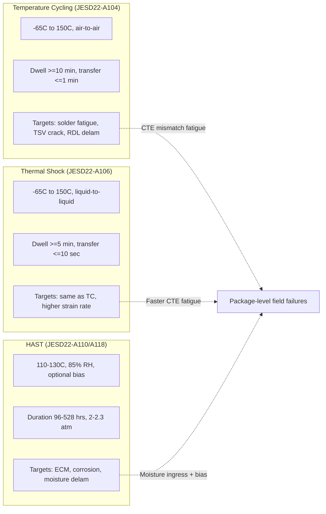

## Reliability Test Standards: Temperature Cycling, HAST, and Thermal Shock

### Overview

Reliability qualification of advanced packaging and heterogeneous integration assemblies relies on standardized accelerated stress tests that emulate field failure mechanisms in compressed timeframes. Temperature cycling (TC), highly accelerated stress testing (HAST), and thermal shock (TS) form the core triad of environmental reliability tests defined primarily by JEDEC (JESD22 series), and IPC/AEC-Q standards. These tests target distinct failure mechanisms: TC and TS stress solder joints, underfills, and interfaces through CTE (coefficient of thermal expansion) mismatch-driven fatigue, while HAST accelerates moisture-driven corrosion and electrochemical migration under combined humidity, bias, and temperature.

---

### Governing Standards Landscape

| Standard | Body | Scope |
| --- | --- | --- |
| JESD22-A104 | JEDEC | Temperature Cycling |
| JESD22-A106 | JEDEC | Thermal Shock |
| JESD22-A110 | JEDEC | HAST (Unbiased) |
| JESD22-A118 | JEDEC | Unbiased HAST (specific) |
| JESD22-A101 | JEDEC | Steady-State Humidity (85/85) |
| JESD47 | JEDEC | Stress-Test-Driven Qualification of ICs |
| JESD94 | JEDEC | Application-Specific Qualification |
| J-STD-020 | JEDEC/IPC | Moisture/Reflow Sensitivity |
| AEC-Q100/Q104 | AEC | Automotive IC & MCM qualification |
| MIL-STD-883 | DoD | Method 1010 (TS), 1004 (Humidity) |

**Key Points**

- JEDEC JESD47 is the umbrella qualification flow document; A104/A106/A110 are the specific test method specifications it invokes.
- Advanced packaging (2.5D/3D, fan-out, chiplets) often layers additional custom acceptance criteria atop JEDEC baselines because standard ICs assumptions (leadframe/wirebond) don't map cleanly to TSV, bump, and RDL structures.

---

### Temperature Cycling (TC) — JESD22-A104

#### Purpose and Failure Mechanisms

Temperature cycling exposes the assembly to alternating high and low temperature extremes, inducing cyclic stress/strain from CTE mismatches between dissimilar materials (die, substrate, mold compound, solder, underfill, PCB). This primarily accelerates **low-cycle fatigue** failures:

- Solder joint cracking (BGA, flip-chip bumps, micro-bumps, C4)
- TSV (through-silicon via) barrier/liner cracking
- RDL (redistribution layer) delamination
- Underfill delamination and cracking
- Die cracking from stress concentration
- Wire bond heel cracks (in hybrid wirebond+flip-chip packages)

#### Test Conditions

JESD22-A104 defines multiple test condition classes based on temperature extremes:

| Condition | Temp Range (°C) | Typical Use |
| --- | --- | --- |
| A | -55 to +85 | Legacy/commercial |
| B | -55 to +125 | Standard commercial/industrial |
| C | -65 to +150 | High-reliability, automotive |
| G | -40 to +125 | Automotive (AEC-Q100 aligned) |
| H | -55 to +150 | Extended automotive/mil |
| J | -40 to +150 | Automotive under-hood |

Cycle profile parameters:

- **Dwell time**: minimum 10 minutes at each temperature extreme (soak time must allow the package core to reach thermal equilibrium, not just chamber air).
- **Transfer/transition time**: typically ≤1 minute between chambers (air-to-air) in two-zone or three-zone chambers.
- **Ramp rate**: not always explicitly bounded, but implicit in transfer time; excessively fast ramps can introduce unrealistic thermal shock artifacts, blurring TC and TS mechanisms.

#### Cycle Count and Acceptance

Automotive grade (AEC-Q100) typically requires 500–1000 cycles depending on grade (Grade 0 through Grade 3), read out at intervals (e.g., 200, 500, 1000 cycles) with electrical test and/or cross-sectional/CSAM (C-mode scanning acoustic microscopy) inspection.

$$N_f = C \cdot (\Delta\gamma_p)^{-n}$$

This is the **Coffin-Manson relation** governing low-cycle fatigue life, where $N_f$ is cycles to failure, $\Delta\gamma_p$ is the plastic shear strain range per cycle, $C$ is a material constant, and $n$ is the fatigue exponent (typically 1.9–2.5 for SnAgCu solders). Acceleration factor between test and field conditions is derived from the **Norris-Landzberg** modification:

$$AF = \left(\frac{\Delta T_{field}}{\Delta T_{test}}\right)^n \times \left(\frac{f_{test}}{f_{field}}\right)^m \times \exp\left[Q/k\left(\frac{1}{T_{max,field}} - \frac{1}{T_{max,test}}\right)\right]$$

where $f$ is cycling frequency, $Q$ is activation energy (~0.123 eV for eutectic SnPb, higher for SAC alloys), and $k$ is Boltzmann's constant.

**Example**

A flip-chip BGA on organic substrate qualified under Condition G (-40°C to 125°C) fails cross-sectional inspection at 450 cycles due to corner solder bump cracking. Weibull analysis of failure population gives characteristic life $\eta$ and shape parameter $\beta$; a $\beta > 1$ confirms wear-out (fatigue) mode consistent with expected TC failure physics, validating the test rather than indicating an infant-mortality escape.

#### Failure Analysis Techniques Paired with TC

- Cross-sectioning + optical/SEM inspection of solder joint crack propagation (typically initiates at the die-side or substrate-side corner joint, the location of maximum shear strain — "die shadow corner" effect)
- CSAM for non-destructive delamination detection between cycling intervals
- Dye-and-pry for bump-level crack mapping across the full array
- 3D X-ray CT for TSV/microbump crack detection in 2.5D/3D stacks without destructive sectioning

---

### Thermal Shock (TS) — JESD22-A106

#### Purpose and Distinction from TC

Thermal shock uses **liquid-to-liquid** or fast **air-to-air** transfer with very short transition times (typically <10 seconds, versus ≤60 seconds for TC), producing much higher effective ramp rates. This targets the same CTE-mismatch fatigue mechanisms as TC but is a harsher, faster-ramp variant — often used to differentiate marginal designs or to accelerate qualification timelines. [Inference] Liquid-to-liquid TS is generally considered a more severe stimulus than air-to-air TC at equivalent $\Delta T$ due to superior heat transfer coefficients of the liquid medium, though direct correlation to field life requires the same Norris-Landzberg-type modeling caveats.

#### Test Conditions

| Condition | Temp Range (°C) |
| --- | --- |
| A | -55 to +85 |
| B | -55 to +125 |
| C | -65 to +150 |
| K | -40 to +125 |

- Dwell time: ≥5 minutes minimum (sufficient for thermal equilibration in a liquid bath, shorter than air chamber TC due to higher heat transfer coefficient)
- Transfer time: ≤10 seconds (liquid-to-liquid); this is the defining differentiator from TC

**Key Points**

- MIL-STD-883 Method 1011 defines a nearly-identical liquid-to-liquid thermal shock method used in defense/aerospace qualification.
- TS is more mechanically aggressive per cycle than TC; equipment (Fluorinert or similar inert fluorocarbon baths) and fixturing must be compatible with exposed die, wire bonds, and optical components — a key limitation for MEMS or optical packages where the media itself can be damaging.
- Package types with brittle low-k dielectric stacks (advanced node dies) are particularly sensitive to TS-induced stress due to the rapid strain rate exceeding the low-k material's fracture toughness margin.

---

### Highly Accelerated Stress Test (HAST) — JESD22-A110 / A118

#### Purpose and Failure Mechanisms

HAST accelerates moisture ingress and moisture-driven degradation using elevated temperature, elevated relative humidity, and (in biased HAST) applied electrical bias, at pressures above ambient to permit temperatures above 100°C while maintaining high RH (unattainable at atmospheric pressure, where humidity saturation caps around 100°C).

Primary mechanisms accelerated:

- **Electrochemical migration (ECM)**: metal ion migration (commonly Ag, Cu, Sn) along a moisture film under bias, forming dendritic shorts between adjacent conductors (e.g., between RDL traces or bond pads)
- **Corrosion** of exposed metallization (bond pads, seed layers) via galvanic or chemical attack in the presence of ionic contaminants and moisture
- **Delamination-assisted moisture ingress** — moisture wicking along delaminated interfaces (mold compound/die, mold compound/leadframe, underfill/passivation) that then feeds ECM or corrosion at internal interconnects
- **Popcorn cracking** precursor conditions (though popcorning itself is a reflow-stage failure, HAST-induced moisture absorption is often paired with a subsequent reflow simulation per J-STD-020)

#### Test Conditions

| Test Type | Temp | RH | Bias | Duration |
| --- | --- | --- | --- | --- |
| Biased HAST (BHAST) | 130°C | 85% | Rated VDD | 96–264 hrs |
| Biased HAST (alt.) | 110°C | 85% | Rated VDD | 264–528 hrs |
| Unbiased HAST (uHAST) | 130°C | 85% | None | 96–192 hrs |
| Unbiased HAST (alt.) | 110°C | 85% | None | up to 264 hrs |

- Pressure: typically 2–2.3 atm (autoclave-like saturated vapor condition) to sustain 85% RH at 130°C
- JESD22-A110 covers biased HAST; JESD22-A118 specifically addresses unbiased HAST with tighter procedural definitions distinguishing it from A110's biased default

#### Acceleration Model

HAST life is commonly modeled via the **Peck model**:

$$TTF = A_0 \cdot (RH)^{-n} \cdot \exp\left(\frac{E_a}{kT}\right)$$

where $TTF$ is time-to-failure, $RH$ is relative humidity, $n$ is the humidity exponent (empirically ~2.5–3 for many corrosion/ECM mechanisms), $E_a$ is activation energy (commonly 0.7–0.9 eV for ECM-type failures, though [Unverified] the specific value is highly mechanism- and metallization-dependent), and $k$ is Boltzmann's constant.

**Example**

A fan-out wafer-level package (FOWLP) with Cu RDL at 15 μm line/space undergoes BHAST at 130°C/85%RH/VDD. Failure occurs at 168 hours as a resistance drop between adjacent RDL traces. FA (failure analysis) via delayering and SEM/EDX confirms Cu dendritic growth bridging the traces — classic ECM signature — indicating either insufficient solder mask/passivation coverage or line/space margin below the design rule for the package's moisture sensitivity level (MSL).

**Key Points**

- HAST is explicitly a **stress test for package-level and interconnect-level moisture reliability**, distinct from Moisture Sensitivity Level (MSL) classification testing (J-STD-020), though both address moisture-related risk and are often run sequentially (preconditioning + reflow simulation, then HAST).
- Autoclave / Pressure Cooker Test (PCT, per JESD22-A102) is a related unbiased, saturated-steam (121°C/100%RH/2atm) test, generally considered even more severe than uHAST and sometimes used as a faster go/no-go screen ahead of full HAST qualification.
- HAST is particularly critical for advanced packages with fine-pitch RDL, exposed Cu pillars, or hygroscopic dielectric materials (e.g., some low-k or organic buildup films) where moisture pathways are shorter and metallization spacing is tighter than legacy wirebond packages.

---

### Comparative Summary

---

### Sample Qualification Flow (JESD47-Aligned)

<svg xmlns="http://www.w3.org/2000/svg" viewBox="0 0 900 380" font-family="sans-serif">
<text x="450" y="25" text-anchor="middle" font-size="16" font-weight="bold">Package-Level Reliability Qualification Flow (svg_diagram)</text>
<rect x="20" y="60" width="160" height="60" rx="6" fill="#dbeafe" stroke="#1e40af" />
<text x="100" y="85" text-anchor="middle" font-size="12">Preconditioning</text>
<text x="100" y="102" text-anchor="middle" font-size="11">(J-STD-020 MSL bake + reflow x3)</text>
<rect x="230" y="60" width="160" height="60" rx="6" fill="#dcfce7" stroke="#166534" />
<text x="310" y="85" text-anchor="middle" font-size="12">Temperature Cycling</text>
<text x="310" y="102" text-anchor="middle" font-size="11">JESD22-A104, 500-1000 cyc</text>
<rect x="440" y="60" width="160" height="60" rx="6" fill="#fef3c7" stroke="#92400e" />
<text x="520" y="85" text-anchor="middle" font-size="12">Thermal Shock</text>
<text x="520" y="102" text-anchor="middle" font-size="11">JESD22-A106, liq-liq</text>
<rect x="650" y="60" width="160" height="60" rx="6" fill="#fce7f3" stroke="#9d174d" />
<text x="730" y="85" text-anchor="middle" font-size="12">HAST / uHAST</text>
<text x="730" y="102" text-anchor="middle" font-size="11">JESD22-A110/A118</text>
<line x1="180" y1="90" x2="230" y2="90" stroke="#333" stroke-width="2" marker-end="url(#arrow)" />
<line x1="390" y1="90" x2="440" y2="90" stroke="#333" stroke-width="2" marker-end="url(#arrow)" />
<line x1="600" y1="90" x2="650" y2="90" stroke="#333" stroke-width="2" marker-end="url(#arrow)" />
<rect x="230" y="180" width="440" height="60" rx="6" fill="#ede9fe" stroke="#5b21b6" />
<text x="450" y="205" text-anchor="middle" font-size="12">Interim + End-of-Test Readouts</text>
<text x="450" y="222" text-anchor="middle" font-size="11">Electrical test, CSAM, cross-section, Weibull fit</text>
<line x1="310" y1="120" x2="350" y2="180" stroke="#333" stroke-width="1.5" marker-end="url(#arrow)" />
<line x1="520" y1="120" x2="480" y2="180" stroke="#333" stroke-width="1.5" marker-end="url(#arrow)" />
<line x1="730" y1="120" x2="620" y2="180" stroke="#333" stroke-width="1.5" marker-end="url(#arrow)" />
<rect x="330" y="280" width="240" height="60" rx="6" fill="#fee2e2" stroke="#991b1b" />
<text x="450" y="305" text-anchor="middle" font-size="12">Pass/Fail vs Acceptance Criteria</text>
<text x="450" y="322" text-anchor="middle" font-size="11">(AEC-Q100 / JESD47 LTPD tables)</text>
<line x1="450" y1="240" x2="450" y2="280" stroke="#333" stroke-width="2" marker-end="url(#arrow)" />
</svg>

---

### Sample Size and Statistical Acceptance (LTPD Approach)

JESD47/AEC-Q100 use **Lot Tolerance Percent Defective (LTPD)** sampling — commonly a sample of $n=77$ units with 0 failures allowed, corresponding to an LTPD of ~3% at 90% confidence, or $n=45$/0 for LTPD ~5%. This is a binomial-based zero-failure acceptance sampling plan:

$$C = 1 - (1-p)^n$$

where $C$ is confidence, $p$ is the maximum acceptable defect rate (LTPD), and $n$ is sample size — solving for $n$ given desired $C$ and $p$ yields the standard sample size tables referenced in AEC-Q100.

**Key Points**

- A single failure in a 0-fail sample plan constitutes a full lot/design reject, triggering root-cause FA and potential design or process correction, not simple derating.
- Reduced sample plans (LTPD 10%, $n=22$ or $n=29$) are sometimes used for lower-risk automotive grades or characterization-only studies but are generally insufficient for production release-grade qualification.

---

### Advanced Packaging-Specific Considerations

**Key Points**

- **2.5D/3D stacked die (TSV-based)**: TC and TS stress the TSV copper-to-silicon CTE mismatch (Cu ~17 ppm/°C vs Si ~2.6 ppm/°C), risking TSV protrusion, liner cracking, and keep-out-zone (KOZ) transistor stress shifts; HAST is critical where TSV reveal exposes Cu near the die backside.
- **Fan-out (FOWLP/FOPLP)**: molding compound CTE and modulus dominate TC/TS response since there is no substrate to buffer die-to-board strain; RDL fine-pitch traces are HAST-sensitive due to short creepage distances.
- **Chiplet/interposer assemblies**: differential CTE across die, interposer (Si or organic), and package substrate creates multi-interface stress concentration; TC failure sites often shift from the traditional package-corner solder joint to interposer-to-substrate micro-bump arrays.
- **Hybrid bonding (Cu-Cu direct bonding)**: has no solder joint fatigue mechanism in the classic sense, so TC/TS failure modes shift toward bond-interface delamination and Cu diffusion voiding; JEDEC standards for this specific mechanism are still evolving. [Speculation] Industry practice suggests existing JESD22-A104/A106 conditions are being applied as interim proxies pending hybrid-bonding-specific standard development, though qualification bodies may formalize distinct criteria as adoption matures.

---

### Common Pitfalls in Test Execution

**Key Points**

- Using chamber air/bath temperature as a proxy for package junction/core temperature without validating actual thermal lag via thermocoupled sample units — dwell time must guarantee the coldest/hottest internal point reaches setpoint, not just the chamber.
- Conflating TC and TS results directly without correcting for differing ramp rates — a design can pass TC but fail TS (or vice versa is rare) because peak strain rate, not just $\Delta T$, drives certain fracture mechanisms in brittle films.
- Running HAST without a matched unbiased control, making it impossible to separate pure moisture/thermal degradation from electrochemically biased degradation.
- Neglecting preconditioning (moisture bake + simulated reflow) before TC/TS/HAST, which can mask delamination-related failures that only manifest after the package has experienced at least one reflow-level thermal excursion.

---

**Related Topics**

- Moisture Sensitivity Level (MSL) classification and J-STD-020 reflow profiles
- Board-level reliability (BLR) drop test and vibration testing (JESD22-B111, B103)
- Power/thermal cycling and Power Cycling Test (PCT) for wide-bandgap and high-power modules
- Weibull reliability analysis and acceleration factor modeling
- CSAM (C-mode scanning acoustic microscopy) and X-ray CT for non-destructive failure analysis
- Electromigration and TDDB (time-dependent dielectric breakdown) as complementary wear-out mechanisms
- Warpage and CTE mismatch modeling in fan-out and 2.5D/3D packages
- AEC-Q104 multi-chip module qualification requirements