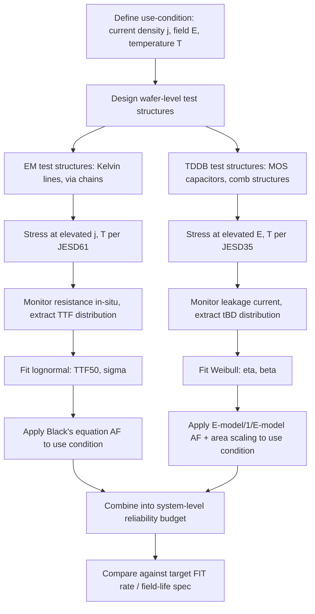

## Electromigration and Time-Dependent Dielectric Breakdown

### Overview

Electromigration (EM) and time-dependent dielectric breakdown (TDDB) are the two dominant intrinsic wear-out mechanisms governing long-term reliability of on-chip and package-level interconnects and dielectrics in advanced packaging and heterogeneous integration. EM is the mass transport of metal atoms in a conductor driven by momentum transfer from a high-density electron flux, leading to voiding (open failures) and hillock/extrusion formation (short failures). TDDB is the progressive, statistically distributed breakdown of a dielectric under sustained electric field stress, culminating in a conductive filament path through the insulator. Both mechanisms are current/field-accelerated, temperature-accelerated, and governed by well-established lifetime models (Black's equation for EM; E-model/1/E-model/power-law models for TDDB) that underpin qualification methodologies across JEDEC standards (JESD61, JESD35, JESD60) and are of particular concern in advanced packaging due to fine-pitch RDL, TSVs, micro-bumps, and hybrid bonding interfaces that push current densities and field strengths well beyond legacy package norms.

---

### Electromigration (EM)

#### Physical Mechanism

EM occurs when the electron "wind force" (momentum transfer from conducting electrons colliding with metal ion cores) exceeds the counteracting force from the electric field acting on the ion's effective charge, producing net atomic drift in the direction of electron flow. Atoms depleted at the cathode end (or at grain boundary triple points, flux divergence sites) create vacancies that coalesce into voids; atoms accumulated at the anode end (or blocked at flux-divergence sites) create hillocks or extrusions.

The net atomic flux is described by:

$$J_{atom} = \frac{D N}{kT} \cdot Z^* e \rho j$$

where $D$ is the diffusivity (via lattice, grain boundary, interface, or surface paths — whichever dominates), $N$ is atomic density, $Z^*$ is the effective charge number (typically negative for metals, meaning the wind force dominates over the direct field force), $e$ is electron charge, $\rho$ is resistivity, and $j$ is current density.

**Key Points**

- Grain boundary diffusion dominates in polycrystalline Al interconnects; in Cu dual-damascene interconnects, the fastest diffusion path is typically the **Cu/dielectric-cap interface** (e.g., Cu/SiN or Cu/SiCN), making cap layer adhesion and interface engineering first-order reliability levers.
- Bamboo-grain structures (grain width ≈ line width, common in narrow modern interconnects) suppress grain-boundary diffusion paths, often shifting the dominant EM lifetime-limiting mechanism to the interface path.
- Flux divergence at vias, contacts, and line bends creates local sites of vacancy/atom accumulation — these are the statistically dominant failure nucleation sites, not uniform line degradation.

#### Black's Equation

The standard EM lifetime model, established by J.R. Black (1969):

$$TTF = A \cdot j^{-n} \cdot \exp\left(\frac{E_a}{kT}\right)$$

where $TTF$ is median time-to-failure, $A$ is a process/geometry-dependent constant, $j$ is current density, $n$ is the current density exponent (typically ~1–2; $n=2$ is the classical void-nucleation-limited value, $n\approx1$ for void-growth-limited failure often seen in Cu interconnects), $E_a$ is activation energy (~0.7–0.9 eV for Cu grain boundary/interface diffusion, ~0.5–0.6 eV for Al), and $k$ is Boltzmann's constant.

**Example**

An RDL trace in a fan-out package carrying 5 mA/μm² at 105°C is qualified against a use-condition target of 1 mA/μm² at 85°C. Using Black's equation with $n=2$ and $E_a=0.8$ eV:

$$AF = \left(\frac{j_{test}}{j_{use}}\right)^n \cdot \exp\left[\frac{E_a}{k}\left(\frac{1}{T_{use}} - \frac{1}{T_{test}}\right)\right]$$

Substituting $j_{test}/j_{use}=5$, $n=2$ gives a current-density acceleration factor of 25×; the temperature term adds further acceleration, yielding a combined AF in the range of several hundred to low-thousands×, translating a 1000-hour test into an implied field life on the order of years to decades — the exact figure depends sensitively on the assumed $n$ and $E_a$, which [Inference] should be empirically extracted per process node/metallization rather than assumed from literature defaults, since both parameters are measurably process- and geometry-dependent.

#### Failure Distribution and Statistics

EM time-to-failure follows a **lognormal distribution**:

$$F(t) = \Phi\left(\frac{\ln t - \ln TTF_{50}}{\sigma}\right)$$

where $TTF_{50}$ is the median failure time and $\sigma$ is the lognormal shape parameter (distribution spread). Lower $\sigma$ indicates tighter, more predictable failure clustering; higher $\sigma$ (common when multiple flux-divergence sites compete, or when process variation is high) extends the early-failure tail, which is what typically determines the qualified field lifetime at the required percentile (e.g., 0.1% cumulative failure at 10 years), not the median.

#### EM in Advanced Packaging Structures

**Key Points**

- **TSVs**: current crowding at the TSV-to-RDL landing pad transition creates localized high-$j$ EM hotspots; TSV liner/barrier integrity (Ta/TaN for Cu TSVs) is critical to prevent Cu diffusion into Si that both degrades EM life and risks transistor contamination.
- **Micro-bumps (Cu pillar + SnAg cap)**: current crowding occurs at the bump entrance/exit due to trace-to-bump cross-sectional area mismatch; this drives **UBM (under-bump metallization) EM**, where Cu-Sn intermetallic compound (IMC, Cu₆Sn₅/Cu₃Sn) growth consumes the Cu UBM asymmetrically depending on current direction, potentially leading to voiding at the cathode-side IMC/Cu interface.
- **Hybrid bonding (Cu-Cu direct bond)**: EM behavior differs from solder/bump EM since there is no IMC formation step; primary concern is void formation at the bond interface under sustained current, with reliability depending heavily on bond quality (void-free coverage) achieved during the bonding process itself.
- **RDL fine-pitch routing**: as line width scales down in fan-out and 2.xD packages, current density for a given current budget rises proportionally, making RDL EM a first-order design constraint alongside IR drop, requiring current-density design rule checks (DRC) in physical verification flows.

#### Qualification Standards

| Standard | Scope |
| --- | --- |
| JESD61 | EM procedures for interconnect metallization |
| JESD87 | Wafer-level EM test structures |
| JEP119 | EM failure mechanism/model guideline |

Test structures typically use Kelvin-probed straight lines, vias, or via-chains stressed at elevated temperature (150–350°C typical wafer-level test range) and current density well above use conditions, with resistance monitored in situ for the characteristic resistance-jump (void-induced) or resistance-decrease (short/extrusion-induced) failure signature.

---

### Time-Dependent Dielectric Breakdown (TDDB)

#### Physical Mechanism

TDDB is the degradation of an insulating dielectric (gate oxide, interlayer dielectric/ILD, TSV liner oxide, or inter-metal dielectric in advanced packaging) under sustained electric field, culminating in a percolation path of defects (traps) connecting the two electrodes and triggering a runaway conductive filament. The dominant physical framework is the **percolation model**: stress-induced defect generation is a statistical, trap-generation process, and breakdown occurs once a critical trap density forms a continuous conductive path across the dielectric thickness.

$$t_{BD} \propto d^{a} \cdot \exp(-\gamma E) \quad \text{[E-model]}$$

or, favored in modern thin-oxide/low-$k$ analysis:

$$t_{BD} \propto \exp\left(\frac{G}{E}\right) \quad \text{[1/E-model]}$$

where $d$ is dielectric thickness, $E$ is electric field, $\gamma$ and $G$ are field-acceleration parameters, and both models incorporate an Arrhenius temperature term $\exp(E_a/kT)$. [Unverified] The choice between E-model and 1/E-model (and various power-law hybrids) remains an active area of debate in the literature for ultra-thin and low-$k$ dielectrics, with model selection materially affecting extrapolated field lifetimes at use-condition voltages far below typical test stress voltages — this is a known source of qualification risk if the wrong model is extrapolated across too large a voltage range.

#### Weibull Statistics for TDDB

TDDB failure times follow a **Weibull distribution** (not lognormal, distinguishing it statistically from EM):

$$F(t) = 1 - \exp\left[-\left(\frac{t}{\eta}\right)^{\beta}\right]$$

where $\eta$ is the characteristic life (63.2% cumulative failure) and $\beta$ is the Weibull shape parameter. Critically, $\beta$ scales with the **stressed area/volume** of dielectric (larger area = more defect sites = lower effective $\eta$ at a given $\beta$), requiring area-scaling corrections when extrapolating from small test structures to full-chip or full-interposer dielectric area:

$$\eta_{chip} = \eta_{test} \cdot \left(\frac{A_{test}}{A_{chip}}\right)^{1/\beta}$$

**Key Points**

- Low $\beta$ (common in low-$k$ ILD, $\beta \approx 1$–2) implies a wide failure distribution and stronger area-scaling penalty — large-area interposers or thick RDL dielectric stacks are disproportionately vulnerable at the population tail compared to small test capacitors.
- High-$k$/metal-gate stacks and low-$k$ interconnect dielectrics generally exhibit different, material-specific $\beta$ and field-acceleration parameters and cannot be assumed interchangeable with classic $SiO_2$ TDDB behavior.

#### TDDB in Advanced Packaging Contexts

**Key Points**

- **TSV liner oxide**: TSV isolation oxide (SiO2 liner between Cu TSV and Si) experiences sustained field stress from TSV-to-substrate bias differentials; liner thickness and conformality (often via PECVD or thermal oxidation) directly set TDDB margin, and process-induced liner thinning at TSV sidewalls/corners is a known area-scaling and field-concentration risk.
- **RDL inter-metal dielectric (polyimide, PBO, or inorganic dielectrics)**: in fine-pitch RDL, TDDB-like time-dependent breakdown of the polymer dielectric between adjacent traces can occur under sustained bias, particularly when combined with moisture ingress (a coupled HAST + TDDB failure mode, sometimes termed "wet TDDB" or moisture-assisted dielectric breakdown).
- **Interposer/substrate embedded capacitor and via dielectrics**: as 2.5D interposers integrate higher via densities and thinner dielectric layers to meet impedance/routing targets, TDDB margin becomes a co-design constraint alongside electrical performance, not solely a transistor-level gate-oxide concern.

#### Qualification Standards

| Standard | Scope |
| --- | --- |
| JESD35 | TDDB procedures for evaluating dielectric reliability |
| JEP122 | TDDB failure mechanism/statistical model guideline |
| JESD92 | Breakdown voltage test methods |

---

### Comparative Framework: EM vs. TDDB

| Aspect | Electromigration | TDDB |
| --- | --- | --- |
| Driving force | Current density (electron wind force) | Electric field across dielectric |
| Primary structures | Metal lines, vias, bumps, TSV liners (Cu path), RDL traces | Gate oxide, ILD, TSV liner oxide, RDL dielectric |
| Statistical distribution | Lognormal | Weibull |
| Lifetime model | Black's equation ($j^{-n}\exp(E_a/kT)$) | E-model / 1/E-model ($\exp(-\gamma E)$ or $\exp(G/E)$, both $\times \exp(E_a/kT)$) |
| Area/volume scaling | Secondary effect (via/line count matters) | First-order effect (explicit $\beta$-dependent area scaling) |
| Key failure signature | Resistance jump (void) or drop (short/hillock) | Sudden leakage current spike / breakdown event |
| Package-level analog | RDL, micro-bump, TSV EM | TSV liner, RDL dielectric, interposer via dielectric |

---

### Combined Qualification Flow

---

### Failure Analysis Techniques

**Key Points**

- **EM FA**: cross-sectioning at the void/hillock site (often identified first via resistance monitoring or thermal/OBIRCH — optical beam induced resistance change — localization), followed by SEM/FIB imaging of void morphology and location relative to vias/flux-divergence points.
- **TDDB FA**: post-breakdown localization via emission microscopy (EMMI) or liquid crystal hot-spot detection to find the breakdown filament location, followed by FIB cross-section and TEM/EDX to characterize the conductive path composition (often metal diffusion into the dielectric, e.g., Cu filament formation in TDDB-failed low-$k$ structures).
- Both mechanisms benefit from **in-situ resistance/leakage monitoring during stress** rather than end-point-only testing, since the shape of the degradation curve (gradual resistance increase vs. sudden jump; gradual leakage increase vs. abrupt breakdown) carries diagnostic information about the underlying failure mode.

---

### System-Level Reliability Budgeting (FIT Rate Combination)

Both mechanisms contribute independently to overall failure rate, combined as competing risks:

$$\lambda_{total} = \lambda_{EM} + \lambda_{TDDB} + \lambda_{other}$$

expressed in **FIT** (Failures In Time, failures per $10^9$ device-hours). [Inference] Package-level qualification typically budgets EM and TDDB as separate line items within an overall system FIT target (e.g., <10 FIT at 10-year field life), since the two mechanisms are physically independent and their combined hazard is additive under a competing-risks assumption — though correlated degradation (e.g., moisture-assisted coupling between the two) can violate strict independence in real packages and may require joint modeling in edge cases.

**Key Points**

- Advanced packaging's higher interconnect density (more vias, more RDL layers, more TSVs) increases the *population* of EM/TDDB failure sites per package relative to planar single-die packages, which — combined with area-scaling for TDDB and via-count scaling for EM — can materially tighten the per-site reliability margin needed to hit the same system-level FIT target.
- Both mechanisms are also coupled to **self-heating** in dense 3D-stacked configurations: local Joule heating from EM-stressed lines or TDDB leakage current raises local $T$, which back-accelerates both mechanisms further via their respective Arrhenius terms — a positive feedback loop that thermal-aware design (power/thermal co-design) must account for.

---

**Related Topics**

- Black's equation parameter extraction methodology and wafer-level EM test structure design
- Low-$k$ dielectric TDDB and moisture-assisted breakdown coupling
- Thermal cycling, HAST, and thermal shock (complementary extrinsic reliability tests)
- Joule heating and self-heating effects in 3D-stacked die
- FIT rate budgeting and system-level reliability allocation across mechanisms
- TSV liner/barrier integrity and Cu diffusion reliability risk
- UBM/IMC formation kinetics in Cu-pillar micro-bump interconnects
- Stress migration (SM) as a related but field-independent metal reliability mechanism