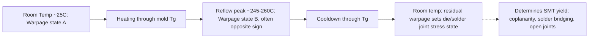
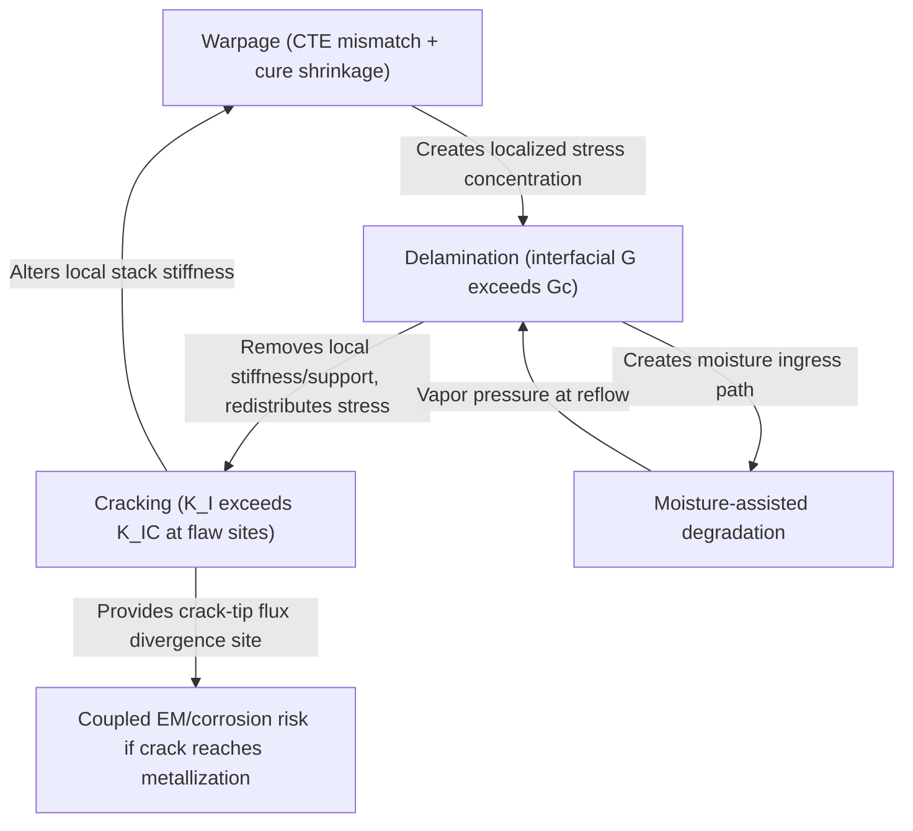

## Delamination, Cracking, and Warpage-Driven Failure Modes

### Overview

Delamination, cracking, and warpage are mechanically coupled failure modes that arise from interfacial adhesion loss, fracture mechanics-governed crack propagation, and CTE-mismatch-driven bow/twist across the multi-material stackups characteristic of advanced packaging. Unlike electromigration or TDDB (intrinsic, current/field-driven wear-out), these are predominantly **process-induced or thermomechanically-induced structural failures**, often surfacing during assembly (reflow, molding, curing), reliability stress testing (TC/TS/HAST), or in-field thermal cycling. In heterogeneous integration — where dies, interposers, substrates, mold compounds, and underfills with widely differing CTE, modulus, and interfacial chemistries are stacked and bonded — these three mechanisms are frequently interdependent: warpage induces localized stress concentrations that nucleate delamination, and delamination alters local stiffness in ways that redistribute stress and promote cracking.

---

### Delamination

#### Physical Mechanism

Delamination is the separation of two bonded material interfaces due to loss of adhesive/interfacial strength under mechanical, thermal, or moisture-driven stress. It is fundamentally an **interfacial fracture mechanics** problem, governed by the strain energy release rate $G$ exceeding the interfacial fracture toughness $G_c$:

$$G \geq G_c$$

where $G$ depends on applied stress, layer thicknesses, elastic mismatch, and the mode mixity (ratio of mode I opening to mode II shear loading) at the interface, commonly expressed via the **phase angle** $\psi = \tan^{-1}(K_{II}/K_I)$, since interfacial toughness $G_c$ is itself a function of $\psi$ (interfaces are typically toughest under pure mode I and weakest under mixed-mode loading).

#### Common Delamination Interfaces in Advanced Packaging

| Interface | Typical Trigger |
| --- | --- |
| Die / mold compound | Poor surface treatment, contamination, CTE mismatch during cure/cooldown |
| Mold compound / substrate (leadframe or laminate) | Moisture absorption + reflow (popcorning precursor) |
| Underfill / passivation (die side) | Insufficient adhesion promoter, incomplete cure, flux residue |
| Underfill / solder mask (substrate side) | Surface roughness mismatch, contamination |
| Cu RDL / dielectric (polyimide, PBO) | Poor surface roughening, adhesion layer omission |
| Die attach film (DAF) / die back or substrate | Voiding, incomplete cure, thickness non-uniformity |
| TSV liner / Cu | Barrier layer defects, thermal stress at TSV reveal |
| Cu-Cu hybrid bond interface | Particle contamination, surface roughness above bonding tolerance, incomplete bond formation |

#### Moisture-Assisted Delamination and Popcorn Cracking

Moisture absorbed into mold compound or underfill during storage vaporizes explosively during reflow (peak temperatures 245–260°C for Pb-free), generating internal vapor pressure that can exceed interfacial adhesion strength:

$$P_{vapor} \gg \sigma_{adhesion} \Rightarrow \text{delamination + "popcorn" cracking}$$

This is the mechanism formalized by **J-STD-020 Moisture Sensitivity Level (MSL)** classification, which specifies floor-life exposure limits and mandatory bake-out procedures before reflow based on package thickness and volume.

**Key Points**

- MSL testing itself is a preconditioning step (moisture soak at controlled RH/temp, then 3x reflow simulation) that *precedes* TC/TS/HAST in a standard qualification flow specifically to expose latent moisture-assisted delamination before mechanical/electrical stress testing begins.
- Popcorn cracking is most severe in packages with a large internal void-prone volume (e.g., large-body BGA/QFN with thin mold cap) and is a primary reason advanced packages emphasize low-moisture-uptake mold compounds and controlled bake-out SOPs at the assembly house.

#### Detection Methods

**Key Points**

- **CSAM (C-mode Scanning Acoustic Microscopy)**: primary non-destructive method; delamination appears as a phase-inverted (bright/white, depending on convention) acoustic reflection due to the air gap's large acoustic impedance mismatch versus a bonded interface.
- **X-ray CT**: complements CSAM for 3D void/delamination mapping, particularly useful in fully molded or opaque packages where CSAM access is geometrically limited.
- **Cross-sectioning + SEM**: destructive confirmation and root-cause interface identification (via EDX to confirm which specific interface separated and whether residue/contamination is present).
- **Acoustic emission monitoring**: can be used during thermal stress (in-situ) to detect the transient acoustic signature of delamination or crack events as they occur, rather than only at post-test inspection intervals.

---

### Cracking

#### Die Cracking

Silicon die cracking originates from stress concentrations exceeding silicon's fracture toughness ($K_{IC} \approx 0.9$–$1.0\ \text{MPa}\sqrt{\text{m}}$ for bulk Si), typically nucleating at:

- Saw-induced edge chips/microcracks from die singulation (dicing-induced subsurface damage)
- Die corner stress concentrations under CTE-mismatch bending (thin-die, large-body packages are most susceptible)
- Backgrinding-induced subsurface damage on thinned die (critical in 3D-stacked/TSV die where die thickness can be <50 μm)
- Probe mark or handling-induced micro-damage propagated during subsequent thermal stress

$$K_I = Y\sigma\sqrt{\pi a}$$

where $K_I$ is the mode I stress intensity factor, $Y$ is a geometry factor, $\sigma$ is applied stress, and $a$ is the flaw/crack length — fracture occurs when $K_I \geq K_{IC}$. This relation explains why **thin die are disproportionately crack-prone despite lower absolute stress**: thinning reduces the die's bending stiffness, increasing curvature-induced strain for a given warpage, while also often leaving smaller-but-critical subsurface flaws from backgrind that act as the initiating $a$.

#### Solder Joint and Interconnect Cracking

Covered in depth under fatigue mechanisms (Coffin-Manson, low-cycle fatigue from TC/TS), but the crack propagation phase specifically follows **Paris' Law** for cyclic fatigue crack growth:

$$\frac{da}{dN} = C(\Delta K)^m$$

where $da/dN$ is crack growth per cycle, $\Delta K$ is the stress intensity factor range, and $C$, $m$ are material constants. This governs the transition from crack *initiation* (Coffin-Manson dominated) to crack *propagation* (Paris' Law dominated) — the two phases have different acceleration sensitivities, which is why some packages show long incubation periods followed by rapid late-stage resistance degradation in TC data.

#### Mold Compound and Underfill Cracking

- **Mold compound cracking**: typically surface-initiated (thermal stress at cure shrinkage or TC-induced bending) or delamination-driven (crack propagates from an existing delaminated interface where the mold compound is unsupported).
- **Underfill cracking**: cohesive cracking within the underfill material itself, distinct from adhesive delamination at the underfill/die or underfill/substrate interface; often occurs at the fillet edge where stress concentrates due to geometric discontinuity.
- **Capillary underfill voiding**: while not cracking per se, entrapped voids act as pre-existing flaws (analogous to the $a$ term in $K_I=Y\sigma\sqrt{\pi a}$) that lower the effective fracture toughness margin at that location.

#### RDL and Low-k Dielectric Cracking

**Key Points**

- Low-$k$ interlayer dielectrics (porous SiOC-type films used in advanced-node BEOL) have substantially reduced fracture toughness and modulus versus dense oxide, making them highly susceptible to **package-induced stress cracking**, particularly at die corners and near TSVs — a mechanism sometimes termed "low-k delamination/cracking" that couples packaging mechanical design directly to front-end dielectric reliability.
- RDL trace and via cracking in fan-out/2.5D structures typically nucleates at trace-to-via transitions where cross-sectional geometry changes concentrate stress, analogous to solder joint corner failures but at RDL feature scale.

---

### Warpage

#### Physical Origin

Warpage (package bow/twist) arises from **CTE mismatch between stacked material layers combined with cure/cooldown shrinkage**, producing a bimetallic-strip-like bending moment. The classical analytical treatment for a simple bilayer is **Stoney's equation** (and its multilayer extensions):

$$\kappa = \frac{6\sigma_f h_f}{E_s h_s^2}$$

where $\kappa$ is curvature, $\sigma_f$ is film stress, $h_f$/$h_s$ are film/substrate thicknesses, and $E_s$ is substrate modulus. Real packages require multilayer plate theory or FEA (finite element analysis) since Stoney's equation assumes a thin-film-on-thick-substrate approximation that breaks down for the comparable-thickness, multi-material stacks typical of advanced packages.

#### Warpage Measurement Standards

| Standard | Method |
| --- | --- |
| JEDEC JESD22-B112 | Shadow Moiré warpage measurement |
| JEP95 | Package characterization guideline (bow/twist context) |

**Shadow Moiré** is the industry-standard non-contact optical technique: a reference grating is projected onto the package surface, and interference fringes (Moiré patterns) map surface height/curvature with sub-micron resolution across the temperature range of interest (typically room temp through reflow peak, capturing the full warpage-vs-temperature curve rather than a single-point measurement).

#### Temperature-Dependent Warpage Behavior

Warpage in advanced packages is rarely monotonic with temperature — a package can be **convex ("smiling")** at room temperature and **concave ("crying")** at reflow peak (or vice versa), crossing a near-zero-warpage point somewhere in between, because different material layers dominate the net CTE mismatch at different temperature regimes (e.g., mold compound $T_g$ transitions change its effective modulus/CTE behavior above vs. below glass transition).

**Key Points**

- **Warpage at reflow peak temperature is the critical parameter for SMT assembly yield** — excessive warpage during the solder-liquidus window causes non-contact opens (head-in-pillow defects), solder bridging, or coplanarity failures, independent of room-temperature warpage appearance.
- Warpage at room temperature (post-assembly, pre-field-use) sets the **residual stress state** that becomes the baseline for subsequent TC/TS fatigue accumulation — a package with high built-in residual warpage effectively starts its fatigue life partway through its strain budget.
- Panel-level and large-interposer warpage (common in fan-out panel-level packaging, FOPLP, and large 2.5D interposers) is a first-order process yield concern because warpage scales roughly with the square of lateral dimension for a given stack, making large-reticle interposers and large fan-out packages disproportionately warpage-sensitive versus legacy small-die packages.

#### Warpage Mitigation Strategies

**Key Points**

- Material selection: matching CTE across mold compound, substrate core, and die/interposer to minimize net bending moment; low-CTE mold compounds (high filler loading) are commonly used to approach substrate CTE.
- Symmetric stack design: balancing dielectric/metal layer counts above and below the neutral axis in substrates/RDL to cancel bending moments (analogous to symmetric PCB stackup design).
- Stiffener rings, lids, or heat spreaders: add mechanical stiffness to resist bending, commonly used in large flip-chip BGA and 2.5D packages.
- Process-level compensation: intentionally engineering substrate pre-warpage (opposite sign to the expected post-mold warpage) so the two effects cancel near the reflow temperature window.
- Cure profile optimization: staged/ramped cure profiles for mold compound and underfill can reduce cure-shrinkage-induced residual stress versus a single fast cure step.

---

### Interdependency: The Delamination-Cracking-Warpage Triangle

**Example**

A 2.5D interposer package exhibits excessive concave warpage (~80 μm) at reflow peak, causing marginal solder joint coplanarity at the interposer-to-substrate micro-bump array. Post-SMT CSAM reveals localized delamination at the underfill/interposer interface near the package corner, coincident with the region of highest warpage-induced peel stress. Subsequent TC testing (JESD22-A104) accelerates crack propagation from the delamination front into adjacent micro-bumps, producing intermittent opens by 300 cycles — well short of the 1000-cycle qualification target. Root-cause FA (cross-section + FEA correlation) attributes the failure chain to warpage exceeding the underfill's peel-stress margin at that specific corner geometry, not to a intrinsic underfill material defect — illustrating why warpage, delamination, and cracking are typically investigated as a single coupled failure chain rather than independently.

---

### Failure Analysis Workflow for Delamination/Cracking/Warpage

**Key Points**

- Non-destructive triage first: CSAM (delamination mapping) and Shadow Moiré or X-ray-based warpage measurement, performed *before* any destructive step to preserve failure-site location information.
- X-ray CT for 3D crack/void visualization without physical sectioning, especially valuable for TSV/micro-bump crack detection where the failure site location must be precisely known before cross-sectioning (destructive methods risk missing or destroying the actual crack plane if location is only approximately known).
- Cross-section + SEM/EDX for final confirmation: crack path characterization (interfacial vs. cohesive fracture), contamination analysis at delaminated interfaces, and correlation with material/process records (mold lot, cure profile, bake-out history).
- FEA correlation: stress/strain simulation of the actual package geometry and measured warpage profile to confirm the failure site aligns with predicted peak stress/peel-force locations — closing the loop between measured warpage, predicted stress, and observed failure location.

---

**Related Topics**

- Reliability test standards: temperature cycling, HAST, and thermal shock
- Electromigration and time-dependent dielectric breakdown
- Moisture Sensitivity Level (MSL) classification and J-STD-020 reflow profiles
- Fracture mechanics fundamentals: stress intensity factor, energy release rate, mixed-mode loading
- Underfill material selection and capillary/no-flow underfill process design
- Low-k dielectric mechanical reliability in advanced-node BEOL
- FEA-based package warpage and stress simulation methodology
- Shadow Moiré and digital image correlation (DIC) for warpage characterization