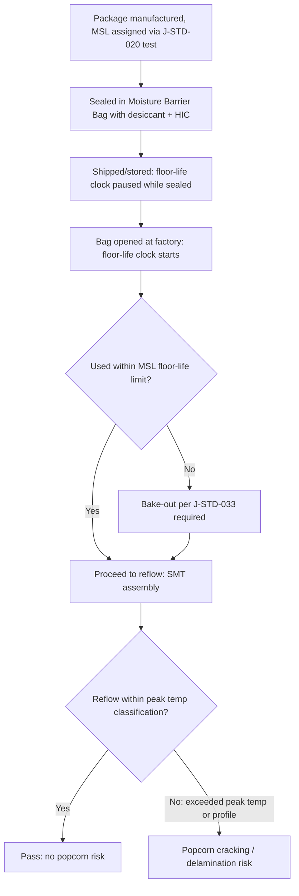

## Moisture Sensitivity Levels and Popcorn Cracking

### Overview

Moisture Sensitivity Level (MSL) classification is the industry-standard framework — defined jointly by **J-STD-020** (reflow classification) and **J-STD-033** (handling/storage/bake requirements) — for characterizing a plastic-encapsulated package's susceptibility to moisture-induced damage during the reflow soldering process. The failure mode it governs, **popcorn cracking**, occurs when moisture absorbed into hygroscopic package materials during storage/handling vaporizes explosively during reflow's rapid temperature rise, generating internal vapor pressure that exceeds interfacial adhesion or material cohesive strength. MSL classification directly determines the floor life, storage conditions, and mandatory bake-out procedures required before a package can be safely reflowed, making it a first-order manufacturing and supply-chain constraint rather than purely a lab characterization exercise.

---

### Physical Mechanism of Popcorn Cracking

#### Moisture Absorption

Plastic packaging materials — mold compound, underfill, die attach film, and to a lesser extent substrate laminate — are hygroscopic and absorb ambient moisture via diffusion, governed by Fick's second law:

$$\frac{\partial C}{\partial t} = D_m \nabla^2 C$$

where $C$ is moisture concentration and $D_m$ is the material's moisture diffusivity (temperature- and material-dependent, typically expressed via an Arrhenius relation). Saturation moisture content and diffusivity are the two key material parameters that determine how quickly a given package reaches a moisture level that poses reflow risk.

#### Vapor Pressure Generation at Reflow

During reflow, peak temperatures reach 245–260°C (Pb-free profiles per J-STD-020), well above water's boiling point. Moisture trapped within the mold compound, at delaminated interfaces, or in voids vaporizes rapidly. Because the heating rate during reflow vastly exceeds the rate at which vapor can diffuse out through the mold compound, internal vapor pressure builds far above ambient — in some cases reported in the literature to approach or exceed 10 MPa in worst-case internal void geometries, though [Unverified] the exact peak pressure is highly dependent on void geometry, local moisture concentration, and heating rate, and is not a fixed constant across package types.

$$P_{vapor} \gg \sigma_{adhesion,interfacial} \text{ or } \sigma_{cohesive,material}$$

When this vapor pressure exceeds the local interfacial adhesion strength or the material's cohesive fracture strength, the result is:

- **Delamination**: separation at a weak interface (die/mold compound, mold compound/leadframe, mold compound/substrate)
- **Internal or external cracking**: the audible "pop" that gives the phenomenon its name, historically most visible as a visible crack on the package body of leaded packages (hence "popcorn" — resembling the popping/expansion of popcorn kernels)
- **Package bulging/delamination without visible external crack**: common in modern thin, fine-pitch packages where the failure may only be detectable via CSAM rather than visual inspection

**Key Points**

- Popcorn cracking is fundamentally a **coupled moisture-thermal-mechanical** failure — it requires all three conditions simultaneously: sufficient absorbed moisture, rapid reflow-rate heating, and a package geometry/material system with insufficient vapor-pressure tolerance (weak interfaces or low-toughness mold compound).
- The failure is most classically associated with **leaded/wirebond packages with large internal cavities and thin mold caps** (legacy PBGA, TSOP), but advanced packages are not immune — large-body fan-out packages, thin 2.5D interposer assemblies, and packages with extensive underfill/mold interfaces present their own moisture-trap geometries.

---

### MSL Classification Framework (J-STD-020)

#### MSL Levels

| MSL | Floor Life | Soak Conditions (if not otherwise specified) |
| --- | --- | --- |
| 1 | Unlimited at ≤30°C/85%RH | 85°C/85%RH, 168 hrs |
| 2 | 1 year at ≤30°C/60%RH | 85°C/60%RH, 168 hrs |
| 2a | 4 weeks at ≤30°C/60%RH | 85°C/60%RH, 696 hrs (or 30°C/60%RH, 696 hrs alt.) |
| 3 | 168 hours at ≤30°C/60%RH | 30°C/60%RH, 192 hrs |
| 4 | 72 hours at ≤30°C/60%RH | 30°C/60%RH, 96 hrs |
| 5 | 48 hours at ≤30°C/60%RH | 30°C/60%RH, 72 hrs |
| 5a | 24 hours at ≤30°C/60%RH | 30°C/60%RH, 48 hrs |
| 6 | Mandatory bake before use, then use within specified time (e.g., 6 hrs) | 30°C/60%RH, per label |

**Key Points**

- MSL is assigned via a **standardized preconditioning + reflow + inspection sequence**: samples are moisture-soaked per the MSL level's soak condition, then subjected to reflow simulation (typically 3 cycles at the specified peak temperature per the package's Pb-free classification), then inspected via CSAM and/or cross-section for delamination/cracking; MSL level is the highest level at which the package passes with no unacceptable delamination or cracking.
- MSL 6 packages have **no floor life** — they must be baked immediately before use and mounted within a tightly bounded window (commonly a few hours), making MSL 6 operationally burdensome and generally avoided in production designs where possible through material/process improvements.
- Peak reflow temperature classification is itself standardized in J-STD-020 by package thickness and volume (e.g., 260°C for most packages ≤2.5mm thick and <350mm³ volume; 245°C for thicker/larger packages), since thermal mass affects how quickly the package interior reaches peak temperature and thus its vapor-pressure risk profile.

#### Reflow Classification Reference Table (Representative, Pb-Free)

| Package Thickness | Volume <350 mm³ | Volume ≥350 mm³ |
| --- | --- | --- |
| <1.6 mm | 260°C | 260°C |
| 1.6–2.5 mm | 260°C | 250°C |
| ≥2.5 mm | 250°C | 245°C |

[Inference] Exact thresholds should always be verified against the current J-STD-020 revision in force, since classification boundaries have been refined across standard revisions and package-specific engineering judgment is sometimes applied for novel form factors not clearly covered by the standard table.

---

### Handling and Storage Requirements (J-STD-033)

**Key Points**

- Moisture Barrier Bags (MBBs): sealed with desiccant and a Humidity Indicator Card (HIC), used to preserve floor-life "clock reset" during shipping/storage for MSL 2–6 parts.
- Floor life "clock": once removed from the MBB, the cumulative out-of-bag time at factory ambient conditions (≤30°C/60%RH assumed unless otherwise tracked) must not exceed the MSL-specified floor life before reflow; exceeding floor life mandates a bake-out per J-STD-033 before proceeding.
- Bake-out conditions: typically 125°C for a duration calculated from absorbed moisture level and package thickness (standard bake tables exist in J-STD-033), or lower-temperature/longer-duration bakes for temperature-sensitive assemblies where 125°C risks other material degradation.
- Multiple floor-life exposures are cumulative — a package taken out of the bag, partially used, and re-bagged still accumulates floor-life "debt" against the total allowed exposure, not reset by re-bagging alone (re-bagging with desiccant halts further moisture uptake but does not undo already-elapsed floor-life time).

---

### Detection and Failure Analysis

**Key Points**

- **CSAM (C-mode Scanning Acoustic Microscopy)**: the primary method for detecting moisture-induced delamination pre- and post-reflow; internal delamination and cracks produce strong acoustic reflection due to the air-gap impedance mismatch, visible as characteristic bright/dark signature regions depending on system convention.
- **Visual/optical inspection**: only catches gross external cracking (classic "popcorn" body cracks); insufficient alone for modern thin/fine-pitch packages where damage is often internal-only.
- **X-ray inspection**: useful for detecting gross voiding or cracking but less sensitive than CSAM for thin delamination layers.
- **Cross-section + SEM**: destructive root-cause confirmation, identifying the specific failed interface and correlating with moisture content/bake history records.

**Example**

A batch of fan-out packages (FOWLP) rated MSL 3 is inadvertently left exposed on the factory floor for 240 hours (exceeding the 168-hour MSL 3 floor life) before reflow. Post-reflow CSAM screening on a sample lot reveals delamination at the mold compound/RDL redistribution interface near the package periphery, though no external cracking is visible. Cross-section confirms an air gap consistent with vapor-pressure-driven separation rather than a process-induced voiding defect (ruled out via comparison against known-good baseline cross-sections). Root cause is traced to the floor-life excursion; corrective action includes tightened floor-life tracking (time-out labels, WIP tracking system enforcement) and a retroactive bake-out-and-requalify of the affected WIP lot before further processing.

---

### MSL in Advanced Packaging and Heterogeneous Integration

**Key Points**

- **Fan-out packages (FOWLP/FOPLP)**: larger body sizes and thinner profiles relative to legacy leadframe packages create different moisture-trap geometries; RDL/mold compound interfaces and the absence of a leadframe (which historically provided some moisture pathway blocking) shift the risk profile, generally requiring MSL characterization specific to the fan-out process/material set rather than assuming legacy package MSL behavior transfers directly.
- **2.5D/3D stacked packages**: multiple stacked die with intervening underfill layers create more internal interfaces and moisture pathways per unit volume than a single-die package, and the larger total interface area increases the statistical likelihood of encountering a moisture-vulnerable interface somewhere in the stack.
- **Multi-die heterogeneous modules (chiplets on interposer)**: MSL is typically qualified at the **module level**, not per individual die, since the failure mode depends on the assembled package's material system and geometry — a chiplet that was individually MSL-1 as a bare die has no bearing on the module's MSL rating once integrated.
- **Panel-level packaging (FOPLP)**: larger panel formats and thinner package profiles common in cost-driven fan-out scaling can present tighter MSL margins, making moisture management (dry storage, controlled cleanroom RH, minimized floor-life exposure) a more central process control lever than in traditional leadframe assembly.

---

### Relationship to Reliability Qualification Flow

MSL/popcorn testing is explicitly a **preconditioning step**, not a standalone reliability test — its purpose is to establish a worst-case-representative starting condition (simulated real-world moisture exposure + reflow) before subsequent TC, TS, or HAST stress testing, since a package that has already experienced moisture-induced delamination during reflow will show artificially degraded (and non-representative) performance in downstream mechanical/electrical stress tests if the delamination itself, rather than the mechanism under test, becomes the dominant failure driver.

$$\text{MSL Precondition (moisture soak + 3x reflow)} \rightarrow \text{TC / TS / HAST} \rightarrow \text{Final inspection}$$

**Key Points**

- Skipping or under-specifying MSL preconditioning before TC/HAST qualification risks **masking latent delamination-related failures** that would only manifest after a reflow-equivalent thermal excursion, producing an artificially optimistic qualification result that does not represent actual field assembly conditions.
- MSL classification itself is typically re-verified whenever mold compound formulation, underfill material, or package construction changes materially — it is not a one-time, permanently valid rating for a given package family if the bill of materials shifts.

---

**Related Topics**

- Reliability test standards: temperature cycling, HAST, and thermal shock
- Delamination, cracking, and warpage-driven failure modes
- Mold compound material selection and low-moisture-uptake formulations
- CSAM and X-ray inspection techniques for non-destructive package FA
- J-STD-033 handling, packing, shipping, and use of moisture/reflow sensitive devices
- Underfill and die attach film moisture absorption characteristics
- Fan-out and panel-level packaging process-specific reliability considerations
- Dry storage and factory floor-life management systems (MES integration)