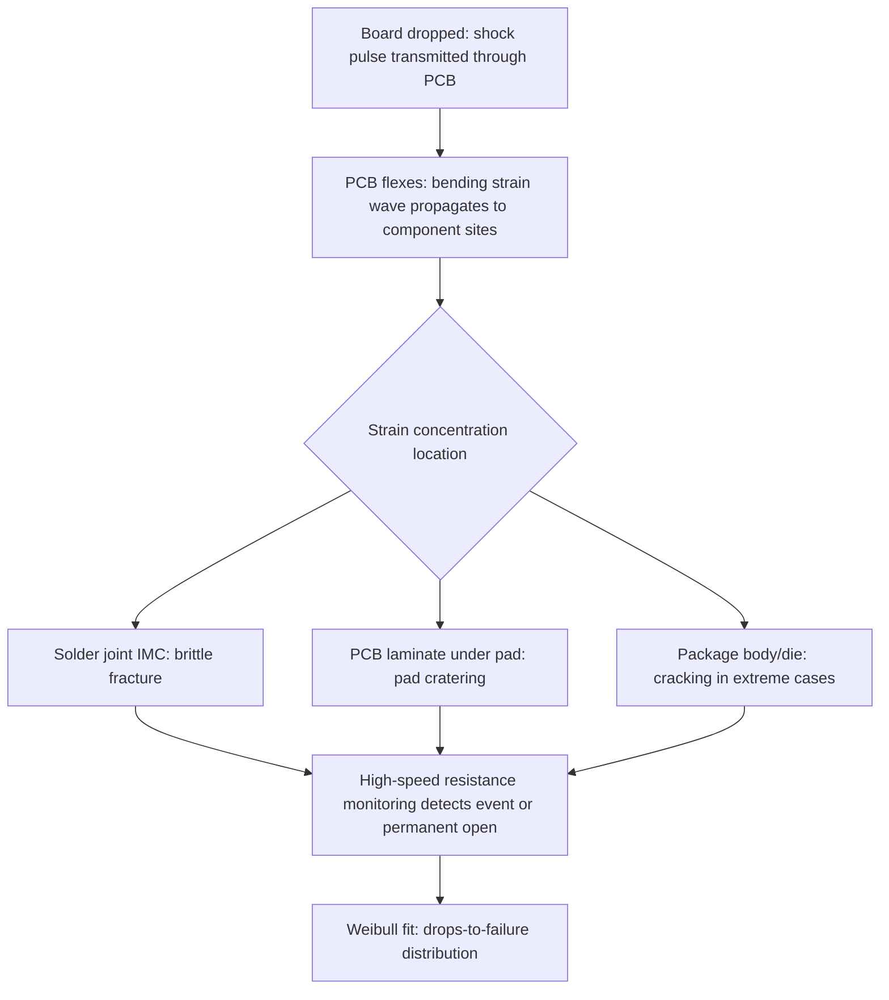

## Board-Level Drop and Vibration Reliability

### Overview

Board-level drop and vibration reliability testing evaluates the mechanical robustness of a package's solder joint interconnects when the assembled PCB experiences sudden mechanical shock (drop) or sustained cyclic mechanical excitation (vibration) — both dominated by **high-strain-rate, brittle-fracture-prone failure mechanisms** distinct from the thermally-driven low-cycle fatigue governing temperature cycling. These tests are especially critical for handheld and portable electronics (smartphones, wearables, automotive under-hood/chassis modules subject to road vibration), where board-level mechanical events, not thermal cycling, are often the dominant field-failure driver. The governing standards are **JESD22-B111** (board-level drop) and **JESD22-B103/B103B** (vibration), both distinguishing board-level (system-representative) testing from component-level (package-only) testing, since the PCB's flexural response is itself a first-order contributor to the strain experienced at the solder joint.

---

### Board-Level Drop Test — JESD22-B111

#### Purpose and Failure Mechanism

Board-level drop testing simulates the mechanical shock experienced when a handheld device is dropped, capturing the **PCB bending response** that transmits high strain rates to solder joints — this is fundamentally different from component-level drop or shock testing (e.g., MIL-STD-883 Method 2002), which tests the package in isolation without the board's dynamic flexural contribution.

The dominant failure mechanism is **brittle fracture** of the solder joint or the intermetallic compound (IMC) layer, occurring on a millisecond timescale — orders of magnitude faster than the low-cycle fatigue crack growth seen in temperature cycling. This high strain rate favors **brittle IMC cracking** (at the Cu₆Sn₅/Cu₃Sn or Ni₃Sn₄ interface) over the ductile bulk-solder deformation that dominates under slow thermal cycling strain rates, meaning board-level drop failures often occur at a different physical location within the same solder joint than TC failures.

#### Test Setup and Conditions (JESD22-B111)

**Key Points**

- Standard test board: JEDEC-defined form factor, typically a 132mm × 77mm × 1.0mm PCB with a defined pattern of component daisy-chained test packages, mounted via standoffs at four corners.
- Drop table apparatus: the board is mounted horizontally and dropped from a specified height onto a rigid or semi-rigid impact surface, producing a controlled shock pulse.
- Standard shock pulse: half-sine pulse, **1500 G peak acceleration, 0.5 ms duration** (JESD22-B111's baseline condition), though alternate conditions exist for different product segments.
- Drop count: typically evaluated to a specified number of drops (e.g., 30 drops as a common pass/fail threshold in consumer electronics qualification, though exact criteria are product/application-specific and not fixed by the standard itself).
- In-situ monitoring: daisy-chained solder joints are continuously monitored for resistance during each drop event via a high-speed data acquisition system (typically triggered to capture microsecond-scale resistance transients), since a joint can exhibit an intermittent "event" failure (brief resistance spike/dropout during the shock pulse) that would be missed by end-point-only continuity checks.

#### Failure Statistics

Board-level drop failure data is typically analyzed via **Weibull distribution** (drop-number-to-failure), similar in statistical framework to TDDB but representing a distinct physical mechanism:

$$F(n) = 1 - \exp\left[-\left(\frac{n}{\eta}\right)^{\beta}\right]$$

where $n$ is the drop number at failure, $\eta$ is characteristic drop life, and $\beta$ is the Weibull shape parameter. A steep $\beta$ (high value) indicates tightly clustered failures consistent with a dominant brittle fracture mechanism at a consistent strain threshold; a shallow $\beta$ suggests mixed failure modes or higher process/material variability across the sample population.

**Example**

A CSP (chip-scale package) on a JEDEC standard drop-test board fails at a median of 22 drops under the 1500G/0.5ms condition, with Weibull $\beta \approx 4.2$. Cross-section FA at the failure site reveals brittle fracture through the Ni₃Sn₄ IMC layer at the package-side pad, a signature consistent with excessive IMC thickness from over-reflow or aged (previously reflowed multiple times) solder joints — distinguishing this from a bulk-solder ductile failure that would instead indicate insufficient solder volume or standoff height.

---

### Failure Site Characterization in Drop Testing

**Key Points**

- **Package-side pad cratering**: fracture occurring in the PCB laminate beneath the copper pad (not in the solder joint itself), typically associated with brittle low-$D_k$/high-modulus laminate materials or insufficient pad-to-trace transition design; this is a **board-level** failure mode, not a solder joint failure, and requires different mitigation (laminate selection, pad design) than solder-side fixes.
- **Solder joint brittle fracture at IMC interface**: the classic drop-test failure mode; sensitive to IMC thickness (grows with each reflow/rework cycle and with elevated storage temperature), solder alloy composition (SAC alloys with certain minor-element dopants, e.g., Ni or Mn additions, have been shown in the literature to improve drop performance versus standard SAC305), and pad finish (ENIG vs. OSP vs. immersion Sn each present different IMC growth kinetics).
- **Via-in-pad and pad design effects**: stress concentration at the solder joint periphery is influenced by pad geometry, solder mask defined (SMD) vs. non-solder-mask-defined (NSMD) pad design, and via placement — NSMD pads are generally reported to distribute stress more favorably for drop performance versus SMD, though [Inference] the magnitude of this effect is package- and stackup-specific rather than a universal fixed improvement factor.

---

### Vibration Testing — JESD22-B103

#### Purpose and Failure Mechanism

Vibration testing evaluates solder joint and component robustness under **sustained cyclic mechanical excitation**, relevant for automotive (engine/chassis-mounted modules experiencing continuous road-induced vibration), aerospace, and industrial applications where mechanical fatigue from resonance-driven cyclic stress — not a single shock event — is the dominant field stress. The governing mechanism is classical **high-cycle mechanical fatigue**, distinct from both the low-cycle thermal fatigue of TC and the single-event brittle fracture of drop testing.

#### Test Conditions (JESD22-B103B)

**Key Points**

- Frequency sweep: the board/component assembly is swept across a defined frequency range (commonly 20 Hz–2000 Hz per standard test profiles, with automotive-specific profiles per AEC-Q100/Q104 often extending or modifying this range) to identify **resonant frequencies** where the structure's response amplitude peaks.
- Resonance dwell: once resonant frequencies are identified (via a low-level sweep characterization step), the test typically dwells at or near resonance for an extended duration at higher excitation amplitude, since resonance dramatically amplifies the effective strain at the solder joint for a given input acceleration — testing only at non-resonant frequencies would understate real-world risk if the assembly's resonance falls within the field vibration spectrum.
- Excitation profile: can be sinusoidal (single-frequency, swept), random vibration (broadband, PSD-defined spectrum more representative of real-world automotive/aerospace environments), or a combination; random vibration testing is increasingly favored for automotive qualification as it better represents actual road/engine vibration spectra versus a pure sine sweep.
- Acceleration levels: application-specific, ranging from a few G in benign environments to 20+ G in engine-mounted automotive applications; AEC-Q104 (multi-chip module qualification) and OEM-specific specifications often define acceleration/duration profiles tailored to mounting location (engine compartment vs. cabin vs. chassis).

#### Fatigue Life Under Vibration

High-cycle vibration fatigue is governed by stress-based fatigue models (S-N curve approach) rather than the strain-based Coffin-Manson relation used for low-cycle thermal fatigue:

$$N_f = \left(\frac{\sigma_a}{\sigma_f'}\right)^{1/b}$$

where $N_f$ is cycles to failure, $\sigma_a$ is stress amplitude, $\sigma_f'$ is the fatigue strength coefficient, and $b$ is the fatigue strength exponent (material-specific). Because vibration failures accumulate over very high cycle counts (potentially $10^6$–$10^8$ cycles at typical resonant frequencies over a qualification duration), the applicable stress regime is generally the **high-cycle fatigue (HCF)** portion of the S-N curve, where stress amplitudes are well below the material's yield strength and failure is driven by microstructural crack initiation at defects rather than bulk plastic deformation.

**Key Points**

- Resonant frequency shift during test (monitored via accelerometer response or strain gauge) is itself a diagnostic signal — a shift indicates developing damage (crack growth reducing local stiffness) even before a full electrical open occurs, allowing damage progression tracking rather than only binary pass/fail readout.
- Component mass and mounting (e.g., large discrete components, connectors, or heavy heatsinks mounted near a BGA) can significantly alter local board resonance and strain distribution, meaning vibration qualification results are not always transferable across different board designs even with the same package under test — board-level system context matters more for vibration than for many other reliability tests.

---

### Comparative Framework: Drop vs. Vibration vs. Temperature Cycling

| Aspect | Board-Level Drop | Vibration | Temperature Cycling |
| --- | --- | --- | --- |
| Driving stimulus | Single/repeated mechanical shock | Sustained cyclic mechanical excitation | Cyclic thermal excursion |
| Strain rate | Very high (millisecond pulse) | Moderate-high (Hz–kHz cyclic) | Very low (minutes-scale ramps) |
| Dominant fracture mode | Brittle (IMC cracking, pad cratering) | High-cycle fatigue (S-N curve) | Low-cycle fatigue (Coffin-Manson) |
| Statistical model | Weibull (drops-to-failure) | Weibull or lognormal (cycles-to-failure) | Lognormal (cycles-to-failure) |
| Key standard | JESD22-B111 | JESD22-B103/B103B | JESD22-A104 |
| Most sensitive package feature | IMC thickness, pad design, PCB flex | Resonant frequency, mounting mass | CTE mismatch, solder volume/standoff |

---

### Advanced Packaging-Specific Considerations

**Key Points**

- **Fan-out and WLCSP (wafer-level chip-scale packages)**: having no substrate/interposer buffering between die and PCB solder joint, these packages transmit board flex strain more directly to the die-adjacent solder joints, generally making them **more drop-sensitive** than substrate-based BGA packages of similar footprint, all else equal — a key reason WLCSP drop performance is a heavily studied and iterated topic in mobile/wearable packaging.
- **Large-body 2.5D/3D packages**: larger footprint increases the moment arm for board-bending-induced strain at peripheral solder joints, making corner/edge joints in large interposer-based packages particularly drop-test-critical, analogous to (but mechanistically distinct from) the corner-joint criticality seen in TC.
- **Underfill as a drop-performance lever**: capillary underfill significantly improves drop performance by mechanically coupling the die to the substrate/board and distributing shock-induced strain away from concentrated solder joint sites — however, underfill selection involves a trade-off, since a very stiff underfill can improve drop performance while simultaneously *worsening* TC fatigue life (by preventing the solder joint's natural stress-relieving deformation), meaning drop and TC requirements can pull underfill material selection in opposing directions and require co-optimization rather than independent optimization.
- **TSV and micro-bump structures under shock**: [Inference] high strain-rate shock loading on fine-pitch micro-bump arrays in 2.5D/3D stacks is expected to favor brittle fracture at the micro-bump IMC interface similar to board-level solder joints, though the much smaller feature size and different loading path (die-to-interposer rather than package-to-board) mean direct extrapolation from JESD22-B111 board-level data to micro-bump-level shock behavior is not established as a validated equivalence and generally requires dedicated characterization.

---

### Failure Analysis Techniques

**Key Points**

- **High-speed data acquisition + event detection**: essential during both drop and vibration testing to capture transient/intermittent failures (microsecond-scale resistance spikes) that would be missed by post-test-only continuity checks — this is a key procedural difference from TC/HAST FA, where end-point or interval readout is generally sufficient given the much slower failure development timescale.
- **Cross-section + SEM/EDX**: identifies fracture path (brittle IMC vs. pad crater vs. bulk solder) and correlates with IMC thickness measurement, pad finish analysis, and solder microstructure.
- **Dye-and-pry**: particularly valuable for drop-test FA to map the full pattern of fractured vs. intact joints across the array, revealing whether failure clusters at corners/edges (consistent with board-flex-driven strain distribution) or is randomly distributed (suggesting a process/material defect rather than a design-driven stress concentration).
- **Fractography (SEM examination of fracture surface)**: distinguishes brittle cleavage fracture (drop/shock) from fatigue striations (vibration/TC), providing direct mechanistic confirmation of which stimulus produced a given failure when root-causing field returns where the actual field stress history is unknown.

---

**Related Topics**

- Reliability test standards: temperature cycling, HAST, and thermal shock
- Delamination, cracking, and warpage-driven failure modes
- Underfill material selection and drop/TC trade-off optimization
- Solder alloy selection (SAC305 vs. doped alloys) for drop performance
- AEC-Q104 automotive multi-chip module vibration/shock qualification
- Pad finish and IMC growth kinetics (ENIG, OSP, immersion Sn)
- Dye-and-pry and fractography techniques for interconnect failure analysis
- WLCSP and fan-out package drop reliability optimization