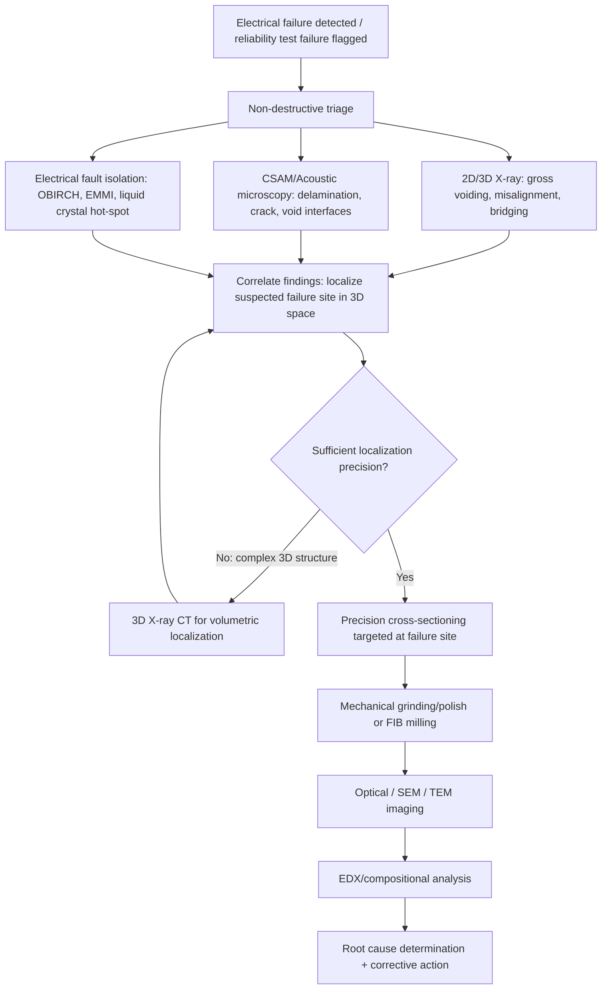

## Failure Analysis Techniques: Cross-Sectioning, X-Ray, and Acoustic Microscopy

### Overview

Cross-sectioning, X-ray inspection, and acoustic microscopy form the core physical failure analysis (FA) toolkit for advanced packaging and heterogeneous integration, spanning the full spectrum from non-destructive screening to destructive root-cause confirmation. These techniques are typically applied in a **structured escalation sequence** — non-destructive methods (X-ray, acoustic microscopy) first to localize and characterize a defect without altering the failure site, followed by destructive methods (cross-sectioning) to physically expose and confirm the failure mechanism at high resolution. Correct sequencing is critical: destructive analysis performed before non-destructive localization risks missing or physically destroying the actual failure site, especially in complex 3D structures (TSV stacks, fan-out RDL, 2.5D interposers) where the defect location is not always predictable from electrical failure signatures alone.

---

### Cross-Sectioning

#### Purpose and Principle

Cross-sectioning is a destructive technique that physically sections a package through a plane of interest, exposing internal structures for direct optical or electron microscopy examination. It remains the **gold-standard confirmation method** for most package-level failure mechanisms because it provides direct, high-resolution visual/compositional evidence of the failure site — void morphology, crack path, delamination interface, IMC layer structure — that indirect methods can only infer.

#### Process Flow

**Key Points**

- **Precision localization**: prior non-destructive data (X-ray, CSAM, electrical fault isolation) is used to target the sectioning plane as precisely as possible, since an imprecisely located cross-section risks missing the actual failure site by even tens of microns in fine-pitch structures.
- **Mounting and encapsulation**: the sample is potted in epoxy resin (often vacuum-impregnated to fill voids and prevent smearing during grinding) to provide mechanical support during subsequent grinding/polishing.
- **Coarse grinding**: progressive grinding with SiC abrasive papers (typically 240 through 1200+ grit) to approach the target plane while removing bulk material.
- **Fine polishing**: diamond suspension polishing (typically 6 μm down to 0.05 μm or colloidal silica final polish) to achieve a scratch-free, optically flat surface suitable for high-magnification imaging without polishing artifacts obscuring genuine features.
- **Staining/etching (optional)**: chemical etchants can selectively reveal grain boundaries, IMC layers, or specific material phases not distinguishable by polish alone (e.g., metallographic etchants for solder microstructure, or selective etches to differentiate Cu₆Sn₅ from Cu₃Sn IMC layers).
- **Imaging**: optical microscopy for initial overview and crack/delamination mapping; SEM for high-resolution imaging of fracture surfaces, void morphology, and fine-pitch interconnect structures beyond optical resolution limits.

#### Advanced Packaging-Specific Cross-Sectioning Considerations

**Key Points**

- **TSV and micro-bump structures**: require very high positional precision (often sub-10 μm targeting accuracy) given TSV diameters typically in the 5–20 μm range and micro-bump pitches increasingly below 40 μm; standard mechanical grinding/polishing is frequently supplemented or replaced by FIB (focused ion beam) milling for final precision sectioning at these scales.
- **FIB cross-sectioning**: uses a focused gallium (or other) ion beam to mill a precise cross-section, often combined with in-situ SEM imaging in a dual-beam FIB-SEM system, enabling nanometer-scale positional accuracy essential for isolating individual TSVs, micro-bumps, or specific RDL vias identified via prior electrical fault isolation (e.g., OBIRCH or EMMI localization).
- **Stacked die (3D-IC)**: cross-sectioning through multiple stacked die and intervening underfill/bonding layers requires careful attention to differential hardness between materials (Si die, Cu TSV, underfill, solder/hybrid bond interface) to avoid differential removal rates that can smear soft materials over harder ones or create polishing-induced artifacts that mimic delamination.
- **Hybrid bond interfaces**: extremely thin bond lines (often sub-micron) demand FIB-based sectioning and TEM-level imaging (rather than SEM alone) to resolve bond-interface voiding or incomplete bonding at the relevant length scale.

#### Limitations

**Key Points**

- Fundamentally destructive and single-plane — the technique only reveals the specific section plane chosen, meaning a failure site not intersected by the chosen plane is entirely missed; this is why precise non-destructive pre-localization is a prerequisite rather than an optional step for complex 3D structures.
- Preparation-induced artifacts (smearing, pull-out of brittle phases, polishing-induced micro-cracking) can be misinterpreted as genuine failure features if the analyst is not experienced in distinguishing process artifacts from authentic defects — comparison against a known-good reference cross-section prepared identically is standard practice to mitigate this risk.
- Time- and labor-intensive relative to non-destructive screening methods, generally reserving cross-sectioning for confirmed or highly suspected failure sites rather than broad population screening.

---

### X-Ray Inspection

#### Purpose and Principle

X-ray inspection uses differential X-ray attenuation across materials of different atomic number and density to non-destructively image internal package structures. Higher-atomic-number materials (solder, Cu, Au wire bonds) attenuate X-rays more strongly than lower-Z materials (mold compound, underfill, Si), producing contrast that reveals voiding, misalignment, bridging, and gross structural defects without physically altering the sample.

#### 2D X-Ray

**Key Points**

- Standard transmission imaging: a single 2D projection through the full package thickness, effective for detecting solder joint voiding, wire bond integrity, die placement/tilt, and gross bridging/shorting between adjacent conductive features.
- Limitation: overlapping features at different depths within the package superimpose in a single 2D projection, making it difficult to distinguish which layer a defect resides in for multi-layer/stacked structures — a void in a top-die solder joint and a void in a bottom-die solder joint in a 3D stack may appear at the same 2D image location despite being at entirely different physical depths.

#### 3D X-Ray CT (Computed Tomography)

**Key Points**

- Acquires multiple 2D projections across a full rotational sweep of the sample, computationally reconstructing a full 3D volumetric dataset — resolving the depth-ambiguity limitation of 2D X-ray and enabling virtual cross-sectioning at any arbitrary plane without physically sectioning the sample.
- Essential for **TSV void/crack detection**, **micro-bump array inspection** (individual bump voiding across a full BGA/µBGA array), and **3D-stacked die inspection** where 2D projection would conflate multiple die layers into an uninterpretable composite image.
- Resolution trade-off: achieving sub-micron resolution CT (sometimes termed nano-CT) requires either very small sample size or very long acquisition times, creating a practical trade-off between resolution, field of view, and scan duration — full-package nano-CT of a large 2.5D interposer package at TSV-resolving resolution can require extended scan times that limit throughput for high-volume screening applications.
- Laminography: an alternative to full CT rotation for large, flat samples (e.g., large PCBs or panel-level packages) where full 360° rotation is impractical; laminography acquires a limited-angle dataset sufficient to reconstruct planar-oriented internal structures (e.g., BGA solder joint arrays) without requiring the sample to be small enough for full rotational access.

**Example**

A 2.5D interposer package with a 12×12 TSV array shows intermittent electrical failure on a subset of signal paths. 2D X-ray inspection shows no obvious gross defect. 3D X-ray CT reveals a cluster of TSVs with partial void formation at the TSV-to-RDL landing pad interface, invisible in 2D projection due to overlapping RDL trace structures at the same projected location. This CT-derived localization data is then used to target FIB cross-sectioning precisely at the affected TSVs for SEM/EDX confirmation of the void composition and root cause (traced to incomplete Cu electroplating fill during the original TSV metallization process).

---

### Acoustic Microscopy

#### Purpose and Principle

Acoustic microscopy (commonly implemented as **C-mode Scanning Acoustic Microscopy, CSAM**, also called Scanning Acoustic Tomography/SAT) uses high-frequency ultrasound pulses transmitted into the package through a coupling medium (typically water), with reflected acoustic energy detected to map internal interfaces based on **acoustic impedance mismatch**. This makes CSAM uniquely sensitive to **delamination, cracking, and voiding** — an air gap (delamination or void) presents an extreme acoustic impedance mismatch relative to any bonded solid interface, producing a strong, easily distinguished reflection signature that other techniques (X-ray, which is density/Z-based rather than interface-based) are comparatively insensitive to for thin delamination layers.

#### Operating Modes

**Key Points**

- **C-mode (C-scan)**: the most common mode, producing a 2D planar image at a selected depth (time-gated to isolate reflections from a specific interface of interest, e.g., specifically the die-attach interface versus the mold compound surface), analogous to viewing a single "slice" from above.
- **A-mode (A-scan)**: a single-point depth profile showing reflected signal amplitude versus time (depth) at one location, useful for initial gate-setting calibration and understanding the full layer stack's acoustic response before performing a full C-scan.
- **B-mode (B-scan)**: a cross-sectional (side) view along a scan line, providing depth-resolved information analogous to a virtual cross-section without physical sectioning, useful for visualizing delamination depth and extent through the package thickness.
- **Through-Scan Acoustic Microscopy (TSAM)**: transmits ultrasound through the full sample thickness (transducer on one side, receiver on the other) rather than using pulse-echo reflection, useful for gross void/delamination detection in simpler structures but less common for high-resolution defect localization than pulse-echo C-mode.

#### Frequency Selection Trade-offs

**Key Points**

- Higher frequency transducers (e.g., 100+ MHz to GHz range) provide finer spatial resolution and thinner-layer sensitivity but shallower penetration depth — suited to thin, fine-pitch structures like RDL or thin die-attach layers close to the sample surface.
- Lower frequency transducers (e.g., 10–30 MHz) penetrate deeper into thick packages (large BGA, thick mold caps) at the cost of coarser resolution — suited to detecting delamination deep within a thick package stack.
- [Inference] Selecting the appropriate frequency for a given package requires balancing the depth of the interface of interest against the resolution needed to distinguish it from adjacent interfaces, and is typically determined empirically per package construction rather than from a single universal frequency recommendation.

#### Advanced Packaging Applications

**Key Points**

- **MSL/popcorn crack screening**: CSAM is the primary method for detecting moisture-induced delamination at mold compound, underfill, and RDL interfaces following MSL preconditioning, as covered under moisture sensitivity qualification.
- **Fan-out RDL delamination**: fine-pitch RDL/dielectric interfaces in FOWLP require high-frequency CSAM to resolve delamination at the relevant thin-layer scale, often in combination with careful gate-timing to isolate the specific RDL-to-mold or RDL-to-dielectric interface from adjacent layers.
- **Die-attach void mapping**: quantitative void-area-percentage measurement via C-scan is a standard process-control metric for die attach film (DAF) or paste die-attach quality, with acceptance criteria typically specified as maximum allowable void percentage of total die-attach area.
- **In-line/interval reliability monitoring**: CSAM's non-destructive nature makes it the standard method for interval inspection during TC/TS/HAST reliability testing (e.g., checking for delamination onset at 200, 500, 1000 cycles) without terminating the test unit, enabling degradation progression tracking on the same physical sample across the full test duration.

---

### Integrated FA Workflow

---

### Comparative Summary

| Technique | Destructive | Best For | Key Limitation |
| --- | --- | --- | --- |
| Cross-sectioning | Yes | High-res confirmation, crack path, IMC/microstructure | Single plane only; requires precise pre-localization |
| 2D X-ray | No | Gross voiding, wire bond, die placement, bridging | Depth-ambiguous (overlapping layers) |
| 3D X-ray CT | No (typically) | TSV/micro-bump void mapping, 3D-stack internal structure | Resolution/scan-time/field-of-view trade-off |
| Acoustic microscopy (CSAM) | No | Delamination, cracking, voiding via impedance contrast | Requires liquid coupling; depth resolution vs. frequency trade-off |
| FIB-SEM | Yes (localized) | Nanometer-precision sectioning of TSV/micro-bump/hybrid bond | Small field of view; slow for large-area work |

**Key Points**

- No single technique is sufficient in isolation for comprehensive advanced-packaging FA — the standard practice is a **layered, escalating approach**: broad non-destructive screening (X-ray, CSAM) to localize, followed by increasingly precise destructive methods (mechanical cross-section, then FIB) to confirm, with electrical fault isolation techniques (OBIRCH, EMMI) often bridging the gap between "which die/net failed" and "where exactly within the structure."
- Technique selection should be matched to the *suspected* failure mechanism from the outset (e.g., go straight to CSAM for a MSL-related failure hypothesis, straight to 3D X-ray CT for a suspected TSV void) rather than applying every technique unconditionally, both for efficiency and because some techniques (e.g., cross-sectioning) irreversibly consume the sample.

---

**Related Topics**

- Reliability test standards: temperature cycling, HAST, and thermal shock
- Delamination, cracking, and warpage-driven failure modes
- Moisture sensitivity levels and popcorn cracking
- Electrical fault isolation: OBIRCH, EMMI, and liquid crystal hot-spot detection
- FIB-SEM and TEM techniques for nanoscale interconnect characterization
- Board-level drop and vibration reliability (fractography and dye-and-pry FA methods)
- EDX/compositional analysis for contamination and IMC characterization
- Statistical process control for CSAM-based void/delamination acceptance criteria