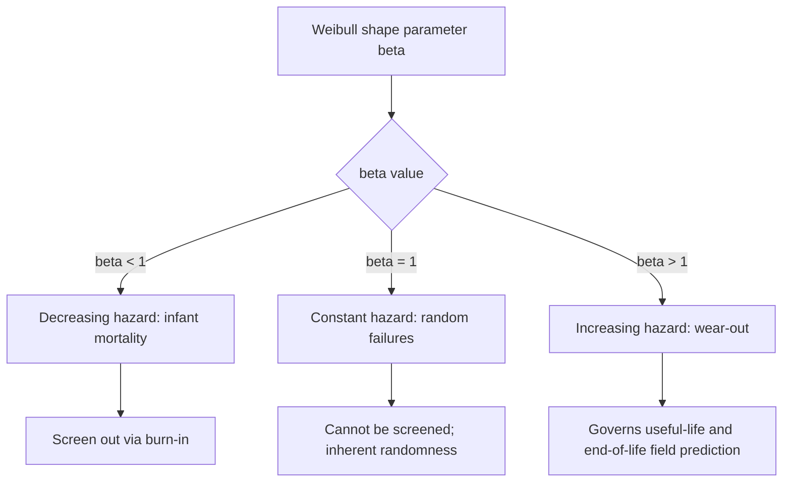
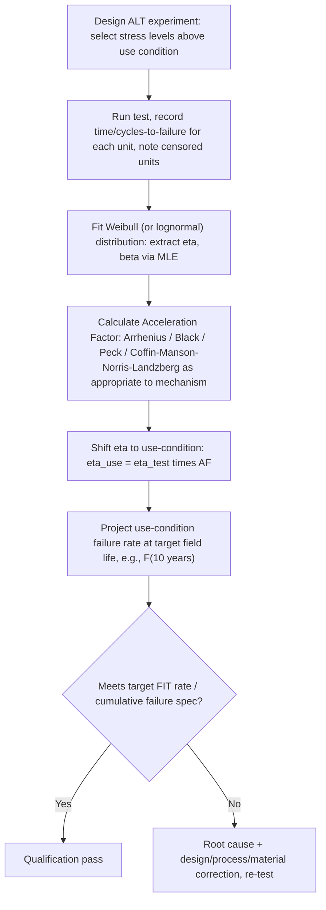

## Accelerated Life Testing and Weibull Reliability Modeling

### Overview

Accelerated Life Testing (ALT) and Weibull reliability modeling together form the statistical backbone that converts raw reliability test data (from temperature cycling, HAST, drop, vibration, EM, TDDB, and other stress tests) into quantitative, field-life predictions and pass/fail qualification decisions. ALT applies stress levels above normal use conditions to compress the time required to observe failures, while Weibull analysis provides the statistical distribution framework to characterize the resulting failure population, extract meaningful life metrics, and extrapolate back to use-condition field life via acceleration factors. This combination is foundational to virtually every reliability qualification flow (JESD47) discussed elsewhere in this chapter — it is the mathematical layer that sits beneath every specific test method.

---

### Accelerated Life Testing Fundamentals

#### Purpose and Philosophy

ALT exploits the physical reality that most failure mechanisms in semiconductor packaging (fatigue, diffusion, corrosion, dielectric breakdown) have **rate-limiting steps that are themselves accelerated by stress** (temperature, voltage, humidity, mechanical strain). By applying stress well above use conditions, a test that would otherwise require years to produce statistically meaningful failure data can be compressed into hundreds or thousands of hours, provided the underlying failure mechanism remains **physically consistent** between test and use conditions (a critical caveat addressed below).

#### Types of Acceleration

| Acceleration Type | Stimulus | Governing Model | Applicable Mechanism |
| --- | --- | --- | --- |
| Thermal | Temperature | Arrhenius | Diffusion-driven (EM, corrosion, chemical degradation) |
| Thermal cyclic | $\Delta T$, cycle frequency | Coffin-Manson / Norris-Landzberg | Solder fatigue (TC, TS) |
| Electrical | Voltage/field | E-model, 1/E-model, power law | TDDB, dielectric wear-out |
| Current density | Current density | Black's equation | Electromigration |
| Humidity | Relative humidity | Peck model | HAST, corrosion, ECM |
| Mechanical | Stress amplitude/strain rate | S-N curve (fatigue), fracture mechanics | Vibration, drop/shock |

#### The Arrhenius Relationship (General Thermal Acceleration)

The foundational thermal acceleration model, applicable across many mechanisms as a multiplicative term combined with mechanism-specific stress terms:

$$AF_{thermal} = \exp\left[\frac{E_a}{k}\left(\frac{1}{T_{use}} - \frac{1}{T_{test}}\right)\right]$$

where $E_a$ is the mechanism's activation energy (eV), $k$ is Boltzmann's constant ($8.617 \times 10^{-5}$ eV/K), and temperatures are in Kelvin. $E_a$ is mechanism- and often process-specific — it is not a universal constant, and [Inference] using a generic literature $E_a$ rather than an empirically extracted value for the specific process/material system under test is a common source of qualification risk, since acceleration factor calculations are exponentially sensitive to $E_a$.

**Example**

A Cu-interface EM mechanism with $E_a = 0.8$ eV tested at 200°C (473K) against a use condition of 85°C (358K) yields:

$$AF_{thermal} = \exp\left[\frac{0.8}{8.617\times10^{-5}}\left(\frac{1}{358} - \frac{1}{473}\right)\right] \approx \exp(6.03) \approx 415\times$$

A 1000-hour test at this condition thus represents an implied use-condition life of roughly 415,000 hours (~47 years) *for the thermal component alone* — this must be combined multiplicatively with any current-density or other stress-term acceleration (per Black's equation) for the full AF.

#### Design of Experiments for ALT

**Key Points**

- **Single-stress ALT**: one accelerating variable (e.g., temperature only) held at multiple discrete levels to allow extrapolation of the acceleration model parameters themselves (not just a single AF at one condition) — necessary when $E_a$ or other model parameters are not already well-established for the specific material/process system.
- **Multi-stress ALT**: two or more stresses applied simultaneously (e.g., HAST's combined temperature + humidity + bias) — requires a combined model (Peck model for HAST) and more complex experimental design to separate the individual stress contributions.
- **Step-stress testing**: stress level increased in discrete steps on the same sample set over time, useful for rapid characterization but requiring careful statistical treatment (e.g., cumulative damage models) to convert step-stress results into an equivalent constant-stress life estimate — [Unverified] step-stress-to-constant-stress conversion accuracy depends on the validity of the assumed cumulative damage model (commonly a linear damage accumulation assumption), which may not hold precisely for all failure mechanisms.
- **Censoring**: most ALT datasets are **right-censored** — testing stops (for time/cost reasons) before all units fail, meaning some units are known only to have survived to at least the censoring time, not their true failure time. Proper statistical treatment of censored data (rather than discarding or mishandling censored units) is essential for unbiased parameter estimation.

---

### Weibull Distribution Fundamentals

#### Why Weibull

The two-parameter Weibull distribution is the dominant reliability modeling framework in semiconductor packaging because its flexible shape parameter can represent decreasing, constant, or increasing hazard rate regimes — corresponding respectively to infant mortality (early-life defects), random/constant failure rate, and wear-out (fatigue/aging) failure populations — within a single unified mathematical framework, unlike the lognormal distribution (also widely used, particularly for EM) which lacks this direct hazard-rate-shape interpretability.

#### Mathematical Form

Cumulative distribution function (CDF):

$$F(t) = 1 - \exp\left[-\left(\frac{t}{\eta}\right)^{\beta}\right]$$

Probability density function (PDF):

$$f(t) = \frac{\beta}{\eta}\left(\frac{t}{\eta}\right)^{\beta-1}\exp\left[-\left(\frac{t}{\eta}\right)^{\beta}\right]$$

Hazard (failure) rate function:

$$h(t) = \frac{\beta}{\eta}\left(\frac{t}{\eta}\right)^{\beta-1}$$

where $t$ is time (or cycles, drops, or other relevant stress-count unit), $\eta$ is the **characteristic life** (scale parameter, the time at which 63.2% cumulative failure is reached, independent of $\beta$), and $\beta$ is the **shape parameter**.

#### Interpreting the Shape Parameter $\beta$

| $\beta$ Value | Hazard Rate Behavior | Physical Interpretation |
| --- | --- | --- |
| $\beta < 1$ | Decreasing | Infant mortality / early-life defects (e.g., latent process defects, marginal solder joints) |
| $\beta = 1$ | Constant | Random failures (reduces to exponential distribution) |
| $\beta = 1$–3 | Increasing (moderate) | Mild wear-out onset |
| $\beta > 3$ | Increasing (steep) | Strong wear-out, tightly clustered fatigue failure (e.g., classic TC solder fatigue often shows $\beta \approx 3$–6) |

**Key Points**

- The classic **bathtub curve** field failure-rate pattern is the superposition of a decreasing-hazard early-life population ($\beta<1$, screened by burn-in), a constant-hazard random-failure population ($\beta=1$), and an increasing-hazard wear-out population ($\beta>1$) — different reliability tests are designed to characterize different regions of this curve (HAST/burn-in target early-life; TC/TDDB/EM target wear-out).
- A $\beta$ estimate derived from a small sample size carries substantial statistical uncertainty (confidence bounds on $\beta$ can be wide with typical qualification sample sizes of tens of units) — reporting a point estimate of $\beta$ without its confidence interval can overstate the precision of the underlying failure population characterization.

---

### Three-Parameter Weibull

Some datasets exhibit a **failure-free period** before any failures begin, better modeled with a location parameter $\gamma$:

$$F(t) = 1 - \exp\left[-\left(\frac{t-\gamma}{\eta}\right)^{\beta}\right], \quad t \geq \gamma$$

where $\gamma$ represents a minimum guaranteed life before the wear-out mechanism can produce any failure. [Inference] While physically plausible for some fatigue-dominated mechanisms (e.g., a true incubation period before crack initiation in Coffin-Manson-governed solder fatigue), the three-parameter model requires more data to fit reliably than the two-parameter form and can be prone to overfitting or non-physical $\gamma$ estimates with limited sample sizes — the two-parameter model remains the more common default in JEDEC-aligned qualification reporting unless there is strong physical or statistical justification for the location parameter.

---

### Parameter Estimation Methods

**Key Points**

- **Maximum Likelihood Estimation (MLE)**: the statistically preferred method for parameter estimation, particularly with censored data, as it properly incorporates the information content of both failed and (right-censored) surviving units without requiring the ad-hoc adjustments that rank-regression methods need for censoring.
- **Median Rank Regression (MRR) / Weibull probability plotting**: a graphical method (plotting $\ln[-\ln(1-F)]$ versus $\ln(t)$, which linearizes the Weibull CDF) — historically popular for its visual interpretability and ease of manual computation, and still widely used for quick visual assessment of goodness-of-fit, but generally considered statistically less efficient than MLE, especially for smaller or heavily censored datasets.
- Goodness-of-fit assessment (e.g., Anderson-Darling statistic) should accompany parameter estimation to confirm the Weibull distribution is an appropriate model for the observed failure population — not all failure mechanisms are well-described by Weibull, and forcing a poor-fitting distribution onto data can produce misleading life predictions.

---

### From Test Data to Field-Life Prediction

#### The Full Reliability Prediction Chain

#### Converting to FIT Rate

Failure rate at a specific point in the product life, expressed in **FIT** (Failures In Time, per $10^9$ device-hours), is derived from the fitted hazard function evaluated at the target field-life time, scaled by the acceleration factor:

$$FIT = h(t_{field}) \times 10^9 \times \frac{1}{AF}$$

(with appropriate unit consistency between $h(t)$ and the FIT time base) — this FIT figure is what feeds into system-level reliability budgets that sum contributions across EM, TDDB, TC-fatigue, and other independent wear-out mechanisms, as discussed under electromigration/TDDB reliability budgeting.

**Example**

A TC dataset (JESD22-A104, Condition G) on a flip-chip BGA yields a fitted Weibull with $\eta = 850$ cycles, $\beta = 4.5$ from a 45-unit sample (0-fail up to 500 cycles readout, remainder censored at 1000 cycles). Applying a Norris-Landzberg acceleration factor of 12× (accounting for the difference between the -40°C to 125°C test condition and an 85°C-ambient, 40°C-swing field-use profile) shifts the characteristic life to a use-condition $\eta_{use} = 10{,}200$ equivalent field-cycles. Evaluating the Weibull CDF at a 10-year target field life (assumed to correspond to ~3650 equivalent thermal cycles for the specific application duty cycle) gives $F(3650) \approx 0.08\%$ cumulative failure — compared against a system reliability target (e.g., <0.1% at 10 years) to determine pass/fail, with the duty-cycle-to-cycle-count conversion itself representing a separate, application-specific modeling assumption that should be validated against actual field usage profiles where possible.

---

### Common Pitfalls in ALT and Weibull Analysis

**Key Points**

- **Mechanism shift at high stress**: a critical validity assumption of any ALT is that the *same* failure mechanism dominates at both test and use conditions — if elevated stress triggers a different (non-field-representative) failure mode (e.g., a TC test temperature exceeding a material's glass transition, fundamentally changing its mechanical response), the resulting AF and life prediction are not valid extrapolations to use conditions, regardless of how well the Weibull fit describes the test data itself.
- **Insufficient sample size for tail-percentile claims**: qualification specs often target a very low cumulative failure percentile (e.g., 0.1% at 10 years) — this is the extreme early tail of the Weibull distribution, which is the region *least* well-constrained by a typical qualification sample size of tens of units; small changes in fitted $\beta$ can produce large changes in the predicted tail percentile even when the fit looks visually reasonable at the median.
- **Mixing failure populations**: if a test population contains two distinct failure mechanisms (e.g., some units failing via IMC brittle fracture, others via a process-defect-driven early failure), fitting a single Weibull distribution to the combined dataset can produce a poor fit and a physically meaningless $\beta$ — mechanism-specific failure mode analysis (via cross-sectioning/FA on each failed unit) should precede or accompany statistical fitting to confirm population homogeneity.
- **Zero-failure datasets**: a 0-fail qualification result (common under LTPD sampling plans) does not itself provide a $\beta$/$\eta$ estimate — it provides only a statistical *lower bound* on reliability at the given confidence level; reporting an assumed $\beta$ from a related dataset to back-calculate an implied $\eta$ from a 0-fail result requires that assumption to be stated explicitly as an assumption, not presented as a directly-fitted result.

---

**Related Topics**

- Reliability test standards: temperature cycling, HAST, and thermal shock
- Electromigration and time-dependent dielectric breakdown
- Board-level drop and vibration reliability
- FIT rate budgeting and system-level reliability allocation across mechanisms
- Burn-in screening and infant mortality reduction strategies
- Failure analysis techniques: cross-sectioning, X-ray, and acoustic microscopy
- Design of Experiments (DOE) methodology for reliability characterization
- Bayesian reliability estimation for small-sample qualification scenarios