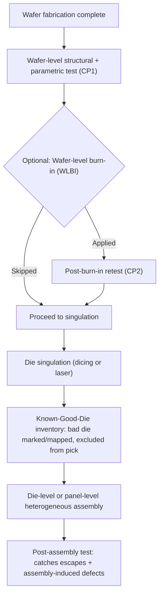
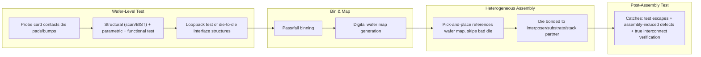

## Wafer-Level Test Architecture and Probe Card Technology

### Overview

Wafer-level test architecture encompasses the electrical test infrastructure, probing methodology, and test flow design used to verify die functionality and parametric performance while still in wafer form — before singulation and packaging. In advanced packaging and heterogeneous integration, wafer-level test takes on outsized importance because it is the primary (and often only practical) mechanism for achieving **Known-Good-Die (KGD)** status, a prerequisite for economically viable multi-die assemblies (2.5D/3D stacks, chiplet modules, fan-out multi-die packages) where a single bad die discovered post-assembly can scrap an otherwise-good multi-die module. Probe card technology — the physical interface translating tester electronics into die-level electrical contact — has evolved substantially to meet the fine-pitch, high-pin-count, high-frequency demands of modern advanced-node and heterogeneous designs.

---

### Wafer-Level Test Architecture

#### Test Flow Position and Purpose

**Key Points**

- **Wafer sort (WS) / Circuit Probe (CP)**: the primary wafer-level test step, applying functional, structural (scan/BIST), and parametric tests to each die on the wafer while still in native wafer form, binning die as good/bad before dicing.
- **KGD requirement for heterogeneous integration**: unlike a single-die package where a bad die simply results in one scrapped package, a multi-die 2.5D/3D or chiplet assembly multiplies the cost impact of an undetected bad die by the value of every other known-good die and the assembly process cost bonded alongside it — making wafer-level test coverage and escape-rate minimization a first-order economic driver, not merely a quality nicety.
- **Test coverage economics**: the traditional "test economics" trade-off (more test time/coverage costs more per die but reduces field-failure and assembly-scrap cost) shifts substantially toward *more* wafer-level test investment in multi-die heterogeneous integration, since the downstream cost multiplier for an escaped defect is structurally higher than in single-die packaging.

#### Test Content Categories

| Category | Purpose |
| --- | --- |
| Continuity/opens-shorts | Basic connectivity verification, often first-pass low-cost screen |
| Parametric (DC/AC) | Leakage current, threshold voltage, timing margins |
| Scan-based structural test | Stuck-at, transition, and bridging fault coverage via scan chains |
| Built-In Self-Test (BIST) | Memory BIST (MBIST), logic BIST (LBIST) for embedded array/logic self-verification |
| Functional test | At-speed or reduced-speed functional pattern verification |
| Burn-in (wafer-level, WLBI) | Accelerated stress screening for infant-mortality defects, where economically justified |

**Key Points**

- Scan-based structural test (via JTAG/IEEE 1149.1 boundary scan and internal scan chains) provides the highest fault coverage per test-time investment for digital logic and is the dominant test content category in modern SoC/chiplet wafer sort flows.
- MBIST is essential for embedded memory arrays (SRAM, embedded DRAM) since external probe-based testing cannot efficiently access internal memory cell arrays at the density and speed required — MBIST controllers generate patterns and compare results on-die, reporting only pass/fail (or repair-map data for redundancy-enabled memories) to the tester.
- For heterogeneous integration specifically, **die-to-die interface test** (testing the specific I/O structures — micro-bump drivers/receivers, hybrid bond pads, TSV-adjacent circuitry — that will connect to another die post-assembly) is an increasingly critical test category, since these interfaces often cannot be fully exercised until the die is mated with its partner, creating an inherent test-coverage gap addressed partly through loopback structures and partly accepted as residual assembly-level risk.

#### Known-Good-Die (KGD) Strategies

**Key Points**

- **Wafer maps**: the bad-die location data from wafer sort is preserved as an ink-dot map (legacy) or, predominantly in modern flows, a digital wafer map format (e.g., SEMI-standard formats) that downstream pick-and-place/die-bonding equipment reads directly to skip known-bad die locations during die attach.
- **KGD confidence limitations**: even comprehensive wafer-level test cannot achieve 100% escape-free coverage — test escapes (defects not caught by the applied test content, often due to coverage gaps in analog/mixed-signal circuitry, marginal timing paths, or latent reliability defects not manifesting as functional failures at test time) remain a residual risk that assembly-level and system-level test must additionally address.
- **Burn-in trade-offs at wafer level**: wafer-level burn-in (WLBI) can screen infant-mortality ($\beta<1$ Weibull population) defects before assembly, but adds cost/cycle-time and carries handling-risk considerations (thermal stress on an unsingulated wafer); its use is generally reserved for applications where the escape-cost multiplier justifies the additional wafer-level investment (e.g., high-reliability automotive or aerospace multi-die modules).

---

### Probe Card Technology

#### Purpose and Core Requirements

The probe card is the physical/electrical interface between the wafer prober's tester channels and the die's bond pads or micro-bumps, and must simultaneously satisfy: fine-pitch mechanical contact accuracy, high pin-count parallelism (testing multiple die simultaneously to amortize test time/cost), signal integrity at increasingly high test frequencies, and sufficient mechanical durability across the probe card's operational lifetime (millions of touchdowns).

#### Probe Card Technology Types

| Type | Contact Mechanism | Typical Application |
| --- | --- | --- |
| Cantilever | Angled needle-like probes flexing on contact | Legacy, low pin-count, larger pad pitch |
| Vertical (Cobra/Blade) | Buckling wire or blade probes providing vertical compliance | Moderate pin-count, moderate pitch |
| MEMS-based (Membrane/Microspring) | Lithographically-fabricated micro-springs or membrane contacts | Fine-pitch, high pin-count, high-frequency |
| Vertical/MEMS Hybrid (e.g., cantilever-free vertical probe) | Combines vertical compliance with MEMS fabrication precision | Advanced-node fine-pitch, high-parallelism |

**Key Points**

- **Cantilever probe cards**: the oldest and simplest technology, using individually mounted angled needles that flex laterally on contact; limited in pitch scaling (generally not suited below ~80–100 μm pitch) and pin count due to the mechanical/assembly complexity of individually placing many needles, but remain cost-effective for legacy or lower-density applications.
- **Vertical probe cards (Cobra-style, blade probes)**: use probes designed to compress with primarily vertical motion (minimizing lateral scrub relative to cantilever designs), enabling finer pitch and higher pin counts than cantilever while maintaining good current-carrying capacity — a common choice for moderate-to-fine pitch power/mixed-signal test applications.
- **MEMS-based probe cards**: fabricated using photolithographic/semiconductor-like processes to create arrays of microscopic spring contacts (e.g., cantilevered microsprings or vertical micro-bump-scale probes) with very tight pitch capability (sub-40 μm and finer, increasingly matching advanced micro-bump and hybrid-bond pad pitches) and excellent multi-DUT (device-under-test) parallelism scalability — the dominant technology direction for advanced-node and advanced-packaging wafer test.

#### Advanced Packaging-Specific Probe Card Challenges

**Key Points**

- **Micro-bump and hybrid-bond pad probing**: die intended for 2.5D/3D stacking or hybrid bonding often present bond pads or micro-bumps not originally designed with probe contact robustness as a primary consideration (since their final function is a permanent bonded joint, not a repeated-touchdown probe target) — probe card design must account for potential bump/pad damage risk (e.g., probe mark cratering, oxide scrubbing requirements) that could compromise the subsequent bonding process quality if probing damages the contact surface.
- **High-frequency signal integrity**: as test frequencies rise (particularly for high-speed SerDes, HBM interface, and die-to-die interconnect test relevant to chiplet architectures), probe card design must manage impedance matching, crosstalk, and insertion loss across the probe-to-DUT signal path — increasingly requiring co-designed probe card and load board electrical simulation rather than treating the probe card as a passive mechanical interface only.
- **Multi-site/high-parallelism test**: amortizing wafer-sort tester cost over more simultaneously-tested die (multi-site testing) requires probe cards supporting proportionally more total probe count while maintaining per-site signal integrity and mechanical planarity across a larger physical probe card area — a scaling challenge that has driven much of the MEMS probe card technology development.
- **Planarity and co-planarity across large probe card areas**: as wafer diameters (300mm standard, with ongoing industry discussion of larger formats) and multi-site probe card areas grow, maintaining sub-micron-level contact planarity across the full probe card becomes mechanically demanding, particularly relevant when probing fine-pitch micro-bumps where excessive planarity variation risks incomplete contact on some die within a multi-site test.

#### Probe Card Reliability and Maintenance

**Key Points**

- **Probe wear and contact resistance drift**: repeated touchdowns cause gradual probe tip wear (oxide buildup, mechanical deformation), progressively degrading contact resistance and potentially introducing false-fail or false-pass test escapes if not proactively managed via scheduled cleaning and periodic contact resistance verification.
- **Probe card cleaning**: typically performed via dedicated cleaning wafers/substrates at scheduled touchdown-count intervals, removing accumulated oxide/debris from probe tips to restore contact resistance within acceptable limits.
- **Overdrive and scrub design**: the mechanical "overdrive" (additional z-axis travel after initial contact) and resulting lateral "scrub" motion are deliberately engineered to penetrate native oxide on the bond pad/bump surface and ensure low-resistance ohmic contact — however, excessive scrub risks pad/bump damage (particularly relevant for the micro-bump probing challenge noted above), requiring careful process-window optimization balancing reliable contact against contact-surface integrity.

---

### Test Architecture for Heterogeneous Integration Specifically

#### Die-to-Die Interconnect Test Structures

**Key Points**

- **Loopback test structures**: on-die test circuitry that routes a signal out through a micro-bump/TSV/hybrid-bond pad and back through an adjacent pad, allowing some degree of interconnect-driver/receiver verification at wafer level without requiring an actual mated partner die — a partial mitigation for the die-to-die interface test coverage gap noted earlier, though it cannot fully replace post-assembly interconnect verification since it does not test the actual mated interface.
- **Boundary scan extensions for 3D-IC (IEEE 1838)**: an emerging/established standard extending traditional JTAG boundary scan concepts to address 3D-IC-specific test access challenges — including TSV test, inter-die test access, and die-stack-aware test scheduling — recognizing that legacy single-die boundary scan architectures do not natively address the test access and fault-isolation requirements of a multi-die 3D stack. [Unverified] Industry adoption maturity and specific implementation details of IEEE 1838-based test architectures vary across vendors and should be verified against current tool/foundry PDK support for any specific advanced packaging program.
- **Test Access Port (TAP) chaining across stacked die**: in 3D stacks, individual die TAP controllers are often chained or made independently accessible depending on the assembly architecture, requiring test architecture planning (which die's TAP is accessible externally, how commands route to buried die) to occur at the chip design stage, well before assembly — a key example of design-for-test decisions needing to be made with full awareness of the eventual heterogeneous integration architecture, not treated as an afterthought.

#### Test Flow Diagram: Wafer Test to KGD to Assembly

---

### Emerging Directions

**Key Points**

- **Parallel test scaling pressure**: as die sizes shrink (chiplets) and die-per-wafer counts rise, wafer-sort throughput economics increasingly favor higher-parallelism (more simultaneous DUT) probe card architectures, pushing continued MEMS probe technology investment.
- **Co-design of probe interface with final bump/pad structure**: [Speculation] as hybrid bonding and ultra-fine-pitch micro-bump architectures become more prevalent, there is an industry trend toward designing dedicated test-only probe pads (separate from the functional bonding interface) specifically to avoid probe-induced damage risk to the final bond surface — though the specific adoption rate and standardization of this practice across the industry is still evolving and program-specific.
- **AI/ML-assisted test optimization**: adaptive test content selection and probe card health monitoring increasingly leverage statistical/ML techniques to optimize test time and predict probe maintenance needs, though [Unverified] the maturity and standardization of these approaches varies significantly by test house and equipment vendor, and specific implementation details should be verified against current vendor documentation for any given program.

---

**Related Topics**

- Known-Good-Die economics and multi-die assembly yield modeling
- Boundary scan and IEEE 1838 test standards for 3D-IC
- Built-In Self-Test (BIST) architectures for embedded memory and logic
- Post-assembly and system-level test strategies for chiplet modules
- Redundancy and repair strategies for embedded memory arrays
- MEMS probe card fabrication and mechanical reliability
- Die-to-die interconnect test structures for hybrid bonding and micro-bump interfaces
- Test economics and cost-of-test modeling for heterogeneous integration