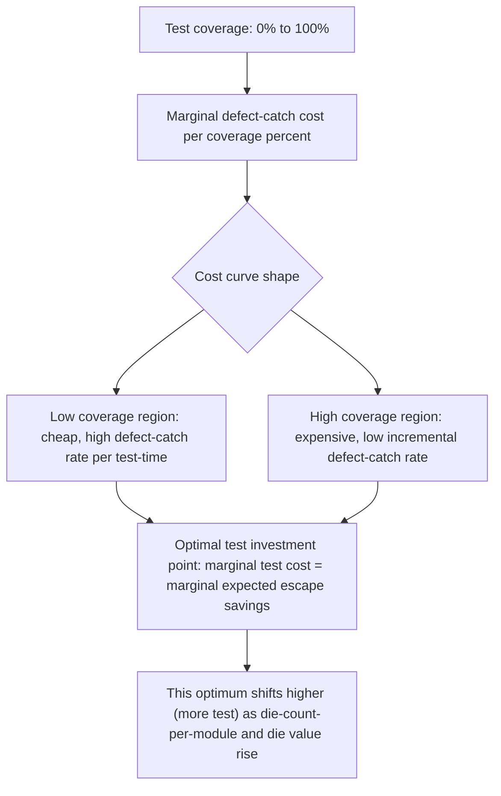
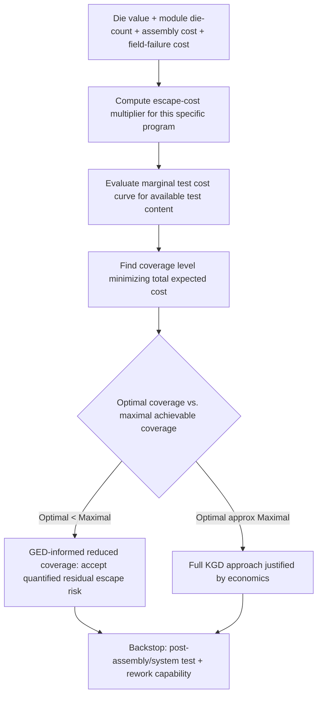

## Known Good Die and Good-Enough-Die Economic Trade-offs

### Overview

Known-Good-Die (KGD) and Good-Enough-Die (GED) represent two competing philosophies for managing test coverage, yield, and economic risk in multi-die heterogeneous integration. KGD pursues maximal pre-assembly test confidence to minimize the cost of assembling defective die into an expensive multi-die module, while GED — a more recent, economics-driven reframing — accepts that 100% defect-free assurance is neither achievable nor always economically optimal, and instead seeks the **test coverage level that minimizes total cost per good assembled module**, explicitly trading residual defect escape risk against test cost and cycle time. This trade-off is central to chiplet-based system design, 2.5D/3D integration, and any multi-die packaging strategy where assembly cost and die value are high enough that a bad die discovered post-assembly imposes a substantial cost multiplier.

---

### The Economic Case for KGD

#### Cost Multiplication in Multi-Die Assembly

The fundamental economic driver behind KGD is that in a multi-die assembly, an undetected bad die does not merely waste that one die's value — it scraps (or requires costly rework of) the **entire assembled module**, including every other known-good die bonded alongside it plus the assembly process cost itself.

$$C_{escape} = C_{bad\,die} + \sum_{i=1}^{n-1} C_{good\,die,i} + C_{assembly}$$

where $n$ is the number of die in the module. As $n$ grows (increasingly common in chiplet-based architectures with many small die), the cost penalty for a single escaped defect scales roughly linearly with the number of co-assembled die — making test investment that reduces escape rate proportionally more valuable as module die-count increases.

**Example**

A 2.5D interposer module integrates one high-value compute die ($150 cost basis) and four smaller I/O/memory chiplets ($20 each), plus $40 of interposer and assembly cost. If any single die is defective post-assembly and the defect is only caught at final module test, the scrap cost is $150 + 4(20) + 40 = \$270$ — versus the $20–$150 cost of the individual defective die alone had it been caught at wafer sort. This roughly 2–13× cost multiplier (depending on which die escapes) is the core quantitative argument for investing more heavily in wafer-level test coverage than would be justified for an equivalent single-die package.

#### Diminishing Returns of Test Coverage

Test coverage improvement follows a classic diminishing-returns economic curve: early test content (basic continuity, gross functional test) catches the majority of defects cheaply, while achieving each additional increment of coverage toward 100% requires disproportionately more test time, pattern development effort, and DFT (design-for-test) silicon area investment.

$$\text{Marginal Cost of Coverage} \propto \frac{1}{(1 - \text{Coverage})^k}$$

for some $k>1$ reflecting the accelerating cost of chasing the last few percentage points of fault coverage — this general shape (not a precisely derived formula, but a widely-observed empirical pattern in test economics) is why no realistic wafer-sort program targets literal 100% defect coverage; the optimal point is where marginal test cost equals marginal expected escape-cost savings, not the theoretical coverage maximum.

---

### Good-Enough-Die: Reframing the Optimization

#### Core Premise

GED explicitly acknowledges that the KGD ideal of "test until confident the die is defect-free" is not a well-posed economic objective, because **perfect confidence is unattainable at any finite test cost**, and pushing coverage asymptotically toward 100% eventually costs more in test time/cycle-time/capital equipment than the escape-cost risk it eliminates. GED reframes the question from "is this die good?" to "**is the expected total cost of using this die (including its escape-risk-weighted contribution to assembly scrap) lower than the cost of additional testing to increase confidence further?**"

$$\text{Total Cost} = C_{test} + P_{escape} \times C_{escape}$$

The GED-optimal test coverage is the point minimizing this total cost expression, which is generally **less than maximal achievable coverage** — meaning a rational economic optimum can deliberately accept a nonzero, quantified escape probability rather than pursuing ever-higher test coverage without bound.

**Key Points**

- GED is not a relaxation of quality standards in an unqualified sense — it is a reframing that makes the underlying cost trade-off explicit and quantitative rather than treating "more test coverage is always better" as an unexamined assumption.
- The GED-optimal coverage point is **not fixed** — it shifts with die value, module die-count, assembly cost, and the specific escape-cost multiplier for a given application, meaning the same die design can have different economically-optimal test strategies depending on which multi-die module it is destined for.
- [Inference] Applications with very high per-module value or safety-criticality (aerospace, automotive safety-critical, medical) will generally see their cost-optimal point shift toward higher test coverage than a cost-sensitive consumer application with lower per-unit value and higher risk tolerance, since $C_{escape}$ itself scales with application context beyond pure silicon/assembly cost (e.g., field-return and liability cost in safety-critical contexts).

#### Key Variables in the GED Optimization

| Variable | Description | Effect on Optimal Coverage |
| --- | --- | --- |
| Die value | Cost basis of the individual die | Higher value → generally justifies higher test investment |
| Module die-count ($n$) | Number of die per assembled module | Higher $n$ → escape cost rises → favors more coverage |
| Assembly cost | Cost of the bonding/integration process itself | Higher assembly cost → favors more coverage |
| Field failure/liability cost | Cost if an escape reaches the field (warranty, safety, brand) | Higher → favors more coverage, potentially dominating the calculation |
| Test cost per unit coverage | Tester time, pattern complexity, DFT area overhead | Higher marginal test cost → favors accepting lower coverage |
| Rework feasibility | Whether a bad-die module can be reworked (de-bond/re-bond) vs. scrapped outright | Rework feasibility reduces $C_{escape}$, favors lower coverage |

---

### Test Coverage Strategies Along the KGD–GED Spectrum

#### Full KGD Approach

**Key Points**

- Maximal wafer-level structural (scan/BIST), parametric, and functional test coverage, frequently supplemented with wafer-level burn-in (WLBI) for infant-mortality screening.
- Appropriate when die value is high, module die-count is high, rework is impractical/impossible (e.g., hybrid-bonded stacks that cannot be de-bonded), or the end application has high field-failure cost (safety-critical, high-reliability automotive/aerospace).
- Carries the highest wafer-sort cost and cycle-time burden, which must be justified by the escape-cost economics of the specific program.

#### Tiered/Risk-Weighted Testing

**Key Points**

- Applies differentiated test coverage depth by die role in the module — e.g., a central compute die that anchors the highest-value module assembly receives full KGD-level test, while lower-cost peripheral chiplets receive a reduced (but still substantive) test set, reflecting each die's differential contribution to total escape cost.
- This approach directly operationalizes the GED cost-optimization logic without requiring a single uniform coverage target across all die in a heterogeneous system.

#### Assembly-Level and System-Level Test as a Backstop

**Key Points**

- Regardless of wafer-level coverage philosophy, post-assembly and system-level test remains a necessary final backstop, catching both wafer-level test escapes and assembly-induced defects (misalignment, bonding voids, interconnect opens from the bonding process itself) that cannot be detected before assembly by definition.
- The GED framework explicitly treats post-assembly test capability as part of the overall economic calculation — a program with strong, low-cost assembly-level test and rework capability can rationally accept lower wafer-level coverage than a program where assembly-level defects are expensive or impossible to detect/rework, since the "safety net" cost differs.
- **Known-Good-Stack (KGS)** is sometimes used as an extension of the KGD concept to describe verified partial or full die stacks in 3D integration, acknowledging that stack-level test (after some but not all bonding steps) can be a valuable intermediate checkpoint in the overall economic strategy.

---

### Practical Implementation Considerations

**Key Points**

- **Data-driven coverage tuning**: mature programs increasingly use accumulated yield/escape data (correlating specific test content with actual field-return or assembly-scrap root causes) to iteratively refine which test content genuinely reduces escape-cost-weighted risk versus which test content adds cost without proportional economic benefit — this requires a feedback loop from field/assembly failure analysis back into wafer-sort test content decisions, not a static, one-time test plan.
- **DFT area/cost trade-off**: test content that requires additional on-die DFT structures (scan chains, BIST controllers, loopback structures for die-to-die interfaces) imposes a silicon area and design cost that must itself be included in the GED total-cost calculation — DFT investment is not free even though its marginal per-unit test cost may be low once implemented.
- **Cycle-time economics**: beyond direct dollar cost, wafer-sort test time affects tester capacity utilization and overall program cycle time — in capacity-constrained or time-to-market-sensitive programs, test time itself carries an opportunity cost that factors into the GED optimization alongside direct escape-cost risk.
- **Contractual/supply-chain KGD requirements**: in disaggregated chiplet supply chains (where die from different vendors are integrated by a separate assembly/integration party), KGD test coverage requirements are often contractually specified between die supplier and integrator, since the integrator bears the escape-cost risk for die it did not itself test — making KGD specification a supply-chain and contractual matter as much as a pure engineering optimization in multi-vendor chiplet ecosystems (relevant to standards efforts such as UCIe that define chiplet interoperability).

---

**Related Topics**

- Wafer-level test architecture and probe card technology
- Boundary scan and IEEE 1838 test standards for 3D-IC
- Chiplet interoperability standards and multi-vendor supply chain considerations
- Yield modeling and cost-of-test analysis for multi-die assembly
- Post-assembly and system-level test strategies for heterogeneous modules
- Rework and de-bond/re-bond feasibility for hybrid-bonded and stacked die
- Burn-in screening and infant mortality reduction strategies
- Accelerated life testing and Weibull reliability modeling