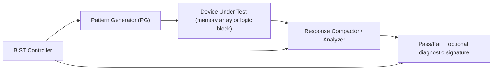
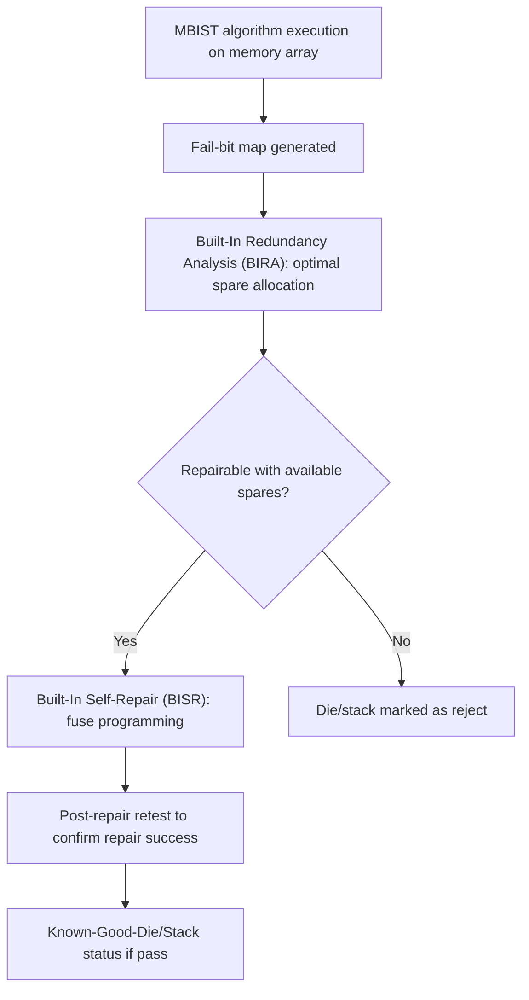
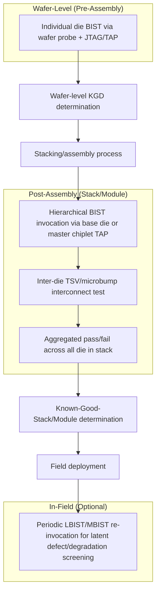

## Built-In Self-Test for Chiplets and Stacked Memory

### Overview

Built-In Self-Test (BIST) embeds test pattern generation, response evaluation, and (where applicable) fault diagnosis directly on-die, allowing a chiplet or stacked memory device to verify its own functionality with minimal reliance on external tester pattern application and observation. BIST is foundational to Known-Good-Die strategies in heterogeneous integration because it addresses two structural challenges that external (tester-driven) test alone cannot solve efficiently: the **I/O bottleneck** of accessing deeply embedded structures (memory arrays, buried die in a 3D stack) through a limited number of external probe/package pins, and the need for **at-speed testing** of structures whose functional timing exceeds practical external tester channel bandwidth. In chiplet and stacked-memory (HBM-class) architectures specifically, BIST also extends into post-assembly and in-field self-test roles that have no equivalent in traditional single-die packaging.

---

### BIST Fundamentals

#### Core Architecture

A BIST engine generally comprises three functional blocks operating in a closed loop entirely on-die:

**Key Points**

- **Pattern Generator**: produces test stimuli on-die, commonly via a Linear Feedback Shift Register (LFSR) for pseudo-random pattern generation (logic BIST) or a dedicated finite-state-machine-based address/data sequencer for deterministic algorithmic patterns (memory BIST).
- **Response Compactor**: reduces the (potentially very large) raw test response data into a compact signature, commonly via a Multiple Input Signature Register (MISR) for logic BIST, avoiding the need to store or transmit every individual test response externally.
- **BIST Controller**: sequences the overall test (pattern selection, algorithm stepping, start/stop, result reporting) and provides the external interface (often via JTAG/IEEE 1149.1 or a dedicated test access mechanism) through which the tester or system initiates BIST and retrieves pass/fail results.

#### Why BIST Matters More in Heterogeneous Integration

**Key Points**

- **Pin-limited access to embedded structures**: a memory array with gigabit-scale capacity cannot be practically tested by externally applying every address/data pattern through a limited pin count at wafer-probe or package level — BIST generates and evaluates patterns internally, requiring only a small control/status interface externally.
- **Buried die access in 3D stacks**: in a TSV-based 3D stack, die other than the top or bottom layer have no direct external pin access once stacked — BIST (combined with a die-to-die test access architecture, e.g., IEEE 1838-aligned TAP chaining) is often the *only* practical means of testing a buried die's internal structures after stacking, since external probing of a buried die is physically impossible post-assembly.
- **At-speed test requirement**: many timing-sensitive faults (delay faults, marginal setup/hold timing) only manifest at full operational frequency — external tester channels, particularly at high pin counts, often cannot drive/sample at the full functional speed of modern high-bandwidth interfaces, making on-die at-speed BIST necessary to catch these fault classes.

---

### Memory BIST (MBIST) for Stacked Memory

#### Purpose and Algorithm Classes

MBIST is the dominant test methodology for embedded and stacked memory (SRAM caches, embedded DRAM, and critically, **HBM-class stacked DRAM** in 2.5D/3D heterogeneous integration), applying algorithmic test patterns designed to detect memory-specific fault models: stuck-at faults, transition faults, coupling faults (between adjacent cells), address decoder faults, and retention/data-pattern-sensitive faults.

| Algorithm | Complexity | Fault Coverage Focus |
| --- | --- | --- |
| MARCH C- | $O(n)$ | Stuck-at, transition, some coupling faults |
| MARCH SS | $O(n)$ | Static coupling faults |
| Walking 1/0 | $O(n^2)$ | Coupling faults (exhaustive, limited to smaller arrays) |
| GALPAT (Galloping Pattern) | $O(n^2)$ | Coupling faults (comprehensive but high test-time cost) |
| Checkerboard | $O(n)$ | Pattern-sensitivity, adjacent-cell interference |

**Key Points**

- MARCH-class algorithms ($O(n)$ complexity, where $n$ is memory size) dominate production MBIST because $O(n^2)$ algorithms (Walking, GALPAT) become impractically time-consuming for gigabit-scale arrays typical of HBM stacks — the linear-complexity March algorithms represent the practical fault-coverage-versus-test-time trade-off point for large memories.
- HBM's wide-I/O, high-bandwidth architecture (thousands of TSV-based data/control connections per stack) means MBIST for stacked HBM must exercise not only the memory array's internal fault models but also the **TSV interconnect and microbump interface** between DRAM layers and between the DRAM stack and its base logic die, extending traditional MBIST scope beyond the memory array itself.

#### Redundancy and Repair

**Key Points**

- Modern high-density memory (including HBM DRAM layers) commonly integrates **built-in redundancy** (spare rows/columns) that MBIST-identified defects can be mapped to via a repair algorithm, replacing a faulty row/column with a spare through fuse programming (laser fuse, e-fuse, or anti-fuse) or similar non-volatile configuration mechanism.
- **Built-In Redundancy Analysis (BIRA)** and **Built-In Self-Repair (BISR)** extend MBIST from pure detection into on-die diagnosis-and-repair: BIRA analyzes the fail-bit map from MBIST to determine an optimal repair solution (which spares to allocate to which faults), and BISR executes the fuse-programming repair, ideally without requiring external tester intervention for the repair decision itself.
- Repair at wafer level (before stacking) versus repair at stack level (after TSV bonding, testing the assembled stack) represents a key architectural decision — pre-stack repair addresses die-level defects cheaply before the cost multiplier of stacking is incurred, while post-stack repair (where architecturally supported) can additionally address TSV/bonding-induced defects that only manifest after assembly, but at the higher cost-of-escape point discussed under KGD/GED economics.

---

### Logic BIST (LBIST) for Chiplets

#### Purpose and Architecture

LBIST applies pseudo-random or pseudo-exhaustive patterns to a chiplet's logic (typically via existing scan chain infrastructure repurposed for BIST operation) to achieve structural fault coverage (stuck-at, transition delay faults) without requiring externally-supplied deterministic test patterns, reducing both external pattern-storage/bandwidth requirements and enabling at-speed structural test.

**Key Points**

- **STUMPS architecture** (Self-Test Using MISR/Parallel SRSG) is the standard LBIST architecture for scan-based designs: an on-die pseudo-random pattern generator (often an LFSR-based Shift Register Sequence Generator) feeds multiple parallel scan chains simultaneously, with responses compacted through a MISR — this parallelization is what makes LBIST practical for large logic blocks where serial scan-in/scan-out of every individual test vector would be prohibitively time-consuming.
- **Test point insertion**: pure pseudo-random patterns alone often cannot achieve adequate fault coverage for all logic structures (certain fault types are inherently "random-pattern-resistant") — LBIST implementations commonly add dedicated test points (control/observation points inserted into the design specifically to improve random-pattern testability) to close coverage gaps that pseudo-random patterns alone would miss.
- **In-field LBIST**: increasingly relevant for chiplet-based systems in safety-critical or high-reliability applications (automotive functional safety per ISO 26262, for example), LBIST can be re-invoked periodically during system operation (not just at manufacturing test) to detect latent or newly-developed defects/degradation in the field — a capability with no direct equivalent in traditional manufacturing-only test flows and increasingly a designed-in requirement for chiplet-based automotive and safety-critical systems.

---

### BIST in Multi-Die Test Access Architecture

#### Integration with Die-to-Die Test Access

**Key Points**

- BIST engines on individual die within a chiplet module or 3D stack must be accessible through a coordinated **test access architecture** spanning the full assembly — commonly built on extensions of IEEE 1149.1 (JTAG) and, for 3D-specific challenges, IEEE 1838, which addresses test access, TSV test, and die-stack-aware test scheduling that legacy single-die JTAG does not natively cover.
- **Hierarchical BIST invocation**: in a multi-die stack, a top-level test controller (often residing on a base logic die in an HBM-class stack, or a designated "master" chiplet in a multi-chiplet module) sequences BIST invocation across individual die, aggregates pass/fail results, and presents a consolidated status to external test equipment — reducing external test complexity by handling die-to-die test orchestration on-die rather than requiring the external tester to individually sequence each die's BIST.
- **Pre-assembly vs. post-assembly BIST invocation**: the same MBIST/LBIST content is often invoked at multiple points in the flow — at wafer sort (die-level KGD screening), after partial or full stack assembly (verifying the assembly process itself introduced no new defects and that inter-die interconnects function), and potentially in-field — meaning BIST architecture design must anticipate multiple invocation contexts with potentially different available test access paths at each stage.

---

### Design-for-Test Trade-offs Specific to BIST in Advanced Packaging

**Key Points**

- **Silicon area overhead**: BIST logic (pattern generators, MISRs, controllers, test points) consumes die area that could otherwise be functional logic or memory — this overhead must be justified against the KGD/GED economic framework's escape-cost calculation, since BIST area is a direct cost that trades against reduced test-escape risk.
- **Power delivery during BIST**: particularly for MBIST on wide-I/O stacked memory, simultaneous switching activity during algorithmic pattern application can create localized power delivery and thermal stress well above typical functional operation — BIST pattern scheduling sometimes requires deliberate power-aware sequencing (staggering array segments rather than testing the full array simultaneously) to avoid test-induced (rather than genuine) failures from power delivery network stress.
- **Test time vs. coverage trade-off within BIST itself**: even within an on-die BIST engine, algorithm selection (e.g., MARCH C- versus a more exhaustive but slower algorithm) represents the same fundamental test-economics trade-off discussed in Known-Good-Die/Good-Enough-Die economics, just instantiated at the BIST-algorithm-selection level rather than the overall test-strategy level.
- **Diagnostic resolution vs. compaction**: response compaction (MISR-based signature analysis) is efficient for pass/fail determination but inherently discards some diagnostic information (aliasing risk, where different failure patterns can theoretically produce the same compacted signature) — designs requiring detailed fail-bit mapping for redundancy repair (BIRA/BISR) must balance compaction efficiency against retaining sufficient diagnostic granularity to drive an effective repair decision.

---

**Related Topics**

- Wafer-level test architecture and probe card technology
- Known Good Die and good-enough-die economic trade-offs
- Boundary scan and IEEE 1838 test standards for 3D-IC
- HBM (High Bandwidth Memory) architecture and TSV-based stacking
- Redundancy, repair, and fuse-programming techniques for embedded memory
- Die-to-die interconnect test structures for hybrid bonding and micro-bump interfaces
- Functional safety (ISO 26262) considerations for chiplet-based automotive systems
- Power delivery network design for wide-I/O stacked memory architectures