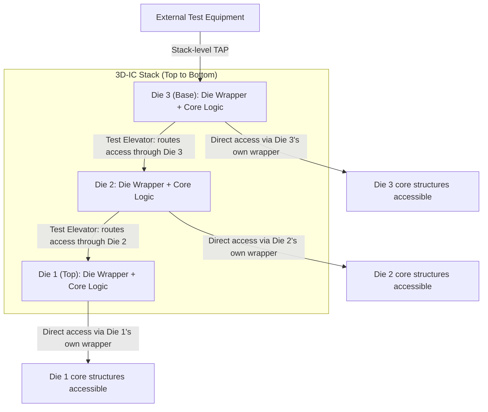

## Boundary Scan and IEEE 1838 Test Access for 3D-ICs

### Overview

Boundary scan (IEEE 1149.1/JTAG) provides standardized, pin-level structural test access for individual digital die, but its architecture was conceived for single-die, board-mounted packages with all pins externally accessible — an assumption fundamentally broken by 3D-IC stacking, where most die in a stack have no direct external pin access post-assembly. **IEEE 1838**, ratified as the "Standard Test Access Architecture for Three-Dimensional Stacked Integrated Circuits," extends boundary-scan concepts to address this gap, defining standardized die-level test wrappers, inter-die test access mechanisms, and stack-level test scheduling that allow individual die within a 3D stack (including buried die) to be tested both independently and in the context of their neighbors, both pre- and post-stacking.

---

### IEEE 1149.1 (JTAG) Foundations

#### Core Architecture Recap

**Key Points**

- **Test Access Port (TAP)**: the standard 4-5 wire interface (TCK, TMS, TDI, TDO, optional TRST) through which external test equipment issues commands and shifts data into/out of a die's internal test infrastructure.
- **TAP Controller**: a finite state machine governing the sequencing of test operations (instruction load, data shift, update) based on the TMS/TCK signal sequence, standardized across all IEEE 1149.1-compliant devices for interoperability.
- **Boundary Scan Register (BSR)**: a chain of scan cells placed at each I/O pin, allowing external pin states to be controlled (for driving test stimuli onto board-level interconnect) and observed (for capturing board-level interconnect response) without requiring direct physical probe access to each pin — originally designed to solve board-level interconnect test for fine-pitch surface-mount packages where physical bed-of-nails probing became impractical.
- **Instruction Register (IR)**: selects which internal register/operation the TAP controller's data operations act upon (e.g., BYPASS, EXTEST, SAMPLE/PRELOAD, and device-specific instructions), providing the extensibility that allows JTAG to serve purposes well beyond its original board-interconnect-test intent (including, in many modern SoCs, access to internal scan chains, MBIST/LBIST invocation, and debug infrastructure).

#### Why 1149.1 Alone Is Insufficient for 3D-ICs

**Key Points**

- **No native concept of "buried" die**: 1149.1 assumes every device's TAP is externally accessible via board-level wiring; a die embedded within a 3D stack (not the top or bottom layer) has its TAP signals available only through TSVs/micro-bumps to adjacent die, not through any external package pin — 1149.1 provides no standardized mechanism for routing TAP access *through* one die to reach another.
- **No standardized inter-die test access protocol**: while a design team could create a custom scheme to chain multiple die's TAPs together within a stack, without a standard, every 3D-IC program would require a bespoke, non-interoperable test access solution — a significant barrier in heterogeneous integration and chiplet ecosystems where die from different design teams or vendors may need to be stacked together.
- **No TSV-specific test provisions**: 1149.1 has no defined mechanism for testing the TSVs themselves (the physical through-silicon interconnects unique to 3D-IC stacking) as a distinct structural element requiring its own fault model and test method.
- **No stack-aware test scheduling**: 1149.1 does not address the sequencing challenge of testing a partially-assembled stack (e.g., two of four planned die bonded so far) versus a fully-assembled stack, or how test operations on one die should be coordinated with simultaneous operations on adjacent die.

---

### IEEE 1838 Architecture

#### Standard Scope and Goals

IEEE 1838 defines a standardized test access architecture specifically addressing the gaps above, enabling:

- Independent test of each die in a stack, both **pre-bond** (die/wafer level, before stacking) and **post-bond** (after stacking, potentially through intervening die).
- Testing of **TSVs and inter-die interconnects** themselves as distinct structural elements.
- **Interoperable test access** across die from different design origins, a critical enabler for multi-vendor chiplet/3D-IC ecosystems.
- **Test scheduling and access chaining** across a stack of arbitrary depth and (within defined constraints) heterogeneous die types.

#### Key Architectural Elements

**Key Points**

- **Die Wrapper**: a standardized test wrapper (conceptually extending the 1149.1 boundary-scan register concept) placed around each die's core logic, providing controllable/observable access to the die's TSV-facing I/O in addition to its conventional peripheral I/O — the die wrapper is what makes a die's internal structures accessible even when the die is buried within a stack and has no direct external pin access.
- **Test Elevator**: the mechanism (conceptually) by which test access signals are routed *through* one die to reach another die further into the stack — since TAP signals cannot simply "pass through" a die's core logic, the test elevator provides a defined bypass/routing path through each die's wrapper specifically for relaying test access to neighboring die.
- **TSV Test**: IEEE 1838 defines test methods addressing TSV-specific fault models (opens, shorts, resistive/high-resistance connections, and TSV-to-substrate leakage) that are structurally distinct from conventional interconnect fault models and require dedicated test circuitry (often a form of boundary-scan-like cell specifically at the TSV interface) to exercise.
- **Die-level and Stack-level TAP hierarchy**: individual die retain their own TAP-like control, but a stack-level (or module-level) test controller coordinates access across the full stack, determining which die's test infrastructure is currently being addressed and managing the elevator-based routing to reach it.

---

### Pre-Bond vs. Post-Bond Test Strategy

#### Pre-Bond Test (Die/Wafer Level)

**Key Points**

- Each die is tested individually at wafer level before stacking, using its die wrapper's external-facing test access (available since the die has not yet been buried in a stack) — this is the primary Known-Good-Die screening step for 3D-IC-bound die, conceptually similar to standard wafer-sort but structured to exercise the die-wrapper infrastructure that will later be used for post-bond access.
- Pre-bond test cannot exercise TSV-to-TSV connections that only exist once the die is physically bonded to its stack partner — a structural limitation meaning pre-bond test alone cannot achieve full Known-Good-Stack confidence regardless of how thoroughly the individual die is tested.
- Pre-bond TSV test (testing the TSV structure itself, before it is bonded to anything) focuses on TSV integrity in isolation — open/short/resistance testing of the TSV structure and its immediate connection to the die's internal circuitry, without yet being able to verify the eventual bonded interconnect to a partner die.

#### Post-Bond Test (Stack/Module Level)

**Key Points**

- After stacking, post-bond test exercises the actual bonded TSV/micro-bump interconnects between die — this is the only point at which the true inter-die electrical connection (rather than each die's TSV structure in isolation) can be verified, making post-bond test essential for catching assembly-induced defects (misalignment, bonding voids, incomplete TSV reveal) that pre-bond test structurally cannot detect.
- Post-bond test for buried die relies entirely on the test elevator mechanism to route access through intervening die — meaning the test infrastructure design of *every* die in the stack (not just the die currently being tested) affects whether a given buried die can be successfully accessed, a key reason IEEE 1838 compliance across all die in a heterogeneous stack (even from different design teams) matters for practical testability.
- **Partial stack test**: for stacks assembled incrementally (die bonded one layer at a time rather than in a single step), IEEE 1838's architecture is intended to support testing the partially-assembled stack at each incremental step, allowing defect detection (and potential process correction) before the full stack — and its full cost investment — is committed.

```mermaid
flowchart LR
    A["Wafer-level pre-bond test: each die individually via own wrapper"] --> B["Pre-bond TSV structural test: isolated TSV integrity"]
    B --> C["KGD screening: bin good die pre-stacking"]
    C --> D["Incremental stacking: bond die 1 to die 2"]
    D --> E["Partial-stack post-bond test: verify die 1-die 2 interconnect"]
    E --> F["Continue stacking: bond die 3"]
    F --> G["Full-stack post-bond test via test elevator chain"]
    G --> H["Known-Good-Stack determination"]
```

---

### Relationship to BIST and Overall Test Access Hierarchy

**Key Points**

- IEEE 1838 provides the **access architecture** (how to reach a given die's test infrastructure within a stack) but does not itself replace the test *content* — MBIST, LBIST, and structural scan test content still execute the actual fault detection; 1838 is the routing/access layer that makes invoking that content on a buried die possible.
- A stack-level test controller (often implemented as extended logic on a base logic die, common in HBM-class and logic-plus-memory-stack architectures) typically coordinates 1838-based access alongside BIST invocation, presenting external test equipment with a consolidated interface rather than requiring the external tester to manage the full elevator-routing complexity directly for every individual test operation.
- [Inference] The practical effectiveness of an IEEE 1838-based test architecture in a heterogeneous, multi-vendor chiplet stack depends on consistent, correct implementation of the die wrapper and test elevator specification across every die vendor contributing to the stack — a single non-compliant or poorly-implemented die wrapper can break the access chain for every die "behind" it in the stack, making 1838 compliance verification a supply-chain-level concern in disaggregated chiplet ecosystems, not solely a single design team's responsibility.

---

### Design and Adoption Considerations

**Key Points**

- **Area and complexity overhead**: die wrappers, test elevators, and TSV-specific test circuitry all consume die area and design effort beyond what a single-die, non-stacked design would require — this overhead is a direct cost input to the same Known-Good-Die/Good-Enough-Die economic trade-off framework governing overall test investment decisions, since 1838 compliance is itself a design choice with a cost that must be justified by the escape-risk reduction it enables in multi-die stacks.
- **Standard maturity and tool support**: [Unverified] as with many test-access standards, the maturity of commercial EDA tool support (automated die-wrapper insertion, elevator synthesis, stack-level test pattern generation/scheduling) and the consistency of adoption across different foundries/IP vendors can vary, and should be verified against current tool and PDK documentation for any specific 3D-IC program rather than assumed uniformly available.
- **Heterogeneous stack compatibility**: since 3D-IC and chiplet ecosystems increasingly involve die from different design houses and process nodes stacked together, IEEE 1838's interoperability goal is particularly relevant — but achieving genuine interoperability requires not just standard compliance on paper but practical validation that die wrappers and elevator interfaces from different vendors correctly interoperate in the specific stack configuration being assembled.
- **Complementary relationship to other 3D-IC test standards**: 1838 is generally discussed alongside (and is intended to be usable in conjunction with) conventional 1149.1 infrastructure at the individual die level and BIST content for the actual fault detection — it is one layer of a multi-layer test architecture rather than a complete standalone test solution.

---

**Related Topics**

- Built-in self-test for chiplets and stacked memory
- Wafer-level test architecture and probe card technology
- Known Good Die and good-enough-die economic trade-offs
- TSV (through-silicon via) fabrication and reliability fundamentals
- Chiplet interoperability standards (UCIe) and multi-vendor supply chain test requirements
- Known-Good-Stack verification strategies for incremental 3D assembly
- Die-to-die interconnect test structures for hybrid bonding and micro-bump interfaces
- HBM (High Bandwidth Memory) base-die test controller architecture