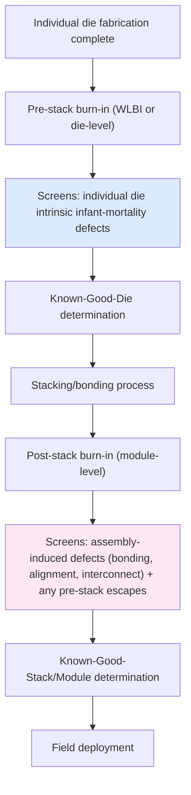

## Burn-In Strategies for Pre-Stack and Post-Stack Dies

### Overview

Burn-in is an accelerated-stress screening process applying elevated temperature and (typically) elevated voltage to precipitate and detect **infant-mortality defects** — latent manufacturing defects that would otherwise fail early in field life — before a die or assembled stack ships. In 3D-IC and heterogeneous integration, burn-in strategy bifurcates into **pre-stack (wafer/die-level) burn-in** and **post-stack (assembled module-level) burn-in**, each addressing a different defect population and each carrying distinct economic and technical trade-offs. The choice of when, whether, and how aggressively to burn-in at each stage is a direct extension of the Known-Good-Die/Good-Enough-Die economic framework, since burn-in is itself a test-investment decision weighed against escape-cost risk.

---

### Burn-In Fundamentals

#### Purpose: The Bathtub Curve Connection

Burn-in specifically targets the **decreasing-hazard-rate (infant mortality) region** of the reliability bathtub curve — corresponding to a Weibull shape parameter $\beta < 1$ — by accelerating the same stress mechanisms (thermal, electrical) that would cause these latent defects to fail early in the field, compressing that early failure window into a manufacturing-stage screening step rather than allowing it to occur after shipment.

$$h(t) = \frac{\beta}{\eta}\left(\frac{t}{\eta}\right)^{\beta-1}, \quad \beta < 1 \Rightarrow \text{decreasing } h(t)$$

Burn-in duration and stress level are chosen to move a unit far enough along this decreasing-hazard curve that units surviving burn-in have a substantially reduced probability of early field failure, effectively "pre-aging" the population past the steepest part of the infant-mortality hazard decline.

#### Burn-In Stress Conditions

**Key Points**

- **Temperature**: burn-in temperatures are typically well above normal operating temperature (commonly 125°C–150°C for standard commercial burn-in, though specific conditions are process/product-dependent) to exploit Arrhenius-type thermal acceleration of the underlying defect mechanisms.
- **Voltage**: often elevated above nominal $V_{DD}$ (voltage acceleration further compresses time-to-failure for many defect mechanisms, particularly gate-oxide and dielectric-related latent defects, following TDDB-type field-acceleration behavior), though voltage margins must respect the device's absolute maximum ratings to avoid inducing new, non-representative failure modes.
- **Duration**: determined by the target infant-mortality escape rate and the acceleration factor achieved at the chosen stress condition — calculated via the same Arrhenius/acceleration-factor framework used for reliability qualification testing generally, applied here to project how much field-equivalent early-life time the burn-in duration represents.
- **Dynamic vs. static burn-in**: static burn-in applies steady-state bias without functional switching activity; dynamic burn-in applies actual clocking/functional patterns during stress, generally providing better fault-activation coverage for defects that only manifest under switching conditions (e.g., certain timing-marginal or crosstalk-sensitive defects) at the cost of requiring more sophisticated burn-in equipment capable of applying functional patterns at elevated temperature.

---

### Pre-Stack (Wafer/Die-Level) Burn-In

#### Purpose in the KGD Context

Pre-stack burn-in — commonly termed **Wafer-Level Burn-In (WLBI)** when performed at wafer level, or die-level burn-in if performed on singulated die — screens infant-mortality defects in an individual die *before* it is committed to an expensive multi-die assembly, directly targeting the highest-leverage point in the Known-Good-Die cost-multiplication chain: catching a latent defect before it can scrap co-assembled good die.

**Key Points**

- **Wafer-Level Burn-In (WLBI)**: performed on the full or partial wafer using specialized wafer-level burn-in equipment (temperature-controlled chucks/chambers capable of contacting many die simultaneously, often via a full-wafer or large-area probe/contactor rather than individual die sockets) — offering high parallelism (many die burned-in simultaneously) but requiring specialized, capital-intensive equipment and careful thermal uniformity management across the wafer.
- **Singulated die-level burn-in**: performed after dicing using conventional die-level burn-in sockets/boards — more mature, widely available equipment infrastructure, but generally lower parallelism per burn-in oven/chamber load compared to full-wafer WLBI, and introduces the handling risk/cost of manipulating individual bare die (which lack the mechanical protection of a package) through the burn-in process.
- **Economic justification**: pre-stack burn-in adds direct cost (equipment time, potential yield loss from burn-in-induced die damage) that must be weighed against the escape-cost reduction it provides — per the GED framework, this justification strengthens as module die-count and per-module value rise, since the cost multiplier for an infant-mortality defect escaping into an assembled stack is the same multiplier discussed in Known-Good-Die/Good-Enough-Die economics.

#### Technical Challenges Specific to Pre-Stack Burn-In

**Key Points**

- **Bare die handling**: pre-singulation or freshly-singulated die lack package-level mechanical protection, making burn-in equipment contact (temporary electrical connection for the burn-in duration) more delicate than package-level burn-in socket insertion — probe/contactor design for WLBI must balance reliable electrical contact against risk of mechanical damage to bond pads or micro-bumps that will later be needed for the bonding/stacking process.
- **Thermal uniformity across a wafer or large die population**: achieving consistent burn-in temperature across every die in a simultaneous WLBI batch is non-trivial at wafer scale, and temperature non-uniformity risks under-stressing (reduced fault-activation effectiveness) some die while over-stressing others (risk of inducing new, non-representative damage) within the same burn-in run.
- **TSV and micro-bump exposure during burn-in**: die intended for later TSV-based or hybrid-bond stacking may have exposed TSV landing pads or micro-bumps not originally hardened against repeated thermal cycling or burn-in-stage handling — burn-in equipment and process design must avoid degrading the very interconnect structures the die will later depend on for successful bonding.
- **Limited functional coverage pre-stack**: as with general pre-bond test (discussed under IEEE 1838 test access), pre-stack burn-in cannot exercise or stress the eventual inter-die interconnects, since they do not yet exist — meaning pre-stack burn-in addresses only the individual die's intrinsic defect population, not defects that will only manifest once the die is bonded to its stack partners.

---

### Post-Stack (Module-Level) Burn-In

#### Purpose and Distinct Defect Coverage

Post-stack burn-in applies stress to the **fully or partially assembled multi-die module**, targeting infant-mortality defects that either escaped pre-stack screening or that only manifest in the context of the assembled structure — most notably, defects in the bonding/interconnect process itself (TSV/micro-bump/hybrid-bond joint integrity) that have no pre-stack equivalent to screen against.

**Key Points**

- **Assembly-induced defect screening**: bonding voids, marginal TSV-to-TSV alignment, incomplete hybrid-bond formation, and other assembly-process-induced latent defects are, by definition, undetectable by any pre-stack screening step and require post-stack test/burn-in as the only point in the flow capable of catching them before field deployment.
- **Interconnect-level stress**: post-stack burn-in exercises the actual bonded interconnects under thermal and electrical stress, potentially revealing marginal joints (elevated resistance, intermittent connectivity) that would pass initial post-bond functional test but fail under accelerated stress — analogous in concept to how board-level solder joints can pass initial continuity test yet still harbor marginal, burn-in-detectable weaknesses.
- **Self-heating and thermal gradient considerations in stacked structures**: 3D-stacked die inherently have worse heat dissipation paths for internal die layers compared to a single-die package (heat generated in a buried die must conduct through neighboring die/TIM layers to reach the package's external heat removal path) — post-stack burn-in must account for this altered thermal profile, since the temperature actually experienced by an internal die layer during burn-in may differ substantially from the burn-in chamber's ambient/applied condition, requiring either calibrated compensation or in-situ temperature monitoring (e.g., via on-die thermal sensors) to ensure the intended stress level is actually achieved at each die layer.

---

### Comparative Trade-offs: Pre-Stack vs. Post-Stack Burn-In

| Aspect | Pre-Stack Burn-In | Post-Stack Burn-In |
| --- | --- | --- |
| Defect population addressed | Individual die intrinsic defects | Assembly/interconnect-induced defects + pre-stack escapes |
| Cost-multiplier leverage | High (catches defect before assembly cost committed) | Lower per-defect leverage, but only point that can catch assembly defects |
| Equipment/handling risk | Bare die handling, wafer-scale thermal uniformity | Stack thermal gradient management, in-situ monitoring complexity |
| Coverage limitation | Cannot address interconnect/bonding defects | Cannot separate cost-effectively which die contributed a detected failure without diagnosis |
| Typical role | Primary infant-mortality screen before assembly investment | Backstop for assembly-specific risk, final pre-shipment screen |

**Key Points**

- The two stages are generally **complementary, not substitutable** — pre-stack burn-in cannot address assembly-induced defects by definition, and post-stack burn-in alone (skipping pre-stack) risks committing full assembly cost to die that pre-stack screening would have caught more cheaply, reintroducing the exact cost-multiplication problem burn-in strategy is meant to mitigate.
- A common strategic pattern is **tiered burn-in intensity**: full/aggressive pre-stack burn-in on individual die (cheaper failure point) combined with a lighter-touch or reduced-duration post-stack burn-in focused specifically on interconnect/assembly-defect activation, rather than duplicating full-intensity burn-in at both stages — though [Inference] the specific optimal split between pre- and post-stack burn-in intensity is program-specific, depending on the same die-value, module-die-count, and escape-cost variables governing the broader KGD/GED economic calculation, and is not a fixed industry-standard ratio.
- **Diagnostic attribution challenge**: when a post-stack burn-in failure occurs, determining which specific die (or which specific interconnect) within the stack caused the failure can be more complex than a single-die burn-in failure, since the failure signature is observed at the module level — this is where IEEE 1838-based test access and hierarchical BIST invocation (discussed elsewhere in this chapter) become operationally important, providing the diagnostic resolution needed to attribute a post-stack burn-in failure to a specific die layer or interconnect for effective root-cause/yield-improvement feedback.

---

### Economic and Strategic Considerations

**Key Points**

- **Burn-in as part of the GED total-cost calculation**: like wafer-level test coverage generally, burn-in duration/intensity at each stage represents a direct cost input (equipment time, potential burn-in-induced damage/yield loss) weighed against escape-cost reduction — neither maximal pre-stack nor maximal post-stack burn-in is automatically optimal; the economically rational choice depends on the same variables (die value, module die-count, assembly cost, field-failure cost, rework feasibility) discussed under Known-Good-Die/Good-Enough-Die trade-offs.
- **Rework feasibility interaction**: if post-stack rework (de-bonding a defective die and replacing it) is technically feasible for a given stacking technology (generally more plausible for some reversible/mechanically-assisted bonding approaches than for permanent hybrid bonding), the cost penalty of a post-stack burn-in failure is reduced relative to an unreworkable stack, which can shift the economically optimal burn-in strategy toward relying more on post-stack screening and less on exhaustive pre-stack screening — though [Inference] this trade-off is highly technology- and program-specific and should not be assumed to generalize across different bonding approaches without explicit rework-cost and rework-yield data for the specific stacking technology in use.
- **Application-driven burn-in intensity**: as with general test coverage decisions, applications with high field-failure cost (automotive safety-critical, aerospace, medical, high-reliability industrial) generally justify more aggressive burn-in investment at both stages than cost-sensitive consumer applications, reflecting the same $C_{escape}$ sensitivity to application context discussed in the broader KGD/GED framework.

---

**Related Topics**

- Known Good Die and good-enough-die economic trade-offs
- Boundary scan and IEEE 1838 test access for 3D-ICs
- Built-in self-test for chiplets and stacked memory
- Accelerated life testing and Weibull reliability modeling
- Wafer-level test architecture and probe card technology
- Thermal management and self-heating in 3D-stacked die
- Rework and de-bond/re-bond feasibility for hybrid-bonded and stacked die
- Reliability test standards: temperature cycling, HAST, and thermal shock