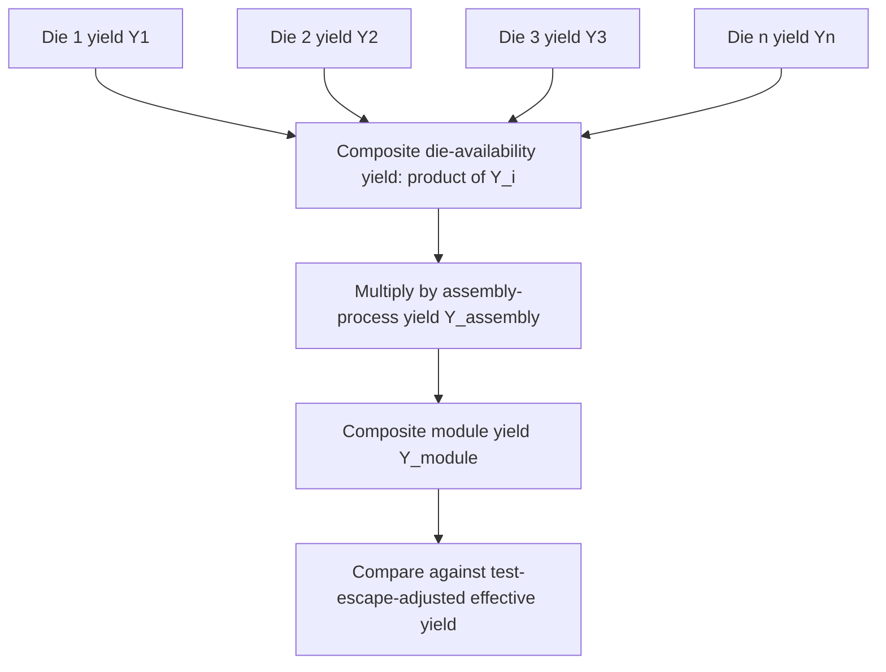
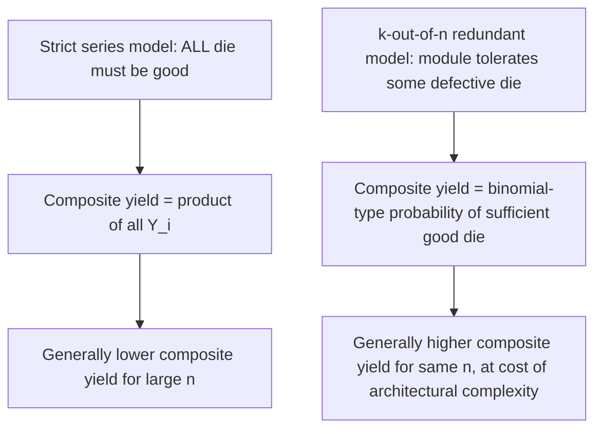

## Composite Yield Modeling for Multi-Die Heterogeneous Systems

### Overview

Composite yield modeling quantifies the probability that a multi-die heterogeneous assembly (2.5D/3D stack, chiplet module, fan-out multi-die package) emerges functional at the end of the full manufacturing flow, combining individual die yield, test escape rate, and assembly-process yield into a single system-level metric. This modeling framework is the quantitative engine underlying the Known-Good-Die/Good-Enough-Die economic trade-offs discussed elsewhere in this chapter — it converts qualitative statements like "more die means more risk" into the specific numerical yield and cost projections that drive test-coverage, burn-in, and architectural decisions (die count, redundancy, repairability) in heterogeneous system design.

---

### Foundational Yield Concepts

#### Die (Wafer-Level) Yield Models

Before addressing composite/system yield, individual die yield itself is typically modeled using defect-density-based statistical distributions accounting for the fact that larger die area has proportionally higher probability of containing a yield-limiting defect.

**Poisson yield model** (simplest form, assumes random, independent defect distribution):

$$Y_{die} = \exp(-D_0 \cdot A)$$

where $D_0$ is defect density (defects per unit area) and $A$ is die area.

**Negative binomial (Murphy/Seeds-derived) model**, commonly preferred for accounting for defect clustering:

$$Y_{die} = \left(1 + \frac{D_0 \cdot A}{\alpha}\right)^{-\alpha}$$

where $\alpha$ is a clustering parameter (lower $\alpha$ indicates more defect clustering; as $\alpha \to \infty$ this reduces to the Poisson model).

**Key Points**

- Die yield is a strongly nonlinear (exponential/power-law) function of die area — this is the foundational economic argument for **chiplet disaggregation**: splitting a large monolithic die into several smaller chiplets can substantially improve aggregate yield, since $Y_{die}$ falls off much faster than linearly with area for a fixed $D_0$.
- $D_0$ and $\alpha$ are process-node- and fab-specific parameters that must be empirically characterized per manufacturing line — [Inference] using generic literature values rather than fab-specific extracted parameters for a composite yield projection can introduce substantial error, since these parameters directly and multiplicatively drive every downstream yield calculation in the composite model.

---

### Composite Yield: Combining Multiple Die

#### The Basic Multiplicative Model

For a module containing $n$ independently-sourced die (each with its own die yield $Y_i$, reflecting different die sizes, process nodes, or maturity levels typical of heterogeneous chiplet integration), assuming independence between die yields:

$$Y_{composite,die-only} = \prod_{i=1}^{n} Y_i$$

**Example**

A chiplet module integrates one compute die ($Y=0.85$), two I/O chiplets ($Y=0.95$ each), and one memory-controller chiplet ($Y=0.90$):

$$Y_{composite} = 0.85 \times 0.95 \times 0.95 \times 0.90 \approx 0.691$$

Even though each individual die yield looks reasonably healthy, the multiplicative combination across four die drops composite die-availability yield to roughly 69% — illustrating why die-count itself is a first-order yield-risk driver independent of any single die's individual quality, and why this multiplicative penalty is the core mathematical justification for the escape-cost-multiplier logic discussed in Known-Good-Die/Good-Enough-Die economics.

#### Extending to Assembly Yield

The full composite yield must also incorporate the yield of the **assembly/integration process itself** (bonding, stacking, interconnect formation), which is a separate stochastic process from individual die fabrication yield:

$$Y_{module} = Y_{assembly} \times \prod_{i=1}^{n} Y_i$$

where $Y_{assembly}$ captures defects introduced specifically during bonding/stacking (misalignment, voiding, incomplete TSV/micro-bump/hybrid-bond formation) that have no equivalent in the individual die's own fabrication yield.

---

### Incorporating Test Escape Rate

#### Effective Yield with Imperfect Test Coverage

Real-world composite yield modeling must account for the fact that wafer-level test (KGD screening) is never 100% effective — some fraction of die classified as "good" are actually latent-defective (test escapes), and these escapes propagate into the assembly yield calculation as an additional loss term discovered only at module-level test or, worse, in the field.

$$Y_{effective,i} = Y_i \times (1 - E_i)$$

where $E_i$ is the test escape rate for die $i$ (the fraction of true defects not caught by the applied test coverage) — note this is distinct from $Y_i$ itself (the true fraction of defect-free die); $E_i$ specifically represents the *detection gap* in the test process.

**Key Points**

- Test escape rate is generally not directly measurable in real time — it is typically estimated retrospectively from field-return data, module-level test fallout attributable to specific die (via post-assembly diagnostic/fault-isolation techniques), or statistical fault-coverage modeling (e.g., stuck-at fault coverage percentage as a proxy, though this is an imperfect proxy since it does not capture all real-world defect mechanisms).
- The escape-rate term is precisely the quantity that wafer-level test investment (covered under Known-Good-Die and BIST strategies) is designed to minimize, and composite yield modeling makes explicit how directly a reduction in $E_i$ for even a single die type propagates into improved module-level effective yield across every module containing that die.

#### Full Composite Model with Test Escape

$$Y_{module,effective} = Y_{assembly} \times \prod_{i=1}^{n} \left[Y_i \times (1-E_i)\right]$$

with the module-level scrap/rework cost driven by whichever failures are *not* caught before final shipment — meaning the total economic cost model combines this yield expression with the cost-multiplication logic from Known-Good-Die/Good-Enough-Die economics:

$$C_{total} = \frac{C_{die} \cdot n + C_{assembly} + C_{test}}{Y_{module,effective}} + (\text{field-failure cost from residual escapes})$$

---

### Redundancy and Repair in Composite Yield Modeling

#### Impact of On-Die Redundancy

Where individual die incorporate redundancy (spare memory rows/columns with BISR, as discussed under BIST for stacked memory), the effective die yield used in the composite calculation should reflect the **post-repair** yield, not the raw (pre-repair) fabrication yield:

$$Y_{i,post-repair} = Y_{i,raw} + Y_{i,repairable} \times R_i$$

where $Y_{i,repairable}$ is the fraction of otherwise-defective die that contain only repairable defects (within the spare-resource budget) and $R_i$ is the repair success rate for that die type.

**Key Points**

- Redundancy/repair capability shifts the effective die yield curve favorably, but the spare-resource area itself imposes an area (and thus baseline yield) cost — meaning redundancy strategy involves its own internal optimization (how many spares to include) that interacts with, rather than trivially improves, the overall composite yield/cost calculation.
- For stacked memory specifically, post-repair yield calculations must also account for whether repair occurs pre-stack (repairing individual DRAM die before stacking) or post-stack (repairing after assembly, if architecturally supported) — the same pre-stack/post-stack strategic trade-off discussed under burn-in strategies applies analogously to repair timing.

#### Module-Level (Architectural) Redundancy

**Key Points**

- Beyond on-die memory redundancy, some heterogeneous system architectures incorporate **module-level architectural redundancy** — e.g., designing a system to tolerate one defective chiplet out of several by re-routing functionality or accepting graceful degradation — which fundamentally changes the composite yield calculation from requiring *all* die to be good to requiring only a *sufficient subset* to be good, a substantially more favorable yield mathematics (analogous to a k-out-of-n reliability system rather than a strict series system).
- [Speculation] Architectural redundancy at the module level is more common in large-scale/high-value systems (e.g., certain HBM stack configurations tolerating some die-level redundancy, or large multi-chiplet accelerator designs with spare compute tiles) than in cost-sensitive consumer chiplet modules, where the area/complexity cost of architectural redundancy may not be justified by the composite-yield improvement it provides — though the specific adoption pattern varies by application and is evolving as chiplet architectures mature.

---

### Sensitivity Analysis and Design Implications

#### Identifying the Yield-Limiting Die

**Key Points**

- In a heterogeneous module with die of varying size, maturity, and process node, composite yield modeling typically reveals that **one or two die dominate the overall yield loss** (generally the largest-area die or the die on the least-mature process node) — this sensitivity analysis is a standard output of composite yield modeling and directly informs where test-coverage, burn-in, and redundancy investment should be prioritized rather than spread uniformly across all die types.
- Partial derivative sensitivity ($\partial Y_{module}/\partial Y_i$) can be computed analytically from the multiplicative model — since $Y_{module}$ is a product, the module yield is proportionally most sensitive to the die with the *lowest* individual yield in relative terms, reinforcing that yield-improvement investment (process maturity, test coverage, redundancy) generally has the highest system-level leverage when targeted at the weakest-yielding die in the module rather than uniformly.

#### Design-Stage Trade-offs Informed by Composite Yield Modeling

**Key Points**

- **Die partitioning decisions**: composite yield modeling directly informs the chiplet-disaggregation decision (how to split a large monolithic function into smaller chiplets) — since smaller die yield better individually but the composite multiplicative penalty grows with die count, there is a genuine optimization trade-off rather than a universal "more chiplets is always better" rule, and the optimal partitioning depends on the specific $D_0$, $\alpha$, and per-die area trade-offs for the given process/design.
- **Process node mixing**: heterogeneous integration's core value proposition (combining die from different, node-optimized processes) directly interacts with composite yield modeling, since a mature, high-yield legacy-node I/O die combined with a leading-edge, lower-yield compute die produces a different composite yield profile than a hypothetical monolithic single-node design — this yield modeling is part of the broader economic case for heterogeneous integration alongside the performance/cost benefits of node-specific optimization.
- **Test and burn-in investment allocation**: as established, composite yield modeling with escape-rate terms provides the quantitative basis for allocating differentiated test/burn-in investment across die types (per the tiered/risk-weighted testing approach discussed under Known-Good-Die/Good-Enough-Die economics), since the model directly shows which die's escape rate has the largest leverage on total module cost.

---

**Related Topics**

- Known Good Die and good-enough-die economic trade-offs
- Burn-in strategies for pre-stack and post-stack dies
- Built-in self-test for chiplets and stacked memory
- Chiplet disaggregation strategy and process-node-optimized die partitioning
- Redundancy and repair strategies for embedded memory arrays
- Accelerated life testing and Weibull reliability modeling
- Boundary scan and IEEE 1838 test access for 3D-ICs
- Chiplet interoperability standards (UCIe) and multi-vendor supply chain yield considerations