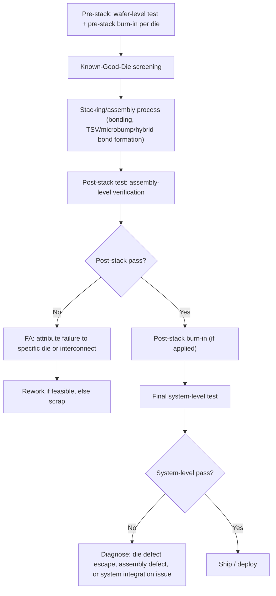
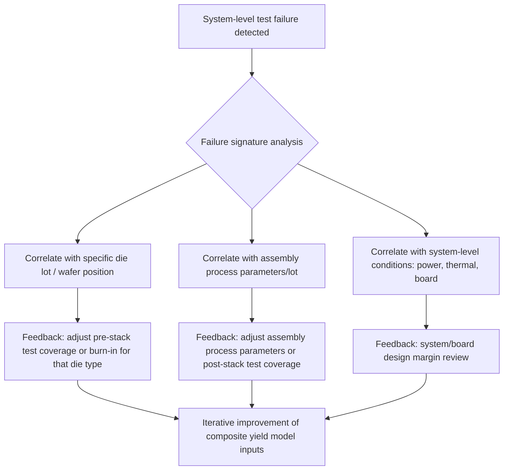

## Post-Stack and Final System-Level Test Flows

### Overview

Post-stack and final system-level test flows constitute the last test checkpoints in a heterogeneous integration manufacturing chain, verifying that an assembled multi-die module functions correctly both as a collection of individually-good die and as an integrated system exercising the full inter-die interconnect and system-level functionality that cannot be validated at any earlier stage. These flows serve a structurally distinct purpose from pre-stack (wafer-level) test: they are the only points in the flow capable of catching assembly-induced defects (bonding voids, interconnect opens, misalignment) and system-level integration issues (die-to-die protocol/timing interactions, thermal/power co-dependencies) that simply do not exist as testable entities before the die are physically joined.

---

### Position in the Overall Test Flow

**Key Points**

- Post-stack test and final system-level test are related but distinct steps — post-stack test typically verifies the assembled module's structural integrity and basic inter-die connectivity/functionality, while final system-level test exercises the module in a configuration and workload representative of actual end-application use, often at the board or system level rather than module-in-isolation.
- Both stages function as the practical backstop referenced throughout the Known-Good-Die/Good-Enough-Die economic framework — the effectiveness and cost of these stages directly factor into the optimal pre-stack test-coverage decision, since a program with strong, comprehensive post-stack/system test capability can rationally accept somewhat reduced pre-stack coverage, and vice versa.

---

### Post-Stack Test

#### Purpose and Scope

Post-stack test targets defects and verification needs specific to the just-completed assembly step, distinct from (and complementary to) the individual die-level test each die already passed before stacking.

**Key Points**

- **Inter-die interconnect verification**: testing the actual bonded TSV, micro-bump, or hybrid-bond connections between die — continuity, resistance, and (where feasible) at-speed signal integrity across the newly-formed physical interconnect, which by definition did not exist and could not be tested before assembly.
- **Assembly-defect screening**: detecting bonding voids, misalignment-induced opens/shorts, incomplete TSV reveal, or other process-induced defects specific to the stacking/bonding operation itself, distinguishing these from die-intrinsic defects that pre-stack test should already have screened.
- **Test access via IEEE 1838-aligned architecture**: for buried die within the stack, post-stack test relies on the test elevator/die-wrapper infrastructure (covered under Boundary Scan and IEEE 1838 Test Access) to route test access through intervening die layers, since buried die have no direct external pin access once stacked.
- **Incremental (partial-stack) testing**: for stacks assembled in multiple sequential bonding steps, post-stack test can be applied after each incremental bonding operation rather than only at final full-stack completion — catching a defect early in a multi-step stacking sequence avoids committing the cost of subsequent bonding steps to an already-defective partial stack.

#### Post-Stack Test Content

| Test Category | Purpose |
| --- | --- |
| Interconnect continuity/resistance | Basic TSV/microbump/hybrid-bond joint integrity |
| Structural (scan) test via elevator access | Verify die logic still functions correctly post-bonding stress |
| Inter-die functional/loopback test | Exercise actual die-to-die signal paths (not just isolated loopback used pre-stack) |
| Power delivery network verification | Confirm PDN integrity across the stack, since stacking can introduce new IR-drop/impedance paths |
| Thermal/self-heating characterization | Especially relevant for stacks with buried, heat-constrained die layers |

**Example**

A 3-high logic-on-memory 3D stack completes hybrid bonding. Post-stack test via the base logic die's stack-level TAP controller sequences structural scan test through the test elevator to each memory die layer, confirming each layer's internal logic survived the bonding thermal/mechanical process intact. A subsequent inter-die functional test exercises the actual bonded data/control interconnects between logic and memory layers — a test that could not have been performed pre-stack since the physical connection did not yet exist. The test reveals one signal path with elevated resistance consistent with a partially-formed hybrid bond at that specific pad location; FA via X-ray CT and FIB cross-section (per techniques covered under failure analysis) confirms a localized bonding void, informing a process adjustment to the bonding recipe for subsequent lots.

---

### Final System-Level Test

#### Purpose and Distinction from Post-Stack Test

Final system-level test exercises the assembled module in a context and configuration closer to actual field deployment — often mounted on a test board or within a representative system fixture — verifying functionality, performance, and power/thermal behavior under conditions that a module-level post-stack test bench cannot fully replicate.

**Key Points**

- **Full functional/application-representative workloads**: rather than structural (scan/BIST) test content alone, system-level test often applies functional patterns closer to actual end-use workloads, catching integration-level issues (timing margins under realistic switching activity, cross-die protocol interactions under sustained operation) that structural test's more artificial pattern sets may not fully expose.
- **System-level power and thermal validation**: verifying the module operates correctly under realistic power delivery and thermal conditions (board-level power supply characteristics, system-level cooling solution thermal resistance) rather than the potentially more controlled/idealized conditions of a dedicated post-stack test bench.
- **Speed binning and parametric characterization**: final system-level test is often where speed-grade binning (sorting modules into performance/power tiers for different product SKUs) occurs, since this requires full-system-representative timing/power measurement rather than isolated die or module-only characterization.
- **Protocol-level and interoperability verification**: for chiplet-based systems using standardized die-to-die interfaces (e.g., UCIe-based interconnect), system-level test may specifically verify protocol-level link training, error correction, and interoperability behavior across the full signal path, which depends on the complete system context (board routing, power delivery, thermal state) not fully represented at the module-alone post-stack test stage.

#### Diagnostic Challenges at System Level

**Key Points**

- **Failure attribution complexity**: a system-level test failure is further removed from the specific physical defect than a post-stack test failure — diagnosing whether a system-level failure stems from a die-level escape, an assembly defect, a system-level integration issue (e.g., board-level signal integrity, power delivery marginality), or an interaction between multiple marginal-but-individually-passing elements requires a more elaborate diagnostic methodology than earlier test stages.
- **Statistical/data-driven root-cause analysis**: mature system-level test programs increasingly rely on accumulated test/yield data analytics (correlating system-level failure signatures with specific upstream die lots, assembly process parameters, or test-content patterns) to identify systemic root causes across a population of units, since individual-unit FA (cross-section, X-ray, etc.) becomes progressively more expensive and slower relative to the volume of units passing through system-level test.
- **Return path to earlier test stages**: a systemic (recurring, non-random) system-level failure pattern often triggers feedback into pre-stack test content, post-stack test coverage, or burn-in parameters — closing the loop referenced under composite yield modeling and Known-Good-Die/Good-Enough-Die economics, where field/system-level failure data informs iterative refinement of earlier-stage test investment.

---

### Test Flow Architecture Considerations for Heterogeneous Systems

#### Handling Multi-Vendor Chiplet Contexts

**Key Points**

- In disaggregated chiplet supply chains, post-stack and system-level test responsibility often falls to the **integrating party** (the entity performing the assembly), who may have limited visibility into individual chiplet vendors' internal pre-stack test coverage or defect data — making the integrator's post-stack/system test investment a critical independent verification layer regardless of upstream vendor test claims, and a key reason contractual KGD specifications (discussed under Known-Good-Die economics) matter in multi-vendor arrangements.
- **Standardized interfaces simplify but don't eliminate system-level test need**: adoption of standardized die-to-die interconnect protocols (e.g., UCIe) provides some standardized test/compliance hooks at the protocol level, but does not eliminate the need for assembly-specific post-stack defect screening or application-specific system-level functional verification, since protocol compliance alone does not guarantee a specific physical bonding process was defect-free.

#### Economic Integration with Overall Test Strategy

**Key Points**

- Post-stack and system-level test costs are the final terms in the total-cost expression from composite yield modeling — since these stages occur after the full cost of die procurement/fabrication and assembly has already been incurred, a failure caught here represents the **maximum possible cost-multiplier point** in the flow (short of an actual field failure), reinforcing why earlier-stage (pre-stack) screening investment generally carries higher cost-avoidance leverage per dollar spent, even though post-stack/system test remains structurally necessary regardless of how well-optimized earlier stages are.
- **Rework economics at this stage**: whether a post-stack or system-level test failure can be economically reworked (versus outright module scrap) depends heavily on the specific bonding technology (as discussed under burn-in strategies) — permanent hybrid-bonded stacks generally offer little to no rework feasibility at this late stage, making pre-stack and post-stack screening investment comparatively more valuable for hybrid-bonded architectures than for more reworkable interconnect approaches.

---

**Related Topics**

- Known Good Die and good-enough-die economic trade-offs
- Composite yield modeling for multi-die heterogeneous systems
- Boundary scan and IEEE 1838 test access for 3D-ICs
- Burn-in strategies for pre-stack and post-stack dies
- Built-in self-test for chiplets and stacked memory
- Failure analysis techniques: cross-sectioning, X-ray, and acoustic microscopy
- Chiplet interoperability standards (UCIe) and system-level protocol compliance test
- Speed binning and parametric characterization methodologies