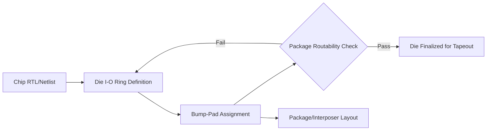
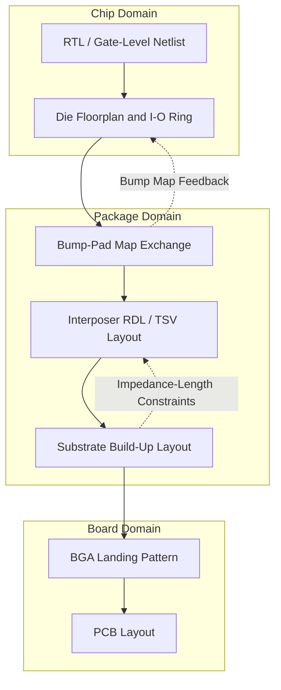

## Package Design and Layout Tool Ecosystems

### Overview

**Key Points**

- Advanced package design (2.5D/3D, fan-out, SiP) requires EDA tool ecosystems distinct from traditional PCB or IC layout tools, bridging chip-level and board-level design abstractions
- Major ecosystems: Cadence (Integrity 3D-IC, APD, SiP Layout, Allegro Package Designer), Synopsys (3DIC Compiler, IC Validator), Siemens EDA (Xpedition Package Designer, Innovator3D IC), Zuken (CR-8000)
- Tool selection driven by die count, interconnect density (RDL fan-out vs. bump/TSV), package substrate complexity, and co-design requirements with chip and board domains
- [Unverified] Specific pricing and licensing structures vary significantly by vendor negotiation and are not publicly standardized

### Why Package Design Needs Specialized Tooling

Traditional IC design tools operate at nanometer geometries with millions of standard cells; traditional PCB tools operate at tens-to-hundreds of micron geometries with discrete components. Advanced packaging occupies an intermediate regime:

- **Feature sizes**: RDL (redistribution layer) traces at 2-10 µm, microbumps at 20-50 µm pitch, TSVs (through-silicon vias) at 5-10 µm diameter — finer than PCB, coarser than leading-edge IC
- **Design intent spans domains**: a single package may connect bare die (IC-level nets), interposers (silicon or organic), and substrate (PCB-like build-up layers)
- **Multi-die coordination**: 2.5D/3D designs require simultaneous awareness of multiple die's I/O placement, bump maps, and thermal/mechanical constraints

This drove EDA vendors to build dedicated "3D-IC" or "package design" platforms rather than stretching IC or PCB tools beyond their intended scope.

### Core Ecosystem Components

#### 1. Die-to-Package I/O Planning (Bump/Pad Assignment)

**Key Points**

- Defines the physical location of C4 bumps, microbumps, or wire-bond pads on each die
- Must reconcile the chip design team's I/O ring/area-array plan with package routability
- Tools: Cadence Integrity 3D-IC Planner, Synopsys 3DIC Compiler, or die-level tools like Cadence Virtuoso with package-aware plugins

Bump assignment is where the "shift-left" co-design philosophy matters most — a die taped out with a bump map that is unroutable at the package level forces a costly respin.

#### 2. Interposer and RDL Design

**Key Points**

- Silicon interposers (passive or active) require IC-like layout tools due to fine-pitch RDL and TSV rules
- Organic/glass interposers use hybrid rule decks closer to advanced substrate design
- Key tools: Cadence Integrity 3D-IC (unified interposer + package flow), Synopsys 3DIC Compiler (interposer place-and-route with IC Compiler II heritage)

RDL routing on a silicon interposer resembles back-end-of-line (BEOL) IC routing — Manhattan or any-angle traces, via stacking rules, and DRC decks derived from the foundry's interposer PDK.

#### 3. Package Substrate Layout

**Key Points**

- Multi-layer organic (BT, ABF) or ceramic substrate design with build-up layers, blind/buried vias, and fine-line traces
- Historically PCB-tool lineage: Cadence Allegro Package Designer / SiP Layout Option, Siemens Xpedition Package Designer, Zuken CR-8000 Design Gateway/System Planner
- Handles ball-grid array (BGA) fanout, power/ground plane shaping, and impedance-controlled routing to the board

Substrate layout tools inherit PCB-style constraint managers (net classes, differential pair rules, length matching) but add finer grid resolution and die-cavity/embedded-component support for advanced substrates.

#### 4. System-in-Package (SiP) Co-Design

**Key Points**

- SiP tools integrate multiple bare die, passives, and sometimes embedded components onto a single substrate or interposer
- Requires simultaneous handling of chip, package, and sometimes board-level constraints in one environment
- Cadence SiP Layout Option (within Allegro) is a common reference implementation; Siemens offers similar capability in Xpedition

### Major Vendor Ecosystems in Detail

#### Cadence

**Key Points**

- **Integrity 3D-IC Platform**: unified environment for multi-die planning, hierarchical implementation, and analysis across 2.5D/3D stacks — positioned as the flagship for heterogeneous integration
- **Allegro Package Designer / APD**: substrate and package layout, shares database lineage with Allegro PCB Editor for board co-design continuity
- **Virtuoso**: brought in for interposer/die-level physical implementation when full-custom IC-style layout is needed
- Cadence emphasizes a "shift-left" flow where package-aware planning happens before chip finalization, using the same underlying data model across Integrity 3D-IC, Virtuoso, and Allegro

[Unverified] Exact feature parity and integration depth between Integrity 3D-IC and legacy Allegro/Virtuoso flows continues to evolve across releases; consult current Cadence documentation for release-specific capabilities.

#### Synopsys

**Key Points**

- **3DIC Compiler**: unified 2.5D/3D IC and package implementation platform, built on IC Compiler II / Fusion Compiler technology extended for multi-die and interposer design
- **IC Validator**: physical verification (DRC/LVS) extended with 3D-IC rule decks for interposer and stacked-die checks
- **StarRC**: parasitic extraction extended to handle TSV, microbump, and RDL parasitics for signal/power integrity
- Synopsys positions 3DIC Compiler as bringing IC-grade place-and-route rigor to package/interposer design, appealing to teams with existing Synopsys digital design flows

#### Siemens EDA

**Key Points**

- **Xpedition Package Designer**: substrate and SiP layout with strong PCB-design heritage from the Xpedition/Expedition lineage
- **Innovator3D IC**: newer platform targeting 3D-IC planning and multi-die integration, addressing the same problem space as Cadence Integrity 3D-IC and Synopsys 3DIC Compiler
- **HyperLynx**: signal/power integrity analysis often used alongside package layout for high-speed interconnect validation

#### Zuken

**Key Points**

- **CR-8000 Design Force / System Planner**: package and PCB co-design with 3D visualization, popular in Japanese and broader Asian semiconductor/electronics supply chains
- Strong in electro-mechanical co-design (package-to-board-to-enclosure) rather than deep interposer/TSV-level implementation

### Co-Design Data Flow Across the Ecosystem

Data exchange between domains historically relied on intermediate formats; modern flows increasingly use vendor-unified databases (e.g., Cadence's OpenAccess-derived formats spanning Virtuoso/Integrity 3D-IC/Allegro) to reduce translation loss.

### Interchange and Standard Formats

**Key Points**

- **GDSII/OASIS**: die and interposer geometry exchange (IC-domain heritage)
- **ODB++**: package substrate and PCB manufacturing data exchange, widely adopted across substrate fabs
- **IPC-2581**: newer XML-based standard intended to unify design-to-manufacturing data exchange for substrates/PCBs, addressing ODB++ limitations in multi-vendor flows
- **Bump/pad map exchange**: often via vendor-specific or semi-standardized CSV/LEF-DEF-like formats between chip and package teams; no single universal standard dominates this handoff, which remains a practical pain point in industry flows

[Unverified] The degree of IPC-2581 adoption versus continued ODB++ dominance varies by region and supply chain segment as of the knowledge cutoff; current market share should be verified against recent industry surveys if precision is required.

### Verification and Analysis Tool Integration

**Key Points**

- **DRC/LVS**: extended rule decks handle interposer TSV density, microbump pitch, and RDL spacing — Synopsys IC Validator, Cadence Pegasus/Physical Verification System, Siemens Calibre (widely used as a cross-vendor sign-off standard)
- **Parasitic extraction**: Synopsys StarRC, Cadence Quantus — extended for through-package parasitics affecting signal integrity
- **Thermal/mechanical co-simulation**: often handled by separate tools (Ansys Icepak, Ansys Mechanical) that import package geometry via interchange formats rather than being native to the layout tool
- **Signal/power integrity**: Ansys SIwave/HFSS, Cadence Sigrity, Siemens HyperLynx — analyze the completed package interconnect for impedance, crosstalk, and IR drop

Calibre (Siemens EDA) deserves separate mention: it functions as a cross-vendor sign-off tool used regardless of which front-end layout tool (Cadence, Synopsys) produced the design, similar to its role in traditional IC verification.

### Example: Tool Chain for a 2.5D CoWoS-Style Design

**Example**

1. **Die-level**: Virtuoso or equivalent IC layout tool produces die GDSII with defined I/O bump locations
2. **Interposer planning**: Cadence Integrity 3D-IC (or Synopsys 3DIC Compiler) imports die bump maps, plans interposer RDL routing and TSV placement
3. **Interposer verification**: Calibre or IC Validator runs DRC against foundry interposer PDK rules; StarRC/Quantus extracts parasitics
4. **Substrate design**: Allegro Package Designer (or Xpedition) imports the interposer's BGA-side connections, routes substrate build-up layers to package balls
5. **Package-level SI/PI**: Sigrity or HyperLynx analyzes the full interconnect stack (die → RDL → TSV → substrate → BGA)
6. **Board handoff**: substrate BGA landing pattern exported via ODB++/IPC-2581 to the PCB design team's Allegro/Xpedition/CR-8000 board flow

### Selection Criteria for Tool Ecosystems

**Key Points**

- **Existing digital design flow**: teams with Synopsys Fusion Compiler/IC Compiler II experience often gravitate to 3DIC Compiler for workflow continuity; Cadence Innovus/Virtuoso users often prefer Integrity 3D-IC
- **Interconnect type**: fine-pitch silicon interposer/TSV designs favor IC-heritage tools (Cadence, Synopsys); organic substrate-dominant SiP designs favor PCB-heritage tools (Allegro APD, Xpedition)
- **Team structure**: organizations with separate chip and package teams may prioritize clean interchange formats over a single unified platform; vertically integrated teams benefit more from unified environments like Integrity 3D-IC
- **Foundry/OSAT ecosystem alignment**: foundries (TSMC CoWoS, Intel EMIB/Foveros) and OSATs (ASE, Amkor) often qualify specific tool/PDK combinations, constraining practical tool choice

### Conclusion

The package design and layout tool ecosystem sits at the convergence of IC and PCB design disciplines, and vendor platforms increasingly blur that historical boundary. Cadence, Synopsys, and Siemens EDA each offer unified 2.5D/3D-IC planning platforms (Integrity 3D-IC, 3DIC Compiler, Innovator3D IC respectively) paired with substrate-level layout tools inherited from PCB design lineages. Tool selection depends heavily on interconnect density, existing team tooling investment, and foundry/OSAT qualification requirements rather than a single universally superior choice.

**Related Topics**

- Multi-die floorplanning and bump map co-optimization
- TSV design rules and keep-out zone management
- RDL routing algorithms for fan-out wafer-level packaging (FOWLP)
- Signal integrity analysis for 2.5D interposer interconnects
- Thermal-aware package layout and co-simulation with mechanical tools
- ODB++ vs. IPC-2581 data exchange in substrate manufacturing
- Foundry-specific PDKs for silicon interposer design (e.g., CoWoS design rules)
- Chiplet interface standards (UCIe) and their impact on layout tool requirements