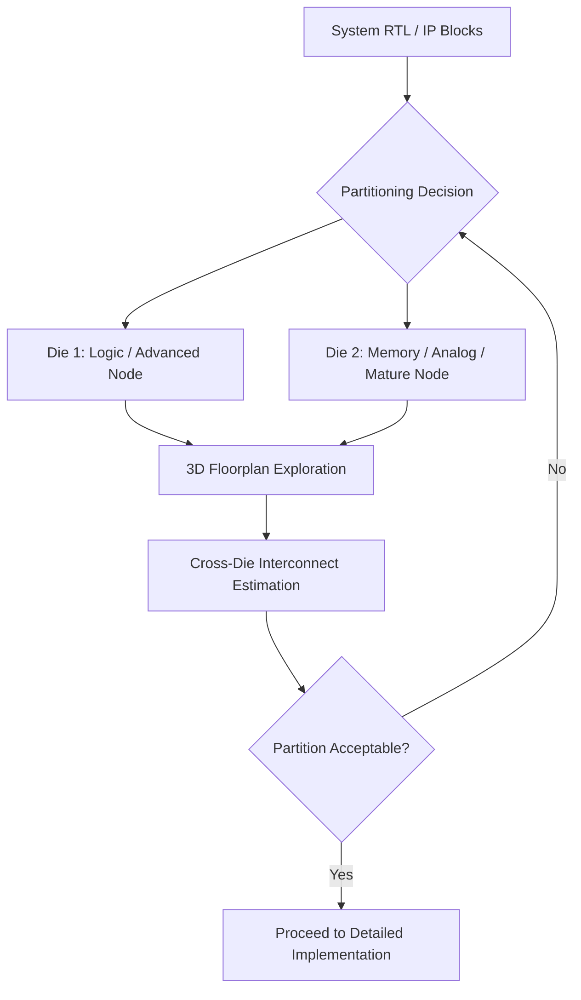
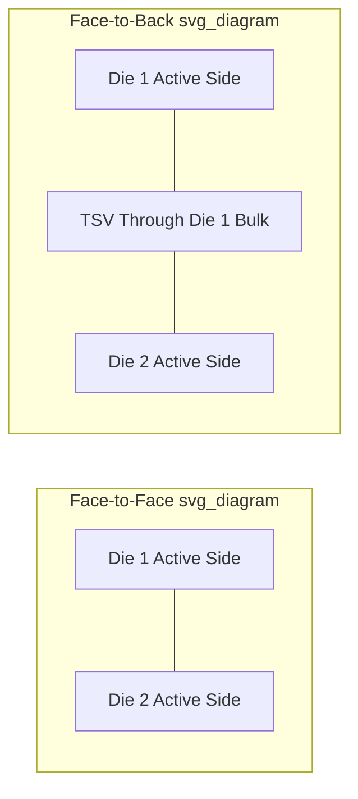
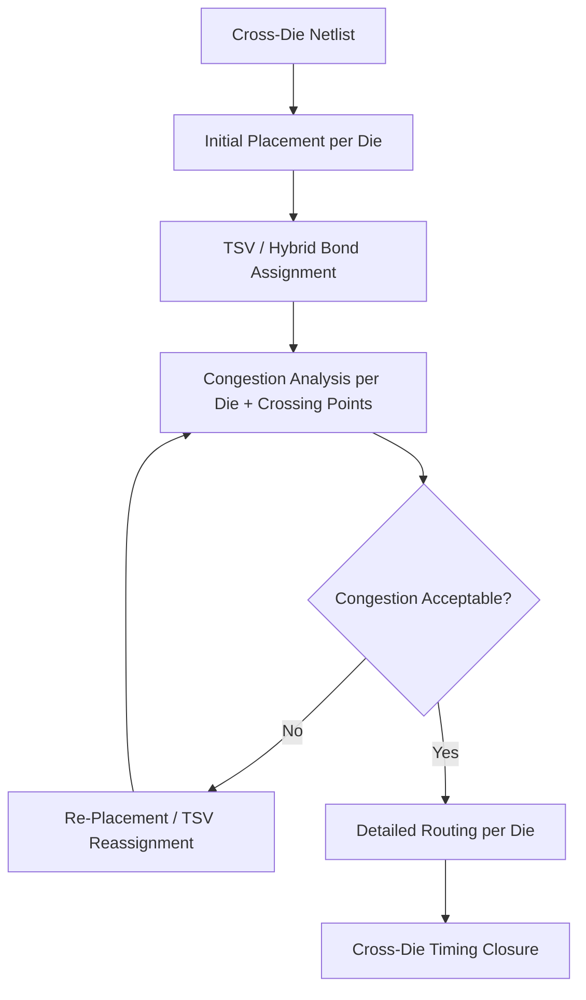
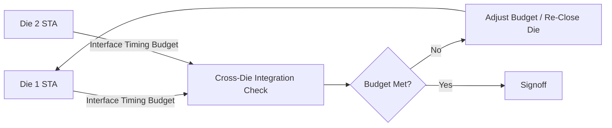

## 3D-IC Floorplanning and Physical Implementation Flows

### Overview

**Key Points**

- 3D-IC physical implementation extends traditional 2D place-and-route with a Z-axis dimension: die-to-die alignment, TSV/hybrid-bond insertion, and thermal-aware stacking
- Floorplanning must simultaneously optimize each die's internal layout AND the vertical alignment/interaction between stacked dies
- Key flow stages: partitioning, 3D floorplanning, TSV/via planning, die-to-die routing co-optimization, thermal-mechanical-aware placement, and multi-die signoff
- Primary platforms: Cadence Integrity 3D-IC, Synopsys 3DIC Compiler, Siemens Innovator3D IC — each extending their respective 2D P&R engines (Innovus, Fusion Compiler/IC Compiler II) into the third dimension

### Why 3D-IC Implementation Differs from 2D

In 2D IC implementation, placement and routing optimize within a single planar layer stack. In 3D-IC (die-stacked via TSV, hybrid bonding, or WoW/DoW integration), implementation must account for:

- **Vertical interconnect**: TSVs or hybrid bond pads occupy area on multiple dies simultaneously and constrain placement on both sides
- **Cross-die timing paths**: a signal path may traverse logic on die A, a TSV, then logic on die B — timing closure requires visibility across the full 3D netlist
- **Thermal coupling**: heat from a lower die affects the temperature (and thus timing/reliability) of an upper die, requiring 3D thermal-aware placement
- **Mechanical stress**: TSVs induce keep-out zones (KOZ) due to thermal-mechanical stress on nearby transistors, a constraint with no 2D equivalent

### Partitioning: System-to-Die Decomposition

**Key Points**

- Partitioning decides which logic blocks map to which die in the stack — the first and most consequential decision in a 3D-IC flow
- Driven by: process node heterogeneity (e.g., logic on advanced node, analog/IO on mature node), thermal budget, yield/cost optimization (splitting large die reduces defect-limited yield loss), and reticle-size constraints
- Tools: Cadence Integrity 3D-IC Planner and Synopsys 3DIC Compiler both provide early-stage partitioning exploration with interconnect and area estimation before committing to detailed implementation

### 3D Floorplanning

**Key Points**

- Establishes the physical footprint, alignment, and orientation (face-to-face, face-to-back) of each die in the stack
- Must jointly optimize each die's block placement AND the alignment of inter-die connection points (TSV/bump landing zones)
- Floorplanning tools visualize the full 3D stack, allowing designers to inspect vertical alignment and identify blockages across layers

#### Face-to-Face vs. Face-to-Back Stacking

**Key Points**

- **Face-to-Face (F2F)**: two dies bonded with their active (front) sides facing each other — enables finest-pitch hybrid bonding (sub-10 µm pitch) but limits stack to 2 dies without additional TSVs for further stacking
- **Face-to-Back (F2B)**: active side of one die bonds to the backside (through substrate/TSV) of another — enables arbitrary stack height but requires TSVs through the upper die's bulk silicon, consuming area and inducing KOZ

### TSV and Via Planning

**Key Points**

- TSV placement must balance: signal/power delivery needs, keep-out zone impact on nearby cell placement, and thermal via requirements for heat dissipation
- **TSV types**: signal TSVs (data transfer), power/ground TSVs (PDN continuity across dies), and thermal TSVs (dedicated heat conduction paths with no electrical function)
- Tools generate TSV arrays automatically based on power/thermal budget targets, then the floorplanner reserves KOZ around each TSV during placement

**Example**

A typical mid-density 3D-IC stack might allocate:

- Signal TSVs: sized per interface bandwidth requirement (e.g., wide parallel bus needs proportionally more TSVs)
- Power/Ground TSVs: sized per die current draw and target IR drop budget, often the majority of TSV count in high-power stacks
- Thermal TSVs: added in regions with high local power density (identified via early thermal analysis) even where no signal/power connection is needed

[Unverified] Exact TSV count and pitch requirements are highly design- and process-specific; the ratios above are illustrative, not prescriptive figures.

### Die-to-Die Routing Co-Optimization

**Key Points**

- Unlike 2D routing (single congestion map), 3D routing must consider congestion on each die layer plus the limited TSV/hybrid-bond "crossing points" between them
- **TSV assignment to nets** happens jointly with placement refinement — poor TSV-to-logic proximity increases wirelength and timing penalty on both dies
- Modern tools (Integrity 3D-IC, 3DIC Compiler) perform **concurrent multi-die optimization**: placement and routing engines see the full cross-die netlist and can shift logic between dies' boundary regions to reduce TSV-crossing wirelength

### Thermal-Aware Placement

**Key Points**

- Stacked dies trap heat between layers; a hotspot on a lower die elevates temperature-dependent timing (and potentially reliability) on dies above it
- 3D floorplanning tools integrate thermal solvers (often co-simulated with or informed by tools like Ansys Icepak/RedHawk-SC Electrothermal) to guide placement away from creating compounding hotspots across the stack
- Mitigation techniques implemented at the placement stage: spreading high-power blocks across the X-Y footprint rather than stacking them vertically, inserting thermal TSVs/thermal vias, and reserving space for heat spreaders in package-level co-design

[Inference] The degree to which thermal feedback is fully automated within placement optimization (versus requiring iterative manual guidance from separate thermal analysis) varies by tool maturity and specific flow configuration; this should be verified against current tool documentation for the specific release in use.

### Cross-Die Timing Closure

**Key Points**

- Static timing analysis (STA) must traverse paths spanning multiple dies, incorporating TSV/hybrid-bond parasitic delay as an additional stage in the timing path
- Requires a **unified 3D timing model**: either a merged netlist view across dies or a well-defined interface timing budget (similar to a hierarchical/ILM approach) if each die is closed independently
- Two general methodologies:
  - **Flat 3D STA**: full visibility across all dies in a single timing run — most accurate, but computationally heavy for large stacks
  - **Hierarchical/budgeted STA**: each die closed independently against an interface timing budget, then cross-die paths verified at integration — faster, more scalable, but requires careful budget-margin management to avoid over/under-constraining individual dies

### Physical Verification for 3D-IC

**Key Points**

- DRC/LVS extended per-die using standard foundry rule decks, plus **3D-specific checks**: TSV-to-TSV spacing, TSV KOZ violations, die-to-die alignment tolerance, and bond-pad-to-bond-pad registration
- Parasitic extraction (Quantus, StarRC) extended to model TSV and hybrid-bond parasitics as part of the full cross-die RC network feeding STA and SI analysis
- Calibre (Siemens EDA) commonly used for 3D-IC-specific DRC across multi-vendor design flows, similar to its cross-vendor role in 2D IC signoff

### Example: Simplified 2-Die Logic-on-Memory Stack Flow

**Example**

1. **Partition**: logic die (advanced node) and memory die (mature node) defined as separate partitions from system RTL
2. **Floorplan**: Integrity 3D-IC/3DIC Compiler establishes F2F stacking orientation with hybrid bond pad array aligned between dies
3. **TSV/Bond planning**: hybrid bond pads assigned for high-density signal interconnect; power/ground TSVs added at die periphery for supplemental PDN
4. **Placement**: each die's standard cells placed with KOZ respected around TSVs; concurrent optimization shifts boundary logic to minimize bond-pad wirelength
5. **Routing**: each die routed independently within its own metal stack; hybrid bond layer connects the two die's top metal directly
6. **Thermal check**: thermal solver flags hotspot region; memory die's high-activity banks relocated away from logic die's compute cluster footprint
7. **Timing closure**: hierarchical STA closes each die against interface budget; flat 3D STA run at integration milestone to verify no budget violations
8. **Signoff**: DRC/LVS per die plus 3D-specific bond alignment and KOZ checks; full-stack parasitic extraction feeds final STA/SI signoff

### Common Flow Pitfalls

**Key Points**

- **Late partitioning changes**: since partitioning determines the entire downstream flow, late-stage repartitioning (e.g., due to thermal or yield findings) can cascade into significant rework
- **KOZ underestimation**: insufficient TSV keep-out margin discovered late in placement forces costly re-placement passes
- **Independent die thermal closure**: closing each die's thermal budget in isolation without full-stack thermal co-simulation risks compounding hotspots invisible to per-die analysis
- **Interface budget mismatch**: overly conservative or overly aggressive interface timing budgets in hierarchical STA either leave performance on the table or cause integration-stage timing failures

### Conclusion

3D-IC floorplanning and implementation flows extend 2D physical design methodology with an explicit Z-axis: partitioning decisions that determine die composition, floorplanning that aligns TSV/bond interconnect across the stack, thermal-aware placement that accounts for inter-die heat coupling, and timing closure methodologies (flat or hierarchical) that span multiple dies. Cadence Integrity 3D-IC, Synopsys 3DIC Compiler, and Siemens Innovator3D IC represent the current generation of unified platforms addressing this expanded design space, each building on their vendor's established 2D P&R engine foundations.

**Related Topics**

- Hybrid bonding vs. TSV interconnect: pitch scaling and reliability trade-offs
- Thermal-mechanical stress modeling and TSV keep-out zone rules
- Known-good-die (KGD) testing strategy for pre-stack yield optimization
- Chiplet interface standards (UCIe) and their implementation flow implications
- Power delivery network (PDN) co-design across stacked dies
- Wafer-on-wafer (WoW) vs. die-on-wafer (DoW) vs. die-on-die (DoD) integration flow differences
- Multi-die signoff methodology and full-stack parasitic extraction