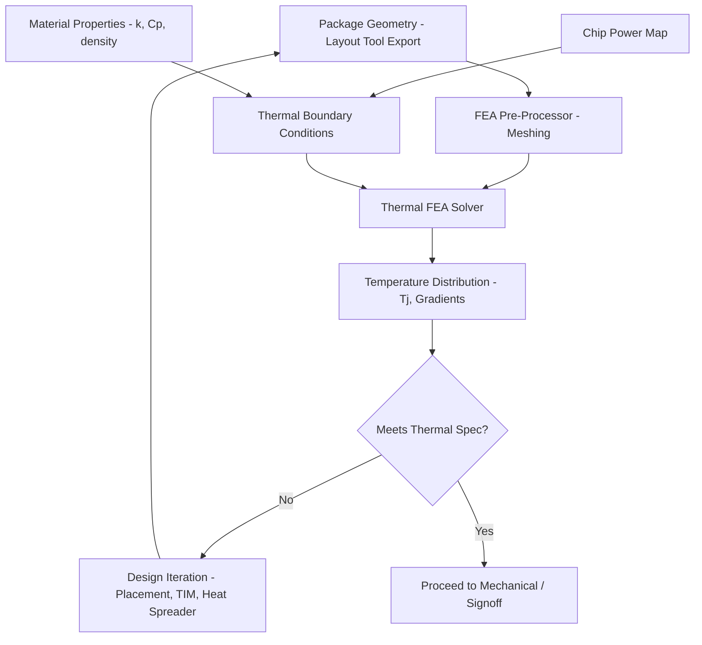
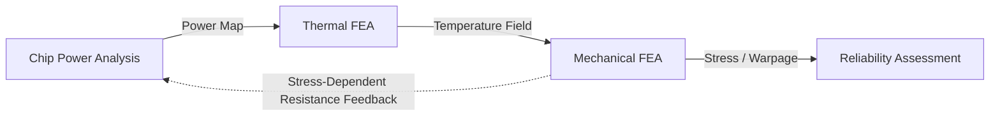

## Finite Element Analysis for Thermal and Mechanical Simulation

### Overview

**Key Points**

- Finite Element Analysis (FEA) discretizes complex package geometries into small elements to numerically solve thermal and mechanical field equations that lack closed-form solutions
- In advanced packaging, FEA addresses: warpage prediction, thermal-mechanical stress (CTE mismatch-driven), solder joint reliability, TSV-induced stress, and steady-state/transient thermal distribution
- Major tools: Ansys Mechanical, Ansys Icepak/Ansys Redhawk-SC Electrothermal, Siemens Simcenter (formerly NX/Femap), COMSOL Multiphysics, and specialized packaging-focused solvers integrated into EDA flows
- FEA complements (not replaces) EDA layout tools — geometry is typically exported from layout tools into FEA pre-processors for meshing and solving

### Why FEA Is Essential in Advanced Packaging

Advanced packages combine dissimilar materials (silicon, copper, mold compound, substrate laminate, solder) with vastly different coefficients of thermal expansion (CTE), elastic moduli, and thermal conductivities. These material mismatches, combined with thermal cycling during operation and manufacturing (reflow), create:

- **Warpage**: differential thermal expansion causes the package to bow, risking solder joint opens or handling failures during assembly
- **Stress concentration**: at material interfaces (die-to-substrate, TSV-to-silicon, solder-to-pad), stress can exceed material yield or fracture limits
- **Thermal gradients**: uneven heat generation across stacked dies creates temperature differentials affecting both reliability and electrical performance (timing, leakage)

Analytical (closed-form) solutions exist only for highly simplified geometries; real package structures with irregular die placement, varying layer counts, and complex boundary conditions require numerical methods — FEA being the dominant approach in the industry.

### FEA Fundamentals as Applied to Packaging

**Key Points**

- The governing physics: heat conduction (Fourier's law) for thermal analysis, linear/nonlinear elasticity (stress-strain relations) for mechanical analysis, often solved as **coupled thermal-mechanical** problems since temperature changes drive mechanical stress
- Domain is discretized into elements (typically tetrahedral or hexahedral in 3D) connected at nodes; field equations are approximated within each element and assembled into a global system of equations
- Solution: for steady-state thermal, this reduces to solving $KT = Q$ where $K$ is the conductivity matrix, $T$ is nodal temperature, and $Q$ is heat load; for mechanical, $Kx = F$ where $K$ is stiffness, $x$ is displacement, $F$ is applied force/thermal load

$$K_{thermal} \cdot T = Q$$

$$K_{mechanical} \cdot x = F$$

For thermal-mechanical coupling, temperature results from the thermal solve become a load input to the mechanical solve via thermal expansion terms.

### Thermal Simulation Workflow

**Key Points**

- **Steady-state analysis**: determines equilibrium temperature distribution under constant power dissipation — used for junction temperature (Tj) verification against reliability limits
- **Transient analysis**: models temperature evolution over time — critical for workload-dependent heating (e.g., burst compute causing rapid local temperature rise) and thermal cycling reliability (JEDEC-style temperature cycling tests)
- Boundary conditions: power maps (from chip power analysis tools), ambient temperature, convection coefficients (natural or forced air, liquid cooling), and thermal interface material (TIM) properties

### Mechanical Simulation Workflow

**Key Points**

- **Warpage analysis**: predicts package bow/twist across temperature range (e.g., room temperature to reflow temperature ~260°C), critical for SMT assembly yield
- **Stress analysis**: identifies peak stress locations at material interfaces, informing die crack risk, delamination risk, and TSV-induced keep-out zone requirements
- **Solder joint fatigue**: thermal cycling-induced strain in solder joints (BGA balls, microbumps) modeled to predict fatigue life, often using empirical models (e.g., Coffin-Manson or Engelmaier equations) fed by FEA-derived strain data

**Example**

A typical warpage analysis flow:

1. Build a full package FE model including die, substrate, mold compound, and solder ball layers with accurate layer thicknesses and material properties
2. Apply a temperature ramp from room temperature to peak reflow temperature (thermal-mechanical coupled analysis)
3. Extract out-of-plane displacement (warpage) across the package footprint at each temperature step
4. Compare peak warpage against JEDEC or customer specification limits (commonly expressed as maximum deviation in micrometers over the package diagonal)
5. If warpage exceeds spec, iterate on stack-up (e.g., adjusting mold compound thickness, substrate core thickness, or adding stiffener rings)

[Unverified] Specific warpage limit values are customer/application-specific and governed by relevant JEDEC standards (e.g., JESD22-B112 for post-reflow warpage measurement); exact numerical thresholds should be verified against the applicable specification for the design in question.

### CTE Mismatch and Material Modeling

**Key Points**

- Coefficient of Thermal Expansion (CTE) mismatch between adjacent materials is the primary driver of thermal-mechanical stress
- Representative CTE ranges (illustrative, not authoritative for any specific material grade): silicon ~2.6 ppm/°C, copper ~17 ppm/°C, FR4/substrate laminate ~14-17 ppm/°C (in-plane), mold compound ~7-10 ppm/°C, solder (SAC alloys) ~21-24 ppm/°C
- Accurate FEA requires temperature-dependent material properties where applicable, since modulus and CTE can shift meaningfully across the operating/reflow temperature range — especially for polymeric materials like mold compound and underfill

[Inference] Material property databases used in commercial FEA tools (Ansys Granta, material libraries within Simcenter) provide starting-point values, but package-specific material characterization is often required for high-confidence reliability predictions, particularly for novel material systems.

### TSV-Induced Stress (3D-IC Specific)

**Key Points**

- Copper-filled TSVs have significantly higher CTE than surrounding silicon, causing localized stress around each via upon thermal cycling
- FEA-derived stress fields inform the **keep-out zone (KOZ)** radius specified in design rules — the distance from a TSV edge within which active transistors should not be placed to avoid stress-induced mobility shift or reliability degradation
- Full-chip TSV array simulation is computationally prohibitive at transistor-level resolution; industry practice commonly uses **representative unit-cell modeling** (simulating a single TSV or small TSV cluster) combined with superposition or extraction of a simplified KOZ rule applied uniformly across the design

### Coupled Multiphysics Considerations

**Key Points**

- Thermal and mechanical domains are often coupled sequentially (thermal solve feeds mechanical solve as a load) rather than fully simultaneously solved, which is computationally efficient and adequate when mechanical response doesn't significantly feed back into thermal behavior
- Some advanced flows extend to **electro-thermal-mechanical** coupling: electrical power dissipation (from chip-level power analysis) drives the thermal solve, which drives the mechanical solve — tools like Ansys RedHawk-SC Electrothermal explicitly target this chip-to-package coupled chain
- Fully coupled (simultaneous) multiphysics solving is used selectively where feedback loops are significant (e.g., stress affecting electrical resistance in fine interconnect), given the added computational cost

### Mesh Considerations for Packaging FEA

**Key Points**

- Package structures span vastly different length scales: TSVs/microbumps at micrometers, full package at millimeters-to-centimeters — requiring **mesh refinement strategies** (fine mesh near stress concentrators, coarser mesh in bulk regions) to keep model size tractable
- Element type selection: hexahedral elements generally offer better accuracy-per-node for regular geometries (layered substrate structures); tetrahedral elements handle irregular geometries (die edges, complex routing regions) more readily at some accuracy cost
- **Submodeling** is a common technique: a coarse full-package model establishes global boundary conditions, then a fine-mesh submodel of a critical local region (e.g., a single TSV cluster or solder joint) is solved using boundary conditions extracted from the global model — balancing accuracy and computational cost

### Integration with EDA and Package Design Flows

**Key Points**

- Geometry typically exported from package layout tools (Cadence Allegro/Integrity 3D-IC, Siemens Xpedition) via standard formats (ODB++, STEP, or vendor-specific bridges) into FEA pre-processors
- Power maps exported from chip-level power analysis tools (e.g., derived from Synopsys PrimePower, Cadence Voltus, or similar) feed thermal boundary conditions
- Results feed back into design decisions: layout tools may need placement adjustments to relocate high-power blocks (thermal), or package stack-up changes (warpage/stress) — creating an iterative loop between EDA layout and FEA simulation rather than a one-way handoff

[Unverified] The degree of automated/bidirectional integration between specific EDA layout tools and specific FEA tools varies by vendor partnership and tool version; some flows remain largely manual geometry/data exchange rather than fully automated round-trip integration.

### Common Simulation Pitfalls

**Key Points**

- **Oversimplified boundary conditions**: using generic convection coefficients instead of application-specific cooling solution characteristics leads to inaccurate junction temperature predictions
- **Ignoring temperature-dependent material properties**: using room-temperature-only material data for reflow-temperature warpage analysis can produce significant error, particularly for mold compound and underfill
- **Insufficient mesh refinement at stress concentrators**: under-resolved mesh near TSVs, solder joint corners, or die edges underestimates peak stress, risking undetected reliability issues
- **Neglecting manufacturing-induced residual stress**: as-fabricated residual stress (from curing, prior thermal cycles) can meaningfully shift baseline stress state and is sometimes omitted in simplified models

### Conclusion

FEA is the primary numerical method bridging package physical design and reliability/manufacturability verification, addressing thermal distribution, warpage, and mechanical stress phenomena that arise from multi-material advanced packaging structures. Effective use requires accurate geometry import from EDA layout tools, realistic (often temperature-dependent) material properties, appropriately refined meshing strategies (including submodeling for local stress concentrators like TSVs and solder joints), and increasingly coupled electro-thermal-mechanical analysis chains that connect chip-level power behavior through to package-level reliability outcomes.

**Related Topics**

- JEDEC reliability standards for thermal cycling and warpage measurement (JESD22 series)
- Solder joint fatigue life prediction models (Coffin-Manson, Engelmaier)
- Chip-package-system (CPS) co-simulation methodologies
- Underfill and mold compound material characterization for FEA
- Design rule generation from TSV keep-out zone simulation studies
- Computational fluid dynamics (CFD) for package-level airflow/liquid cooling design
- Model order reduction techniques for fast thermal simulation in early design exploration