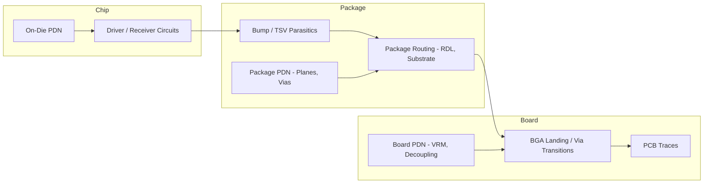
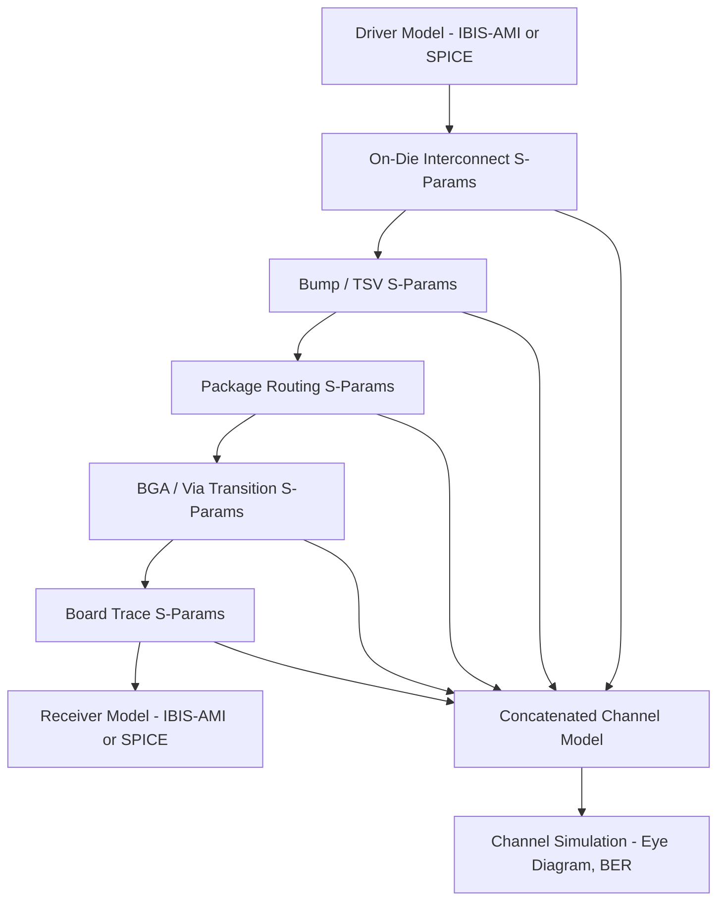

## Chip-Package-System Electrical Co-Simulation

### Overview

**Key Points**

- Chip-package-system (CPS) co-simulation analyzes electrical behavior (signal integrity, power integrity, EMI) across the full interconnect path spanning die, package, and board as a unified electrical system rather than isolated domains
- Motivated by the breakdown of traditional design margins as data rates increase and package parasitics become a larger fraction of total channel loss/noise budget
- Domains analyzed: power delivery network (PDN) impedance, signal integrity (SI) for high-speed interfaces, simultaneous switching noise (SSN), and electromagnetic interference (EMI)
- Key tools: Ansys SIwave/HFSS/RedHawk-SC, Cadence Sigrity (Clarity, PowerSI, PowerDC), Siemens HyperLynx/Calibre 3DSTACK, Keysight ADS

### Why Isolated Domain Analysis Falls Short

Historically, chip designers verified on-die power/signal integrity, package designers verified package parasitics separately, and board designers verified PCB signal/power integrity independently — each using worst-case or idealized boundary conditions for the adjacent domain. This worked when each domain's parasitic contribution was small relative to design margins.

As data rates increased (multi-Gbps SerDes, high-bandwidth memory interfaces) and package interconnect density increased (2.5D/3D integration), several effects invalidated isolated analysis:

- **Package parasitics became a first-order contributor** to signal loss and power delivery impedance, no longer negligible relative to on-die and board effects
- **Resonances can form across domain boundaries** — a PDN resonance might arise from the interaction between on-die decoupling capacitance, package inductance, and board decoupling, invisible to any single-domain analysis
- **Return path discontinuities** at die-to-package and package-to-board transitions create signal integrity issues not captured by analyzing each domain's transmission lines in isolation

CPS co-simulation addresses this by building a unified electrical model spanning all three domains.

### Power Delivery Network (PDN) Co-Analysis

**Key Points**

- PDN impedance must stay below a target threshold ($Z_{target}$) across the relevant frequency range to keep voltage ripple within specification under transient current draw
- $Z_{target}$ is commonly estimated via the simplified relation:

$$Z_{target} = \frac{\Delta V}{\Delta I}$$

where $\Delta V$ is the allowable voltage ripple and $\Delta I$ is the worst-case transient current step

- Full PDN impedance profile results from the series/parallel combination of on-die decoupling capacitance, package inductance/capacitance (including TSV or bump inductance), and board-level VRM output impedance plus board decoupling capacitors
- Each domain dominates impedance at different frequency ranges: on-die decoupling handles highest frequencies (fastest transients), package decoupling covers mid-range, board/VRM covers low frequencies — gaps between these ranges can create impedance peaks (anti-resonances) if not co-optimized

**Example**

A simplified PDN impedance co-analysis flow:

1. Extract on-die PDN model (R, L, C network) from chip power analysis tool (e.g., Cadence Voltus, Synopsys PrimePower/PrimeRail)
2. Extract package PDN parasitics (plane inductance, via inductance, TSV inductance) via 3D field solver (Ansys SIwave, Cadence Clarity/PowerSI)
3. Extract board PDN model including VRM frequency response and discrete decoupling capacitor placement
4. Concatenate models into a unified circuit netlist or S-parameter cascade
5. Simulate full-path impedance vs. frequency; identify any impedance peaks exceeding $Z_{target}$ at their respective frequency
6. Iterate: add/relocate decoupling capacitors (package or board), adjust TSV/via count, or modify plane shapes to flatten the impedance profile

[Unverified] The specific $Z_{target}$ value and its frequency-dependent profile (often not a single flat target in practice) are design-specific, derived from the power delivery specification of the particular chip and application.

### Signal Integrity Co-Simulation

**Key Points**

- High-speed signal paths (SerDes, HBM interfaces, DDR) traverse driver → on-die interconnect → bump/TSV → package routing → BGA/via → board trace → receiver, with each segment contributing loss, reflection, and crosstalk
- **Channel-level co-simulation** extracts S-parameters for each segment (often via 3D/2.5D field solvers for package and board, and RC/RLC extraction for on-die interconnect) and concatenates them into a full channel model
- Analysis outputs: eye diagram (for NRZ/PAM signaling), insertion loss, return loss, and crosstalk (near-end and far-end) across the operating frequency range
- Tools: Ansys HFSS/SIwave for 3D EM extraction of package/board structures, Cadence Clarity 3D Solver and Sigrity SystemSI for channel simulation, Keysight ADS Channel Simulator for eye diagram and BER estimation

### Return Path and Discontinuity Analysis

**Key Points**

- Signal return current must have a continuous, low-impedance path adjacent to the signal path; transitions between domains (die-to-package bump, package-to-board BGA ball) often introduce **return path discontinuities** where reference planes change or are interrupted
- Discontinuities cause impedance mismatches, reflections, and increased radiated emissions — particularly problematic at bump/via transitions where signal and ground/power vias may not be optimally co-located
- Mitigation: ground via stitching near signal transitions, careful reference plane assignment across the stack-up, and dedicated ground bumps/TSVs adjacent to high-speed signal bumps/TSVs

[Inference] The relative severity of return path discontinuities at each domain transition (die-to-package vs. package-to-board) depends on specific interconnect pitch and frequency; finer-pitch die-to-package transitions in advanced 2.5D/3D packages can introduce proportionally larger discontinuity effects relative to signal wavelength than coarser package-to-board transitions, though this varies by specific design.

### Simultaneous Switching Noise (SSN) and Crosstalk

**Key Points**

- SSN (also called ground bounce or $\Delta I$ noise) arises when multiple output drivers switch simultaneously, inducing voltage noise on shared power/ground paths due to parasitic inductance
- CPS co-simulation models the shared inductance path across chip, package, and board to predict SSN magnitude under realistic simultaneous switching patterns (e.g., a full data bus transitioning simultaneously)
- Crosstalk co-simulation extends single-victim/single-aggressor analysis across domain boundaries — coupling between adjacent signal traces/traces may differ significantly between on-die, package, and board routing pitch and shielding, requiring full-path extraction rather than per-domain worst-case assumptions

### EMI and Electromagnetic Co-Simulation

**Key Points**

- Full 3D electromagnetic (EM) field solvers (Ansys HFSS, Cadence Clarity) model radiated emissions from package and board structures, informing compliance with EMI regulatory limits (e.g., FCC, CISPR)
- Package-level resonant structures (power/ground plane cavities, via arrays) can act as unintentional antennas at specific frequencies; CPS co-simulation identifies these resonances before physical prototyping
- Particularly relevant for packages with integrated antennas (e.g., mmWave AiP — antenna-in-package) where the package itself is intentionally part of the RF design, requiring tight EM co-design between chip RF front-end and package antenna structure

### Model Extraction and Interoperability

**Key Points**

- **On-die models**: typically SPICE netlists or reduced-order models extracted from chip-level extraction tools (Cadence Quantus, Synopsys StarRC), sometimes represented as IBIS or IBIS-AMI models for I/O buffers to enable fast channel simulation without full SPICE-level detail
- **Package/board models**: S-parameter models (Touchstone format, .snp files) from 3D/2.5D field solvers, or equivalent circuit models (RLGC per-unit-length for transmission lines) for faster simulation
- **Standard interchange formats**: Touchstone S-parameters are the de facto standard for passive interconnect models across the industry, enabling model exchange between different vendors' tools (e.g., a package model from Ansys SIwave imported into a Cadence or Keysight channel simulator)
- IBIS-AMI standardizes behavioral I/O buffer and equalization models for high-speed SerDes channel simulation, allowing IP vendors to supply models without exposing proprietary transistor-level implementation

### Simulation Methodology: Full-Wave vs. Quasi-Static

**Key Points**

- **Full-wave EM solvers** (HFSS-class, finite element or method-of-moments based) solve Maxwell's equations without simplifying assumptions — most accurate but computationally expensive, typically reserved for structures where wavelength-scale effects matter (high frequency, resonant structures, antennas)
- **Quasi-static/2.5D solvers** (SIwave-class) assume simplified field behavior appropriate for planar, layered structures (power/ground planes, transmission lines) — faster, suitable for the bulk of package/board PDN and SI analysis where full-wave accuracy isn't required
- Practical flows often mix both: quasi-static solvers for bulk PDN/SI extraction across the full package/board, full-wave solvers reserved for localized critical structures (connector transitions, antenna structures, complex via fields)

### Example: HBM Interface CPS Co-Simulation

**Example**

A representative flow for a High Bandwidth Memory (HBM) interface, which is particularly demanding due to very wide parallel buses at fine pitch over a silicon interposer:

1. Extract on-die driver/receiver IBIS-AMI or SPICE models from both logic die and HBM die
2. Extract interposer RDL routing S-parameters via 2.5D/quasi-static field solver, given the large number of parallel signal traces (thousands of I/Os in wide HBM interfaces)
3. Extract TSV and microbump parasitics feeding both signal integrity and PDN models
4. Build channel model concatenating driver, on-die interconnect, microbump, interposer RDL, and receiver
5. Run channel simulation across all bus bits, checking eye diagram margin and crosstalk between adjacent data lines given the tight interposer routing pitch
6. Co-analyze PDN impedance across logic die, interposer power routing, and any package-level decoupling to ensure adequate power integrity under wide-bus simultaneous switching
7. Iterate interposer routing/shielding if crosstalk or SSN margins are insufficient

### Common Pitfalls in CPS Co-Simulation

**Key Points**

- **Domain boundary oversimplification**: using ideal (lossless, zero-impedance) boundary conditions at chip-package or package-board interfaces instead of extracted models understates real system noise/loss
- **Model bandwidth mismatch**: combining models extracted or valid only over different frequency ranges (e.g., a low-frequency PDN model concatenated with a high-frequency SI model) without verifying consistent bandwidth validity
- **Neglecting simultaneous switching patterns**: analyzing single-bit SI performance without accounting for realistic simultaneous switching noise from adjacent bits/buses can significantly underestimate real-world margin degradation
- **Late-stage co-simulation**: performing full CPS analysis only after chip and package are largely finalized limits the ability to correct systemic issues (e.g., resonances) without costly respins — increasingly, CPS co-simulation is pushed earlier ("shift-left") into the design flow using preliminary/estimated models

### Conclusion

Chip-package-system electrical co-simulation unifies signal integrity, power integrity, and electromagnetic analysis across the die, package, and board domains, addressing effects — cross-domain resonances, return path discontinuities, simultaneous switching noise — that isolated single-domain analysis cannot capture. It relies on consistent model extraction (SPICE/IBIS-AMI for active devices, Touchstone S-parameters for passive interconnect) and a mix of full-wave and quasi-static field solvers appropriate to each structure's electrical scale. As data rates and integration density increase, particularly in 2.5D/3D packages with wide parallel interfaces like HBM, CPS co-simulation has shifted from a late-stage verification step toward an earlier, iterative part of the co-design methodology.

**Related Topics**

- IBIS-AMI modeling methodology for SerDes channel simulation
- Power integrity target impedance derivation and decoupling capacitor optimization
- Antenna-in-package (AiP) design for mmWave applications
- S-parameter model quality metrics (passivity, causality) for channel simulation
- HBM interface signal integrity challenges in 2.5D interposer designs
- EMI/EMC regulatory compliance methodology for packaged systems
- Model order reduction for fast PDN/SI simulation in early design exploration