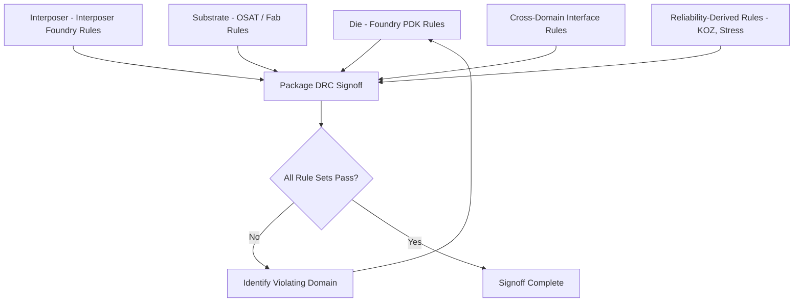
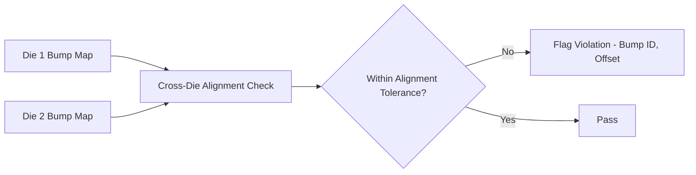

## Design Rule Checking for Advanced Package Structures

### Overview

**Key Points**

- Design Rule Checking (DRC) for advanced packages verifies geometric and electrical rules across heterogeneous structures — silicon interposers, RDL fan-out, TSVs, substrate build-up layers — that combine IC-style and PCB-style rule paradigms
- Unlike traditional IC DRC (single foundry PDK) or PCB DRC (single fabricator's capability file), package DRC must reconcile rule decks from multiple sources: die foundries, interposer/RDL foundries, substrate fabricators, and assembly/OSAT houses
- Primary tools: Siemens Calibre (widely used as cross-vendor package DRC signoff), Cadence Pegasus/PVS extended for package structures, Synopsys IC Validator with 3D-IC rule extensions, plus PCB-heritage checkers within Allegro/Xpedition for substrate-level rules
- Rule categories span: geometric spacing/width rules, TSV/via-specific rules, cross-die alignment rules, and reliability-driven rules (stress keep-out zones)

### Why Package DRC Differs from IC and PCB DRC

Traditional IC DRC operates against a single, well-defined foundry PDK with consistent process rules across the entire chip. Traditional PCB DRC operates against a single fabricator's design rules for a homogeneous multi-layer laminate stack. Advanced package DRC must instead verify:

- **Multiple process domains in one design**: a 2.5D package might include a die (foundry PDK A), a silicon interposer (different foundry or process, PDK B), and an organic substrate (OSAT/substrate fab rules, entirely different rule paradigm)
- **Cross-domain interface rules**: rules governing the transition between domains (bump landing pad alignment tolerance between die and interposer, TSV-to-RDL via alignment) have no single-domain precedent
- **Reliability-driven geometric rules**: stress-based keep-out zones (e.g., around TSVs) are derived from mechanical simulation rather than pure lithography/etch process capability, a rule category largely absent from conventional IC or PCB DRC

### Rule Categories for Advanced Packages

#### 1. Geometric Spacing and Width Rules

**Key Points**

- Standard DRC checks (minimum width, minimum spacing, minimum enclosure) apply within each domain but at vastly different scales: RDL traces on silicon interposers may require sub-2 µm rules, while substrate build-up traces may follow 10-25 µm class rules
- **Layer-to-layer alignment tolerance**: build-up substrate and RDL layers require checks on via-to-pad enclosure accounting for realistic layer-to-layer registration error, distinct from IC processes where lithography alignment is typically tighter relative to feature size
- Differential and single-ended trace impedance-driven width/spacing rules, inherited from PCB-style constraint management, apply at the substrate level for controlled-impedance routing

#### 2. TSV and Via-Specific Rules

**Key Points**

- **TSV-to-TSV spacing**: minimum pitch driven by both process capability (etch/fill uniformity) and stress interaction between adjacent vias
- **TSV keep-out zone (KOZ)**: minimum distance from TSV edge to active transistor area, derived from thermal-mechanical stress simulation (see FEA discussion) rather than pure lithographic capability — a rule type unique to TSV-based 3D-IC
- **TSV-to-die-edge spacing**: minimum margin from TSV to die boundary, accounting for edge stress effects and dicing tolerance
- **Landing pad/via alignment**: TSV-to-RDL and TSV-to-bump alignment tolerance rules ensuring adequate overlap despite realistic process variation

**Example**

A representative (illustrative, not authoritative) TSV rule set might specify:

- TSV diameter: process-dependent, commonly in the 5-10 µm range for mid-density 3D-IC
- TSV-to-TSV minimum pitch: driven by combined lithographic and stress-interaction limits
- TSV KOZ radius: derived from FEA stress simulation results specific to the TSV aspect ratio and surrounding material stack
- TSV-to-die-edge margin: process- and reliability-qualification-specific

[Unverified] Actual numerical values for any specific process node or foundry are proprietary and vary significantly; the categories above describe the rule types present, not usable design values.

#### 3. Cross-Die and Cross-Domain Alignment Rules

**Key Points**

- **Bump/bond pad alignment tolerance**: verifies that die-to-interposer or die-to-die bump/hybrid-bond pad positions fall within acceptable alignment tolerance given realistic pick-and-place or wafer bonding accuracy
- **Stacking offset rules**: for face-to-face or face-to-back stacked dies, rules governing acceptable X-Y offset and rotation tolerance between stacked dies
- These checks require the DRC tool to have visibility into multiple dies' geometry simultaneously — a capability specific to 3D-IC-aware DRC tools (Calibre 3DSTACK, Cadence Pegasus 3D-IC extensions, Synopsys IC Validator 3D-IC) rather than traditional single-die DRC

#### 4. Reliability-Driven Rules

**Key Points**

- Beyond TSV KOZ, additional reliability-derived rules include: solder joint pitch/size rules to limit fatigue risk, minimum copper pillar spacing to avoid bridging under thermal cycling-induced deformation, and mold compound keep-out around die edges to prevent delamination initiation
- These rules typically originate from qualification data and FEA simulation results specific to a given package platform/OSAT process, then get codified into the DRC rule deck for that platform
- Represents an area where package DRC diverges most from conventional IC DRC: many rules are empirically/simulation-derived reliability margins rather than pure process capability limits

### DRC Tool Architecture for Multi-Domain Verification

**Key Points**

- Modern 3D-IC/package DRC tools must ingest and cross-reference geometry from multiple sources: GDSII/OASIS for die and interposer (IC heritage), and ODB++ or similar for substrate (PCB heritage)
- Unified rule deck compilation: rule decks for each domain (die, interposer, substrate) plus interface rules are compiled into a single verification run, often using a hierarchical or "stitched" database approach that preserves each domain's native coordinate system and design data while enabling cross-domain checks
- **Calibre 3DSTACK** (Siemens EDA) is commonly cited as addressing this specific multi-die, multi-domain DRC challenge, providing a framework to run DRC across stacked die configurations with cross-die awareness
- Cadence and Synopsys provide comparable capability integrated within their respective 3D-IC platforms (Integrity 3D-IC's verification integration, 3DIC Compiler's IC Validator integration)

[Unverified] Specific architectural implementation details and feature completeness of cross-domain DRC vary by tool version and vendor roadmap; current documentation should be consulted for release-specific capability.

### LVS (Layout vs. Schematic) Extension for Packages

**Key Points**

- Traditional LVS verifies that physical layout connectivity matches the intended schematic/netlist — extended in package contexts to verify connectivity across bump maps, TSVs, RDL routing, and substrate traces against the full system-level netlist
- **Cross-die LVS** must trace signal connectivity from die A's pin, through TSV/bond pad, into die B's corresponding pin, verifying against the intended multi-die netlist — a capability requiring the LVS tool to have a unified view of the full 3D-IC or SiP netlist rather than per-die netlists in isolation
- Package-level LVS commonly also verifies power/ground net connectivity across the full interconnect stack, ensuring no unintended opens or shorts in the PDN as it traverses die, TSV, and substrate domains

### Example: DRC Flow for a 2.5D Interposer-Based Package

**Example**

1. **Die-level DRC**: each die verified independently against its respective foundry PDK rules (standard IC DRC, unrelated to package-specific checks)
2. **Interposer DRC**: RDL routing and TSV array on the silicon interposer verified against interposer foundry rules, including TSV-to-TSV spacing and TSV KOZ
3. **Cross-die alignment DRC**: bump maps from both dies checked against interposer landing pads for alignment tolerance compliance, using a 3D-IC-aware DRC tool (e.g., Calibre 3DSTACK)
4. **Substrate DRC**: package substrate build-up layers verified against OSAT/substrate fabricator design rules (trace width/spacing, via-in-pad rules, solder mask clearance) using PCB-heritage checkers within Allegro/Xpedition or dedicated substrate DRC
5. **Interface DRC**: interposer-to-substrate BGA landing pattern verified for alignment and pad size compliance against both interposer output geometry and substrate fabrication capability
6. **Cross-domain LVS**: full system netlist connectivity verified from die pin through interposer RDL/TSV to substrate BGA ball, confirming no shorts/opens introduced across domain transitions
7. **Signoff**: consolidated violation report reviewed; any violations trace back to their originating domain and are resolved by the responsible design team (chip, interposer, or substrate)

### Common DRC Pitfalls in Package Design

**Key Points**

- **Rule deck version mismatch**: using an outdated interposer or substrate rule deck (rules evolve as fabricators refine process capability) produces either false violations or missed real violations
- **Incomplete cross-domain coverage**: running each domain's DRC independently without dedicated cross-domain/alignment checks can miss bump misalignment or TSV-to-KOZ violations that only manifest when domains are considered together
- **Treating reliability rules as purely geometric**: KOZ and similar reliability-derived rules require understanding the underlying stress/reliability rationale — blanket rule relaxation without re-validating against FEA data risks introducing real reliability issues even if the DRC tool reports a pass against a modified (loosened) rule
- **Late discovery of cross-domain violations**: running full multi-domain DRC only late in the flow (after individual domains are largely finalized) increases the cost of fixing cross-domain alignment or interface issues — favors earlier, iterative cross-domain checking where tool capability allows

### Conclusion

Design rule checking for advanced package structures extends conventional IC and PCB DRC into a multi-domain verification challenge, reconciling rule decks from die foundries, interposer/RDL processes, and substrate fabricators within a single signoff flow. Beyond standard geometric spacing/width rules, package DRC introduces reliability-driven rule categories — particularly TSV keep-out zones derived from thermal-mechanical stress simulation — and requires cross-domain alignment and connectivity (LVS) checks that have no direct precedent in single-domain IC or PCB verification. Tools like Calibre 3DSTACK, alongside Cadence and Synopsys 3D-IC verification extensions, address this by unifying multi-source geometry and rule decks into cross-domain-aware verification runs.

**Related Topics**

- TSV keep-out zone derivation from FEA stress simulation
- Multi-die netlist LVS methodology for 3D-IC connectivity verification
- Interposer and RDL foundry rule deck structure and evolution
- Substrate fabricator design rule capability and constraint management
- Hybrid bonding alignment tolerance and its DRC rule implications
- Reliability qualification data as a source for package design rules
- Cross-vendor DRC signoff methodology (Calibre) in multi-tool package flows