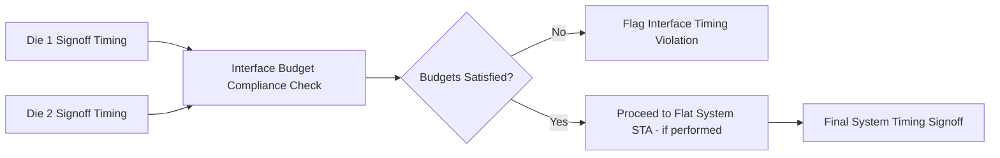
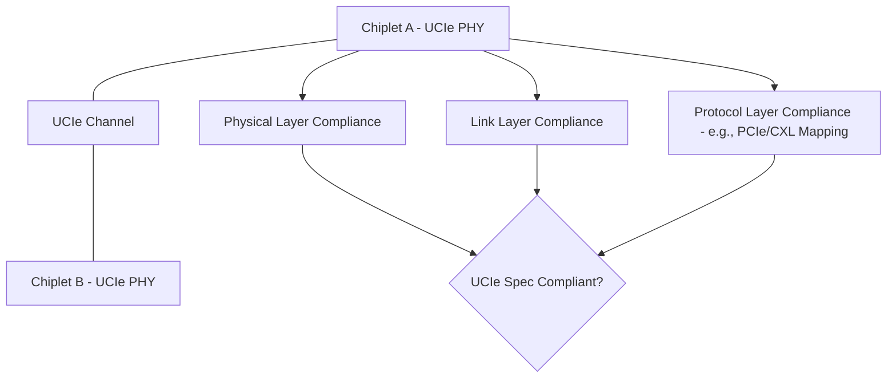

## Multi-Die System Assembly and Verification Flows

### Overview

**Key Points**

- Multi-die system assembly and verification flows govern how independently designed dies (and IP from potentially different vendors/nodes) are integrated into a single package and verified as a coherent system before tapeout/manufacturing commitment
- Encompasses: netlist/connectivity assembly across dies, unified physical verification, system-level timing/power signoff, and chiplet interface compliance (e.g., UCIe) verification
- Builds on individually-covered flows (3D-IC floorplanning, package DRC, CPS co-simulation) but focuses specifically on the **integration and signoff** stage where per-die results are combined into system-level verification
- Key tools: Cadence Integrity 3D-IC (system assembly/verification integration), Synopsys 3DIC Compiler, Siemens Calibre 3DSTACK, plus system-level timing tools (PrimeTime, Tempus) extended for multi-die netlists

### Why Multi-Die Assembly Requires a Dedicated Flow Stage

Individual dies in a 2.5D/3D or multi-chip package may be designed by different teams, using different EDA tool flows, on different process nodes, potentially sourced from different vendors (chiplet ecosystems). Before final signoff, these independently-verified dies must be assembled into a single verified system, addressing:

- **Netlist stitching**: combining separate per-die netlists into a unified system netlist reflecting actual physical interconnect (TSV, bump, hybrid bond, or package trace connections)
- **Cross-die verification consistency**: ensuring each die's individually-signed-off timing/power/DRC results remain valid in the context of the assembled system (interface timing, thermal coupling, shared PDN)
- **Interface protocol compliance**: for chiplet-based designs using standardized interfaces (UCIe), verifying electrical and protocol-level compliance between dies from potentially different design teams/vendors

```mermaid
flowchart TD
    A[Die 1 - Signed Off Independently] --> D[Netlist Stitching]
    B[Die 2 - Signed Off Independently] --> D
    C[Die N - Signed Off Independently] --> D
    D --> E[System Netlist]
    E --> F[Cross-Die Physical Verification]
    E --> G[System-Level Timing Signoff]
    E --> H[System-Level Power Signoff]
    E --> I[Interface Protocol Compliance]
    F --> J{All Checks Pass?}
    G --> J
    H --> J
    I --> J
    J -->|No| K[Identify Owning Die / Issue]
    J -->|Yes| L[System Signoff Complete]
```

### Netlist and Connectivity Assembly

**Key Points**

- Each die's netlist (from its own design flow) must be connected via a **system-level connectivity map** defining which die pins connect through which physical interconnect (TSV, microbump, hybrid bond pad, or package/substrate trace) to which pins on other dies
- Connectivity assembly tools ingest per-die netlists (typically Verilog/LEF-DEF or vendor-specific formats) plus the physical interconnect map (bump/TSV assignment from floorplanning) to construct the unified system netlist
- **Netlist consistency checking**: verifies that the assembled connectivity matches design intent — e.g., that a signal driven on die A's output pin correctly reaches the intended receiver pin on die B without unintended floating nets, shorts, or mismatched pin counts

**Example**

A representative connectivity assembly step:

1. Die A netlist declares output port `data_out[63:0]` mapped to specific bump locations via its I/O ring definition
2. Die B netlist declares input port `data_in[63:0]` mapped to corresponding bump locations on its receiving face
3. The interposer/package bump map (from 3D-IC floorplanning) defines the physical connection between Die A's bump set and Die B's bump set
4. System assembly tool cross-references all three sources, generating a stitched netlist where `dieA.data_out[63:0]` connects to `dieB.data_in[63:0]` through the defined bump/TSV path
5. Any mismatch (e.g., bit-width mismatch, missing bump assignment, or unconnected pin) is flagged for resolution before proceeding

### Cross-Die Physical Verification

**Key Points**

- Builds directly on package DRC/LVS capability (see prior topic) but specifically at the assembly stage verifies the **as-assembled** system: confirming that each die's physical geometry, once placed in final stack position, satisfies all cross-die rules (alignment, KOZ, spacing) simultaneously
- Distinguishes from earlier-stage floorplan-level checks by using final, tapeout-ready geometry for each die rather than placeholder/estimated geometry used during earlier planning iterations
- Requires tools with true multi-die database visibility (Calibre 3DSTACK, Cadence Pegasus/Integrity 3D-IC verification integration, Synopsys IC Validator 3D-IC) to run DRC/LVS treating the assembled stack as a single verification domain

### System-Level Timing Signoff

**Key Points**

- Extends the cross-die timing closure methodology (flat vs. hierarchical STA, covered under 3D-IC floorplanning) to the final assembly stage, where each die's actual signed-off timing (not estimated) is available
- **Final interface timing verification**: confirms that each die's actual signoff timing at its interface pins is compatible with the budget/assumption used by the adjacent die during its own independent closure — if Die A closed against an interface budget assuming a certain setup/hold window, Die B's actual signoff must satisfy that same window
- For flat system-level STA (where computationally feasible), the fully assembled netlist with cross-die interconnect parasitics (TSV, bump, hybrid bond delay) is analyzed as a single timing graph, offering the most accurate but most computationally expensive verification
- Tools: Synopsys PrimeTime and Cadence Tempus both support multi-die/3D-IC timing extensions; some flows use dedicated 3D-IC platform-integrated timing signoff (within Integrity 3D-IC or 3DIC Compiler) for tighter flow integration

### System-Level Power Signoff

**Key Points**

- Aggregates per-die power analysis into a system-level power delivery verification, accounting for the shared PDN path (on-die, TSV/bump, package, board) under realistic simultaneous multi-die activity scenarios
- **IR drop analysis** extended across the full stack: voltage drop from the board-level VRM through package PDN, through TSV/bump PDN connections, to each die's on-die power grid — verifying each die receives adequate voltage under worst-case simultaneous switching across all dies in the stack
- **Thermal-power coupling**: system-level power signoff often coordinates with thermal FEA (covered under thermal/mechanical simulation) since power dissipation patterns across multiple simultaneously active dies directly determine the thermal profile requiring verification
- Tools: Cadence Voltus (extended for multi-die), Synopsys PrimePower/PrimeRail with 3D-IC extensions, integrated within the broader 3D-IC platform verification flow

### Chiplet Interface Compliance Verification (UCIe and Similar Standards)

**Key Points**

- Universal Chiplet Interconnect Express (UCIe) and similar standardized die-to-die interface specifications define electrical, protocol, and physical layer requirements enabling interoperability between chiplets from potentially different vendors
- Compliance verification spans multiple layers: **physical layer** (bump pitch, electrical signaling levels, channel characteristics matching UCIe specification), **link layer** (training sequences, error detection/correction protocol), and **protocol layer** (transaction-level compliance, typically leveraging existing protocols like PCIe or CXL mapped onto the UCIe physical layer)
- [Unverified] Specific verification methodology and available EDA tool support for UCIe compliance checking continue to evolve as the standard and its adoption mature; consult current UCIe Consortium specifications and vendor tool documentation for release-specific verification IP and methodology
- Standardized interfaces reduce (but do not eliminate) the need for custom cross-die verification when integrating third-party chiplets, since much of the interface behavior is pre-verified against the published specification rather than requiring bespoke verification for each chiplet pairing

### Known-Good-Die (KGD) and Test Integration

**Key Points**

- Multi-die assembly flows increasingly integrate with **known-good-die (KGD)** testing strategy — since a defective die discovered post-stacking can scrap an entire multi-die assembly (including otherwise-good dies), pre-stack test coverage is a critical economic consideration
- **Design-for-test (DFT) coordination across dies**: test access mechanisms (boundary scan, built-in self-test) must be coordinated across dies so that post-assembly system-level test can access and diagnose each die's functionality through the assembled interconnect
- IEEE 1838 (3D-IC test standard) and related test access architectures address structured test methodology for stacked die assemblies, though [Unverified] the extent of current industry-wide standardization and tool support should be verified against current documentation given continued evolution in this area

### Example: Multi-Die Assembly and Verification Flow for a 3-Die 2.5D System

**Example**

1. **Per-die signoff**: three dies (e.g., compute die, HBM stack, I/O die) each independently complete their own DRC/LVS, timing, and power signoff against their respective foundry rules and interface timing budgets
2. **Netlist stitching**: system assembly tool combines the three per-die netlists using the interposer bump/TSV connectivity map established during 3D-IC floorplanning
3. **Cross-die physical verification**: Calibre 3DSTACK (or equivalent) verifies final tapeout-ready geometry for all three dies against cross-die alignment, KOZ, and interposer DRC rules simultaneously
4. **System netlist LVS**: full connectivity verified from compute die through interposer to HBM stack and I/O die, confirming no shorts/opens across the assembled system
5. **Interface timing verification**: each die's actual signoff timing checked against the interface budgets used during independent closure; any violations trigger targeted re-closure of the specific interface path
6. **System power/IR drop signoff**: full-stack PDN analyzed under realistic simultaneous compute + HBM + I/O activity scenario, verifying adequate voltage delivery to all three dies
7. **UCIe compliance check** (if applicable interfaces present): physical/link/protocol layer compliance verified for any standardized chiplet interfaces used between dies
8. **Final system signoff**: consolidated report reviewed across all verification domains; design released for manufacturing/assembly

### Common Pitfalls in Multi-Die Assembly Flows

**Key Points**

- **Assuming per-die signoff guarantees system correctness**: independently signed-off dies can still fail at assembly if interface assumptions (timing budgets, connectivity, power) weren't consistently applied across all dies — assembly-stage verification is not redundant with per-die signoff
- **Late connectivity mismatch discovery**: netlist stitching errors (bit-width mismatch, incorrect bump mapping) discovered only at final assembly rather than through earlier incremental connectivity checks can be costly to trace back to their root cause
- **Insufficient KGD test coverage**: under-investing in pre-stack die test coverage increases the economic risk of scrapping good dies alongside a single defective die in the stack
- **Treating standardized interfaces as zero-verification**: even with UCIe or similar standardized interfaces, implementation-specific verification (actual channel characteristics, realistic layout parasitics) remains necessary rather than assuming specification compliance alone guarantees system-level correctness

### Conclusion

Multi-die system assembly and verification flows form the integration stage where independently designed and signed-off dies come together into a unified, verified system — encompassing netlist stitching, cross-die physical verification, system-level timing and power signoff, and increasingly, standardized chiplet interface compliance verification (UCIe). This stage is where the cross-die rules, budgets, and assumptions established during earlier floorplanning and per-die design are ultimately validated against the as-built system, making it a critical checkpoint before manufacturing commitment — particularly given the high economic cost of defects discovered after die stacking in multi-die packages.

**Related Topics**

- IEEE 1838 test access architecture for 3D-IC assemblies
- UCIe protocol stack and compliance test methodology
- Known-good-die (KGD) test strategy and pre-stack yield economics
- Interface timing budget derivation for hierarchical multi-die closure
- Chiplet ecosystem ecosystem standards beyond UCIe (BoW, OpenHBI comparisons)
- System-level IR drop and thermal-power co-analysis for multi-die stacks
- Netlist connectivity verification tools and methodologies for heterogeneous IP integration