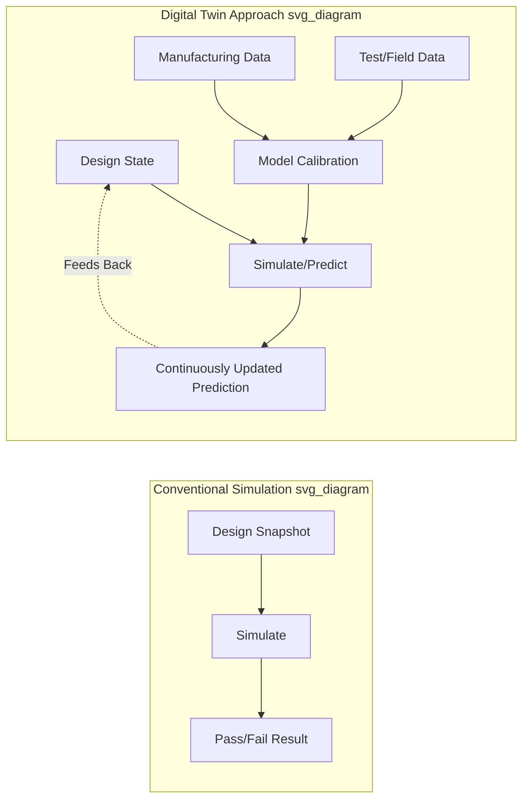
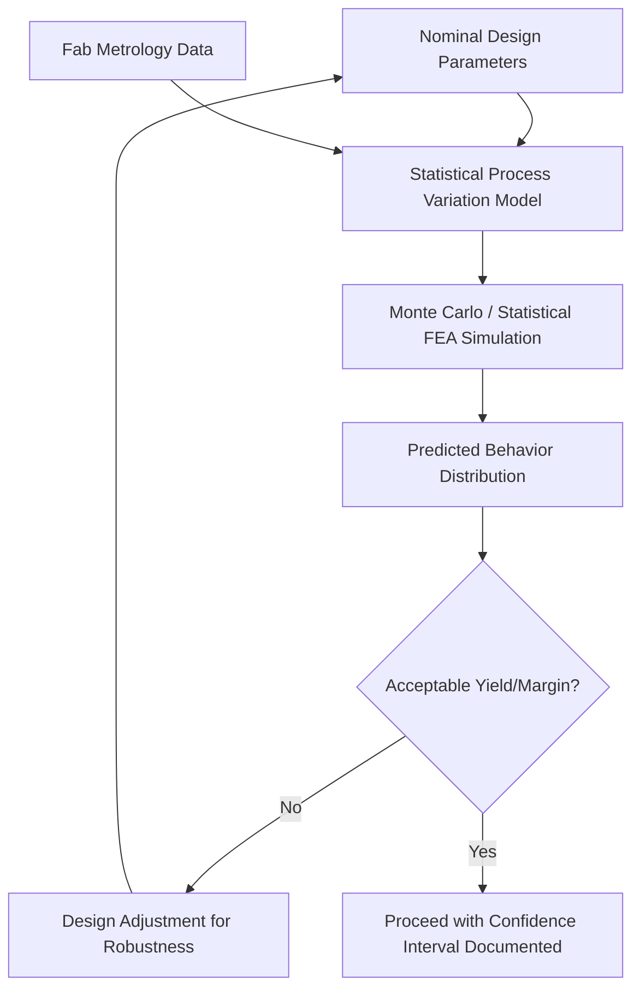

## Digital Twin Approaches to Package-Level Design

### Overview

**Key Points**

- A digital twin in package-level design is a persistent, continuously-updated virtual model of a physical package that synchronizes with design, simulation, manufacturing, and (in advanced implementations) field data across the product lifecycle
- Distinguishes from conventional point-in-time simulation (a single FEA run, a single DRC signoff) by emphasizing **persistence and bidirectional data flow**: the model updates as design changes, incorporates manufacturing process variation data, and can potentially receive field/test feedback
- In advanced packaging, digital twins are applied to: thermal-mechanical behavior prediction, yield/process variation modeling, and increasingly, correlating simulated behavior against actual manufacturing/test data to improve model fidelity over time
- [Unverified] Industry-wide adoption maturity of full digital twin methodology (as distinct from conventional simulation-heavy design flows) varies significantly by organization; this remains an emerging methodology rather than a universally standardized practice as of the knowledge cutoff

### Digital Twin vs. Conventional Simulation: Key Distinction

**Key Points**

- Conventional package simulation (the FEA, CPS co-simulation, and DRC flows covered in prior topics) typically represents **point-in-time verification**: a specific design snapshot is simulated against specific assumed conditions, producing a pass/fail or margin result for that snapshot
- A digital twin extends this toward a **living model**: ideally synchronized with the current design state, capable of rapid re-evaluation as design or manufacturing parameters change, and progressively refined using actual measured data (process metrology, test results, or field telemetry where available) to reduce the gap between simulated and real-world behavior
- The distinction is one of degree and intent rather than a categorically different simulation technology — the underlying FEA/CPS/electrical solvers are often the same tools discussed in prior topics, but embedded within a framework emphasizing continuous synchronization and calibration rather than one-off verification

### Application Area 1: Thermal-Mechanical Digital Twins

**Key Points**

- Extends the FEA-based thermal/warpage/stress analysis (covered in the thermal-mechanical simulation topic) by maintaining a model that can be rapidly re-evaluated as workload, environmental, or design conditions change, rather than requiring a full simulation re-run for each scenario
- **Reduced-order modeling (ROM)** is a common enabling technique: a computationally expensive full FEA model is used to train a much faster surrogate model (e.g., via model order reduction techniques or machine learning regression) that approximates the FEA-predicted temperature/stress response across a range of input conditions with far lower computational cost per evaluation
- This enables near-real-time thermal prediction for use cases like dynamic thermal management (adjusting workload/clock behavior based on predicted rather than only measured temperature) or rapid design-space exploration during early architecture decisions

**Example**

A representative thermal digital twin construction approach:

1. Run a set of full FEA thermal simulations across a range of representative power maps and boundary conditions (design of experiments approach)
2. Train a reduced-order/surrogate model (e.g., via proper orthogonal decomposition, or a trained neural network regression) to approximate the FEA output across the input parameter space
3. Deploy the surrogate model for rapid "what-if" evaluation — e.g., predicting junction temperature for a new workload power profile in milliseconds rather than the hours a full FEA run might require
4. Periodically validate/recalibrate the surrogate model against new full FEA runs or actual thermal test data to maintain prediction accuracy as confidence in edge cases is established

[Inference] The specific surrogate modeling technique (classical model order reduction vs. machine learning-based regression) and achievable speed/accuracy trade-offs are implementation-specific and an active area of tool development rather than a single standardized approach.

### Application Area 2: Process Variation and Yield Digital Twins

**Key Points**

- Incorporates statistical process variation data (from substrate fabrication, die attach, TSV formation, etc.) into the simulation model, moving from single-point "nominal" simulation toward **statistical/probabilistic prediction** of package behavior across expected manufacturing variation
- Enables earlier identification of designs with excessive sensitivity to realistic process variation — e.g., a warpage prediction that looks acceptable at nominal process conditions but has unacceptably high variance across the realistic process window
- Requires ongoing calibration against actual fabrication/metrology data to keep the assumed variation distributions representative of the real manufacturing process, distinguishing this from a purely theoretical statistical simulation

### Application Area 3: Design-Manufacturing Correlation

**Key Points**

- A core digital twin value proposition is closing the loop between simulated prediction and actual measured outcome — comparing FEA-predicted warpage against measured post-reflow warpage, or predicted junction temperature against actual thermal test data, to identify and correct systematic model error
- This correlation process can reveal model deficiencies: e.g., material property assumptions that don't match actual material batch behavior, or boundary condition assumptions (convection coefficients, actual power map) that differ from real operating conditions
- Over successive design iterations or product generations, this correlation feedback is intended to progressively improve model fidelity, reducing reliance on excessive design margin that would otherwise compensate for model uncertainty

[Unverified] The rigor and formality of this correlation feedback loop varies substantially across organizations; some apply it as a structured, tracked methodology while others perform informal, ad-hoc comparison without systematic model recalibration.

### Integration with EDA and Simulation Toolchains

**Key Points**

- Digital twin implementations in packaging typically build on the same underlying tools discussed in prior topics — Ansys (Mechanical, Icepak, and increasingly Ansys Twin Builder for reduced-order model deployment), Siemens Simcenter (with explicit digital twin positioning in its product messaging), and similar platforms
- **Ansys Twin Builder** is a notable example of a commercial tool explicitly targeting reduced-order model creation and deployment for digital twin applications, applicable to package thermal-mechanical behavior among other domains
- Integration with PLM (Product Lifecycle Management) systems is common in mature digital twin implementations, providing the data backbone connecting design data, simulation results, and (where available) manufacturing/field data across the product lifecycle

[Unverified] The specific tool landscape for packaging-focused digital twin deployment continues to evolve; organizations should verify current tool capability and vendor roadmap against their specific application requirements.

### Digital Twin Fidelity Levels

**Key Points**

- Digital twin implementations vary substantially in fidelity and scope; a useful framing distinguishes:
  - **Design-stage digital twin**: model synchronized with current design data, used for rapid design-space exploration and what-if analysis before manufacturing — the most commonly implemented tier in current packaging practice
  - **Manufacturing-correlated digital twin**: model calibrated against actual fabrication/assembly process data, improving prediction accuracy for a specific manufacturing line/process
  - **Field-connected digital twin**: model receives ongoing operational/telemetry data from deployed products, enabling prediction refinement based on real-world usage patterns — the most advanced and least commonly implemented tier for packaging applications specifically, though more established in other engineering domains (e.g., industrial equipment monitoring)

[Inference] Most current package-level "digital twin" implementations in the semiconductor industry likely operate primarily at the design-stage and manufacturing-correlated tiers; field-connected digital twins for package-level thermal-mechanical behavior specifically are a less mature application relative to design-stage use, though this assessment should be treated as an informed inference rather than a verified industry-wide statistic.

### Practical Benefits and Motivations

**Key Points**

- **Faster design iteration**: reduced-order/surrogate models enable rapid design-space exploration that would be computationally prohibitive using full FEA/CPS simulation for every candidate design point
- **Reduced over-design margin**: improved model fidelity through manufacturing correlation can justify tighter design margins (rather than conservative worst-case assumptions), potentially improving performance, cost, or yield
- **Earlier issue detection**: statistical/probabilistic prediction incorporating realistic process variation surfaces marginal designs earlier than nominal-only simulation would
- **Cross-functional data continuity**: a persistent model shared across design, simulation, and manufacturing teams reduces data silos and re-work from inconsistent or outdated design representations

### Common Challenges and Limitations

**Key Points**

- **Model calibration data availability**: manufacturing-correlated and field-connected digital twin tiers require actual measured data (metrology, test, telemetry) that may not be readily available, especially for new package platforms without established production history
- **Surrogate model validity boundaries**: reduced-order/surrogate models are typically valid only within the parameter range used for their training data; extrapolation beyond that range risks inaccurate predictions without clear warning to the user
- **Organizational/tooling fragmentation**: achieving true cross-lifecycle model persistence requires data continuity across design, simulation, manufacturing, and (where applicable) field systems — often spanning multiple vendors' tools and an organization's own PLM/data infrastructure, a significant integration undertaking distinct from the underlying simulation technology itself
- **Maintaining calibration currency**: as manufacturing processes evolve (process improvements, material substitutions) or product designs change, previously calibrated models require re-validation to avoid silently degrading prediction accuracy

### Conclusion

Digital twin approaches to package-level design extend the same core simulation technologies (FEA thermal-mechanical analysis, CPS electrical co-simulation) covered in earlier topics toward a persistent, continuously-calibrated modeling paradigm rather than isolated point-in-time verification. Key applications include reduced-order thermal-mechanical models for rapid design exploration, statistical process variation modeling for yield/robustness prediction, and design-manufacturing correlation loops intended to progressively improve model fidelity. While design-stage digital twin practices are increasingly established, manufacturing-correlated and especially field-connected digital twin implementations for package-level behavior remain comparatively less mature, representing an active area of methodology development rather than a fully standardized industry practice.

**Related Topics**

- Reduced-order modeling and model order reduction techniques for FEA surrogate models
- Machine learning-based surrogate modeling for thermal/mechanical prediction
- Statistical/Monte Carlo simulation methodology for process variation analysis
- PLM system integration for cross-lifecycle design-manufacturing data continuity
- Ansys Twin Builder and comparable reduced-order model deployment platforms
- Design-manufacturing correlation methodology and systematic model recalibration practices
- Field telemetry integration for operational digital twin refinement in other engineering domains