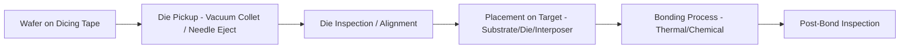
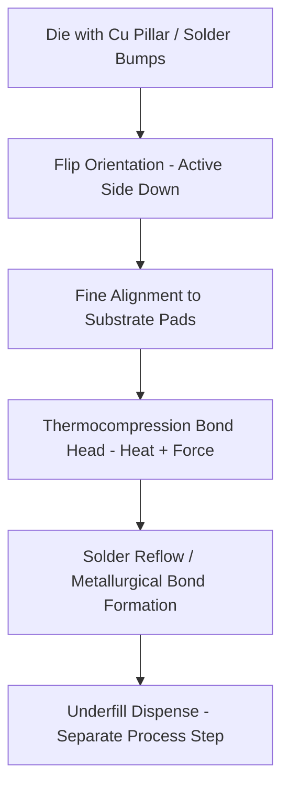
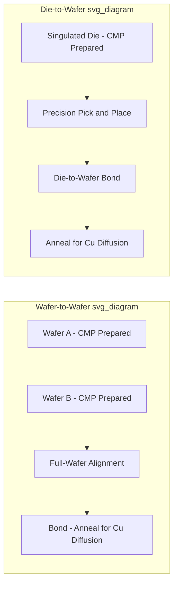

## Pick-and-Place and Die-Bonding Equipment

### Overview

**Key Points**

- Pick-and-place and die-bonding equipment perform the physical assembly step of transferring singulated die from a wafer/carrier and precisely attaching them to a substrate, interposer, leadframe, or another die (for stacking)
- Core equipment categories: die bonders (thermocompression, eutectic, epoxy/adhesive), flip-chip bonders, and hybrid bonders (for direct Cu-Cu bonding without solder)
- Key performance metrics: placement accuracy (often sub-micron for advanced hybrid bonding, single-digit micron for standard flip-chip), throughput (units per hour, UPH), and bond strength/reliability
- Major equipment vendors: ASMPT, Besi (BE Semiconductor Industries), Kulicke & Soffa (K&S), Shinkawa, and EV Group/SUSS MicroTec for wafer-level bonding applications

### Die Attach Fundamentals

**Key Points**

- The core sequence: die pickup (from wafer on dicing tape or a die carrier) → alignment (to target substrate/die location) → placement → bonding (mechanical/thermal/chemical process forming the permanent attach)
- **Die pickup mechanisms**: vacuum collet (common for standard die sizes), needle ejection assist (pushing die up from below the dicing tape to aid separation), and increasingly laser-assisted release for thin/fragile die
- Bond type selection depends on application: wire-bond packages typically use simple epoxy/adhesive die attach (electrical connection made separately via wire bonding), while flip-chip and advanced packages require the bonding process itself to form the electrical interconnect

### Die Bonder Types by Bonding Mechanism

#### Adhesive/Epoxy Die Attach

**Key Points**

- Die attached using conductive or non-conductive epoxy adhesive, cured via heat (oven or in-situ heated bond head)
- Simplest and most widely used method for standard wire-bond packages where the die attach itself doesn't need to form the electrical path
- Throughput-oriented equipment, generally the highest UPH category among die bonders given the relatively simple process requirements

#### Eutectic Die Attach

**Key Points**

- Uses a eutectic alloy (commonly gold-silicon, Au-Si) melted at the bond interface to form a metallurgical bond, offering better thermal conductivity and hermeticity than epoxy attach
- Used in applications requiring higher reliability or thermal performance than epoxy can provide, such as certain RF, optoelectronic, or high-reliability/aerospace-grade packages
- Requires precise temperature control at the bond head to reach the eutectic melting point (e.g., Au-Si eutectic at approximately 363°C) without damaging the die or substrate

#### Flip-Chip (Thermocompression) Bonding

**Key Points**

- Die is placed face-down (active side toward substrate) with solder bumps or copper pillars aligned to substrate pads, then bonded via applied heat and pressure (thermocompression) to reflow/form the electrical and mechanical joint
- Requires significantly tighter placement accuracy than adhesive die attach, since bump-to-pad alignment directly determines electrical yield — misalignment beyond bump pad tolerance causes opens or shorts
- **Thermocompression bonding (TCB)** equipment applies controlled heat and force through the bond head, often with a defined time-temperature-pressure profile per bond, distinguishing it from simple mass-reflow (where many bonds reflow simultaneously in an oven) — TCB offers finer process control suited to fine-pitch, high-density interconnect

### Hybrid Bonding Equipment

**Key Points**

- Hybrid bonding forms direct copper-to-copper (and surrounding dielectric-to-dielectric) bonds without solder, enabling the finest interconnect pitches (sub-10 µm, trending toward sub-2 µm in leading-edge applications) required for advanced 3D-IC stacking
- Process requires exceptionally high placement accuracy (sub-micron alignment) and extremely clean, flat, low-roughness bonding surfaces prepared via chemical-mechanical polishing (CMP) before bonding
- Two primary configurations: **die-to-wafer (D2W)** hybrid bonding, where singulated die are bonded onto a wafer (used when combining die of different sizes or from different source wafers), and **wafer-to-wafer (W2W)** hybrid bonding, where entire wafers are aligned and bonded before singulation (higher throughput, but requires matched wafer sizes and compatible die-per-wafer counts)
- Key equipment vendors for hybrid bonding: EV Group (EVG) and SUSS MicroTec are prominent for wafer-level (W2W) bonding systems; die-to-wafer hybrid bonding equipment is offered by vendors including ASMPT, Besi, and others with dedicated hybrid bonding platforms

[Unverified] Specific alignment accuracy specifications and throughput figures for current-generation hybrid bonding equipment are rapidly evolving and vendor/model-specific; current vendor datasheets should be consulted for precise specifications relevant to a given process node or application.

### Placement Accuracy Requirements Across Bonding Types

**Key Points**

- Placement accuracy requirements scale with interconnect pitch, roughly following this hierarchy from least to most stringent:
  - Wire-bond die attach (epoxy/eutectic): coarsest requirement, since electrical connection is made separately via wire bonding, not through placement alignment itself
  - Flip-chip solder bump (moderate pitch, e.g., ~100-150 µm class): moderate placement accuracy required, with solder self-alignment during reflow providing some tolerance for placement error
  - Fine-pitch copper pillar flip-chip: tighter placement accuracy required, with reduced self-alignment margin as pitch shrinks
  - Hybrid bonding (Cu-Cu direct bond): tightest requirement, sub-micron accuracy needed since there is no solder reflow self-alignment mechanism to compensate for placement error

[Inference] The general trend of decreasing tolerance for placement error as pitch shrinks and self-alignment mechanisms (like solder reflow) are removed is a well-established engineering principle; specific numerical accuracy figures for each bonding type vary by equipment generation and should be verified against current equipment specifications rather than treated as fixed values.

### Throughput and Productivity Considerations

**Key Points**

- **Units per hour (UPH)** is the standard throughput metric, but meaningful comparison requires accounting for die size, bond complexity, and required accuracy — a high-UPH epoxy die bonder handling standard-size die is not directly comparable to a lower-UPH hybrid bonder handling sub-micron-accuracy fine-pitch bonds
- Throughput trade-off is fundamental: higher placement accuracy generally requires more time per bond cycle (finer alignment measurement, more controlled bond head motion), creating an inherent tension between accuracy and UPH that equipment vendors continuously work to improve through faster vision/alignment systems and optimized bond head mechanics
- **Multi-head and parallel processing architectures** are common equipment design approaches to improve effective system throughput without proportionally sacrificing per-bond accuracy, allowing multiple die to be processed concurrently on a single platform

### Vision and Alignment Systems

**Key Points**

- Precision alignment relies on machine vision systems that image fiducial marks (or the bond pads/pillars themselves) on both the die and target substrate, computing the required X-Y-θ (rotation) correction before bond head placement
- Advanced systems may use **split-field or dual-camera** vision architectures to simultaneously image both the die (typically held by the bond head, viewed from below or via a beam-splitter arrangement) and the target substrate, enabling accurate relative alignment measurement immediately before placement
- For hybrid bonding's sub-micron accuracy requirements, vision/metrology systems require correspondingly higher resolution and stability, often combined with closed-loop feedback during the placement motion itself rather than a single open-loop alignment measurement

### Warpage and Coplanarity Challenges

**Key Points**

- Die and substrate warpage (addressed via FEA simulation in the earlier thermal-mechanical topic) directly impacts bonding equipment performance: warped surfaces reduce effective bond contact area or create localized gaps, particularly problematic for hybrid bonding where surface flatness is critical to achieving void-free bonds
- Bond head design increasingly incorporates **compliant or force-controlled** placement mechanisms to accommodate minor warpage/coplanarity variation while maintaining adequate bond force across the full die/bond area
- Pre-bond warpage measurement (often integrated as an in-line metrology step) can inform process adjustments or flag out-of-specification material before committing to a bond that may fail or produce marginal reliability

### Underfill and Post-Bond Processing

**Key Points**

- For flip-chip solder bonds, **underfill dispense** (a separate process step, typically capillary-flow underfill dispensed at the die edge and drawn under the die via capillary action, or pre-applied "no-flow" underfill in some processes) fills the gap between die and substrate to mechanically reinforce solder joints against thermal cycling fatigue
- Hybrid bonding, by contrast, does not require underfill since the direct Cu-Cu and dielectric-dielectric bond provides both electrical and mechanical connection without a solder gap — this is frequently cited as both a reliability advantage (no solder fatigue mechanism) and a process simplification (eliminating the underfill dispense/cure step)
- Post-bond thermal annealing is required for hybrid bonding to complete copper diffusion bonding at the interface, distinct from (and generally at different temperature/time profiles than) solder reflow thermal processing

### Example: Equipment Selection Considerations for a 2.5D Package Assembly

**Example**

A representative equipment selection scenario for assembling die onto a silicon interposer in a 2.5D package:

1. **If using microbump (solder) interconnect**: select a thermocompression flip-chip bonder capable of the required placement accuracy for the microbump pitch (commonly tens of micrometers pitch class), followed by a separate reflow/underfill process
2. **If using hybrid bonding interconnect**: select a die-to-wafer hybrid bonding system (given typical mixed die sizes in heterogeneous integration) capable of sub-micron placement accuracy, with upstream CMP surface preparation and downstream anneal process integration
3. Throughput requirement (production volume) informs whether a single high-accuracy/lower-UPH system suffices or whether multiple parallel systems/multi-head architectures are needed to meet target production rate
4. Equipment vendor selection often also considers existing fab infrastructure compatibility, service/support relationship, and qualified process recipe availability for the specific interconnect pitch/material system

### Common Equipment and Process Pitfalls

**Key Points**

- **Insufficient vision system calibration/stability**: drift in alignment camera calibration over time can silently degrade placement accuracy without an obvious equipment fault indication, requiring disciplined periodic calibration verification
- **Warpage exceeding equipment compliance range**: die or substrate warpage beyond what the bond head's force/compliance mechanism can accommodate leads to void formation or incomplete bonding, particularly critical for hybrid bonding
- **Throughput/accuracy mismatch for application**: selecting equipment optimized for high-UPH standard die attach when the application actually requires fine-pitch flip-chip or hybrid bonding accuracy (or vice versa, over-specifying accuracy for a coarse-pitch application) leads to either yield issues or unnecessary capital/cycle-time cost
- **Inadequate surface preparation for hybrid bonding**: CMP surface quality (roughness, particle contamination) directly determines hybrid bond yield; equipment capability alone cannot compensate for inadequately prepared bonding surfaces

### Conclusion

Pick-and-place and die-bonding equipment span a spectrum from simple, high-throughput epoxy die attach for wire-bond packages to the sub-micron-accuracy hybrid bonding systems required for leading-edge 3D-IC stacking. Equipment selection is driven primarily by the interconnect type and required placement accuracy, with an inherent throughput-accuracy trade-off that major vendors (ASMPT, Besi, K&S, Shinkawa, EVG, SUSS MicroTec) address through advances in vision/alignment system precision, bond head force control, and parallel processing architectures. As advanced packaging trends toward finer interconnect pitch and hybrid bonding adoption, equipment capability in sub-micron alignment accuracy and surface preparation integration (CMP compatibility) has become an increasingly central differentiator among assembly equipment platforms.

**Related Topics**

- Wafer-level CMP surface preparation for hybrid bonding
- Underfill material selection and capillary flow dispense process optimization
- Machine vision and metrology systems for sub-micron placement accuracy
- Wafer-to-wafer vs. die-to-wafer hybrid bonding throughput and flexibility trade-offs
- Known-good-die (KGD) testing integration with die bonding equipment flow
- Thermocompression bonding process window optimization (time-temperature-pressure)
- In-line warpage and coplanarity metrology for bonding process control