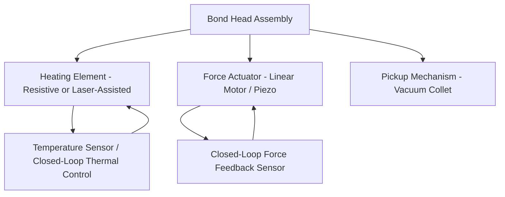
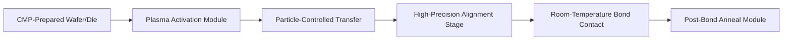
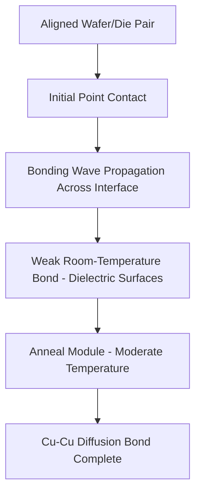
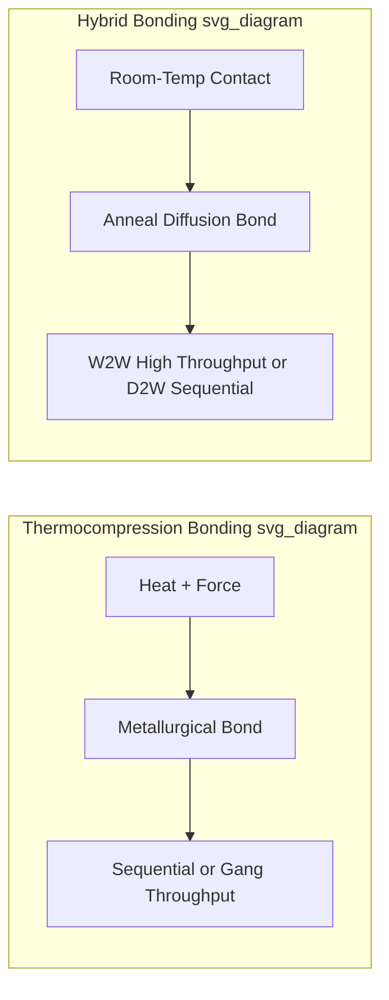

## Thermocompression and Hybrid Bonding Tool Architectures

### Overview

**Key Points**

- This topic examines the internal tool architecture — bond head design, force/thermal control systems, alignment stages, and process chambers — underlying thermocompression bonding (TCB) and hybrid bonding equipment, extending beyond the equipment category overview to the engineering subsystems that enable their performance
- TCB architectures center on precise, localized heat-and-force application per bond site; hybrid bonding architectures center on ultra-high-precision mechanical alignment combined with surface-activation and low-temperature anneal capability
- Core subsystems common to both: bond head (force/thermal actuator), alignment/vision stage, wafer/die chuck, and environmental control (atmosphere, particle control)
- Leading tool architecture examples come from ASMPT (TCB and hybrid bonding platforms), Besi, Kulicke & Soffa, and EV Group/SUSS MicroTec (primarily wafer-level hybrid bonding)

### Thermocompression Bonding (TCB) Tool Architecture

#### Bond Head Design

**Key Points**

- The TCB bond head integrates a heating element (resistive heater or, in advanced designs, laser-assisted localized heating), a force actuator (precision linear motor or piezo-driven actuator for fine force control), and a pickup/placement mechanism (vacuum collet or gripper)
- **Localized heating** is a key architectural distinction from oven-based mass reflow: the bond head heats only the specific die/bond site being processed, minimizing thermal exposure to adjacent already-bonded die and reducing overall thermal budget impact on the assembly
- Force control precision directly determines bond quality consistency — modern TCB bond heads implement **closed-loop force feedback**, continuously adjusting applied force during the bond cycle to maintain a target force profile despite variations in bump height, warpage, or thermal expansion during heating

#### Time-Temperature-Pressure Profile Control

**Key Points**

- TCB tool architecture must precisely execute a defined process recipe across time: typically a ramp to bonding temperature, hold at temperature under applied force (allowing solder reflow or copper pillar deformation/diffusion), then controlled cooldown before bond head release
- Recipe parameters (peak temperature, force magnitude, dwell time, ramp rates) are tuned per interconnect type (solder-capped copper pillar vs. pure copper-to-copper thermocompression) and are typically stored as programmable process recipes within the tool's control software
- **Gang bonding vs. sequential (single-die) bonding** represents an architectural throughput trade-off: sequential TCB processes one die at a time with maximum per-bond control, while gang bonding architectures (bonding multiple die simultaneously under a shared or multi-zone bond head) improve throughput at the cost of reduced per-die process control granularity

**Example**

A representative TCB process profile for copper pillar interconnect (illustrative, not a specific vendor recipe):

1. Bond head picks up die, moves to alignment position above target substrate
2. Vision system measures and corrects X-Y-θ alignment to sub-micron/low-micron tolerance depending on pitch requirement
3. Bond head descends, applies initial contact force
4. Temperature ramps to target bonding temperature while force is maintained or incrementally increased per recipe
5. Dwell period at peak temperature/force allows solder reflow (if solder-capped) or metallurgical bond formation
6. Controlled cooldown ramp while maintaining force until solder solidification/bond stabilization
7. Bond head releases and retracts, moving to next die pickup position

[Unverified] Specific time-temperature-pressure values are process- and material-specific (varying by solder alloy, copper pillar dimensions, and target reliability specification); actual values should be sourced from qualified process recipes for the specific application.

### Hybrid Bonding Tool Architecture

#### Surface Preparation Integration

**Key Points**

- Hybrid bonding tool architecture must interface tightly with upstream CMP (chemical-mechanical polishing) surface preparation, since bond quality depends critically on surface flatness (sub-nanometer scale roughness targets) and cleanliness achieved before the die/wafer reaches the bonding tool
- Some architectures integrate **plasma activation** modules directly into the bonding tool cluster — a plasma treatment step immediately before bonding modifies the dielectric surface to promote stronger room-temperature bonding, requiring the tool architecture to manage wafer/die transfer between plasma activation and bonding chambers while maintaining surface cleanliness
- Particle control is architecturally critical: any particle at the bond interface can prevent local bond formation or create a void, driving cleanroom-class environmental control requirements within the tool's process chambers beyond what TCB architectures typically require

#### High-Precision Alignment Stage

**Key Points**

- Hybrid bonding's sub-micron (and for leading-edge applications, sub-100nm class) alignment requirement drives a fundamentally more precise alignment stage architecture than TCB tools: high-resolution interferometric or advanced optical metrology, ultra-stable mechanical stages (often air-bearing or similar low-friction, high-precision motion systems), and vibration isolation to prevent alignment drift during the bond cycle
- **Wafer-to-wafer (W2W) architectures** (e.g., EV Group's wafer bonding platforms) typically use a bond chamber where two full wafers are aligned face-to-face using through-wafer infrared alignment or edge-alignment techniques, then brought into contact under controlled, uniform pressure across the full wafer area
- **Die-to-wafer (D2W) architectures** require the alignment stage to handle individual die pickup and placement with wafer-level-bonding-class precision, a more demanding combination than either standard die pick-and-place (lower precision) or W2W bonding (no individual die handling) alone — representing a distinct architectural challenge addressed by specialized D2W hybrid bonding platforms from vendors including ASMPT and Besi

[Unverified] Specific alignment technology implementation (interferometric vs. other high-precision optical metrology approaches) varies by vendor and tool generation; current vendor technical documentation should be consulted for architecture specifics of a particular platform.

#### Bond Contact and Initiation

**Key Points**

- Unlike TCB's heat-driven bond formation, hybrid bonding typically initiates via **room-temperature direct contact** bonding: properly prepared and aligned surfaces spontaneously form a weak initial bond (often via van der Waals forces or similar surface interaction) upon contact, before subsequent annealing strengthens the bond
- Bond initiation architecture often uses a controlled, progressive contact approach (e.g., starting contact at a central point and allowing a bonding wave to propagate outward across the wafer/die) rather than simultaneous full-area contact, intended to expel air/particles from the interface and achieve more uniform, void-free bonding
- Post-contact, the assembly proceeds to a **separate anneal module** (often at moderate temperatures well below solder reflow temperatures) where copper diffusion across the Cu-Cu interface completes the electrical bond, architecturally separating the mechanical bond formation step from the electrical bond completion step

### Comparative Architecture Summary

**Key Points**

- **Bonding mechanism**: TCB relies on heat-and-force-driven metallurgical bond formation (solder reflow or thermocompression diffusion); hybrid bonding relies on room-temperature surface contact followed by lower-temperature anneal-driven diffusion
- **Alignment precision**: hybrid bonding architectures require substantially tighter alignment precision than TCB, driving fundamentally different (more precise, more vibration-sensitive) stage designs
- **Throughput architecture**: TCB architectures often emphasize sequential or gang-bonding approaches balancing per-bond control with throughput; W2W hybrid bonding can achieve high effective throughput (many die bonded simultaneously via a single wafer-level bond) while D2W hybrid bonding faces throughput architecture challenges similar to high-precision sequential placement
- **Environmental control**: hybrid bonding architectures generally require more stringent particle/contamination control given the criticality of interface cleanliness to bond formation, compared to TCB's relatively more tolerant (though still controlled) process environment

### Multi-Zone and Modular Tool Cluster Architectures

**Key Points**

- Production-scale bonding tools are frequently architected as **modular clusters**: separate chambers/modules for surface preparation (plasma activation), alignment/bonding, and anneal, connected via automated wafer/die handling robotics under a shared vacuum or controlled-atmosphere environment
- This modular architecture allows parallel processing across modules (e.g., one wafer being aligned while another anneals), improving overall system throughput beyond what a single monolithic bond chamber could achieve
- Tool architecture must carefully manage hand-off between modules to avoid reintroducing particle contamination or surface degradation between the (often vacuum or inert-atmosphere) plasma activation step and the bonding step, an integration challenge distinct from the individual module technologies themselves

### Force and Thermal Uniformity Across Large-Area Bonds

**Key Points**

- For W2W hybrid bonding and gang TCB architectures processing larger bond areas simultaneously, achieving **uniform force and temperature distribution** across the full area is an architectural challenge distinct from single-die sequential bonding, where uniformity across a small bond area is comparatively easier to achieve
- Non-uniform force/temperature distribution across a full wafer bond can result in edge-to-center bond quality variation, driving tool architectures toward multi-zone heating elements and carefully engineered pressure distribution mechanisms (e.g., compliant bond chuck designs) to equalize conditions across the full bonding area
- [Inference] This uniformity challenge is likely a significant driver of continued architectural refinement in W2W hybrid bonding tools as wafer sizes and required alignment precision both increase, though specific engineering solutions are vendor-proprietary and evolve across tool generations.

### Metrology and In-Situ Process Monitoring

**Key Points**

- Advanced tool architectures increasingly integrate in-situ metrology: real-time alignment verification immediately before/during bond contact, force/temperature sensor feedback throughout the bond cycle, and post-bond inspection (optical or acoustic) integrated into the tool cluster rather than requiring a separate offline inspection step
- This in-situ monitoring supports both real-time process control (adjusting subsequent bond cycles based on immediate feedback) and statistical process control (SPC) data collection for ongoing yield/quality management across production volume
- Acoustic microscopy (scanning acoustic microscopy, SAM) is commonly used for post-bond void/delamination inspection, sometimes integrated as an in-line module within advanced bonding tool clusters rather than purely offline

### Common Architectural Trade-offs and Pitfalls

**Key Points**

- **Precision vs. throughput trade-off**: architectures optimized for maximum alignment precision (fine-pitch hybrid bonding) inherently sacrifice some throughput relative to coarser-pitch TCB architectures; tool selection must match the actual precision requirement of the target application rather than defaulting to maximum precision unnecessarily
- **Module hand-off contamination risk**: modular cluster architectures with multiple process chambers introduce hand-off points where contamination or environmental exposure (e.g., between plasma activation and bonding) can degrade bond quality if not carefully engineered
- **Thermal budget management in TCB**: sequential single-die TCB inherently exposes each die to a full thermal cycle; architecture and recipe design must account for cumulative thermal exposure across multiple bonding steps in a multi-die stack to avoid exceeding thermal budget limits for previously-bonded die or temperature-sensitive materials
- **Vibration isolation adequacy**: hybrid bonding's sub-micron alignment tolerance makes tool architecture highly sensitive to facility-level vibration; inadequate vibration isolation in the tool's mechanical design or installation environment can silently degrade achievable alignment accuracy

### Conclusion

Thermocompression and hybrid bonding tool architectures represent distinct engineering approaches suited to their respective bonding mechanisms: TCB architectures center on precise localized heat-and-force control through an actively-controlled bond head executing defined time-temperature-pressure profiles, while hybrid bonding architectures center on ultra-high-precision alignment stages, integrated surface preparation (plasma activation), and room-temperature bond initiation followed by separate anneal-driven diffusion bonding. Both architecture families face a fundamental precision-throughput trade-off, addressed through techniques like gang bonding (TCB) and wafer-scale simultaneous bonding (hybrid bonding W2W), while increasingly incorporating in-situ metrology and modular cluster designs to support production-scale volume with the stringent quality requirements advanced packaging interconnects demand.

**Related Topics**

- CMP process integration and surface preparation requirements for hybrid bonding
- Plasma activation chemistry and its effect on room-temperature bond strength
- Scanning acoustic microscopy (SAM) for post-bond void and delamination inspection
- Multi-zone thermal and force uniformity engineering for wafer-scale bonding
- Gang bonding vs. sequential bonding throughput and process control trade-offs
- Vibration isolation and facility requirements for sub-micron precision equipment
- Copper diffusion bonding kinetics and anneal process optimization