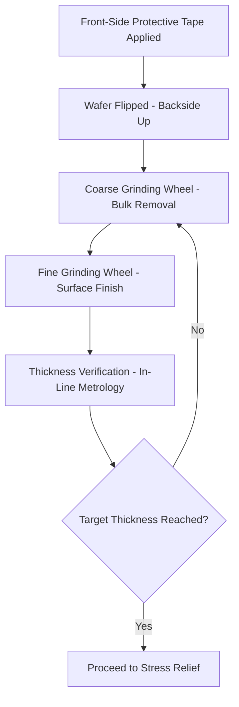
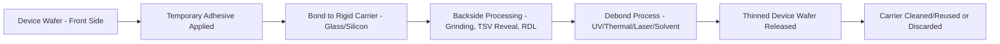

## Wafer Thinning, Grinding, and Handling Systems

### Overview

**Key Points**

- Wafer thinning reduces wafer thickness from as-fabricated levels (typically 700-775 µm for standard 300mm wafers) down to target thicknesses required for advanced packaging — ranging from tens of micrometers for 3D-IC stacking down to single-digit micrometers in extreme cases for TSV reveal processes
- Core process sequence: backgrinding (coarse mechanical material removal), fine grinding/polishing (surface finish refinement), and stress relief (removing subsurface damage from grinding)
- Ultra-thin wafer handling requires specialized **temporary bonding/debonding** systems and carrier substrates to manage extremely fragile thinned wafers through subsequent process steps
- Key equipment vendors: DISCO Corporation (grinding equipment market leader), EV Group and SUSS MicroTec (temporary bonding/debonding), Applied Materials and others for stress relief/CMP-adjacent processes

### Why Wafer Thinning Is Necessary

Standard wafer thickness (several hundred micrometers) provides mechanical rigidity for handling during front-end fabrication but is far thicker than needed — or desirable — for advanced packaging applications:

- **TSV formation**: through-silicon vias must span the full wafer thickness; thinner wafers enable shorter, lower-aspect-ratio TSVs with reduced parasitic resistance/capacitance and simpler etch/fill processes
- **3D stacking density**: package Z-height budgets for multi-die stacks require each die layer to be as thin as possible while maintaining adequate mechanical integrity
- **Thermal resistance**: thinner die reduce the thermal path length between the active device layer and heat removal structures (heat spreader, package exterior), improving thermal performance

### Backgrinding Process and Equipment

**Key Points**

- Backgrinding uses a rotating grinding wheel embedded with abrasive particles (commonly diamond) in contact with the wafer backside while the wafer rotates on a vacuum chuck, mechanically removing material through abrasive action
- **Multi-stage grinding** is standard practice: a coarse grinding wheel (larger abrasive grit) removes bulk material quickly, followed by a fine grinding wheel (smaller grit) for surface finish improvement — balancing throughput (coarse stage) against surface quality (fine stage)
- Wafer front side (containing the completed device structures) is protected during backgrinding via a **temporary protective film or tape** applied before the wafer is flipped for backside processing, preventing damage to active circuitry and providing a stable surface for the grinding chuck

### Grinding-Induced Subsurface Damage and Stress Relief

**Key Points**

- Mechanical grinding inherently introduces **subsurface damage**: microcracks and crystal lattice disruption extending some depth below the ground surface, which can act as fracture initiation sites, significantly weakening wafer mechanical strength if left untreated
- **Stress relief processes** remove or mitigate this damage layer, commonly via: dry polishing (a lighter mechanical finishing step using finer abrasives than the fine grinding stage), wet chemical etching (removing a thin damaged layer via controlled chemical etch), or chemical-mechanical polishing (CMP) for the highest-quality surface finish requirements
- The choice of stress relief method involves a trade-off between throughput/cost (dry polishing generally faster/cheaper) and resulting wafer strength/surface quality (wet etch or CMP generally providing superior damage removal at higher process cost/complexity)

[Inference] The specific stress relief method selected depends on the target application's mechanical reliability requirements and cost sensitivity; applications requiring extreme thinning (very high mechanical fragility) generally warrant more thorough damage removal methods, though specific process selection criteria are application- and vendor-specific.

### Temporary Bonding and Debonding Systems

**Key Points**

- Below a certain thickness threshold (device- and application-dependent, but commonly cited in the range where wafers become too fragile for standard automated handling — often well under 100 µm), wafers require **temporary bonding to a rigid carrier** (typically glass or silicon) before proceeding through backgrinding and subsequent process steps
- Temporary bonding uses an adhesive layer (various chemistries: UV-release, thermal-release, laser-release, or solvent-release adhesives) applied between the device wafer and carrier, providing mechanical support through thinning and downstream processing
- **Debonding** at the appropriate process stage releases the thinned wafer from its carrier using a mechanism matched to the adhesive chemistry (UV light exposure, controlled heating, laser irradiation, or solvent dissolution), requiring careful process control to avoid damaging the now-fragile thinned wafer during release

**Example**

A representative temporary bond/debond flow for TSV reveal processing:

1. Device wafer with completed front-side interconnect and buried TSVs (not yet exposed on the backside) bonded face-down to a glass carrier using a UV-release adhesive
2. Backside grinding thins the wafer down toward the buried TSV tips, followed by fine grinding and stress relief
3. Additional backside processing (TSV reveal etch, backside RDL if required) proceeds with the wafer mechanically supported by the carrier
4. UV light exposure through the (typically transparent) glass carrier releases the adhesive, allowing the thinned wafer to be separated from the carrier
5. Residual adhesive cleaned from the wafer surface before proceeding to subsequent packaging steps

[Unverified] Specific adhesive chemistry selection and exact process parameters are proprietary to specific process flows and material suppliers; the sequence above represents a generalized/illustrative flow structure rather than a specific qualified process.

### Carrier Wafer Considerations

**Key Points**

- Carrier material selection depends on the debonding mechanism and downstream process requirements: glass carriers are commonly used with UV-release adhesives (given glass's UV transparency) and also provide the option for optical alignment/inspection through the carrier during processing; silicon carriers may be preferred for closer thermal expansion matching to the device wafer during high-temperature backside processing steps
- **Carrier reusability** is an economic consideration — some carrier/adhesive systems support cleaning and reuse across multiple production lots, while others may be single-use, affecting overall process cost structure
- Carrier flatness and thickness uniformity directly impact the achievable thinning uniformity of the device wafer, since grinding equipment references the exposed (device wafer backside) surface relative to the chuck, and any carrier-side non-uniformity can propagate into device wafer thickness variation

### Ultra-Thin Wafer Handling Systems

**Key Points**

- Beyond the grinding/bonding equipment itself, ultra-thin wafers require specialized **handling robotics and end-effectors** throughout the fab: standard wafer handling (edge-grip or vacuum-based) designed for standard-thickness wafers can damage or break extremely thin, fragile wafers
- Common approaches include: maintaining the wafer on its carrier for handling throughout as much of the process flow as possible (minimizing standalone thin-wafer handling), specialized soft-touch or distributed-support end-effectors when standalone handling is unavoidable, and dedicated thin-wafer cassettes/carriers for storage and transport between process steps
- Automated material handling systems (AMHS) integration in production fabs must account for thin-wafer-specific handling protocols, often requiring dedicated recipes/settings distinct from standard-thickness wafer handling within the same fab's automation infrastructure

### Thickness Metrology and Process Control

**Key Points**

- In-line thickness metrology (commonly using non-contact optical or capacitive sensing methods) monitors wafer thickness throughout the grinding process, enabling real-time or near-real-time process control to hit target thickness with tight tolerance
- **Thickness uniformity across the wafer** (not just average thickness) is a critical quality metric, since non-uniform thinning can create downstream issues in subsequent bonding or TSV reveal steps where a uniform starting thickness is assumed
- Post-grind inspection may include additional checks for surface defects, microcracks, or particle contamination introduced during the grinding process, feeding back into grinding equipment maintenance/calibration decisions

### Integration with TSV Reveal Process

**Key Points**

- For 3D-IC applications using TSVs, backside thinning is directly coupled to **TSV reveal**: grinding removes bulk silicon down near the TSV tip depth, after which a final etch step (often a combination of mechanical and chemical/plasma processes) precisely exposes the TSV copper for subsequent backside interconnect formation
- This coupling means grinding process control must achieve sufficient precision to leave an appropriate remaining silicon thickness for the reveal etch step to complete cleanly — insufficient grinding leaves TSVs unexposed, while excessive grinding risks damaging or exposing TSVs prematurely with poor process control
- The overall thinning-to-reveal sequence represents a tightly coupled multi-step process requiring coordination between grinding equipment capability and the downstream reveal etch process window

### Common Process and Equipment Pitfalls

**Key Points**

- **Warpage induced by thinning**: removing material asymmetrically relative to existing wafer stress (from front-side films, patterned structures) can induce or exacerbate wafer warpage/bow, particularly problematic for very thin wafers where mechanical stiffness is minimal — this connects directly to the thermal-mechanical FEA and warpage topics covered earlier in the packaging flow
- **Inadequate subsurface damage removal**: insufficient stress relief processing after grinding leaves wafers mechanically weaker than intended, risking breakage during subsequent handling or thermal cycling
- **Adhesive residue and debonding process damage**: incomplete adhesive removal after debonding, or excessive force/thermal stress during the debonding process itself, can damage the now-fragile thinned wafer
- **Carrier-induced thickness non-uniformity**: carrier flatness issues propagating into device wafer thickness variation can be a subtle root cause of downstream yield issues if not properly monitored and controlled

### Conclusion

Wafer thinning, grinding, and handling systems form a foundational manufacturing capability enabling advanced packaging's thin-die and TSV-based interconnect requirements, spanning coarse-to-fine mechanical grinding, subsurface damage stress relief, and — for the thinnest applications — temporary bonding/debonding systems that provide mechanical support through fragile processing stages. Equipment from vendors like DISCO Corporation for grinding, and EV Group/SUSS MicroTec for temporary bonding, must work in close process coordination, particularly where thinning is directly coupled to TSV reveal processing. Ultra-thin wafer handling introduces distinct challenges beyond the core grinding/bonding technology itself, requiring specialized robotics, carrier management, and process control disciplines to reliably move increasingly fragile wafers through the remaining packaging flow.

**Related Topics**

- TSV reveal etch process integration and remaining-thickness process control
- Temporary bonding adhesive chemistry selection (UV, thermal, laser, solvent release)
- Wafer warpage management for thin-wafer handling and downstream bonding
- Backside RDL processing on thinned/carrier-supported wafers
- Ultra-thin wafer AMHS integration and handling robotics design
- CMP vs. dry polish vs. wet etch trade-offs for grinding stress relief
- In-line thickness and defect metrology for grinding process control