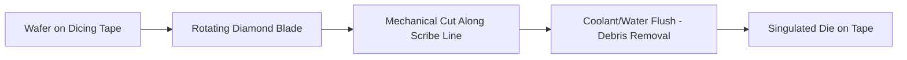
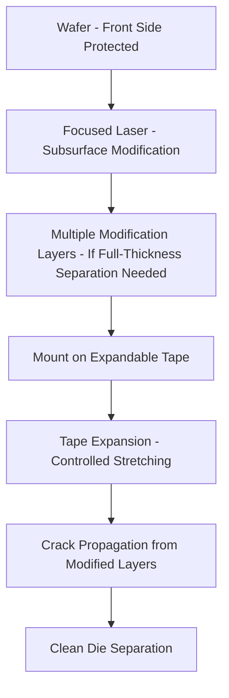
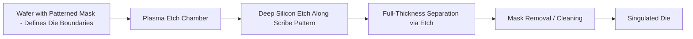
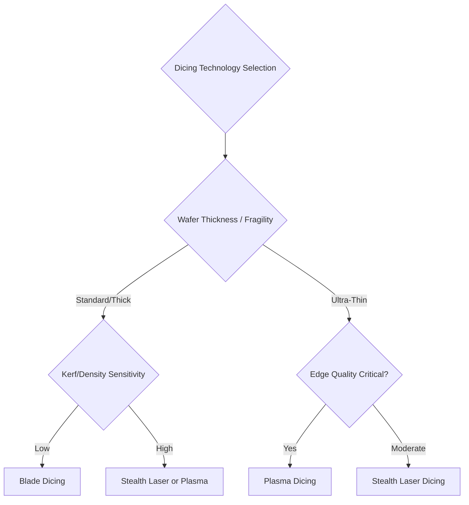

## Dicing Technologies: Blade, Stealth Laser, and Plasma Dicing

### Overview

**Key Points**

- Dicing singulates individual die from a processed wafer, a step with significant implications for die edge quality, mechanical strength, and — for advanced packaging with thin wafers and fine-pitch structures — yield and reliability
- Three primary technology families: **blade dicing** (mechanical sawing, the most established/widespread method), **stealth laser dicing** (subsurface laser modification followed by mechanical expansion), and **plasma dicing** (dry etch-based singulation)
- Technology selection driven by: wafer thickness, die size, kerf width requirements, edge quality/chipping sensitivity, and throughput needs
- Key equipment vendors: DISCO Corporation (dominant across blade and stealth laser dicing), Panasonic and other plasma dicing equipment suppliers, ADT (Advanced Dicing Technologies) for blade dicing

### Blade Dicing

**Key Points**

- Uses a rotating diamond-embedded blade to mechanically saw through the wafer along scribe lines, typically while the wafer is mounted on dicing tape for support and debris collection
- The most widely established and lowest-cost-per-cut dicing method, with decades of production history and broad process familiarity across the industry
- **Kerf width** (the material removed/width of the cut) is determined by blade thickness, typically in the tens-of-micrometers range — this kerf represents unusable area between die, directly impacting die-per-wafer yield for a given die size

#### Blade Dicing Limitations for Advanced Packaging

**Key Points**

- **Mechanical chipping and cracking**: the sawing action inherently induces some edge chipping and subsurface microcracking at the cut edge, which can propagate and cause die strength degradation — a growing concern as die become thinner and more fragile in advanced packaging applications
- **Kerf width constraints on die density**: as die shrink and die-to-die spacing on wafer becomes more precious (especially relevant for chiplet-style designs with many small die per wafer), blade kerf width represents a larger proportional yield loss compared to laser or plasma methods with narrower effective kerf
- Blade dicing generally performs best on relatively thick, mechanically robust wafers and struggles increasingly with ultra-thin wafers (a common requirement in advanced 3D-IC stacking) where mechanical stress from the sawing process risks wafer breakage

### Stealth Laser Dicing

**Key Points**

- A two-step process: a focused laser beam modifies the silicon crystal structure **below the wafer surface** (creating a subsurface damage/modification layer) without cutting through to the surface, followed by mechanical **tape expansion** that propagates cracks from the modified layer to cleanly separate the die
- Because the laser modification is subsurface, this method avoids generating surface debris during the modification step itself (unlike ablative laser cutting or blade dicing), reducing contamination risk to the device surface
- **Narrower effective kerf** compared to blade dicing, since the laser-modified region can be narrower than a mechanical blade's cut width, improving die-per-wafer yield for equivalent die size

#### Stealth Dicing Process Considerations

**Key Points**

- For thicker wafers, **multiple stealth laser passes at different depths** may be required to ensure clean crack propagation through the full wafer thickness during subsequent expansion, since a single subsurface modification layer may not reliably propagate a clean fracture across a large thickness
- Laser parameters (power, focus depth, scan speed) must be carefully tuned to create sufficient subsurface modification for reliable crack propagation without excessive modification that could affect nearby device structures or create uncontrolled cracking
- Well suited to thin wafers where mechanical blade sawing becomes increasingly problematic, and to applications sensitive to debris contamination since the subsurface process avoids the particle generation associated with blade sawing or ablative cutting

[Inference] The specific number of modification passes and laser parameter selection depend on wafer thickness, material properties, and target die strength requirements; these are process-specific engineering decisions rather than fixed universal parameters.

### Plasma Dicing

**Key Points**

- Uses a dry plasma etch process (similar in underlying technology to deep reactive ion etching used elsewhere in semiconductor processing) to singulate die by etching through the wafer along defined scribe line patterns, rather than mechanical or laser-based material removal
- **No mechanical stress induced** during the singulation process itself, since etching is a chemical/physical vapor-phase process rather than a mechanical cutting action — this is a significant advantage for very thin, fragile wafers or die with sensitive edge structures
- Enables **arbitrary die shape singulation** (not limited to straight-line cuts as with blade or standard stealth laser dicing), since the etch pattern is defined lithographically rather than constrained by a mechanical blade path or linear laser scan

#### Plasma Dicing Process Requirements and Trade-offs

**Key Points**

- Requires a **lithographically defined mask** protecting the die area during etch, adding process steps (mask application, patterning, and post-etch mask removal) compared to blade or stealth laser dicing's more direct mechanical/optical approach
- **Narrowest achievable kerf** among the three methods, since plasma etch can achieve very fine feature definition — offering the best die-per-wafer yield for die-density-critical applications, particularly relevant for small chiplets in heterogeneous integration
- Throughput and cost considerations differ substantially from blade/laser methods: plasma dicing processes an entire wafer's singulation pattern via batch etch rather than sequential blade/laser traversal, potentially offering throughput advantages for high die-count wafers, but with the added mask process overhead and different equipment capital cost structure

[Unverified] Comparative throughput and cost-per-wafer figures between plasma dicing and blade/stealth laser methods are highly dependent on specific wafer characteristics (die count, size) and current equipment generation; general directional trade-offs are described above, but specific figures should be sourced from current vendor data for a given application.

### Comparative Technology Selection Framework

**Key Points**

- **Edge quality/die strength priority**: applications requiring maximum die strength (thin die, stacking applications sensitive to edge-crack-initiated failure) favor stealth laser or plasma dicing over blade dicing's inherent mechanical chipping
- **Die shape/pattern flexibility**: applications requiring non-rectangular die shapes or highly irregular scribe patterns favor plasma dicing's lithographically-defined etch pattern flexibility
- **Kerf/die-density sensitivity**: applications with very small die (chiplets) where kerf represents a significant proportion of die pitch favor narrower-kerf methods (stealth laser, and especially plasma dicing)
- **Cost/process maturity**: applications without stringent thin-wafer or fine-kerf requirements may still favor blade dicing given its process maturity, lower capital equipment cost, and extensive industry familiarity

### Die Edge Quality and Reliability Implications

**Key Points**

- Die edge quality directly impacts **die strength** (resistance to fracture under subsequent handling, bonding, and operational thermal-mechanical stress) — a critical reliability consideration given the multiple downstream handling and bonding steps advanced packages require
- **Chipping and microcracking** from mechanical blade dicing can act as stress concentration/fracture initiation sites, potentially reducing die strength and increasing the risk of failure during subsequent thin-wafer handling, stacking, or field operation thermal cycling
- Plasma dicing's etch-based mechanism generally produces the smoothest, most mechanically benign die edge among the three methods, contributing to its adoption in applications with the most stringent die strength requirements (e.g., very thin die in high-reliability 3D-IC stacks)

### Integration with Wafer Handling and Thinning Processes

**Key Points**

- Dicing technology selection interacts directly with the wafer thinning processes discussed in the prior topic — ultra-thin wafers (a common outcome of aggressive backgrinding for 3D-IC applications) are generally more compatible with stealth laser or plasma dicing than blade dicing, given the mechanical stress sensitivity of thin wafers
- Some process flows combine **temporary carrier support** (from the thinning/temporary bonding process) through the dicing step itself, since an ultra-thin wafer may require continued mechanical support even during singulation — requiring dicing equipment compatible with carrier-mounted wafer configurations
- **Dicing-before-grinding (DBG)** is an alternative process sequence used in some flows: a partial-depth cut (via blade or stealth laser) is made before backgrinding, with the final grinding step completing separation as the wafer is thinned — this sequence can reduce mechanical stress on already-thinned material compared to dicing a fully-thinned wafer

### Example: Dicing Technology Decision for a Chiplet Application

**Example**

A representative technology selection scenario for a small, thin chiplet design intended for hybrid bonding-based 3D-IC integration:

1. Given the thin wafer target thickness (required for TSV-based 3D stacking) and small die size (chiplet), blade dicing's mechanical stress and kerf width present significant yield/reliability risk
2. Stealth laser dicing is evaluated: offers narrower kerf and reduced mechanical stress compared to blade dicing, suitable if die shapes are simple/rectangular
3. Plasma dicing is evaluated as an alternative if die strength requirements are particularly stringent (given hybrid bonding's sensitivity to any pre-existing microcracking) or if non-rectangular die shapes are required for the specific chiplet floorplan
4. Final selection weighs the added plasma dicing mask process overhead against its superior edge quality and kerf width benefits, informed by the specific reliability qualification requirements for the target 3D-IC stacking application

### Common Pitfalls Across Dicing Technologies

**Key Points**

- **Underestimating edge quality impact on downstream yield**: selecting dicing technology based primarily on throughput/cost without adequately weighting die strength implications can lead to downstream yield loss during subsequent thin-wafer handling or bonding steps that only manifests later in the process flow
- **Stealth laser parameter mismatch to wafer thickness**: insufficient modification depth/passes for a given wafer thickness can result in incomplete or uncontrolled crack propagation during tape expansion, producing ragged die edges or failed separation
- **Plasma dicing mask process defects**: mask patterning defects (over/under-etch, misalignment) directly translate into die dimension or shape errors, requiring the same lithographic process control discipline as other masked semiconductor process steps
- **Inadequate coordination with thinning process sequence**: failing to consider dicing technology compatibility with the wafer thinning/temporary bonding flow (e.g., attempting standard blade dicing on an ultra-thin, carrier-mounted wafer without process adaptation) can lead to wafer breakage or handling failures

### Conclusion

Blade dicing, stealth laser dicing, and plasma dicing represent progressively more specialized singulation technologies addressing the increasing demands of advanced packaging: blade dicing remains the mature, cost-effective default for standard applications, while stealth laser dicing and especially plasma dicing address the thin-wafer, fine-kerf, and superior edge-quality requirements of advanced 3D-IC and chiplet applications. Technology selection requires weighing wafer thickness/fragility, die density/kerf sensitivity, edge quality/reliability requirements, and process cost/complexity trade-offs, with close coordination required against upstream wafer thinning and downstream bonding process requirements to ensure a coherent, reliable overall manufacturing flow.

**Related Topics**

- Dicing-before-grinding (DBG) process sequencing and stress reduction benefits
- Die strength testing and qualification methodology (e.g., three-point bend testing)
- Dicing tape selection and expansion process control for stealth laser dicing
- Plasma etch mask lithography process integration for dicing applications
- Kerf width impact on die-per-wafer yield economics for chiplet designs
- Temporary carrier compatibility across thinning, dicing, and bonding process steps
- Post-dicing cleaning and inspection methodology for edge quality verification