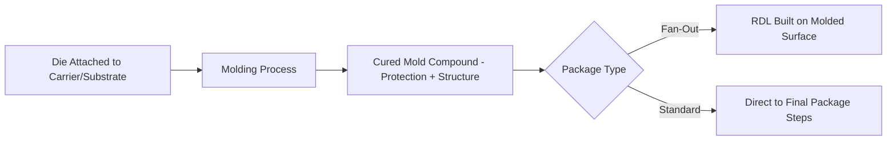
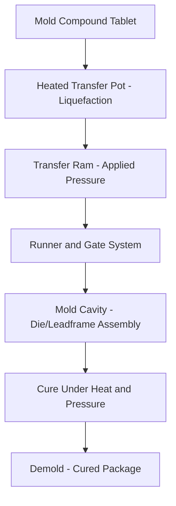
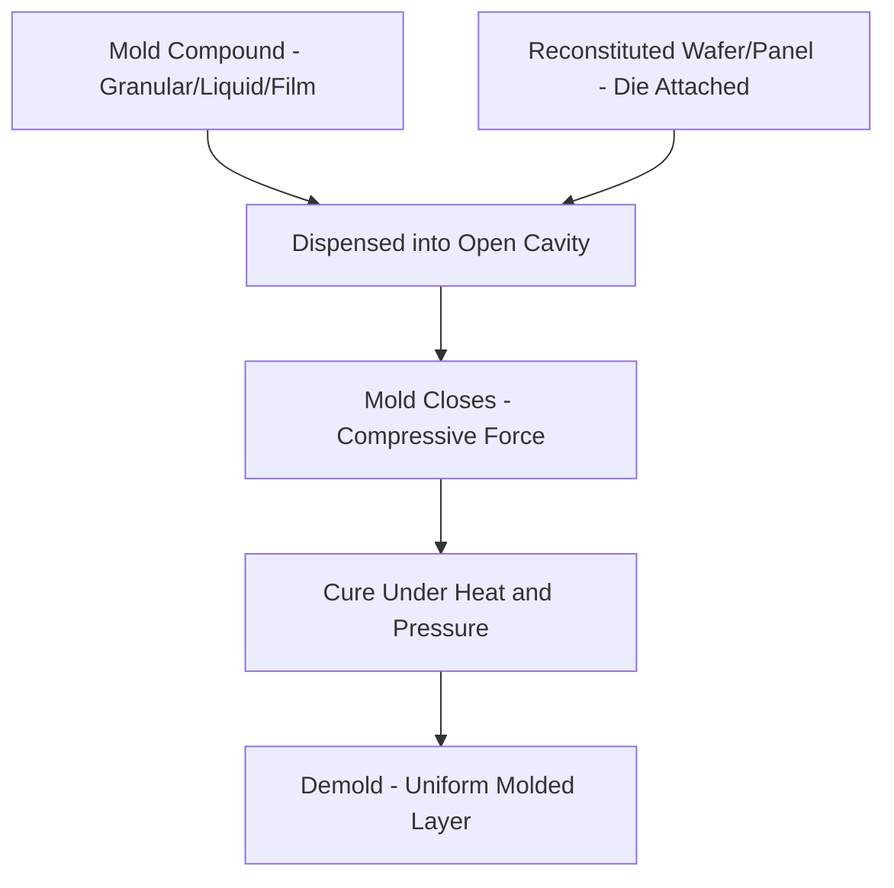
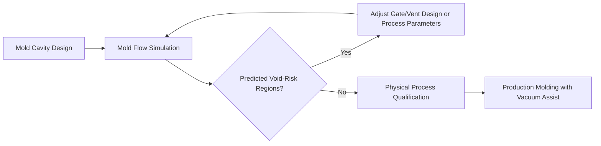

## Molding and Encapsulation Equipment

### Overview

**Key Points**

- Molding and encapsulation equipment applies protective material (typically epoxy mold compound, EMC) around die and interconnect structures, providing mechanical protection, environmental sealing, and — in fan-out packaging — the structural medium that redistribution layers are built upon
- Core molding technology families: **transfer molding** (the traditional, most established method), **compression molding** (increasingly dominant for advanced/fan-out packaging), and **liquid/film-assisted molding variants** addressing specific advanced packaging needs
- Process selection driven by: package format (leadframe-based vs. fan-out wafer/panel-level), die/warpage sensitivity, cavity/thickness uniformity requirements, and throughput needs
- Key equipment vendors: TOWA Corporation, ASMPT, Besi, and Yamada for molding systems, with equipment often qualified alongside specific mold compound material suppliers

### Why Molding and Encapsulation Matters in Advanced Packaging

Encapsulation serves several critical functions beyond simple protection:

- **Mechanical protection**: shields die, wire bonds, and interconnect from physical damage during handling, board assembly, and field operation
- **Environmental sealing**: protects against moisture ingress and contamination that could degrade device reliability over product lifetime
- **Structural function in fan-out packaging**: in fan-out wafer-level packaging (FOWLP) and panel-level packaging (FOPLP), the mold compound doesn't just protect the die — it becomes the **reconstituted carrier** upon which redistribution layers (RDL) are built, making mold compound properties and molding process quality directly relevant to RDL yield and reliability
- **Warpage control**: mold compound's mechanical and thermal properties (particularly CTE) significantly influence overall package warpage behavior, connecting directly to the thermal-mechanical FEA analysis covered earlier

### Transfer Molding

**Key Points**

- The traditional and most widely established molding method: solid mold compound (typically in tablet/pellet form) is heated to a liquid/semi-liquid state in a transfer pot, then forced through runners and gates into closed mold cavities containing the die/substrate assembly under pressure
- Well-suited to leadframe-based packages (traditional wire-bond QFN, QFP-style packages) where the mold cavity geometry is defined around a discrete leadframe unit or strip
- **Runner and gate design** significantly impacts fill quality — mold compound must flow completely around die, wire bonds, and other structures without creating voids, incomplete fill, or wire sweep (deformation of wire bonds from mold compound flow forces)

#### Transfer Molding Limitations for Advanced Packaging

**Key Points**

- Runner/gate flow-induced forces can cause **wire sweep** (wire bond deformation) or, for advanced packages with fine-pitch bumps/pillars, potential **die shift** — a significant concern where precise interconnect alignment is critical
- Less naturally suited to **wafer-level or panel-level** fan-out formats, where the "package" being molded is an entire reconstituted wafer/panel rather than discrete leadframe units, favoring compression molding's more uniform, lower-flow-force approach for these formats

### Compression Molding

**Key Points**

- Mold compound (in granular, liquid, or film form) is dispensed directly into an open mold cavity, after which the mold closes and applies compressive force to shape and cure the material — avoiding the long-distance runner/gate flow inherent to transfer molding
- **Reduced flow-induced stress** on die and interconnect structures compared to transfer molding, since material doesn't need to travel through narrow runners to reach the cavity — a significant advantage for fine-pitch, flow-sensitive advanced package structures
- Well-suited to **wafer-level and panel-level fan-out formats**, where mold compound is dispensed across an entire reconstituted wafer/panel carrier and compressed into a uniform layer — the dominant molding approach for FOWLP/FOPLP applications

#### Compression Molding Process Considerations

**Key Points**

- **Thickness uniformity** across the full wafer/panel area is a critical process quality metric, since fan-out packages typically require the molded layer to achieve consistent thickness for subsequent grinding/exposure steps (some fan-out flows grind the mold compound to expose die backside or achieve final package thickness)
- Mold compound form factor (granular pellets, liquid, or pre-formed film) affects dispense uniformity and process control — film-assisted molding, for example, can help achieve more consistent thickness and reduce certain defect types compared to granular dispense, at potentially different material cost/handling considerations
- Cavity design for compression molding must accommodate the full wafer/panel format, requiring mold tooling and clamping force capability scaled to the reconstituted carrier size (larger for panel-level formats than wafer-level formats)

### Molding-Induced Warpage

**Key Points**

- Mold compound curing involves a temperature cycle (heating for cure, subsequent cooling), during which CTE mismatch between the mold compound and adjacent materials (die, substrate, carrier) drives warpage — directly connecting to the thermal-mechanical FEA methodology discussed in the earlier simulation topic
- **Mold compound formulation** (filler content, resin chemistry) is engineered to balance CTE matching, mechanical strength, and process flowability — material selection and molding process parameters are co-optimized to manage warpage within acceptable limits for the target package format
- Process-level warpage mitigation techniques include: controlled cure temperature ramp profiles, post-mold cure (an additional, typically lower-temperature bake step after initial molding to complete cross-linking and stabilize the material), and, in some flows, active warpage compensation during subsequent process steps (e.g., adjusted grinding to compensate for known warpage patterns)

### Void and Defect Control

**Key Points**

- **Voids** (trapped air or incomplete fill) within the mold compound represent a significant defect category, potentially creating reliability risk (moisture ingress paths, stress concentration) or, if located near die/interconnect structures, direct functional/reliability failure risk
- Vacuum-assisted molding (evacuating the mold cavity before or during the molding process) is a common technique to reduce void formation, particularly relevant for compression molding of complex fan-out structures with fine interconnect features that could otherwise trap air during compound flow
- **Flow simulation** (mold flow analysis, a specialized simulation discipline distinct from but complementary to the thermal-mechanical FEA discussed earlier) is used during process/tooling development to predict fill patterns and identify potential void-prone regions before physical process qualification

### Die Shift and Warpage-Induced Placement Error

**Key Points**

- During molding, particularly in fan-out formats where die are placed on a temporary carrier before molding (rather than pre-attached to a rigid final substrate), mold compound flow and thermal stress during cure can induce **die shift** — small positional/rotational displacement of die from their originally placed location
- Die shift directly impacts subsequent RDL alignment in fan-out packaging, since RDL routing is designed based on intended die position — excessive die shift can cause RDL-to-die pad misalignment, a significant yield concern in FOWLP/FOPLP flows
- Mitigation approaches include: optimized die attach adhesive/carrier systems providing better die position stability during molding, compression molding's inherently lower flow-force profile (reducing shift-inducing forces compared to transfer molding), and **post-mold die position metrology** feeding forward into RDL lithography alignment correction (compensating for actual measured die position rather than assuming nominal placement)

[Inference] The relative contribution of molding-process-induced die shift versus die shift occurring during earlier die placement/carrier bonding steps is application- and process-specific; comprehensive die shift management typically requires attention across the full pre-mold and molding process chain rather than molding process control alone.

### Cure and Post-Mold Processing

**Key Points**

- Mold compound cure involves a defined temperature-time profile to complete the cross-linking reaction, with **post-mold cure (PMC)** — an additional bake step after demold — commonly used to complete cure and stabilize material properties before subsequent process steps
- Cure profile optimization balances complete cross-linking (ensuring full mechanical/thermal property development) against cycle time (throughput) and warpage management (aggressive cure profiles can exacerbate CTE-mismatch-driven warpage if not carefully controlled)
- For fan-out formats, subsequent processing after mold cure typically includes **backgrinding or surface exposure** (grinding the molded surface to expose die backside for thermal management, or to achieve final panel/wafer thickness), directly connecting to the wafer thinning/grinding equipment discussed in the earlier topic, now applied to a reconstituted molded structure rather than a native silicon wafer

### Equipment Architecture: Wafer/Panel-Level vs. Leadframe-Level

**Key Points**

- **Leadframe-level equipment** (predominantly transfer molding systems) processes discrete leadframe strips through sequential or multi-cavity mold tooling, with equipment architecture optimized for the specific leadframe strip format and package outline
- **Wafer-level equipment** processes 300mm (or emerging larger) reconstituted wafers, with compression molding tooling and clamping systems scaled to wafer format, and typically integrated with the broader fan-out process line (die placement, molding, grinding, RDL formation) as a coordinated equipment set
- **Panel-level equipment** processes larger rectangular panel formats (various sizes used across the industry, generally larger area than 300mm wafer-level processing), offering potential economy-of-scale benefits for die-per-panel throughput but requiring distinct tooling and material handling equipment scaled to the panel format — [Unverified] specific panel size standardization across the industry continues to evolve, and equipment/material ecosystem maturity for panel-level processing varies by format size and vendor

### Example: Molding Process Flow for a Fan-Out Wafer-Level Package

**Example**

1. Known-good die placed (via pick-and-place equipment) onto a temporary carrier in the desired reconstituted wafer layout, with adhesive providing temporary die position stability
2. Compression molding equipment dispenses mold compound (granular or liquid form) across the reconstituted wafer and applies compressive force under heat to form and cure the molded layer encapsulating all die
3. Post-mold cure bake completes cross-linking and stabilizes material properties
4. Molded wafer debonded from the temporary carrier (using the temporary bonding/debonding techniques discussed in the wafer thinning topic)
5. Backgrinding (if required by the specific process flow) achieves final panel thickness or exposes die backside
6. Die position metrology measures actual die locations (accounting for any molding-induced die shift) to inform RDL lithography alignment
7. RDL formation proceeds on the molded reconstituted wafer surface, followed by subsequent packaging steps (ball attach, singulation)

### Common Pitfalls in Molding and Encapsulation

**Key Points**

- **Void formation from inadequate vacuum/flow control**: insufficient vacuum assist or poorly designed venting can trap air, creating void defects that may not be detected until downstream inspection or reliability testing
- **Underestimating die shift impact on RDL yield**: molding process changes (compound formulation, cure profile) that inadvertently increase die shift can silently degrade fan-out RDL yield if die position metrology and RDL alignment compensation aren't tightly integrated into the process flow
- **Warpage from inadequate cure profile control**: aggressive cure profiles optimized purely for throughput without adequate warpage consideration can produce packages exceeding warpage specification, discovered only at downstream inspection or board-assembly yield testing
- **Material-process mismatch**: mold compound formulation and molding equipment/process parameters must be co-qualified — using a mold compound formulated for one process type (e.g., transfer molding) in a compression molding process without proper requalification risks unpredictable fill, cure, or warpage behavior

### Conclusion

Molding and encapsulation equipment provides the protective and, in fan-out packaging formats, structural function that enables advanced package reliability and RDL-based redistribution architectures. Transfer molding remains the established approach for traditional leadframe-based packages, while compression molding has become the dominant technology for wafer-level and panel-level fan-out formats given its lower flow-induced stress and better suitability for large-area, uniform-thickness molding. Process quality across both methods centers on managing three interconnected challenges — void formation, molding-induced warpage, and die shift — each requiring coordination between mold compound material properties, process parameter optimization, and, for advanced fan-out flows, downstream metrology and RDL alignment compensation to achieve production-viable yield.

**Related Topics**

- Mold compound material formulation and CTE-matching design trade-offs
- Mold flow simulation methodology for void and fill-pattern prediction
- Die shift metrology and RDL alignment compensation in fan-out packaging
- Post-mold cure profile optimization for warpage and mechanical property balance
- Panel-level packaging (FOPLP) format standardization and equipment ecosystem maturity
- Backgrinding integration for molded wafer/panel thickness control and die exposure
- Reliability testing methodology for encapsulation void and delamination detection