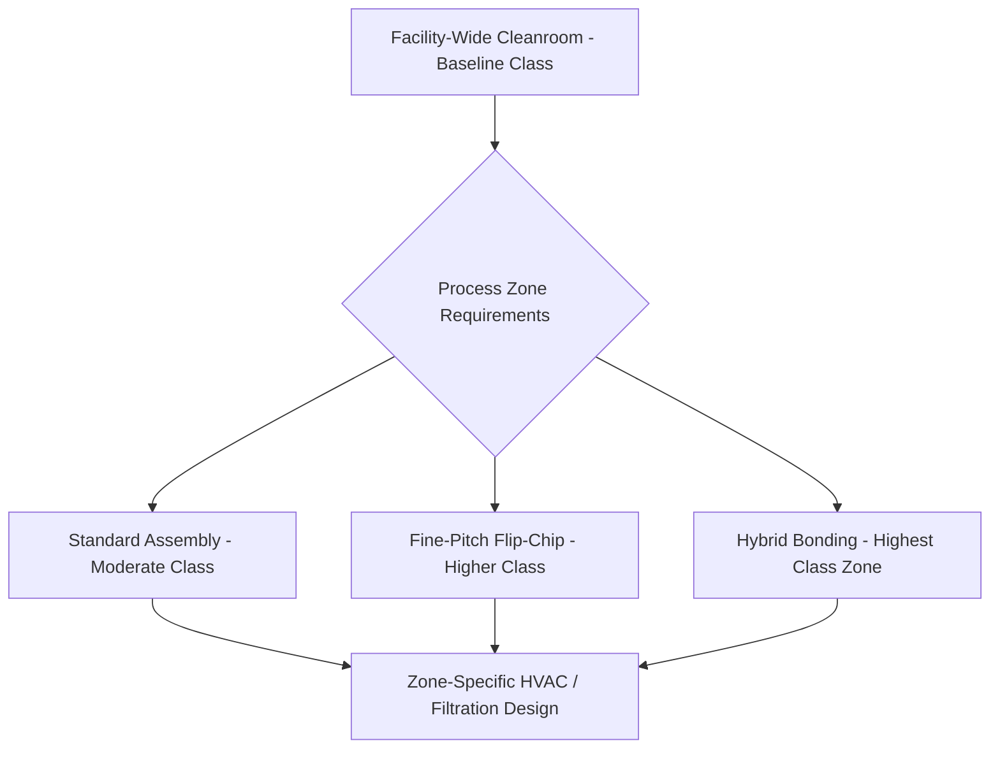

## Cleanroom Process Integration and Contamination Control

### Overview

**Key Points**

- Cleanroom process integration coordinates the physical environment, equipment interfaces, and material handling protocols across the full advanced packaging assembly line to maintain contamination levels compatible with fine-pitch interconnect yield requirements
- Contamination sources span: particulate matter, chemical/molecular contamination, static charge (ESD), and — increasingly critical for hybrid bonding — surface-level nanoscale contamination invisible to conventional particle counting
- Cleanroom classification (ISO 14644 class system) sets baseline particle count requirements per process zone, but advanced packaging increasingly requires **zone-specific contamination control** exceeding a single facility-wide classification, particularly around hybrid bonding and fine-pitch bonding equipment
- Contamination control is not a single technology but an integrated discipline spanning facility design, equipment interfaces, personnel protocols, and material/process consumable qualification

### Cleanroom Classification Fundamentals

**Key Points**

- ISO 14644-1 defines cleanroom classes (ISO Class 1 through ISO Class 9) based on maximum permitted particle count per cubic meter at specified particle sizes — lower class numbers indicate cleaner environments with stricter particle limits
- Advanced packaging assembly areas commonly operate in the **ISO Class 5 to Class 7** range depending on the specific process zone, with the most contamination-sensitive processes (hybrid bonding, fine-pitch flip-chip) typically requiring the cleanest classifications within a given facility
- [Unverified] Specific classification requirements for a given process step are application- and process-node-specific, generally trending toward stricter requirements as interconnect pitch decreases; exact classification targets should be sourced from process qualification requirements rather than treated as fixed universal standards

### Contamination Categories in Advanced Packaging

#### Particulate Contamination

**Key Points**

- Airborne particles settling on wafer, die, or substrate surfaces can cause defects ranging from cosmetic (non-functional) to critical (bond voids, short circuits, or bonding interface defects), with criticality scaling inversely with interconnect pitch — a particle that would be inconsequential for wire-bond pitch geometries may be fatal for hybrid bonding interfaces
- Particle sources include: personnel (skin, clothing fibers — mitigated via cleanroom garment protocols), equipment (mechanical wear, especially from moving parts like robotics and grinding/dicing equipment), and process byproducts (grinding debris, dicing debris, mold compound particulates)
- **HEPA/ULPA filtration** (High-Efficiency and Ultra-Low Penetration Air filtration respectively) forms the primary airborne particle control mechanism, with air handling systems designed for appropriate air change rates and unidirectional (laminar) airflow patterns in the most sensitive process zones

#### Chemical and Molecular Contamination

**Key Points**

- Airborne molecular contamination (AMC) — volatile organic compounds, acidic or basic gaseous species, and other chemical vapors — can affect surface chemistry in ways that impact subsequent process steps, such as degrading adhesion, altering surface energy for bonding processes, or contributing to corrosion of exposed metal structures
- Sources include outgassing from materials (mold compounds, adhesives, cleanroom construction materials) and process chemicals used in adjacent process steps within the facility
- Molecular contamination control typically involves chemical filtration (activated carbon or chemically-impregnated filter media) supplementing particulate HEPA/ULPA filtration, particularly in zones housing contamination-sensitive processes

#### Electrostatic Discharge (ESD) Control

**Key Points**

- Thin die and fine-pitch interconnect structures can be susceptible to ESD-induced damage during handling, requiring **ESD-safe equipment, tooling, and personnel grounding protocols** throughout the assembly flow
- Standard ESD control measures include: grounded workstations and equipment, ESD-safe flooring and personnel footwear/wrist straps, ionization systems to neutralize static charge on non-conductive materials (e.g., certain carrier materials or packaging films) that cannot be directly grounded
- ESD control intersects with contamination control in facility design, since both require careful material selection (ESD-safe materials are sometimes particle-generating, requiring balanced material choices) and consistent protocol adherence across all personnel and automated handling systems

### Zone-Specific Contamination Control for Hybrid Bonding

**Key Points**

- As discussed in the thermocompression/hybrid bonding tool architecture topic, hybrid bonding's direct Cu-Cu and dielectric-dielectric bonding mechanism is exceptionally sensitive to interface contamination — a single particle at the bond interface can prevent local bond formation or create a void
- This drives **the most stringent contamination control zones** within advanced packaging facilities, often architected as dedicated mini-environments or localized clean zones exceeding the surrounding facility's baseline classification, sometimes integrated directly into the bonding tool cluster itself (as discussed in the tool architecture topic's modular cluster design)
- Contamination control for hybrid bonding extends beyond airborne particles to **surface-level nanoscale contamination** — organic residues, native oxide formation, or sub-particle-count-threshold contamination that conventional particle counters may not detect but that can still disrupt bond formation at the atomic/near-atomic scale relevant to direct bonding

### Equipment Interface and Material Handling Protocols

**Key Points**

- **FOUP (Front-Opening Unified Pod) and SMIF (Standard Mechanical Interface) systems**, adapted from front-end semiconductor fabrication practice, are commonly used to transport wafers between process equipment while minimizing environmental exposure, maintaining a controlled micro-environment around the wafer even when moving through less stringently controlled facility areas
- Equipment load ports and transfer mechanisms are designed to maintain contamination control continuity at the interface between the cleanroom environment and the equipment's internal process chamber, avoiding contamination introduction during wafer/die loading and unloading
- For die-level handling (as opposed to whole-wafer handling), similar principles apply via **die carriers or trays** designed to maintain contamination control during transport between process steps, particularly important for the multi-step flows (thinning, dicing, bonding) discussed in prior topics where die/wafers move between distinct equipment platforms

### Personnel Protocols and Gowning

**Key Points**

- Personnel represent a significant contamination source (skin particles, hair, clothing fibers, and potential chemical contamination from cosmetics or other personal care products), managed through **cleanroom gowning protocols** — full-body coveralls, hoods, face masks, gloves, and cleanroom-specific footwear appropriate to the zone's classification level
- Gowning protocol stringency typically scales with zone classification — the most sensitive zones (surrounding hybrid bonding equipment, for example) may require more comprehensive gowning and more restrictive personnel access/traffic protocols than general assembly areas
- **Reduced personnel presence** (via increased automation) is a common contamination control strategy for the most sensitive process zones, since minimizing human presence in the highest-classification areas reduces particle generation risk more effectively than gowning alone can fully mitigate

### Process-Induced Contamination Sources

**Key Points**

- Beyond ambient facility contamination, **the assembly processes themselves generate contamination** that must be controlled and contained: grinding processes (discussed in the wafer thinning topic) generate particulate debris requiring effective containment and removal (coolant/water flush systems, local exhaust); dicing processes similarly generate debris requiring containment; molding processes can generate particulate or volatile byproducts during cure
- Equipment design increasingly incorporates **local containment and exhaust** at the point of contamination generation (e.g., enclosed grinding chambers with dedicated exhaust, rather than relying solely on general room-level air handling) to prevent process-generated contamination from affecting the broader facility environment or adjacent process steps
- Cross-contamination between process steps is a specific concern in integrated process lines — for example, ensuring that debris from an upstream dicing step doesn't contaminate downstream bonding equipment via inadequate wafer/die cleaning or containment between steps

### Contamination Monitoring and Control Systems

**Key Points**

- **Real-time particle monitoring** within cleanroom zones (using laser particle counters positioned throughout the facility and, in some cases, integrated into equipment chambers) provides ongoing verification that contamination levels remain within specification, with excursion alarms triggering investigation/corrective action
- **Surface contamination monitoring** (relevant particularly for hybrid bonding and other highly contamination-sensitive processes) may include witness wafer testing (exposing a clean reference wafer to the process environment and measuring resulting surface contamination) as a periodic verification method beyond continuous airborne particle monitoring
- Statistical process control (SPC) methodology, discussed in the broader manufacturing context, applies directly to contamination monitoring data — tracking trends over time to identify gradual degradation (e.g., filter loading, equipment wear increasing particle generation) before it results in yield-impacting excursions

### Facility Design Integration Considerations

**Key Points**

- Cleanroom process integration requires **coordinated facility design** across HVAC/filtration systems, equipment layout (minimizing unnecessary material transport distance and environmental transitions), and utility routing (chemical, gas, vacuum systems) — all designed with contamination control as a primary architectural driver rather than an afterthought
- **Vibration isolation**, discussed in the hybrid bonding tool architecture topic as critical for alignment precision, is often co-designed with contamination control considerations in facility planning, since both requirements can drive similar facility infrastructure decisions (isolated foundations, careful equipment placement relative to vibration sources like HVAC equipment or nearby traffic)
- Facility expansion or process line reconfiguration (common as advanced packaging technology and volume requirements evolve) must carefully manage contamination control continuity during construction/modification activities, since construction activity itself is a significant contamination risk to adjacent operating cleanroom areas

### Example: Contamination Control Zones for an Integrated 3D-IC Assembly Line

**Example**

A representative zone-based contamination control architecture for a facility integrating wafer thinning, dicing, and hybrid bonding process steps:

1. **General assembly zone** (ISO Class 7-8 class range, illustrative): incoming material staging, general handling areas with standard gowning protocols
2. **Wafer thinning/grinding zone**: moderate classification with dedicated local exhaust/containment around grinding equipment to manage process-generated particulate debris
3. **Dicing zone**: similar moderate classification with debris containment specific to blade, stealth laser, or plasma dicing equipment as applicable
4. **Hybrid bonding zone** (highest classification, potentially with localized mini-environment/tool-integrated clean zones): most stringent gowning protocols, minimized personnel presence favoring automated material handling, dedicated CMP surface preparation and plasma activation modules with tightly controlled hand-off to the bonding chamber
5. **Inter-zone material transport**: FOUP/SMIF-equivalent or die-carrier-based transport maintaining controlled micro-environment during movement between zones of differing classification

[Unverified] Specific classification levels and zone architecture vary substantially by facility and process technology generation; the structure above illustrates a representative zone-based approach rather than a specific qualified facility design.

### Common Pitfalls in Contamination Control

**Key Points**

- **Treating cleanroom classification as sufficient on its own**: meeting a facility-wide ISO classification target doesn't guarantee adequate contamination control for the most sensitive process steps (particularly hybrid bonding) without additional zone-specific or tool-integrated contamination control measures
- **Underestimating process-generated contamination**: focusing contamination control efforts primarily on ambient/personnel-sourced contamination while underestimating debris generated by the assembly processes themselves (grinding, dicing, molding) can leave a significant contamination source inadequately controlled
- **Inadequate inter-zone transfer protocols**: contamination control within individual process zones can be undermined by inadequate protocols for material transport between zones, allowing contamination accumulated in a lower-classification zone to be carried into a higher-classification zone
- **Insufficient monitoring granularity**: relying solely on facility-level or infrequent contamination monitoring, rather than process-zone-specific and appropriately frequent monitoring, can allow gradual contamination excursions to go undetected until yield impact becomes evident

### Conclusion

Cleanroom process integration and contamination control in advanced packaging extends well beyond a single facility-wide cleanroom classification, requiring zone-specific contamination management calibrated to each process step's sensitivity — with hybrid bonding representing the most demanding contamination control requirements given its reliance on pristine, nanoscale-clean bonding interfaces. Effective contamination control integrates facility design (HVAC/filtration, vibration isolation), equipment interface protocols (FOUP/SMIF-style controlled transport), personnel gowning and access discipline, and increasing automation to minimize human-sourced contamination in the most sensitive zones — all coordinated with explicit attention to the contamination generated by the assembly processes themselves (grinding, dicing, molding) rather than treating contamination control as solely an ambient-environment concern.

**Related Topics**

- ISO 14644 cleanroom classification standards and measurement methodology
- Witness wafer testing and surface contamination characterization techniques
- FOUP/SMIF wafer transport system design for contamination-controlled material handling
- ESD control protocol design for thin die and fine-pitch interconnect handling
- Local containment and exhaust system design for process-generated particulate control
- Statistical process control (SPC) methodology for contamination trend monitoring
- Facility HVAC and vibration isolation co-design for advanced packaging cleanrooms