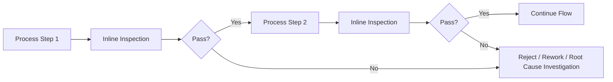
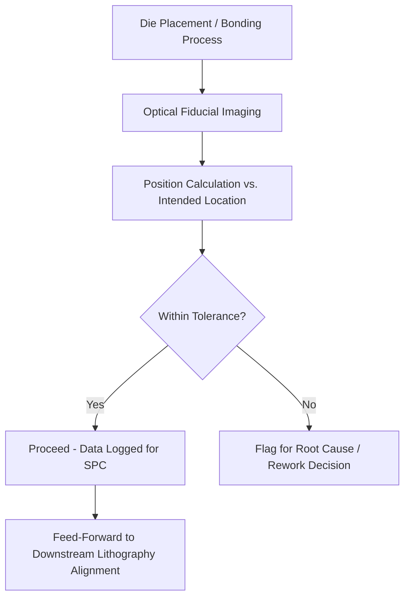
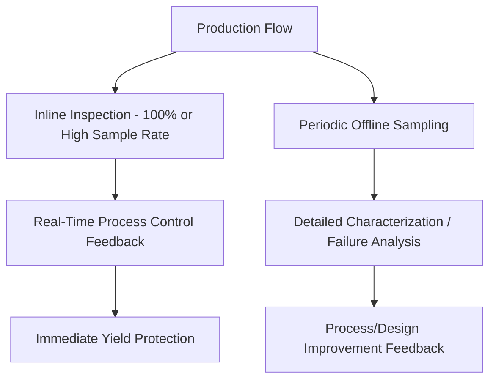

## Metrology and Inline Inspection for Advanced Packages

### Overview

**Key Points**

- Metrology and inline inspection provide the measurement and defect-detection capability embedded throughout the advanced packaging assembly line, enabling real-time process control and preventing defective material from propagating through subsequent (often costly) process steps
- Core measurement categories: dimensional metrology (thickness, alignment, warpage), defect inspection (voids, cracks, particles), and electrical test (continuity, parametric verification)
- Measurement techniques span optical (bright-field/dark-field microscopy, interferometry), acoustic (scanning acoustic microscopy), X-ray (2D and 3D computed tomography), and electrical probing methods, each suited to different defect types and structural access constraints
- Inline (in-process, integrated with production equipment) inspection is distinguished from offline (separate dedicated inspection equipment/lab) inspection, with advanced packaging trending toward greater inline integration to enable faster feedback and reduced work-in-progress inventory risk

### Why Metrology and Inspection Are Critical in Advanced Packaging

Advanced packages combine multiple process steps (thinning, dicing, bonding, molding, RDL formation) each covered in prior topics, with cumulative yield risk compounding across the full flow. Several factors elevate the importance of metrology/inspection beyond traditional packaging:

- **High value-add accumulation**: by the time a multi-die 3D-IC stack reaches final assembly, substantial value (multiple known-good die, prior process steps) has been invested — a defect discovered only at final test wastes all that accumulated value, whereas earlier detection limits loss to the specific step where the defect occurred
- **Reduced defect margin**: fine-pitch interconnect (hybrid bonding, fine-pitch flip-chip) has less tolerance for defects that might have been inconsequential at coarser pitch, requiring correspondingly more sensitive and precise inspection capability
- **Process step interdependency**: as discussed across prior topics (warpage from molding affecting bonding, die shift affecting RDL alignment, thinning affecting TSV reveal), many advanced packaging defects only become apparent or problematic when considering interactions between process steps — motivating inline monitoring that can catch issues before they compound

### Dimensional Metrology

#### Thickness Measurement

**Key Points**

- Non-contact thickness measurement (commonly optical interferometry or capacitive sensing methods, as referenced in the wafer thinning topic) provides in-line feedback during backgrinding to achieve target thickness with tight tolerance
- Thickness uniformity mapping across the full wafer/panel area (not just single-point or average measurement) is critical given the downstream sensitivity to non-uniformity discussed in prior topics (TSV reveal process windows, bonding surface flatness requirements)
- For molded fan-out formats, thickness metrology extends to the molded package thickness, informing backgrinding/exposure process control as discussed in the molding topic

#### Warpage Measurement

**Key Points**

- Optical shadow moiré or similar full-field optical techniques measure package/wafer warpage across temperature (often replicating reflow-relevant temperature profiles), directly correlating to the FEA-predicted warpage behavior discussed in the thermal-mechanical simulation topic
- Inline warpage measurement, where integrated into the production flow rather than performed only as periodic qualification sampling, enables detection of warpage excursions (potentially from material lot variation, process drift) before affected material proceeds through subsequent costly process steps
- Warpage measurement data feeds both immediate process control decisions and, in more advanced implementations, the digital twin correlation loops discussed in the earlier digital twin topic — comparing measured warpage against FEA-predicted values to refine model accuracy

#### Alignment and Placement Verification

**Key Points**

- Post-placement die position metrology (referenced in the molding topic's discussion of die shift) verifies actual die location against intended position, using optical imaging of fiducial marks or die edge features
- For multi-die stacked assemblies, cross-die alignment verification confirms bump/TSV/hybrid bond pad alignment meets the tolerances discussed in the package DRC topic, providing empirical verification that design-rule-compliant geometry was actually achieved in the physical assembly
- High-precision alignment verification for hybrid bonding applications requires correspondingly high-resolution metrology, given the sub-micron alignment tolerances discussed in the bonding tool architecture topic

### Defect Inspection Methods

#### Optical Inspection

**Key Points**

- Bright-field and dark-field optical microscopy detect surface-visible defects: particles, scratches, chipping (relevant to the dicing edge quality discussion), and visible cracks
- **Automated optical inspection (AOI)** systems use pattern recognition/image processing algorithms to identify defects across full wafer/panel area at production throughput, flagging locations for further review or automatically classifying defect types based on trained recognition models
- Optical methods are inherently limited to surface-visible or near-surface defects; subsurface defects (voids beneath a molded surface, bond interface voids) require complementary non-optical inspection methods

#### Scanning Acoustic Microscopy (SAM)

**Key Points**

- SAM uses high-frequency ultrasound to detect subsurface features by measuring acoustic reflection/transmission at material interfaces — voids, delamination, and cracks create distinct acoustic signatures detectable even when not visible at the surface
- Particularly valuable for **post-bond void/delamination inspection** (referenced in the bonding tool architecture topic) and for detecting mold compound voids or die-attach delamination that optical inspection cannot access
- Requires a coupling medium (typically water immersion or a water-based coupling approach) between the transducer and the sample, an important process integration consideration when incorporating SAM into a dry cleanroom process flow — inline SAM integration must manage this coupling requirement without introducing contamination or moisture-sensitivity issues elsewhere in the flow

#### X-Ray Inspection

**Key Points**

- 2D X-ray radiography provides transmission imaging useful for detecting internal defects not accessible to optical or acoustic methods, such as solder joint voiding, wire bond integrity, or internal structural verification without requiring a coupling medium (unlike SAM)
- **3D X-ray computed tomography (CT)** provides full volumetric reconstruction, enabling detailed internal structure analysis (TSV integrity, internal void distribution in three dimensions, solder joint shape/void characterization) at the cost of significantly longer scan time compared to 2D radiography — generally reserved for detailed failure analysis or periodic sampling rather than 100% inline inspection given throughput constraints
- X-ray inspection is particularly valuable for **solder joint and TSV inspection**, where internal void content or fill quality directly correlates to reliability risk and cannot be adequately assessed via surface-accessible methods alone

[Unverified] The specific throughput/resolution trade-offs and current inline integration maturity for 3D X-ray CT in high-volume advanced packaging production vary by equipment generation and application; 2D X-ray inspection is more commonly integrated for high-throughput inline use, while 3D CT is more frequently used for detailed characterization/failure analysis given typical throughput constraints, though this balance continues to evolve with equipment advances.

### Electrical Test Integration

**Key Points**

- **Continuity and parametric electrical test** at various process stages verifies functional connectivity, complementing physical/dimensional metrology by directly confirming electrical function rather than inferring it from geometric compliance alone
- **Known-good-die (KGD) testing** (referenced in the multi-die assembly topic) represents a critical electrical test integration point, performed before die stacking to avoid the economic risk of incorporating a defective die into a multi-die assembly
- Post-assembly electrical test (at wafer level for fan-out formats, or after full package assembly) verifies overall system function, with test access architecture (as discussed in the multi-die assembly topic's IEEE 1838 reference) determining how effectively individual die within a stacked assembly can be diagnosed if a system-level test failure occurs

### Inline vs. Offline Inspection Strategy

**Key Points**

- **Inline inspection** (integrated directly into production equipment or immediately adjacent inline stations) provides rapid feedback enabling real-time process control and minimizing work-in-progress at risk before a defect is caught, but may face throughput, cost, or technical constraints limiting which inspection types can be fully inline
- **Offline/sampling inspection** (separate dedicated equipment, often performing more thorough or slower measurement techniques like detailed 3D X-ray CT or destructive cross-section analysis) provides deeper characterization capability but with inherent sampling risk (not every unit inspected) and longer feedback latency
- Production strategy typically combines both: inline inspection for high-throughput, critical-path defect categories (thickness, gross alignment, surface-visible defects) with periodic offline sampling for more detailed or slower characterization methods (detailed void characterization, cross-sectional failure analysis)

### Statistical Process Control (SPC) Integration

**Key Points**

- Metrology and inspection data feeds SPC methodology (referenced across several prior topics — contamination monitoring, thickness control), tracking measurement trends over time to distinguish normal process variation from meaningful drift requiring intervention
- **Control charts** and similar statistical tools flag when a process parameter trends toward or exceeds control limits before it necessarily produces an outright defect, enabling proactive process adjustment rather than purely reactive defect response
- Effective SPC implementation requires sufficient measurement frequency and data granularity (connecting to the inline vs. offline strategy discussion above) — infrequent or purely offline sampling limits the responsiveness of SPC-driven process control compared to higher-frequency inline data collection

### Data Integration and Traceability

**Key Points**

- Advanced packaging's multi-step, multi-vendor (in chiplet ecosystems) assembly flow benefits from **comprehensive data traceability** — linking metrology/inspection results at each process step to the specific unit (wafer, panel, or individual die/package) throughout its full process history
- This traceability supports root-cause investigation when downstream failures occur (tracing back to identify which upstream process step or equipment may have contributed), and increasingly feeds the digital twin and design-manufacturing correlation approaches discussed in the earlier digital twin topic
- Data integration architecture must handle the heterogeneous measurement types (dimensional, image-based defect data, electrical test results) and potentially multiple equipment vendors' data formats across a complex assembly line, representing a significant systems integration challenge distinct from the individual metrology technologies themselves

### Example: Inline Metrology Integration for a 3D-IC Assembly Flow

**Example**

A representative inline metrology integration spanning several process steps discussed in prior topics:

1. **Post-grinding**: inline thickness/uniformity metrology verifies target thickness achieved before proceeding to dicing, feeding real-time grinding process control
2. **Post-dicing**: optical inspection verifies die edge quality (chipping, cracking) consistent with the dicing technology's expected performance characteristics
3. **Post-bond (TCB or hybrid bonding)**: inline or near-inline SAM inspection checks for bond voids/delamination; alignment verification confirms placement accuracy met specification
4. **Post-mold** (if fan-out format): thickness/warpage metrology verifies molding process quality; die shift metrology feeds forward to RDL lithography alignment correction
5. **Pre-stack (KGD test)**: electrical test verifies die functionality before committing to stacking, given the high economic cost of defects discovered post-stack
6. **Post-assembly**: system-level electrical test, potentially supplemented by periodic X-ray or SAM sampling for internal structural verification, completes the final signoff before shipment

### Common Pitfalls in Metrology and Inspection Strategy

**Key Points**

- **Over-reliance on a single inspection method**: no single technique (optical, acoustic, X-ray, electrical) detects all relevant defect types — comprehensive quality assurance requires a coordinated multi-method strategy matched to the specific defect risks at each process step
- **Insufficient inline coverage for critical-path defects**: relying solely on offline/periodic sampling for defects that can propagate significant downstream cost (e.g., die shift affecting RDL yield, bond voids affecting stack reliability) risks larger-scale yield loss before a sampling-based detection catches a systemic issue
- **Inadequate data integration/traceability**: fragmented metrology data across process steps and equipment vendors limits root-cause investigation effectiveness and undermines the data continuity needed for SPC and digital twin correlation approaches
- **Measurement technique mismatch to defect type**: applying an inspection method poorly suited to the relevant defect risk (e.g., relying only on optical inspection for subsurface bond voids that require SAM or X-ray) can create false confidence in quality while missing critical defect categories

### Conclusion

Metrology and inline inspection provide the measurement backbone supporting quality and yield across the full advanced packaging assembly flow, spanning dimensional metrology (thickness, warpage, alignment), defect inspection (optical, acoustic, X-ray methods each suited to different defect accessibility), and electrical test integration. Given advanced packaging's multi-step process interdependencies and the compounding economic risk of undetected defects propagating through costly downstream steps, effective strategy requires a coordinated combination of high-frequency inline inspection for critical-path defect categories and complementary offline/sampling methods for detailed characterization — unified through comprehensive data traceability that increasingly connects to statistical process control and digital twin correlation methodologies for continuous process improvement.

**Related Topics**

- Automated optical inspection (AOI) algorithm design and defect classification methodology
- Scanning acoustic microscopy (SAM) coupling and inline integration engineering
- 3D X-ray computed tomography for TSV and solder joint internal characterization
- Known-good-die (KGD) test methodology and pre-stack economic yield modeling
- Statistical process control (SPC) implementation for multi-step assembly flows
- Manufacturing data traceability and integration architecture for heterogeneous metrology sources
- IEEE 1838 test access architecture for post-assembly multi-die diagnosis