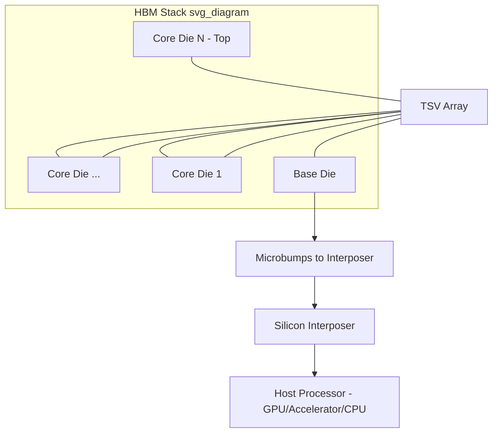
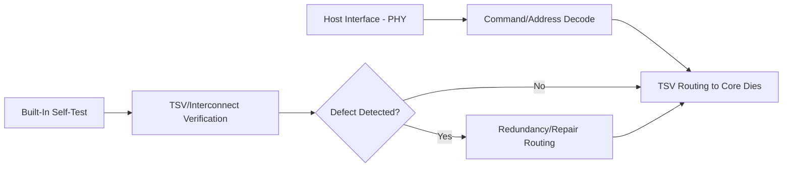
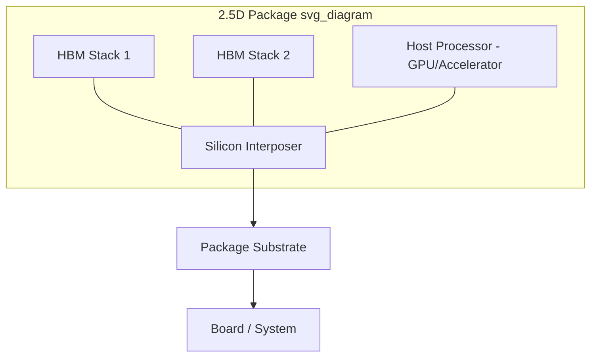

## HBM Architecture: Base-Die and Core-Die Stacking

### Overview

**Key Points**

- High Bandwidth Memory (HBM) achieves its bandwidth and capacity density through vertically stacked DRAM core dies connected via through-silicon vias (TSVs) to a base (logic/buffer) die, which interfaces to the host processor
- Architecture centers on: multiple DRAM core dies (commonly 4, 8, or 12 high in current-generation implementations) stacked atop a base die, all interconnected through a dense TSV array running through the full stack
- The base die serves as the electrical/protocol interface between the DRAM core dies and the host (typically a GPU, AI accelerator, or CPU), handling command decode, data routing, and often built-in test/repair logic
- [Unverified] Specific stack heights, capacities, and bandwidth figures evolve rapidly across HBM generations (HBM2E, HBM3, HBM3E, and beyond); current generation specifications should be verified against the latest JEDEC standard and vendor documentation given the pace of change in this space

### HBM Stack Structure

**Key Points**

- **Core dies**: DRAM memory array dies, each containing memory banks/channels, stacked vertically and connected via TSVs that pass signal, power, and ground through each die in the stack
- **Base die**: positioned at the bottom of the stack (closest to the interposer/package substrate), containing interface logic (PHY circuitry, command/address decode, built-in self-test), and in some implementations, additional buffer or routing logic distinct from the pure memory function of core dies
- **TSV array**: a dense array of through-silicon vias runs through the core dies (and connects to the base die), providing the vertical interconnect for the wide parallel data bus characteristic of HBM's high-bandwidth architecture

### Die-to-Die Interconnect Within the Stack

**Key Points**

- TSVs connecting adjacent dies in the stack are typically joined via **microbumps** at each die-to-die interface, though hybrid bonding approaches (discussed in the earlier bonding tool architecture topics) are increasingly relevant for future HBM generations seeking finer pitch and reduced Z-height
- The TSV array must provide sufficient signal TSVs for the wide parallel data interface (HBM's defining characteristic compared to narrower conventional DRAM interfaces), plus power/ground TSVs for power delivery through the stack, and often redundant/spare TSVs to support post-stack repair mechanisms
- **Micro-bump pitch** in current HBM implementations is significantly finer than traditional flip-chip pitch but coarser than the finest hybrid bonding pitches discussed in earlier topics, reflecting HBM's position as an early and mature adopter of fine-pitch 3D stacking technology within the broader advanced packaging landscape

### Base Die Functions

**Key Points**

- **PHY (physical layer) interface**: manages the electrical signaling between the HBM stack and the host processor across the interposer, implementing the high-speed parallel interface defined by the relevant JEDEC HBM standard
- **Command and address decode**: routes incoming memory commands from the host to the appropriate core die/bank within the stack
- **Built-in self-test (BIST) and repair logic**: given the reliability implications of stacking multiple DRAM dies with dense TSV interconnect, base die logic commonly includes test capability to verify TSV/interconnect integrity and, in many implementations, **redundancy/repair mechanisms** that can route around defective TSVs or memory elements using spare resources built into the design
- Some HBM implementations position additional functionality on the base die beyond pure interface logic — [Unverified] the specific extent of logic integration on the base die (e.g., whether it includes any buffering, ECC, or other value-added functions beyond basic interface/test/repair) varies by HBM generation and vendor implementation, and should be verified against specific product documentation

### TSV Redundancy and Repair Mechanisms

**Key Points**

- Given the large number of TSVs required for HBM's wide parallel interface multiplied across multiple stacked dies, even a low per-TSV defect rate can result in a meaningful probability of at least one defective TSV somewhere in the stack — making **redundancy a practical necessity** rather than an optional reliability enhancement
- Common approaches include: **spare TSV rows/columns** that can be electrically substituted for a defective TSV via programmable routing (often using fuses or similar one-time-programmable elements) on the base die, and **error correction coding (ECC)** at the memory architecture level providing an additional layer of tolerance for residual defects not fully addressed by physical redundancy
- This redundancy architecture directly connects to the **known-good-die (KGD) and test integration** concepts discussed in the multi-die assembly and metrology topics — TSV/interconnect defects are ideally identified and repaired (where possible) as early as possible in the stacking process to avoid wasting good die in a stack ultimately rejected due to a repairable defect

### Stack Height Scaling and Thermal Considerations

**Key Points**

- Increasing stack height (more core dies per stack) increases memory capacity per HBM module but introduces compounding challenges: greater cumulative TSV count/complexity, increased mechanical stress on lower dies in the stack (bearing the weight and thermal-mechanical stress of dies above), and thermal management challenges from heat generated by dies buried within the stack (a direct connection to the thermal FEA and thermal-aware placement topics discussed earlier)
- **Thermal resistance increases** for dies further from the package's primary heat removal path (typically through the base die and package substrate to an external heat sink/spreader), meaning core dies at the top of a tall stack face greater thermal challenges than those near the base — a consideration directly relevant to the thermal-aware 3D-IC floorplanning principles discussed earlier, adapted to HBM's specific stacked-memory context
- [Inference] Stack height scaling trends (moving toward taller stacks in successive HBM generations) likely continue to drive increasing emphasis on thermal management solutions (both within the HBM module design and at the package/system level) and on TSV/bonding technology improvements to manage the compounding mechanical and electrical challenges of taller stacks, though specific future roadmap details should be verified against current JEDEC and vendor roadmaps.

### Integration with 2.5D Package Architecture

**Key Points**

- HBM modules are typically integrated into a 2.5D package architecture (directly connecting to the package design ecosystem and 3D-IC floorplanning topics discussed earlier), where the HBM stack sits alongside a host processor (GPU, AI accelerator) on a shared silicon interposer
- The **interposer RDL routing** (discussed in the package design and layout topic) carries the wide parallel HBM interface signals between the HBM base die and the host processor's memory controller, requiring careful routing density and signal integrity management given the very high pin count of HBM's parallel interface
- This chip-package-system integration directly connects to the **CPS electrical co-simulation** topic discussed earlier — HBM interfaces are frequently cited as a demanding co-simulation use case given the combination of high pin count, tight timing margins, and multi-domain (die, interposer, package) interconnect path

### Manufacturing Process Connections

**Key Points**

- HBM stack assembly draws directly on several manufacturing processes covered in the Assembly Equipment chapter: wafer thinning (core dies are thinned to enable practical stack heights within Z-height budgets), TSV reveal processing (integrated with the thinning process as discussed earlier), and die/wafer bonding (traditionally microbump-based thermocompression bonding, with hybrid bonding increasingly relevant for advanced/future HBM generations seeking finer pitch)
- **Known-good-die (KGD) testing** before stacking (discussed in the multi-die assembly and metrology topics) is particularly critical for HBM given the multi-die stack structure — a defective core die discovered only after full stack assembly risks scrapping multiple good dies along with the defective one, making pre-stack test coverage economically significant
- Post-stack inspection (SAM for bond void detection, X-ray for TSV/interconnect integrity verification, as discussed in the metrology topic) applies directly to HBM stack quality assurance given the multiple bonding interfaces and dense TSV structure requiring verification

### Example: Simplified HBM Stack Assembly Sequence

**Example**

1. DRAM core die wafers fabricated with on-die circuitry plus TSV structures (formed via via-middle or via-last process integration, depending on specific process flow) not yet exposed on the backside
2. Wafers undergo backgrinding and TSV reveal processing (as discussed in the wafer thinning topic) to expose TSV tips and achieve target die thickness for stacking
3. Individual core dies (or, in some flows, full wafers for wafer-to-wafer bonding approaches) undergo known-good-die test to identify functional die before committing to stacking
4. Core dies sequentially bonded via microbump thermocompression bonding (or hybrid bonding in advanced implementations) onto the base die, building up the stack one layer at a time, with inline inspection (SAM, alignment verification) at each bonding step
5. Completed stack undergoes final electrical test verifying full-stack functionality, including TSV/redundancy repair verification if defects were identified during test
6. Tested, known-good HBM stack proceeds to integration onto the 2.5D package interposer alongside the host processor die

### Common Pitfalls and Design Considerations

**Key Points**

- **Underestimating cumulative TSV defect risk**: as stack height increases, the probability of encountering at least one TSV defect somewhere in the stack increases correspondingly, reinforcing the necessity of robust redundancy/repair architecture rather than treating TSV reliability as a solved problem at any stack height
- **Thermal management oversight for buried dies**: focusing thermal design primarily on the base die/package interface without adequately addressing the elevated thermal resistance faced by dies higher in the stack can lead to unexpected thermal margin issues, particularly under sustained high-bandwidth (high-activity) operation
- **KGD test coverage gaps**: insufficient pre-stack test coverage increases the economic risk of scrapping good dies alongside defective ones in a multi-die stack, a particularly acute concern for HBM given typical stack heights
- **Interposer routing congestion**: HBM's very high pin count parallel interface can create significant interposer RDL routing density challenges, requiring careful co-design between HBM placement, host processor placement, and interposer routing capacity as discussed in the package design ecosystem and 3D-IC floorplanning topics

### Conclusion

HBM architecture achieves high memory bandwidth and capacity density through vertically stacked DRAM core dies interconnected via dense TSV arrays to a base die that manages host interface, command routing, and critical test/repair functions. This architecture directly exercises many of the advanced packaging technologies and methodologies covered across prior topics — TSV-based 3D-IC stacking, wafer thinning and TSV reveal, known-good-die testing, redundancy/repair design, and 2.5D interposer-based package integration with chip-package-system co-simulation — making HBM one of the most mature and demanding real-world applications of the advanced packaging ecosystem as a whole. As stack heights and bandwidth requirements continue to scale across successive HBM generations, thermal management for buried core dies and TSV/bonding technology advancement (including potential transition toward hybrid bonding) remain active areas of continued technical development.

**Related Topics**

- JEDEC HBM standard evolution (HBM2E, HBM3, HBM3E, and successor generations)
- TSV redundancy architecture and programmable repair mechanism design
- Thermal management solutions for buried die in tall memory stacks
- Interposer RDL routing density challenges for wide parallel memory interfaces
- Known-good-die (KGD) test economics for multi-die memory stack assembly
- Hybrid bonding adoption trends for future HBM generation interconnect pitch scaling
- HBM-to-host chip-package-system co-simulation methodology and signal integrity challenges