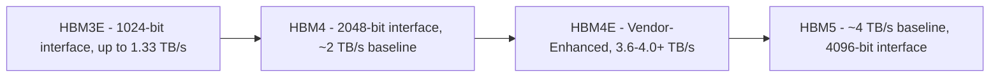
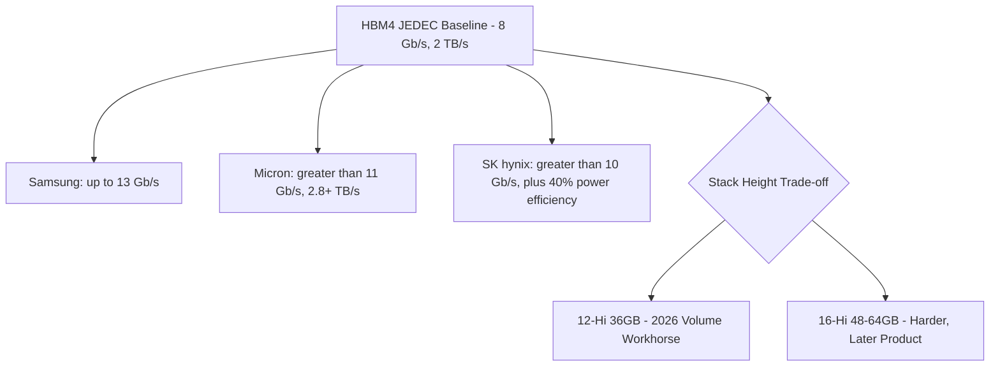
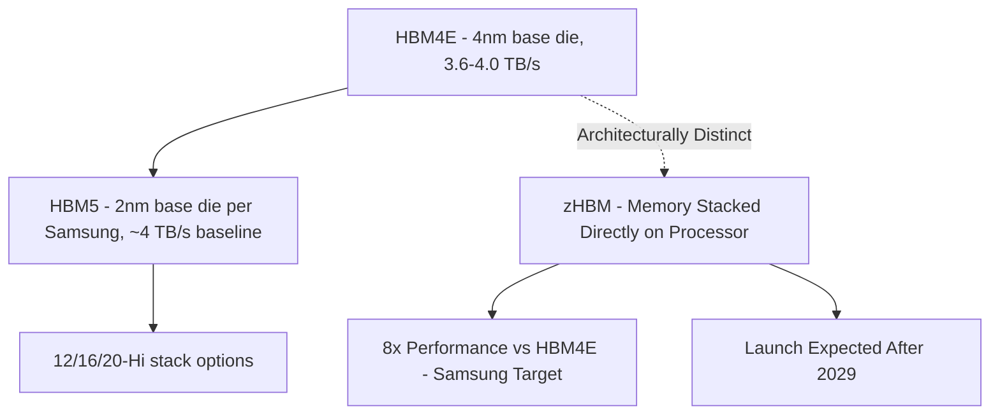

## HBM Generational Roadmap: HBM3E, HBM4, HBM4E, and HBM5

### Overview

**Key Points**

- The HBM roadmap progresses through JEDEC-standardized generations (HBM3E, HBM4) interspersed with vendor-driven enhanced iterations (HBM4E) that push beyond the published standard before the next formal JEDEC generation is finalized
- Each generation trades off pin speed, interface width, channel count, stack height, and power envelope, with successive generations generally widening the interface and increasing stack height as much as (or more than) raising per-pin speed
- [Verified] HBM4, standardized by JEDEC as JESD270-4 in April 2025, doubles the interface to 2,048 bits and the channel count to 32, supports stacks up to 16-high and 64 GB, and sets a baseline of 8 Gb/s per pin for 2 TB/s per stack. [Inside Deep Tech](https://www.insidedeeptech.com/high-bandwidth-memory-hbm-full-guide/)
- [Verified] As of mid-2026, HBM4E does not have a unified JEDEC standard. Each manufacturer has developed its own version with differentiated specifications in pin speed, process node, and packaging technology. HBM5 remains in pre-production roadmap/sampling stages at major memory vendors as of the current date [Ersa Electronics](https://www.ersaelectronics.com/blog/hbm4-hbm4e)

### HBM3E: The Immediate Predecessor Generation

**Key Points**

- [Verified] HBM3e delivers up to 1.33 TB/s per stack, serving as the baseline against which HBM4's architectural changes are measured [Mendix](https://blogs.sw.siemens.com/semiconductor-packaging/2026/04/24/hbm3e-hbm4-ic-design-guide/)
- HBM3E represented an incremental speed enhancement within the HBM3 generation framework rather than a fundamental interface redesign — the distinction from HBM4 is significant precisely because HBM4 changes the interface width itself rather than only pushing per-pin speed higher
- HBM3E remains in active production and deployment across current-generation AI accelerator platforms as HBM4 ramps, representing the practical "previous generation" baseline referenced in comparative HBM4 bandwidth claims

### HBM4: The Current JEDEC-Standardized Generation

**Key Points**

- [Verified] With transfer speeds up to 8 Gb/s across a 2048-bit interface, HBM4 boosts total bandwidth up to 2 TB/s. HBM4 doubles the number of independent channels per stack, from 16 channels (HBM3) to 32 channels with 2 pseudo-channels per channel. [JEDEC](https://www.jedec.org/news/pressreleases/jedec%C2%AE-and-industry-leaders-collaborate-release-jesd270-4-hbm4-standard-advancing)
- [Verified] HBM4 will specify 24 Gb and 32 Gb layers, and [Verified] supports stacks up to 16-high and 64 GB, with [Verified] a 16-high stack of 32 Gb dies reaching 64 GB in a single cube [JEDEC Approaches Finalization of HBM4 Standard, Eyes Future Innovations | JEDEC +2](https://www.jedec.org/news/pressreleases/jedec-approaches-finalization-hbm4-standard-eyes-future-innovations)
- [Verified] Power efficiency improvements come via vendor specific VDDQ (0.7V, 0.75V, 0.8V or 0.9V) and VDDC (1.0V or 1.05V) levels, resulting in lower power consumption and improved energy efficiency [JEDEC](https://www.jedec.org/news/pressreleases/jedec%C2%AE-and-industry-leaders-collaborate-release-jesd270-4-hbm4-standard-advancing)
- [Verified] The HBM4 interface definition ensures backwards compatibility with existing HBM3 controllers, allowing for seamless integration and flexibility in various applications and allowing a single controller to work with both HBM3 and HBM4 if needed. [JEDEC](https://www.jedec.org/news/pressreleases/jedec%C2%AE-and-industry-leaders-collaborate-release-jesd270-4-hbm4-standard-advancing)
- [Verified] Reliability features include directed refresh management for improved row-hammer mitigation and reliability, availability, and serviceability (RAS) [EDN](https://www.edn.com/jedec-finalizes-hbm4-standard/)

#### HBM4 as an Architectural Inflection Point

**Key Points**

- [Verified] HBM4 is not an incremental speed bump to HBM3e, but a redesign of the memory interface and shift in memory architecture by integrating logic die and turning the memory stack into a co-processor. This represents a qualitative shift beyond the earlier "base die as passive interface" description covered in the prior HBM architecture topic [Mendix](https://blogs.sw.siemens.com/semiconductor-packaging/2026/04/24/hbm3e-hbm4-ic-design-guide/)
- [Verified] Vendor implementations already exceed the JEDEC baseline: Samsung quotes a consistent 11.7 Gb/s (up to 13 Gb/s). Micron's 36 GB 12-high HBM4 is specified at more than 11 Gb/s and more than 2.8 TB/s. SK hynix says it is running above 10 Gb/s with more than 40% better power efficiency than the prior generation. [Inside Deep Tech](https://www.insidedeeptech.com/high-bandwidth-memory-hbm-full-guide/)
- [Verified] Production status as of 2026: SK hynix, Samsung, and Micron are all in volume production of HBM4. NVIDIA's Vera Rubin platform is designed around it. [Verified] Micron has announced plans for HBM4 production starting in 2026, with HBM4E already in development. [Inside Deep Tech](https://www.insidedeeptech.com/high-bandwidth-memory-hbm-full-guide/)[All About Circuits](https://www.allaboutcircuits.com/news/jedec-officially-releases-hbm4-memory-standard/)
- [Verified] Stack height trade-offs remain governed by manufacturing yield/thermal realities directly connecting to earlier topics: Each added die increases the number of TSVs that must yield, the heat that must leave the stack, and the mechanical stress on the joints. That is why 12-high 36 GB parts are the 2026 volume workhorse, and why 16-high 48 GB and 64 GB cubes are still the harder, later product. [Inside Deep Tech](https://www.insidedeeptech.com/high-bandwidth-memory-hbm-full-guide/)

### HBM4E: Vendor-Driven Enhancement Without a Unified Standard

**Key Points**

- [Verified] HBM4E is an enhanced iteration of HBM4 developed independently by memory manufacturers such as Samsung, SK Hynix, and Micron. It is not a separate JEDEC standard. HBM4E increases pin speed to 14–16 Gbps, raises single-stack bandwidth to 3.6–4.0 TB/s, and introduces more advanced process nodes and packaging technologies. [Ersa Electronics](https://www.ersaelectronics.com/blog/hbm4-hbm4e)
- [Verified] Per-vendor bandwidth targets: HBM4E delivers 3.6 TB/s (Samsung) to 4.0 TB/s (SK Hynix) per stack, representing an improvement of approximately 80% to 100% over HBM4. [Ersa Electronics](https://www.ersaelectronics.com/blog/hbm4-hbm4e)
- [Verified] Sampling and production timeline: Samsung delivered its first 12-layer samples in May 2026, SK Hynix supplied samples to major customers in June 2026, and Micron plans to begin mass production in 2027. [Ersa Electronics](https://www.ersaelectronics.com/blog/hbm4-hbm4e)
- [Verified] SK hynix's forward roadmap includes HBM4 16-Hi and HBM4E 8/12/16-Hi products, along with a custom HBM4E solution for the 2026-2028 window, with a notable architectural shift: the custom HBM solution essentially moves the HBM controller to the HBM Base Die. Other IPs, such as protocol, etc, are also moved to the HBM Base Die. This allows GPU/ASIC manufacturers to increase the compute silicon area. This directly extends the base-die logic integration trend discussed in the prior HBM architecture topic, pushing further toward the base die functioning as a genuine co-processor/controller rather than a pure PHY/repair interface [TrendForce](https://www.trendforce.com/news/2025/11/04/news-sk-hynix-unveils-2029-2031-roadmap-featuring-hbm5-gddr7-next-and-400-layer-nand/)[Wccftech](https://wccftech.com/sk-hynixs-roadmap-hbm5-hbm5e-gddr7-next-ddr6-400-layer-4d-nand-2029-2031/)

[Unverified] Because HBM4E lacks unified JEDEC standardization, cross-vendor interoperability at the HBM4E tier is not guaranteed in the way HBM4's backward-compatible-with-HBM3-controller design is; system designers should verify specific vendor/controller compatibility for any given HBM4E implementation.

### HBM5: The Next JEDEC Generation on the Horizon

**Key Points**

- [Verified] Target timeline and host platform: HBM5 Targets NVIDIA Feynman With An On-Shelf Release Scheduled For 2029, though [Verified] NVIDIA has listed a 2028 release date, this KAIST study lists what is probably a more realistic 2029 launch date for this HBM5 solution. [Wccftech](https://wccftech.com/next-gen-hbm-architecture-detailed-hbm4-hbm5-hbm6-hbm7-hbm8-up-to-64-tbps-bandwidth-240-gb-capacity-per-24-hi-stack-embedded-cooling/)[3dincites](https://www.3dincites.com/2025/07/iftle-635-kaist-tera-hbm-roadmap/)
- [Verified] Interface architecture: HBM5 seems to stick to the 8 Gbps data rate for the Non-e variant, but drives up the IO lanes to 4096 bits. The bandwidth also increases to 4 TB/s per stack and will come with 16-Hi stacks as the baseline. With 40 Gb DRAM dies, HBM5 will scale to 80 GB capacity per stack, and the per-stack power is expected to hit 100W. [Wccftech](https://wccftech.com/next-gen-hbm-architecture-detailed-hbm4-hbm5-hbm6-hbm7-hbm8-up-to-64-tbps-bandwidth-240-gb-capacity-per-24-hi-stack-embedded-cooling/)
- [Verified] This confirms the pattern observed at the HBM4 transition: HBM5 maintains an 8 Gbps speed but doubles the I/O lanes relative to HBM4 — bandwidth growth again driven primarily by interface widening rather than per-pin speed increase for the baseline (non-enhanced) variant [TechPowerUp](https://www.techpowerup.com/news-tags/HBM5)
- [Verified] SK hynix's roadmap places HBM5 development in the 2029-2031 window: SK hynix is expected to begin developing its next-generation HBM5 and HBM5E products, along with custom [HBM5 solutions], and [Verified] the custom-HBM base-die architecture trend continues: SK hynix will start developing its next-gen HBM5, HBM5E solution, and the respective custom HBM5 solutions [TrendForce](https://www.trendforce.com/news/2025/11/04/news-sk-hynix-unveils-2029-2031-roadmap-featuring-hbm5-gddr7-next-and-400-layer-nand/)[Wccftech](https://wccftech.com/sk-hynixs-roadmap-hbm5-hbm5e-gddr7-next-ddr6-400-layer-4d-nand-2029-2031/)

#### Samsung's HBM5 Roadmap and the zHBM Departure

**Key Points**

- [Verified] Samsung's HBM5 targets and process node shift: HBM5 is targeting twice the performance and 20% higher performance per watt compared to HBM4E, alongside a 20% reduction in thermal resistance. As changes, the base die moves from the 4 nm process used in HBM4 and HBM4E to Samsung's in-house 2 nm node, and the stack options expand to 12, 16, and 20 layers. Mass production is expected around 2028. [TechPowerUp](https://www.techpowerup.com/news-tags/HBM5)
- [Verified] This base-die process node advancement (4nm → 2nm) directly connects to the thermal-mechanical topics discussed earlier: Samsung is also taking HBM5 to a more advanced process, with the base die moving to its in-house 2nm node, and stack height flexibility expands with 12-, 16- and 20-layer DRAM stacks for HBM5, with mass production expected around 2028 [TrendForce](https://www.trendforce.com/news/2026/09/01/news-samsung-unveils-memory-roadmap-at-semicon-hbm5-targets-2x-hbm4e-performance-zhbm-8x-boost)[TrendForce](https://www.trendforce.com/news/2026/09/01/news-samsung-unveils-memory-roadmap-at-semicon-hbm5-targets-2x-hbm4e-performance-zhbm-8x-boost)
- [Verified] Samsung is separately developing a related but architecturally distinct concept called zHBM: zHBM, which is a new architecture that differs from conventional HBM, stacks memory directly on top of the processor instead of placing memory beside the AI accelerator (xPU). By shortening the distance data must travel, the architecture delivers higher bandwidth and improved power efficiency. [Verified] zHBM, targeting 8× the performance and 3× the performance per watt of HBM4E... the company also aims to reduce thermal resistance by 75%–90%, with [Verified] zHBM... expected to be launched after 2029 [[News] Samsung Unveils Memory Roadmap at SEMICON: HBM5 Targets 2× HBM4E Performance, zHBM 8× Boost +2](https://www.trendforce.com/news/2026/09/01/news-samsung-unveils-memory-roadmap-at-semicon-hbm5-targets-2x-hbm4e-performance-zhbm-8x-boost)

[Inference] zHBM's die-on-processor stacking architecture, if realized, would represent a more fundamental departure from the 2.5D interposer-based HBM-beside-host architecture discussed in the prior HBM architecture topic — moving toward true 3D stacking of memory directly atop logic, rather than side-by-side placement on a shared interposer. This should be treated as an emerging, not-yet-mainstream architectural direction distinct from the mainline HBM5 roadmap.

### Comparative Roadmap Summary Table (Descriptive)

**Key Points**

- **HBM3E**: [Verified] 1024-bit interface, up to 1.33 TB/s per stack — established, currently deployed generation
- **HBM4**: [Verified] 2048-bit interface, 32 channels, JEDEC baseline 8 Gb/s pin speed for 2 TB/s per stack, vendor implementations reaching 2.8-3.3+ TB/s; 12-Hi/36GB as the 2026 volume workhorse, 16-Hi/64GB as a harder, later product
- **HBM4E**: [Verified] No unified JEDEC standard; 14-16 Gbps pin speed, 3.6-4.0 TB/s per stack depending on vendor; samples delivered by Samsung and SK hynix in 2026, Micron mass production targeted for 2027
- **HBM5**: [Verified] 4096-bit interface (non-enhanced variant), 8 Gbps baseline pin speed, ~4 TB/s per stack, 16-Hi baseline with 40 Gb dies reaching 80GB capacity, ~100W per-stack power; Samsung targeting 12/16/20-layer stacks on a 2nm base die with mass production around 2028; broader industry launch expected around 2029

### Architectural Trends Across the Roadmap

**Key Points**

- **Interface widening over per-pin speed scaling**: the HBM3E→HBM4→HBM5 baseline progression consistently favors doubling interface width (1024→2048→4096 bits) while holding baseline per-pin speed comparatively stable (8 Gb/s baseline at both HBM4 and HBM5), with "E" variants providing the per-pin speed enhancement layer instead — a pattern with direct implications for the interposer RDL routing density challenges discussed in the prior HBM architecture topic, since wider interfaces mean even higher pin counts requiring interposer routing capacity
- **Base die logic integration deepening**: the progression from HBM4's interface/test/repair-focused base die toward HBM4E/HBM5's "custom HBM" controller-on-base-die architecture represents a continued evolution of the base-die functions discussed earlier, with SK hynix's controller migration explicitly aimed at freeing host die area for compute silicon
- **Process node advancement on the base die**: Samsung's stated 4nm→2nm base die transition for HBM5 reflects increasing logic sophistication being placed on the base die, consistent with the "co-processor" framing of HBM4's architectural shift
- **Divergent standardization patterns**: JEDEC-standardized generations (HBM4, and presumably eventual HBM5 standardization) provide baseline interoperability guarantees, while "E" variants and "custom" vendor-specific implementations proceed without unified standardization — a pattern system architects must account for when planning controller/interposer compatibility across a multi-generation product roadmap

### Common Pitfalls in Roadmap-Based Planning

**Key Points**

- **Conflating JEDEC baseline specs with vendor-shipped performance**: as shown above, actual vendor HBM4 products already substantially exceed the JEDEC JESD270-4 baseline (8 Gb/s), so system architects should source current vendor datasheets rather than relying solely on the published JEDEC baseline figures for capacity planning
- **Assuming HBM4E cross-vendor interoperability**: given the lack of unified HBM4E standardization, assuming a controller qualified for one vendor's HBM4E implementation will work with another vendor's HBM4E product is a significant risk requiring explicit verification
- **Treating roadmap timelines as fixed**: [Unverified] publicly disclosed target dates (e.g., 2028 vs. 2029 for HBM5, "around 2028" for Samsung mass production) are subject to change based on manufacturing yield, process node maturity, and market demand; roadmap dates should be treated as directional rather than committed
- **Overlooking stack-height/yield trade-offs when capacity planning**: as the search results indicate for HBM4, taller stacks (16-Hi vs. 12-Hi) face compounding TSV yield, thermal, and mechanical stress challenges — this same dynamic is likely to apply to HBM5's expanded 12/16/20-layer stack options, meaning the tallest/highest-capacity configurations may lag the baseline configuration's production maturity by a meaningful margin

### Conclusion

The HBM roadmap from HBM3E through HBM5 shows a consistent architectural pattern: JEDEC-standardized generations (HBM4, and the anticipated future HBM5 standard) establish baseline interoperability specifications emphasizing interface widening, while vendor-specific "E" variants and custom implementations push per-pin speed and specialized architecture (such as base-die controller integration) ahead of formal standardization. HBM4, standardized in April 2025, represents a qualitative shift beyond prior generations by integrating substantial logic onto the base die and turning the memory stack into what vendors describe as a co-processor rather than passive memory. HBM4E extends this trend through vendor-specific enhancements reaching 3.6-4.0 TB/s per stack without unified standardization, while HBM5 — targeted for roughly 2028-2029 depending on vendor and source — continues the interface-widening pattern toward a 4096-bit interface and approximately 4 TB/s baseline bandwidth, alongside Samsung's parallel and architecturally distinct zHBM concept exploring direct memory-on-processor stacking for the post-2029 timeframe.

**Related Topics**

- Custom HBM base-die controller integration and its impact on host die compute area allocation
- zHBM and direct memory-on-processor 3D stacking architecture as a departure from 2.5D interposer placement
- TSV yield and thermal trade-offs across increasing HBM stack heights (12-Hi to 20-Hi)
- Interposer RDL routing capacity scaling for successive HBM interface width doublings
- JEDEC standardization process and its relationship to vendor-specific "E" generation products
- HBM-to-host chip-package-system co-simulation challenges as pin count and bandwidth scale
- AI accelerator platform roadmaps (NVIDIA Rubin/Feynman, AMD Instinct) and their HBM generation dependencies