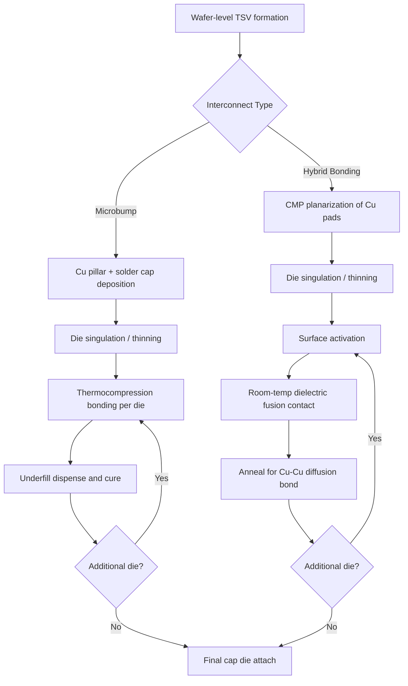

## Microbump versus Hybrid-Bonded Memory Stacking Trade-offs

### Overview

HBM (High Bandwidth Memory) DRAM stacks are assembled by joining multiple DRAM dies vertically using through-silicon vias (TSVs) for signal transmission between tiers. The die-to-die interconnect technology used to join these stacked dies falls into two dominant categories: **microbump (MB) stacking**, the incumbent solder-based approach, and **hybrid bonding (HB)**, a copper-to-copper direct bonding approach displacing microbumps at advanced HBM generations. The choice between these two interconnect schemes drives stack height limits, thermal resistance, bandwidth-per-watt, z-height budget, and ultimately whether HBM roadmaps (HBM3, HBM3E, HBM4, HBM4E) can hit their targeted capacity and performance envelopes within JEDEC package height constraints.

### Microbump Stacking Fundamentals

**Structure and Process**

Microbump stacking uses solder-capped copper pillars (or pure solder microbumps) deposited on the top and bottom surfaces of each DRAM die. Each die's TSVs terminate in a landing pad, onto which a copper pillar with a solder cap (commonly SnAg — tin-silver) is formed. Dies are stacked using thermocompression bonding (TCB) or mass reflow, where the solder caps melt and metallurgically join to the pad of the die below, forming both the electrical and mechanical connection.

**Key Process Characteristics**

- Bump pitch: typically in the 30–40 $\mu m$ range for HBM2E/HBM3-era stacks, though finer pitches (~20–25 $\mu m$) have been demonstrated
- Underfill required between every die pair to mechanically reinforce the joint and prevent solder fatigue/cracking under thermal cycling
- Bonding method: thermocompression bonding with per-die or mass-reflow steps, each requiring precise force, temperature, and time control
- Standoff height per interface: roughly 15–20 $\mu m$ (bump height plus underfill layer)

**Key Points**

- Mature, high-yield process with over a decade of production history across HBM, HBM2, HBM2E, and most HBM3 products
- Underfill dispense and cure adds process steps and cycle time per bonded pair
- Solder joint reliability is governed by electromigration and thermal-cycling fatigue, both of which worsen as bump pitch shrinks
- Each microbump interface contributes measurable parasitic resistance and capacitance, degrading signal integrity as data rates climb

### Hybrid Bonding Fundamentals

**Structure and Process**

Hybrid bonding eliminates the discrete bump entirely. Instead, each die surface is planarized (via chemical-mechanical polishing, CMP) to expose flush copper pads embedded in a dielectric (commonly SiO2 or a similar oxide). Two dies are brought into direct contact: the dielectric surfaces bond first via low-temperature dielectric-to-dielectric fusion, and a subsequent anneal step causes the embedded copper pads to expand and form a direct Cu-Cu metallurgical bond — with no solder, no bump, and no underfill.

**Key Process Characteristics**

- Interconnect pitch: sub-10 $\mu m$, with production and demonstrated pitches in the 4–6 $\mu m$ range (versus 30+ $\mu m$ for microbumps) — roughly an order of magnitude finer
- No solder cap, no discrete standoff gap — dies are essentially in direct contact, reducing per-interface z-height to near zero beyond the thinned die thickness itself
- Requires extremely tight surface planarity (sub-nanometer scale flatness) and particle-free bonding environments, since any topography or contamination prevents proper fusion
- No underfill step, since there is no bump gap to fill

**Key Points**

- Enables far higher I/O density per unit area than microbumps, supporting wider TSV channels or additional redundancy/repair I/O
- Removes the solder joint as a reliability failure mode, replacing it with dielectric-fusion and Cu-Cu diffusion bond integrity as the new reliability driver
- Requires far tighter wafer-level process control (CMP dishing, particle counts, bond alignment accuracy) than microbump TCB
- Enables direct die-on-die stacking without intervening bump layers, reducing total stack thickness significantly across a 12-high or 16-high stack

### Comparative Trade-off Analysis

**Z-Height and Stack Scaling**

The JEDEC HBM package height envelope is fixed regardless of stack count, meaning taller stacks (8-high, 12-high, 16-high) must fit within the same overall package thickness by thinning dies and reducing interconnect height. Microbump interfaces impose a fixed per-layer height penalty (bump + underfill) that becomes the limiting factor as stack count increases. Hybrid bonding removes this penalty almost entirely, which is the primary reason 12-high and 16-high HBM3E/HBM4 stacks have shifted toward hybrid bonding — at 12 or 16 layers, cumulative microbump standoff height alone can consume a disproportionate share of the available package height budget, forcing dies to be thinned to fragility-risking levels to compensate.

**Thermal Resistance**

- Microbumps: the bump/underfill interface has relatively poor thermal conductivity (underfill epoxy is a thermal insulator relative to copper), so each interface adds meaningful junction-to-junction thermal resistance, compounding across an 8-high or 12-high stack and worsening hot-spot formation in lower dies furthest from the heat spreader
- Hybrid bonding: direct Cu-Cu contact provides a much lower-thermal-resistance path between tiers, since copper is a far better conductor than underfill epoxy, and the absence of a bump gap removes an insulating layer entirely
- [Inference] The thermal resistance improvement from hybrid bonding becomes proportionally more significant in taller stacks (12-high, 16-high), where cumulative interface resistance in a microbump stack would otherwise dominate the total thermal budget

**Electrical Performance**

- Microbumps introduce parasitic inductance and capacitance at each solder joint, which degrades signal integrity and increases power consumption per bit transferred as per-pin data rates rise
- Hybrid bonding's direct Cu-Cu connection has substantially lower parasitic capacitance and inductance per interface, supporting higher per-pin bandwidth and improved power efficiency (picojoules per bit) for TSV channel signaling
- This electrical advantage is a primary driver behind HBM4's move to hybrid bonding in conjunction with its 2048-bit-wide interface, since finer pitch and lower parasitics are both needed to route the expanded I/O count within the base die footprint

**Yield and Cost**

- Microbump TCB is a mature, well-characterized process with established yield models and supply chains across multiple OSAT (outsourced semiconductor assembly and test) providers
- Hybrid bonding requires tighter process control (CMP planarity, particle control, bond alignment), which historically carried higher initial defect density and lower yield during ramp, though this gap narrows as the process matures across foundries and memory makers
- [Unverified] Precise yield-crossover points between microbump and hybrid bonding vary by vendor, fab maturity, and stack height, and are not consistently published; production yield figures should be treated as vendor-specific and time-dependent

**Known-Good-Die (KGD) and Rework Implications**

- Microbump stacks permit a degree of rework or replacement at certain assembly stages in some flows, since solder reflow is (in principle) reversible before underfill cure
- Hybrid-bonded stacks are essentially permanent once fused — there is no practical rework path once Cu-Cu diffusion bonding completes — which raises the importance of pre-bond KGD testing and TSV-level repair/redundancy schemes to avoid yield loss propagating through an unrecoverable stack

### Comparison Table

| Attribute | Microbump Stacking | Hybrid Bonding |
| --- | --- | --- |
| Interconnect pitch | ~30–40 $\mu m$ (finer variants ~20–25 $\mu m$) | ~4–10 $\mu m$ |
| Per-interface z-height | Bump + underfill (~15–20 $\mu m$) | Near-zero (direct contact) |
| Underfill required | Yes | No |
| Bonding mechanism | Solder reflow / TCB | Dielectric fusion + Cu-Cu diffusion |
| Thermal resistance per interface | Higher (underfill insulation) | Lower (direct Cu-Cu path) |
| Electrical parasitics | Higher | Lower |
| Process maturity | High (established since HBM2) | Maturing rapidly (HBM3E/HBM4 era) |
| Rework capability | Limited but possible pre-underfill | Effectively none post-bond |
| Best suited for | Lower stack counts (4-high, 8-high) | Taller stacks (12-high, 16-high) |

### Stack Cross-Section Comparison (SVG Diagram)

<svg xmlns="http://www.w3.org/2000/svg" viewBox="0 0 720 420" font-family="Arial, sans-serif">
<text x="180" y="25" font-size="16" font-weight="bold" text-anchor="middle">Microbump Stack (svg_diagram)</text>
<text x="540" y="25" font-size="16" font-weight="bold" text-anchor="middle">Hybrid-Bonded Stack (svg_diagram)</text>

<g>
<rect x="80" y="50" width="200" height="30" fill="#a3c9f1" stroke="#333" />
<text x="180" y="70" font-size="11" text-anchor="middle">DRAM Die (Top)</text>
<rect x="80" y="80" width="200" height="8" fill="#666" />
<text x="285" y="88" font-size="9">Microbump + Underfill</text>



```
<rect x="80" y="88" width="200" height="30" fill="#a3c9f1" stroke="#333" />
<text x="180" y="108" font-size="11" text-anchor="middle">DRAM Die</text>
<rect x="80" y="118" width="200" height="8" fill="#666" />

<rect x="80" y="126" width="200" height="30" fill="#a3c9f1" stroke="#333" />
<text x="180" y="146" font-size="11" text-anchor="middle">DRAM Die</text>
<rect x="80" y="156" width="200" height="8" fill="#666" />

<rect x="80" y="164" width="200" height="30" fill="#a3c9f1" stroke="#333" />
<text x="180" y="184" font-size="11" text-anchor="middle">DRAM Die</text>
<rect x="80" y="194" width="200" height="8" fill="#666" />

<rect x="80" y="202" width="200" height="35" fill="#f4c05a" stroke="#333" />
<text x="180" y="223" font-size="11" text-anchor="middle">Base Logic Die</text>

<line x1="60" y1="50" x2="60" y2="237" stroke="black" stroke-width="1" />
<text x="30" y="150" font-size="10" transform="rotate(-90 30,150)">Taller z-height</text>
```

</g>

<g>
<rect x="440" y="50" width="200" height="30" fill="#a3d9a5" stroke="#333" />
<text x="540" y="70" font-size="11" text-anchor="middle">DRAM Die (Top)</text>
<rect x="440" y="80" width="200" height="2" fill="#c0392b" />



```
<rect x="440" y="82" width="200" height="30" fill="#a3d9a5" stroke="#333" />
<text x="540" y="102" font-size="11" text-anchor="middle">DRAM Die</text>
<rect x="440" y="112" width="200" height="2" fill="#c0392b" />

<rect x="440" y="114" width="200" height="30" fill="#a3d9a5" stroke="#333" />
<text x="540" y="134" font-size="11" text-anchor="middle">DRAM Die</text>
<rect x="440" y="144" width="200" height="2" fill="#c0392b" />

<rect x="440" y="146" width="200" height="30" fill="#a3d9a5" stroke="#333" />
<text x="540" y="166" font-size="11" text-anchor="middle">DRAM Die</text>
<rect x="440" y="176" width="200" height="2" fill="#c0392b" />

<rect x="440" y="178" width="200" height="35" fill="#f4c05a" stroke="#333" />
<text x="540" y="199" font-size="11" text-anchor="middle">Base Logic Die</text>

<line x1="660" y1="50" x2="660" y2="213" stroke="black" stroke-width="1" />
<text x="690" y="140" font-size="10" transform="rotate(-90 690,140)">Reduced z-height</text>
```

</g>

<text x="180" y="260" font-size="9" text-anchor="middle" fill="#555">Gray = solder microbump + underfill gap</text>

<text x="540" y="260" font-size="9" text-anchor="middle" fill="#555">Red line = direct Cu-Cu / dielectric fusion (no gap)</text>

<text x="360" y="300" font-size="10" text-anchor="middle" font-style="italic">Same die count, hybrid-bonded stack achieves lower total height and lower cumulative thermal resistance</text>

</svg>

### Decision Factors by Use Case

**Example**

- **4-high or 8-high HBM3 stack for a mainstream accelerator:** microbump stacking remains viable since cumulative z-height and thermal resistance penalties stay within acceptable bounds, and the process's yield maturity favors cost-sensitive production
- **12-high or 16-high HBM3E/HBM4 stack for flagship AI accelerators:** hybrid bonding becomes necessary because the z-height budget cannot absorb 11–15 microbump interfaces at established bump-plus-underfill heights without excessive die thinning, and thermal resistance in the lower dies would otherwise create unacceptable hot spots under sustained AI training workloads
- **Cost-constrained edge/consumer memory stacks:** microbump remains the pragmatic choice, since hybrid bonding's tighter process control requirements currently carry a cost premium that is difficult to justify outside performance-critical HBM applications

### Process Flow Comparison (Mermaid Diagram)



### Industry Adoption Trends

Major HBM manufacturers have signaled a transition path where hybrid bonding becomes the dominant interconnect for the tallest stack configurations (12-high and beyond), while microbump stacking continues in parallel for lower-layer-count products where its cost and yield maturity remain advantageous. [Inference] The crossover point at which hybrid bonding becomes cost-competitive with microbump stacking at equivalent stack heights is likely to shift over time as hybrid bonding process yields mature and tooling costs amortize across higher production volumes, though exact timelines are vendor-dependent and not fully public.

**Conclusion**

Microbump stacking remains the incumbent, high-yield, cost-effective interconnect for moderate-height HBM stacks, but its cumulative z-height and thermal resistance penalties scale unfavorably as stack count increases. Hybrid bonding directly addresses these scaling limits through near-zero interface height and superior thermal/electrical characteristics, at the cost of tighter process control requirements and the loss of post-bond rework capability. The industry trend places hybrid bonding as the enabling technology for 12-high and 16-high HBM3E/HBM4-class stacks, while microbump stacking persists for lower-layer-count, cost-sensitive HBM products.

**Related Topics**

- TSV (through-silicon via) formation and scaling limits for HBM base/core dies
- Die thinning and wafer handling challenges for sub-30 $\mu m$ HBM dies
- Known-Good-Die (KGD) testing and TSV redundancy/repair schemes
- Thermal management and hot-spot mitigation in tall HBM stacks (thermal vias, TSV placement for heat spreading)
- HBM4 2048-bit interface and base-die logic integration (custom base die trends)
- Hybrid bonding for chiplet-to-chiplet integration beyond memory (e.g., 3D logic stacking)
- CMP planarity requirements and defect density control in hybrid bonding fabs
- Comparison of thermocompression bonding (TCB) versus mass reflow for microbump assembly