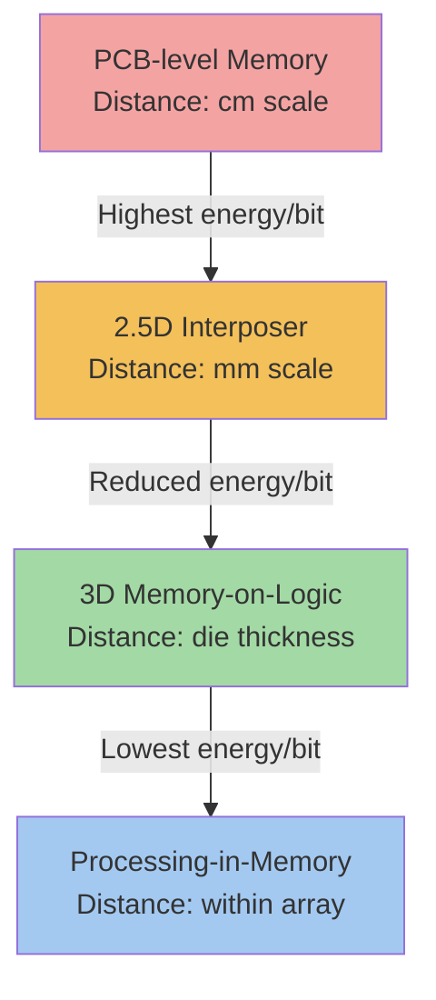

## Memory-on-Logic and Near-Memory Integration Architectures

### Overview

Memory-on-logic and near-memory integration architectures describe packaging approaches that place memory dies in extremely close physical proximity to (or directly stacked upon) compute logic dies, minimizing the interconnect distance data must travel between processing units and memory. This category spans a spectrum from true 3D memory-on-logic stacking (where DRAM or SRAM dies sit directly atop a logic die using hybrid bonding or microbumps) to 2.5D near-memory placement (where HBM stacks sit adjacent to a compute die on a shared interposer). These architectures directly address the "memory wall" — the growing gap between compute throughput and memory bandwidth/latency — which has become a primary bottleneck for AI training, inference, and high-performance computing workloads.

### Architectural Spectrum

**Key Points**

- **2.5D near-memory (HBM-adjacent):** compute die and HBM stacks sit side-by-side on a passive or active interposer, connected via fine-pitch interposer routing; this is the current mainstream architecture for AI accelerators (e.g., GPU/HBM configurations)
- **3D memory-on-logic (direct stacking):** memory die(s) stacked directly on top of a logic die using TSVs and hybrid bonding or microbumps, eliminating interposer routing entirely for the memory-logic interface
- **Hybrid approaches:** some architectures combine both — a 3D-stacked cache or buffer die directly on logic, with additional 2.5D HBM stacks nearby for bulk capacity

### 2.5D Near-Memory Integration

**Structure**

In 2.5D near-memory integration, the compute logic die (GPU, AI accelerator ASIC, CPU) and one or more HBM stacks are placed side-by-side on a silicon interposer or advanced substrate (e.g., organic interposer, silicon bridge). Fine-pitch redistribution layers (RDL) on the interposer route signals between the compute die's HBM PHY and each HBM stack's base logic die.

**Key Points**

- Interposer routing distance is on the order of hundreds of micrometers to a few millimeters, still dramatically shorter than traditional PCB-level memory routing (centimeters)
- Silicon interposers offer the finest routing pitch and best signal integrity but carry higher cost and size (reticle-limited) constraints
- Silicon bridge approaches (e.g., embedded multi-die interconnect bridges) provide localized fine-pitch routing only at the die-to-die junctions, reducing the cost of a full silicon interposer while retaining most of the bandwidth benefit
- This is the dominant architecture for current-generation AI accelerators, balancing bandwidth, yield, and cost

### 3D Memory-on-Logic Stacking

**Structure**

In 3D memory-on-logic architectures, memory dies (often SRAM or DRAM) are directly bonded on top of a logic die using TSVs through the logic die (or the memory die) and hybrid bonding or microbump interconnects at the die-to-die interface. This eliminates the interposer-level routing hop entirely, since memory and logic are vertically integrated within a single 3D stack.

**Key Points**

- Interconnect distance shrinks from hundreds of micrometers (2.5D) to effectively the die thickness itself (tens of micrometers), reducing both latency and per-bit energy cost
- Hybrid bonding is increasingly the preferred interconnect for memory-on-logic stacking due to its fine pitch (enabling massive I/O density between memory and logic) and superior thermal path (critical since the logic die is now a heat source directly beneath the memory die)
- Thermal management becomes significantly more challenging than 2.5D approaches, since the memory die sits directly atop the logic die's hottest regions, requiring careful floorplanning to keep memory away from peak thermal density zones or requiring advanced cooling solutions (e.g., backside power delivery combined with backside cooling)
- TSV placement in the logic die must coexist with the logic die's own active circuitry, requiring co-design between the logic die's floorplan and the memory die's TSV landing pattern

**Example**

AMD's 3D V-Cache technology exemplifies memory-on-logic stacking at the SRAM level, where an additional SRAM die is hybrid-bonded directly on top of a CPU core die to expand last-level cache capacity without consuming additional core die area. [Unverified] Specific interconnect pitch and process details for such implementations are proprietary and vary by vendor generation; general architecture principles described here reflect industry-standard practice rather than any single vendor's exact specifications.

### Near-Memory Compute and Processing-in-Memory Concepts

**Key Points**

- Near-memory computing extends beyond pure packaging proximity to include logic embedded within the memory stack's base die (e.g., HBM base logic dies performing simple compute operations like reduction or accumulation before data leaves the stack)
- Processing-in-memory (PIM) concepts push this further, embedding compute elements within the DRAM core dies themselves, though this remains more architecturally complex and less commercially mainstream than base-die-level near-memory compute
- HBM-PIM and similar research/product directions aim to reduce data movement energy costs by performing simple operations (e.g., multiply-accumulate for AI workloads) at or near the memory array, rather than moving all data to the compute die for processing
- [Inference] As AI workload memory bandwidth demands continue to outpace compute scaling, near-memory and in-memory compute architectures are likely to see increased architectural exploration, though widespread commercial adoption of full processing-in-memory remains uncertain given the significant DRAM process modifications required

### Interconnect Distance and Energy Cost Comparison (Mermaid Diagram)

### Thermal Co-Design Considerations

**Key Points**

- In memory-on-logic stacks, the logic die's power density (often tens of W/mm² in localized hotspots) directly conducts heat into the memory die above it, which has much tighter thermal operating margins than logic (DRAM retention times degrade significantly at elevated temperatures)
- Floorplanning strategies often deliberately avoid placing memory directly above the logic die's highest-power blocks, using thermal-aware placement to route memory over lower-power logic regions where feasible
- Backside power delivery network (BSPDN) architectures, increasingly adopted in advanced logic nodes, can help by moving power routing to the wafer backside, freeing up thermal and routing resources on the front side where memory-on-logic bonding occurs — though this adds additional process complexity
- [Speculation] Future memory-on-logic architectures may increasingly rely on embedded microfluidic or advanced vapor chamber cooling solutions integrated directly into the package stack, given that traditional heat-spreader-based cooling struggles to extract heat efficiently through a multi-die 3D stack

### System-Level Trade-offs: 2.5D vs. 3D Approaches

| Attribute | 2.5D Near-Memory | 3D Memory-on-Logic |
| --- | --- | --- |
| Interconnect distance | mm scale (interposer routing) | Die-thickness scale (tens of $\mu m$) |
| Bandwidth potential | High (current HBM standard) | Higher (finer pitch, more I/O density) |
| Thermal complexity | Moderate (side-by-side heat sources) | High (stacked heat sources) |
| Process maturity | High (established HBM/interposer flows) | Maturing (hybrid bonding ramp-dependent) |
| Rework/yield recovery | Possible at interposer assembly stage | Limited to none post-bond |
| Primary use case | Bulk memory capacity (AI accelerators) | Cache expansion, tightly coupled buffers |

### Why This Matters for AI and HPC Systems

**Key Points**

- Memory bandwidth per unit of compute (bytes/FLOP) is a primary limiting factor for AI training and inference throughput, making interconnect distance reduction directly translatable to system-level performance gains
- Energy per bit transferred scales with interconnect distance and parasitic capacitance, so shrinking that distance through near-memory or memory-on-logic integration directly reduces total system power consumption for memory-bound workloads
- As AI model sizes and context lengths grow, the pressure to reduce memory access latency and energy cost continues to push architectures further along the spectrum from PCB-level memory toward tighter 3D integration

**Conclusion**

Memory-on-logic and near-memory integration architectures represent a continuum of packaging strategies aimed at closing the gap between compute and memory, ranging from established 2.5D interposer-based HBM placement to emerging 3D memory-on-logic stacking enabled by hybrid bonding. Each step closer to true 3D integration reduces interconnect distance, latency, and energy per bit, but introduces increasingly difficult thermal co-design challenges as memory dies are placed directly atop active heat-generating logic. The trajectory of this trend is closely tied to hybrid bonding process maturity and advances in backside power delivery and cooling technologies.

**Related Topics**

- Microbump versus hybrid-bonded memory stacking trade-offs
- JEDEC standardization and stack-height limit evolution
- Backside power delivery network (BSPDN) architectures and thermal implications
- Silicon interposer versus silicon bridge routing architectures (2.5D packaging)
- Processing-in-memory (PIM) and HBM-PIM research directions
- Thermal-aware floorplanning for 3D-stacked heterogeneous dies
- TSV co-design constraints between logic and memory dies in 3D stacks