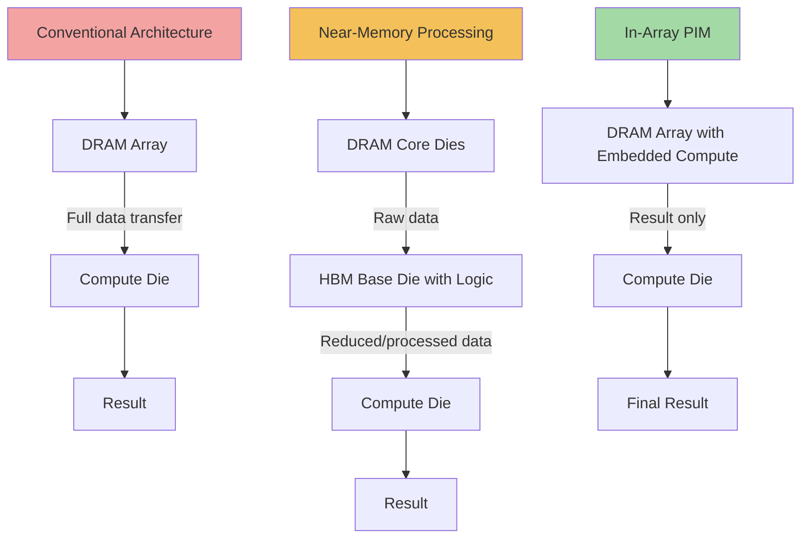

## Processing-in-Memory and Memory-Logic Convergence Concepts

### Overview

Processing-in-memory (PIM) and memory-logic convergence describe architectural approaches that embed computational capability directly within or immediately adjacent to memory arrays, rather than transferring all data to a separate compute die for processing. The underlying motivation is the "memory wall" and, more specifically, the energy and latency cost of data movement: in conventional von Neumann architectures, moving a bit of data from DRAM to a compute core can consume orders of magnitude more energy than the arithmetic operation performed on it. PIM and memory-logic convergence architectures aim to reduce this cost by performing computation where the data already resides, ranging from simple near-bank arithmetic in HBM base dies to more ambitious in-array analog or digital compute schemes.

### Taxonomy of Approaches

**Key Points**

- **Near-memory processing (NMP):** compute logic placed close to memory but still architecturally distinct — e.g., logic embedded in an HBM base die, or a small compute die stacked beneath/beside DRAM
- **Processing-in-memory (PIM) / processing-using-memory (PUM):** compute operations performed within the memory array itself, using either digital logic integrated into the DRAM periphery or analog computation exploiting the memory cell's physical characteristics
- **Memory-logic convergence:** a broader architectural trend where the traditional boundary between "memory" and "logic" dies blurs, driven by 3D integration and hybrid bonding enabling arbitrary logic-memory co-placement

### Near-Memory Processing in HBM Base Dies

**Structure**

HBM stacks already include a base logic die beneath the stacked DRAM core dies, originally intended purely for TSV routing, PHY, and command/address decode. Near-memory processing extends this base die's role to include simple compute functions — such as reduction operations, data type conversion, or accumulation — performed on data as it passes through the base die, before being transferred across the 2.5D interposer to the main compute die.

**Key Points**

- This approach requires no modification to the DRAM core die process, since all added logic resides in the base die (typically fabricated on a more logic-friendly process node than the DRAM core dies)
- Bandwidth savings arise because only the reduced/processed result needs to cross the interposer to the compute die, rather than the full raw dataset
- This is the most commercially mature form of PIM-adjacent technology, having appeared in research and limited commercial HBM-PIM products aimed at AI inference acceleration
- [Unverified] Specific commercial HBM-PIM product availability and feature sets change over time and vary by vendor; readers should verify current product status directly with memory vendors rather than assuming general availability

### In-Array Processing-in-Memory

**Structure**

True in-array PIM embeds compute functionality within the DRAM (or SRAM, or emerging memory technology) array itself, exploiting the physical characteristics of the memory cells or the sense amplifier circuitry to perform operations directly on stored data without shipping it out of the array through the normal read path.

**Key Points**

- **Digital PIM:** adds dedicated digital logic (e.g., bit-serial ALUs) within or adjacent to memory banks, executing simple operations like bitwise AND/OR, addition, or multiply-accumulate directly on data resident in nearby rows
- **Analog PIM:** exploits the analog behavior of memory cells (e.g., bitline charge-sharing in DRAM, or resistance-based computation in emerging non-volatile memory like ReRAM/PCM) to perform operations such as multiply-accumulate as a natural consequence of the physical read process, particularly attractive for AI inference workloads dominated by matrix-vector multiplication
- Analog PIM approaches often trade computational precision for extreme energy efficiency, since analog computation is inherently susceptible to noise and process variation, requiring careful calibration or hybrid analog-digital correction schemes
- In-array PIM requires modifications to the DRAM array's peripheral circuitry, which can reduce array density (fewer bits per unit area) and complicate the DRAM process — a significant commercial adoption barrier given DRAM's extreme cost sensitivity

### Memory-Logic Convergence via 3D Integration

**Key Points**

- Hybrid bonding's fine pitch (single-digit micrometer) enables I/O densities between stacked dies that begin to approach the density of on-die wiring, which architecturally blurs the distinction between "a memory die connected to a logic die" and "a single die with both memory and logic regions"
- This trend supports architectures where compute units are distributed throughout a 3D stack rather than concentrated in a single base logic die — for example, multiple thin logic layers interleaved with memory layers, each handling a slice of the overall computation
- [Speculation] As hybrid bonding pitch continues to scale finer, the architectural line between "near-memory compute" and "in-memory compute" may become increasingly a matter of implementation detail rather than a fundamental design category, since sufficiently dense 3D interconnect approaches the bandwidth and latency characteristics of monolithic on-die interconnect

### PIM Architecture Comparison (Mermaid Diagram)

### Energy and Bandwidth Trade-offs

**Key Points**

- Data movement energy cost typically scales with physical distance and the number of interconnect hops crossed, meaning near-memory processing (staying within the HBM stack/base die) saves more energy than performing the equivalent computation on a separate compute die across an interposer
- In-array PIM offers the largest theoretical energy savings since data never leaves the array for computation, but this benefit is workload-dependent — operations that require complex control flow, high precision, or access to large working sets across many memory rows see diminished PIM benefit compared to simple, data-parallel operations like reduction or matrix-vector multiplication
- [Inference] PIM architectures are likely to see the strongest commercial traction in workloads with highly regular, data-parallel access patterns — such as AI inference matrix operations or database scan/filter operations — rather than general-purpose computing, given the architectural specialization required

### Commercial and Research Adoption Barriers

**Key Points**

- DRAM process economics strongly favor minimal peripheral circuitry changes, since even small increases in per-bit area directly increase cost at DRAM's enormous production volumes — this is the primary barrier to widespread in-array PIM adoption
- Software/programming model complexity is a significant barrier: PIM architectures often require explicit programmer or compiler awareness of which operations can be offloaded to memory, breaking the traditional abstraction that memory is a passive storage resource
- Precision and reliability concerns, particularly for analog PIM approaches, complicate adoption in workloads requiring high numerical accuracy, though this is less of a concern for approximate or reduced-precision AI inference workloads
- Near-memory approaches (HBM base-die logic) face fewer of these barriers since they preserve conventional DRAM array design, which is a primary reason near-memory processing has seen more commercial traction than true in-array PIM

### Relevance to Advanced Packaging

**Key Points**

- PIM and memory-logic convergence architectures are fundamentally enabled by advanced packaging capability — the ability to closely integrate specialized logic with memory dies (via 2.5D interposers, 3D stacking, and hybrid bonding) is a prerequisite for most practical PIM implementations
- As hybrid bonding pitch scales finer and 3D stacking becomes more prevalent, the packaging-level enabling technology for more ambitious memory-logic convergence architectures continues to mature, even though DRAM-process-level barriers to in-array PIM remain largely independent of packaging advances
- This makes PIM a useful lens for understanding why advanced packaging investment (hybrid bonding, fine-pitch interconnect, thermal co-design) matters beyond simply "more bandwidth" — it is also an enabler for fundamentally different compute-memory architectural paradigms

**Conclusion**

Processing-in-memory and memory-logic convergence concepts span a spectrum from commercially mature near-memory processing (logic embedded in HBM base dies) to more architecturally ambitious in-array PIM schemes that remain constrained by DRAM process economics and programming model complexity. Advanced packaging technologies — particularly hybrid bonding's fine-pitch 3D integration — serve as a key enabling layer for this architectural trend, progressively blurring the traditional boundary between memory and logic dies. Near-memory approaches see the most near-term commercial traction, while true in-array PIM remains an active research area with workload-specific rather than general-purpose adoption potential.

**Related Topics**

- Memory-on-logic and near-memory integration architectures
- Microbump versus hybrid-bonded memory stacking trade-offs
- HBM base logic die architecture and PHY design
- Analog compute-in-memory using emerging non-volatile memory (ReRAM, PCM, MRAM)
- AI accelerator memory bandwidth bottlenecks and the memory wall
- 3D stacked logic-memory interleaving architectures
- DRAM process economics and peripheral circuitry cost sensitivity