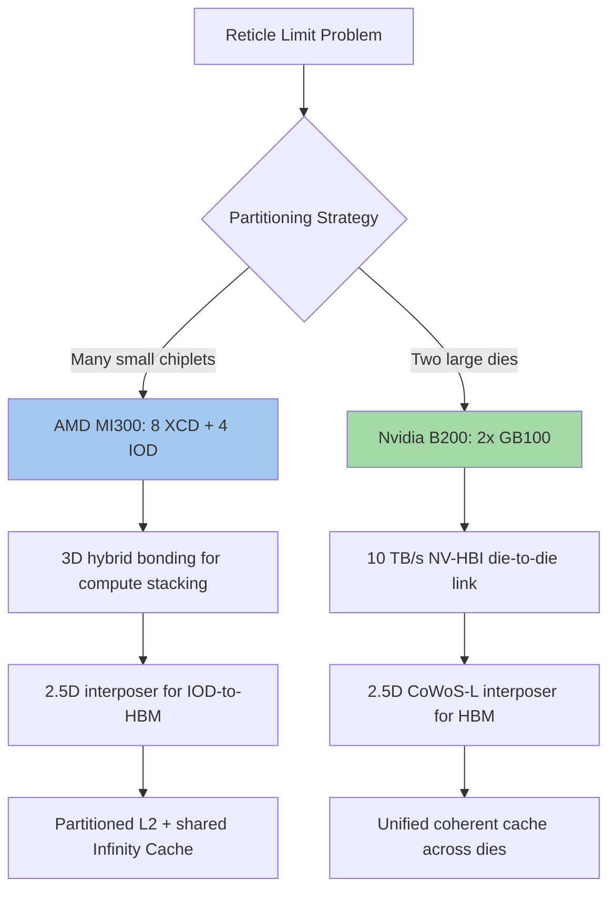

## Multi-Die AI Accelerator Architecture Case Studies

### Overview

Multi-die AI accelerator architectures partition what would traditionally be a single monolithic GPU or ASIC die into multiple smaller dies (chiplets), connected via advanced packaging technologies such as 2.5D silicon interposers, 3.5D hybrid-bonded stacking, and high-bandwidth die-to-die interconnects. This approach addresses reticle-size limits, yield economics, and heterogeneous process-node optimization, allowing accelerator vendors to combine compute dies, I/O dies, cache dies, and HBM memory stacks within a single package. This section examines two major production case studies — AMD's Instinct MI300 series and Nvidia's Blackwell architecture — as representative examples of current multi-die AI accelerator design philosophy.

### Case Study 1: AMD Instinct MI300 Series

**Architectural Structure**

The AMD Instinct MI300 series (MI300A, MI300X) uses a 3.5D packaging approach combining 3D hybrid-bonded chiplet stacking with a 2.5D silicon interposer. The design integrates GPU and I/O chiplets using TSMC's system on integrated chip (SoIC) hybrid bonding technology, adding another dimension of integration above the chip-on-wafer-on-substrate (CoWoS) silicon interposer. [TechInsights](https://www.techinsights.com/blog/amd-instinct-mi300x-processor-floorplan-analysis)

**Key Points**

- The MI300 series incorporates up to eight vertically stacked GPU chiplets, called Accelerator Complex Dies (XCDs), and four I/O dies (IODs) for system infrastructure, interconnected through AMD Infinity Fabric technology and integrated with eight stacks of high-bandwidth memory. [TechInsights](https://www.techinsights.com/blog/amd-instinct-mi300x-processor-floorplan-analysis)
- The MI300A is comprised of 13 chiplets total (3 CCD, 6 XCD, 4 IO), while the MI300X uses 12 chiplets (8 XCD, 4 IO); both use 3D hybrid-bonded SoIC technology. [HotHardware](https://hothardware.com/reviews/amd-instinct-mi300-family-architecture-advancing-ai-and-hpc)
- Each pair of XCDs is 3D-stacked on a single IOD, allowing for tight integration and low-latency interconnects. [Amd](https://instinct.docs.amd.com/projects/amdgpu-docs/en/latest/gpu-partitioning/mi300x/overview.html)
- The IODs act as an active interposer with cache, sitting atop a further active interposer layer that enables fast cross-IOD communication and access to HBM3 memory. [Chips and Cheese](https://chipsandcheese.com/p/inside-the-amd-radeon-instinct-mi300as)
- The full package sits on a record-breaking 3.5x reticle silicon interposer using TSMC's CoWoS-S technology, with over 100 individual pieces of silicon assembled together, ranging from HBM memory layers to active interposers to compute dies to blank structural silicon. [Semianalysis](https://newsletter.semianalysis.com/p/amd-mi300-taming-the-hype-ai-performance)

**Memory Subsystem**

- The MI300X integrates 192GB of HBM3 memory delivering 5.3 TB/s of bandwidth. [arxiv](https://arxiv.org/pdf/2506.00008)
- Memory capacity varies by variant: AMD used eight 8-high HBM3 stacks for the MI300A (128GB total) versus eight 12-high stacks for the MI300X (192GB total), with AMD stating this choice was driven by target workload tailoring for HPC versus AI use cases rather than power or thermal constraints. [Tom's Hardware](https://www.tomshardware.com/pc-components/cpus/amd-unveils-instinct-mi300x-gpu-and-mi300a-apu-claims-up-to-16x-lead-over-nvidias-competing-gpus)
- The MI300 features a 128-channel interface to its HBM3 memory, with each IO die connected to two HBM3 stacks, plus 256MB of AMD Infinity Cache and an Infinity Fabric network-on-chip comprised of 128 total 32Gb links. [HotHardware](https://hothardware.com/reviews/amd-instinct-mi300-family-architecture-advancing-ai-and-hpc)

**Cache Hierarchy**

- MI350-generation devices deliver 256 compute units across 8 XCDs (32 CUs per XCD), with HBM3 bandwidth exceeding 5 TB/s and 8 stacks of HBM totaling 288GB, visible as a single global address space allowing workgroups on any chiplet to access data in any HBM stack. [arxiv](https://arxiv.org/pdf/2604.15379)
- Unlike typical monolithic GPUs with a unified L2 cache, the L2 cache in these devices is partitioned: each XCD has a private 4MB L2 cache (32MB total across the package), with an additional 256MB last-level Infinity Cache shared across all eight XCDs, sitting between L2 and HBM as a victim cache for L2 evictions. [arxiv](https://arxiv.org/pdf/2604.15379)
- [Inference] This partitioned cache architecture reflects a broader multi-die design trade-off: a fully unified cache would require expensive full-bandwidth coherence traffic across every die-to-die link, so partitioned per-chiplet caches backed by a shared last-level cache balance locality against coherence overhead.

**Compute Density**

- Each CDNA 3 compute chiplet features 40 compute units backed by 4MB of shared L2 cache, with only 38 activated per chiplet as a yield-defect mitigation strategy; in total, the MI300X packs 304 active compute units alongside 192GB of HBM3 into a single package. [The Register](https://www.theregister.com/2023/12/06/amd_mi300_gpu/)
- The MI300X contains approximately 153 billion transistors fabricated using a combination of TSMC 5nm and 6nm process technologies, with a 750W TDP, delivering approximately 1,307 TFLOPS at FP16/BF16 precision. [arxiv](https://arxiv.org/pdf/2506.00008)

### Case Study 2: Nvidia Blackwell (B200 / GB200)

**Architectural Structure**

Nvidia's Blackwell architecture addresses reticle-size limits through a dual-die approach rather than AMD's many-small-chiplet strategy. At 4nm feature sizes, reticle limits cap the maximum die area a fab can produce, and a single Blackwell compute die at roughly 104 billion transistors is already at or near that reticle limit. [Packet](https://packet.ai/blog/nvidia-blackwell-architecture)

**Key Points**

- Nvidia's B100/B200 accelerators utilize two GB100 dies in a single package, connected with a 10 TB/s link that Nvidia calls the NV-High Bandwidth Interface (NV-HBI), based on the NVLink 7 protocol. [Wikipedia](https://en.wikipedia.org/wiki/Blackwell_(microarchitecture))
- The two connected GB100 dies are able to act like a large monolithic piece of silicon with full cache coherency between both dies, and the dual-die package totals 208 billion transistors. [Wikipedia](https://en.wikipedia.org/wiki/Blackwell_(microarchitecture))
- The two GB100 dies are placed on top of a silicon interposer produced using TSMC's CoWoS-L 2.5D packaging technique. [Wikipedia](https://en.wikipedia.org/wiki/Blackwell_(microarchitecture))
- Nvidia's Blackwell GPUs pack 208 billion transistors and are manufactured using a custom-built TSMC 4NP process, with all Blackwell products featuring two reticle-limited dies connected by a 10 terabytes per second chip-to-chip interconnect in a unified single GPU. [CUDO Compute](https://www.cudocompute.com/blog/nvidias-blackwell-architecture-breaking-down-the-b100-b200-and-gb200)
- [Unverified] Reported R&D cost figures for the NV-HBI interconnect (cited informally at approximately $10 billion by Nvidia's CEO in a media interview, with some engineers publicly disputing the figure) should be treated as a contested claim rather than a verified engineering cost breakdown.

**Memory Subsystem**

- The GB200's memory system provides 192GB of HBM3e memory delivering 8 TB/s bandwidth, distributed across 8 memory stacks, with an on-chip cache hierarchy including approximately 90MB of L2 cache. [arxiv](https://arxiv.org/pdf/2506.00008)
- The next HBM generation, HBM4, expected in late 2026 for AMD's MI400 and 2027 for Nvidia's Rubin products, is anticipated to offer up to 512GB per stack and over 2 TB/s per stack bandwidth, with 3D stacking enabling trillion-parameter model training without model parallelism across devices. [Calmops](https://calmops.com/ai/ai-hardware-accelerators-complete-guide/)

**System-Scale Integration**

- The GB200 module is a multi-chip module (MCM) that mounts to a baseboard, which must handle combined power delivery, NVLink routing to neighboring modules, and network connectivity within rack-optimized form-factor constraints. [NextPCB](https://www.nextpcb.com/blog/nvidia-blackwell-architecture-b200-gb200-pcb-design)
- The GB200 NVL72 rack-scale system connects 36 Grace CPUs and 72 Blackwell GPUs, and independent MLPerf Training 4.1 benchmarks confirmed Blackwell's gains, with B200-based systems delivering 2.2x faster Llama 2 70B fine-tuning and 2x faster GPT-3 175B pre-training compared to H100. [CUDO Compute](https://www.cudocompute.com/blog/nvidias-blackwell-architecture-breaking-down-the-b100-b200-and-gb200)
- The GB200 NVL72 operates as a single logical GPU with 13.5 TB of unified HBM3e memory and 130 petaFLOPS of FP4 compute. [NextPCB](https://www.nextpcb.com/blog/nvidia-blackwell-architecture-b200-gb200-pcb-design)

### Comparative Architecture Table

| Attribute | AMD MI300X | Nvidia B200 |
| --- | --- | --- |
| Die partitioning strategy | Many small chiplets (8 XCD + 4 IOD) | Two large reticle-limited dies |
| Vertical integration | 3D hybrid-bonded (SoIC) stacking on active interposer | 2.5D only (no 3D die stacking of compute dies) |
| Base interposer technology | TSMC CoWoS-S (2.5D silicon interposer) | TSMC CoWoS-L (2.5D silicon interposer) |
| Die-to-die interconnect | AMD Infinity Fabric | NV-HBI (NVLink 7-based), 10 TB/s |
| HBM memory | 192GB HBM3, 5.3 TB/s | 192GB HBM3e, 8 TB/s |
| Transistor count | ~153 billion | 208 billion |
| Cache architecture | Partitioned per-chiplet L2 + shared Infinity Cache | Shared coherent L2 across dies |

### Multi-Die Partitioning Philosophy Comparison (Mermaid Diagram)

### Architectural Trade-offs: Many Small Chiplets vs. Two Large Dies

**Key Points**

- AMD's many-chiplet approach maximizes yield benefits, since smaller individual dies have inherently higher per-die yield than large monolithic or dual-large-die designs, and defective compute units can be disabled (as seen in the MI300X's 38-of-40 active CU strategy) without discarding the entire chiplet
- Nvidia's two-large-die approach minimizes the number of die-to-die interfaces the system must maintain coherency across, simplifying certain aspects of cache coherence and programming model complexity, at the cost of each die individually pushing closer to reticle limits
- [Inference] AMD's approach trades interconnect complexity (more die-to-die links, more partitioned cache management) for yield economics and modularity, while Nvidia's approach trades yield risk on very large dies for a simpler two-die coherency domain — both are valid responses to the same underlying reticle-limit constraint, reflecting different vendor priorities around cost structure and design complexity
- Both architectures rely on 2.5D silicon interposers (CoWoS-S for AMD, CoWoS-L for Nvidia) as the common foundation for HBM integration, showing convergence on interposer-based memory attachment despite differing compute-die partitioning philosophies
- AMD's additional use of 3D hybrid bonding for XCD-to-IOD stacking represents a further integration step beyond Nvidia's purely 2.5D dual-die approach, illustrating how "multi-die" architectures can combine 2.5D and 3D techniques within a single package (sometimes termed "3.5D" packaging)

### System-Level Scaling Implications

**Key Points**

- Both case studies scale beyond the single-package level into rack-scale systems: AMD's MI300X is deployed in 8-GPU server configurations, while Nvidia's GB200 NVL72 connects 72 GPUs and 36 CPUs into a single NVLink-coherent domain
- The GB200 NVL72's scale-up interconnect enables 30x more tokens generated for inference compared to equivalent Hopper-generation configurations, driven substantially by increased HBM3e bandwidth and the expanded coherent GPU domain. [CUDO Compute](https://www.cudocompute.com/blog/nvidias-blackwell-architecture-breaking-down-the-b100-b200-and-gb200)
- [Inference] The trend across both case studies suggests that multi-die packaging decisions at the single-package level (chiplet count, interconnect bandwidth, cache partitioning) directly shape what is architecturally feasible at the rack scale, since package-level interconnect bandwidth and coherence design choices propagate into how efficiently many packages can be federated into a single logical accelerator domain

**Conclusion**

The AMD MI300 series and Nvidia Blackwell architecture represent two distinct but complementary responses to the same reticle-limit and yield-economics pressures driving the industry toward multi-die AI accelerator design. AMD's approach emphasizes many small, yield-friendly chiplets combined via both 3D hybrid bonding and 2.5D interposer integration, while Nvidia's approach emphasizes two large reticle-limited dies joined by an extremely high-bandwidth proprietary interconnect. Both converge on 2.5D silicon interposer technology for HBM memory integration, underscoring the interposer's role as foundational infrastructure across differing multi-die philosophies.

**Related Topics**

- Microbump versus hybrid-bonded memory stacking trade-offs
- CoWoS (Chip-on-Wafer-on-Substrate) interposer technology variants (CoWoS-S, CoWoS-L, CoWoS-R)
- UCIe (Universal Chiplet Interconnect Express) standardization for die-to-die interoperability
- Reticle-limit constraints and their influence on chiplet partitioning strategy
- Cache coherence protocol design across multi-die and multi-package accelerator domains
- Rack-scale interconnect fabrics (NVLink/NVSwitch, Infinity Fabric) for federated multi-GPU systems
- Yield economics and known-good-die testing in high-chiplet-count packages