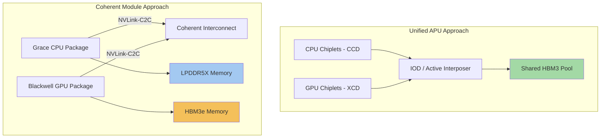

## CPU-GPU-Memory Co-Packaging Strategies

### Overview

CPU-GPU-memory co-packaging integrates central processing units, graphics/accelerator processing units, and high-bandwidth memory within a single package or tightly coupled module, rather than connecting these components via traditional board-level interfaces (PCIe slots, DIMM sockets). This approach reduces interconnect latency and increases bandwidth between compute and memory resources, enabling architectures where CPU and GPU share a unified memory pool and communicate via package-level or module-level links rather than system-bus-level protocols. Co-packaging strategies span a spectrum from fully unified APU (accelerated processing unit) designs with shared memory, to superchip modules pairing discrete CPU and GPU dies with coherent short-reach interconnects, to rack-scale coherent domains that extend the co-packaging philosophy beyond a single physical package.

### Architectural Approaches to CPU-GPU-Memory Integration

**Key Points**

- **Unified APU (single package, shared memory):** CPU and GPU compute dies integrated within the same package, sharing a single HBM memory pool accessible to both without data copying
- **Superchip module (paired dies, coherent interconnect):** discrete CPU and GPU packages connected via a high-bandwidth, cache-coherent short-reach interconnect, each with access to the other's memory pool through the coherent link rather than true physical memory sharing
- **Rack-scale coherent domain:** multiple CPU-GPU modules connected via a scale-up fabric (e.g., NVLink/NVSwitch) that presents an even larger pool of memory and compute as a single logical coherent domain

### Case Study: AMD MI300A (Unified APU Architecture)

**Structure**

The AMD Instinct MI300A is AMD's data center APU accelerator for AI and HPC applications, combining CDNA 3 GPU compute architecture with Zen 4 CPU chiplets and unified HBM3 memory, accessible to both the GPU accelerators and CPU cores.

**Key Points**

- MI300A uses three Core Complex Dies (CCDs), each containing eight Zen 4 CPU cores (24 total threaded cores), alongside six Accelerator Complex Dies (XCDs), each containing 38 active CDNA3 Compute Units, for a total of 228 CDNA 3 compute units
- All compute chiplets (both CCDs and XCDs) sit atop four I/O dies (IODs), which act as an active interposer with cache; the IODs then sit on a further active interposer layer enabling fast cross-IOD communication and access to HBM3 memory
- MI300A integrates 128GB of shared, unified HBM3 memory accessible to both the GPU accelerators and CPU cores, using eight 8-high HBM3 stacks, with AMD reporting the reduced capacity (relative to the MI300X's 192GB) reflects workload tailoring rather than power or thermal constraints
- Because CPU and GPU share the same physical HBM3 pool through the same IOD/interposer fabric, data does not need to be copied between separate CPU and GPU memory spaces — a workload can pass a pointer between CPU and GPU code without explicit memory transfer, unlike traditional discrete-GPU architectures requiring PCIe-based host-to-device copies
- This architecture is used in exascale HPC deployments (e.g., systems requiring tightly coupled CPU-GPU memory sharing for scientific computing workloads), where eliminating explicit memory copy overhead is architecturally significant for irregular, latency-sensitive HPC codes

**Example**

A scientific computing application performing a physics simulation can allocate a single shared memory buffer, have the CPU (Zen 4 cores) initialize simulation parameters directly into that buffer, and have the GPU (CDNA3 compute units) read that same buffer immediately for the compute-heavy simulation kernel, all without an explicit host-to-device memory copy step, since both compute types access the same physical HBM3 pool via the shared IOD/interposer fabric.

### Case Study: Nvidia GB200 Grace Blackwell Superchip (Coherent Module Architecture)

**Structure**

The Nvidia GB200 Grace Blackwell Superchip pairs one Grace CPU with two Blackwell B200 GPU packages, connected via NVLink-C2C (chip-to-chip), a cache-coherent, low-latency memory interconnect that replaces the traditional PCIe host interface between CPU and GPU.

**Key Points**

- Unlike MI300A's single shared physical memory pool, GB200 pairs a Grace CPU package (with its own LPDDR5X memory) and Blackwell GPU packages (with HBM3e memory) as separate physical memory pools connected via a coherent interconnect, rather than a single unified physical memory die-stack
- NVLink-C2C provides cache coherency between the Grace CPU and Blackwell GPU memory spaces despite being physically separate packages, allowing software to treat CPU and GPU memory as a coherent address space even though the underlying physical memory technologies differ (LPDDR5X for CPU-side memory, HBM3e for GPU-side memory)
- This represents a different co-packaging philosophy than MI300A's true unified-memory APU approach: GB200 achieves coherence through a very high-bandwidth interconnect protocol bridging otherwise-separate memory pools, rather than through physically shared memory silicon
- The GB200 module is a multi-chip module (MCM) mounting to a baseboard, which handles combined power delivery, NVLink routing, and network connectivity — a physically co-packaged unit at the module level even though CPU and GPU retain physically distinct memory
- [Inference] This module-level coherent-interconnect approach offers more flexibility in independently scaling CPU and GPU memory capacity and choosing memory technology optimized for each processor type (LPDDR5X's power efficiency for CPU-side memory vs. HBM3e's bandwidth for GPU-side memory), at the cost of not achieving true zero-copy physical memory sharing

### Comparison: Unified APU vs. Coherent Module Approaches

| Attribute | Unified APU (MI300A) | Coherent Module (GB200) |
| --- | --- | --- |
| Memory pool | Single physical HBM3 pool, shared | Separate physical pools (LPDDR5X + HBM3e), coherent via interconnect |
| Memory technology per processor | Same (HBM3 for both CPU and GPU) | Different (LPDDR5X for CPU, HBM3e for GPU) |
| Data movement between CPU/GPU | None required (shared physical memory) | Coherent access via NVLink-C2C (logically transparent, physically routed) |
| Packaging integration level | Single package, all dies co-integrated | Module-level pairing of separate CPU and GPU packages |
| Memory capacity scaling flexibility | Coupled (shared pool sized once) | Independent (CPU and GPU memory sized separately) |
| Primary target workload | HPC/scientific computing with tight CPU-GPU data sharing | AI training/inference with large GPU memory demand and moderate CPU memory needs |

### Co-Packaging Architecture Diagram (Mermaid)

### Rack-Scale Extension of Co-Packaging Philosophy

**Key Points**

- The GB200 NVL72 rack-scale system extends the coherent-module philosophy beyond a single physical package, connecting 36 Grace CPUs and 72 Blackwell GPUs into a fully-connected NVLink 5.0 fabric, operating as a single logical GPU with a unified addressable memory pool spanning the entire rack
- This rack-scale coherent domain provides 13.5 TB of unified HBM3e memory and 130 petaFLOPS of FP4 compute across the full NVL72 configuration, illustrating how module-level co-packaging (GB200 Superchip) can be composed into much larger coherent domains via a scale-up interconnect fabric
- [Inference] The rack-scale extension suggests that co-packaging strategy decisions made at the single-package or single-module level (memory technology choice, interconnect coherence protocol) directly determine how efficiently that co-packaging can later be federated into much larger coherent systems, making package-level architecture choices consequential well beyond the immediate physical package

### Thermal and Power Delivery Considerations

**Key Points**

- Co-packaging CPU, GPU, and memory within a single package or tightly coupled module concentrates power density significantly, since compute logic (CPU and GPU dies) and memory (HBM, with tighter thermal margins than logic) now share thermal solutions and are subject to mutual thermal coupling
- Unified APU designs (MI300A) face particularly acute thermal co-design challenges, since CPU, GPU, and memory dies all reside within the same package footprint and must share a common heat spreader and cooling solution, requiring careful floorplanning to separate the highest-power compute regions from the most thermally sensitive memory stacks
- Module-level coherent approaches (GB200) retain some thermal separation advantage, since Grace CPU and Blackwell GPU packages can be physically positioned with independent thermal solutions on the same baseboard, even though they are tightly coupled electrically via NVLink-C2C
- [Speculation] As co-packaging strategies continue to push toward tighter physical integration (e.g., potential future generations combining CPU, GPU, and memory within a single 3D-stacked package using hybrid bonding), thermal co-design is likely to become an increasingly dominant constraint shaping how much physical co-location is architecturally feasible, independent of the electrical/bandwidth benefits such tighter integration would otherwise provide

### Why Co-Packaging Matters for System Design

**Key Points**

- Traditional CPU-GPU systems connected via PCIe incur meaningful latency and bandwidth limitations for host-to-device data transfer, which co-packaging strategies directly address by either eliminating the transfer entirely (unified memory) or replacing PCIe with a much higher-bandwidth, lower-latency coherent interconnect (NVLink-C2C)
- For HPC and AI workloads with irregular, latency-sensitive CPU-GPU data dependencies, co-packaging can eliminate a major performance bottleneck that would otherwise require careful manual memory management (explicit copies, prefetching) in traditional discrete-GPU programming models
- The choice between unified-memory APU and coherent-module approaches reflects a broader industry trade-off between maximum integration (single shared memory pool, simplest programming model) and flexibility (independently scalable, technology-optimized memory pools per processor type, at the cost of physically distinct memory requiring coherence protocol overhead)

**Conclusion**

CPU-GPU-memory co-packaging strategies represent a spectrum of integration approaches, from AMD's MI300A unified APU design sharing a single physical HBM3 pool between CPU and GPU compute, to Nvidia's GB200 Superchip pairing separate CPU and GPU packages via a high-bandwidth coherent interconnect while retaining distinct, technology-optimized memory pools for each processor type. Both approaches address the same fundamental goal — eliminating the latency and bandwidth penalties of traditional PCIe-based host-to-device communication — but make different trade-offs between integration depth, memory technology flexibility, and thermal co-design complexity. These package-level and module-level co-packaging decisions extend into rack-scale coherent domains, making them foundational to overall AI and HPC system architecture.

**Related Topics**

- Multi-die AI accelerator architecture case studies
- Memory-on-logic and near-memory integration architectures
- NVLink-C2C and coherent chip-to-chip interconnect protocols
- Thermal co-design for heterogeneous multi-die packages
- Unified memory programming models versus explicit host-device memory management
- Rack-scale interconnect fabrics and scale-up coherent domains
- HBM versus LPDDR memory technology trade-offs for co-packaged compute