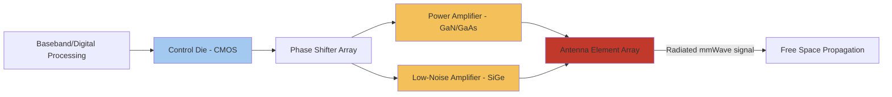

## RF and mmWave Heterogeneous Integration and Antenna-in-Package Design

### Overview

RF and millimeter-wave (mmWave) heterogeneous integration combines radio-frequency front-end components — power amplifiers, low-noise amplifiers, switches, filters, and antennas — with digital baseband and control logic within a single advanced package. Antenna-in-package (AiP) design specifically integrates the radiating antenna element(s) directly into the semiconductor package substrate, eliminating the lossy, bulky board-level transmission lines traditionally required to connect a chip's RF output to a separate discrete antenna. This integration approach is essential for mmWave frequencies (roughly 24 GHz and above, as used in 5G FR2 and emerging 6G bands), where wavelengths are short enough that antenna dimensions become compatible with package-scale integration, and where transmission line losses at board level would otherwise be prohibitive.

### Why mmWave Requires Package-Level Integration

**Key Points**

- At mmWave frequencies, the wavelength shrinks to millimeter scale (e.g., roughly 10 mm at 28 GHz, shrinking further at higher bands), making antenna elements small enough to fit within or directly atop a semiconductor package rather than requiring board-level real estate
- Transmission line losses increase sharply with frequency; routing an RF signal from chip to a board-mounted antenna via standard PCB traces at mmWave frequencies incurs significant insertion loss, directly reducing effective radiated power and receiver sensitivity
- Antenna-in-package design shortens the electrical path between the RF front-end die and the radiating element to millimeters, dramatically reducing this loss compared to board-level antenna routing
- This makes AiP a practical necessity rather than merely a size-optimization choice for mmWave systems, distinguishing it from lower-frequency RF integration where board-level antennas remain a viable option

### Antenna-in-Package Architecture

**Structure**

An AiP module typically consists of a multilayer package substrate (organic laminate, ceramic, or fan-out wafer-level package) with antenna elements — often patch antennas or dipole arrays — fabricated as metal layers within or on top of the substrate, positioned in close proximity to the RF front-end die(s) mounted on the same substrate.

**Key Points**

- Antenna elements are commonly implemented as patch antennas (planar radiating elements) or dipole/monopole arrays, chosen based on desired radiation pattern, bandwidth, and polarization requirements
- Phased-array AiP designs integrate multiple antenna elements (often arranged in a grid) alongside corresponding RF front-end circuitry (phase shifters, amplifiers) for each element, enabling electronic beam steering without mechanical antenna movement
- The package substrate must support both the electrical routing needs of digital/RF signals and the specific dielectric and layer-stack requirements for effective antenna radiation performance, requiring careful co-design between RF engineers (antenna performance) and package engineers (substrate stack-up, routing)
- Substrate material choice significantly affects antenna performance: low-loss dielectric materials are preferred for antenna layers to minimize radiation efficiency loss, which can create tension with cost-optimized substrate materials used elsewhere in the package

### Heterogeneous Integration of RF Front-End Components

**Key Points**

- RF front-end modules typically integrate multiple specialized dies fabricated on different process technologies optimized for their function: GaAs (gallium arsenide) or GaN (gallium nitride) for power amplifiers, SiGe (silicon-germanium) for low-noise amplifiers and mixers, and CMOS for digital control and baseband logic
- This multi-process-node integration is a canonical heterogeneous integration use case, since no single semiconductor process technology optimally serves all these functions simultaneously — GaN offers superior power handling and efficiency for power amplification, while CMOS offers cost-effective, dense digital logic
- Assembly of these heterogeneous dies onto a shared package substrate (alongside the antenna elements) typically uses flip-chip or wire-bond die attach, with flip-chip increasingly preferred at mmWave frequencies due to shorter, lower-inductance interconnect paths compared to wire bonds
- [Inference] As mmWave and future sub-terahertz systems push to higher frequencies, the parasitic inductance and loss associated with wire-bond interconnects become increasingly problematic, likely accelerating the shift toward flip-chip and other low-parasitic die-attach methods within RF front-end module assembly

### Package Substrate Technology Options

**Key Points**

- **Organic laminate substrates:** cost-effective, widely used for AiP in consumer mmWave applications (e.g., 5G smartphone mmWave modules), offering reasonable RF performance at lower cost than ceramic alternatives
- **Low-temperature co-fired ceramic (LTCC):** offers superior RF performance (lower loss, better dimensional stability) at higher cost, often used in higher-performance or higher-frequency applications such as automotive radar or infrastructure equipment
- **Fan-out wafer-level packaging (FOWLP):** enables very thin, compact AiP modules by redistributing die connections across a reconstituted wafer, suited to space-constrained applications like smartphone mmWave antenna modules
- Substrate choice involves trade-offs between RF performance, thermal management capability, mechanical robustness, and cost, with the optimal choice varying significantly by application (consumer mobile, automotive radar, base station infrastructure)

### Example Application: 5G mmWave Smartphone Module

**Example**

A typical 5G FR2 (mmWave) smartphone antenna module integrates a phased-array antenna (often 4 to 8 elements) fabricated within a compact laminate substrate, directly co-packaged with an RF front-end die containing phase shifters, power amplifiers, and low-noise amplifiers. Because smartphones require multiple such modules positioned at different locations around the device edge to maintain signal coverage regardless of hand or body blockage orientation, the AiP module's small form factor (enabled by package-level antenna integration rather than board-level antennas) is essential to fitting multiple modules within the constrained smartphone chassis volume.

### Beam Steering and Phased-Array Integration

**Key Points**

- Phased-array AiP modules achieve electronic beam steering by independently controlling the phase (and often amplitude) of the signal fed to each antenna element, causing constructive interference in a desired direction without physically moving the antenna
- This requires per-element phase shifter circuitry integrated within the RF front-end die(s), with routing from each phase shifter output to its corresponding antenna element kept as short and well-matched as possible to preserve phase accuracy across the array
- [Inference] Antenna-in-package integration is particularly valuable for phased-array systems specifically because it allows tight, symmetric, well-matched routing between each phase shifter and its antenna element — routing mismatches across array elements degrade beam-steering accuracy, and package-level integration provides much tighter dimensional control than board-level routing would allow

### RF/mmWave AiP Module Cross-Section (SVG Diagram)

<svg xmlns="http://www.w3.org/2000/svg" viewBox="0 0 700 380" font-family="Arial, sans-serif">
<text x="350" y="25" font-size="16" font-weight="bold" text-anchor="middle">Antenna-in-Package Module Cross-Section (svg_diagram)</text>

<rect x="100" y="50" width="80" height="15" fill="#c0392b" />
<rect x="220" y="50" width="80" height="15" fill="#c0392b" />
<rect x="340" y="50" width="80" height="15" fill="#c0392b" />
<rect x="460" y="50" width="80" height="15" fill="#c0392b" />
<text x="600" y="62" font-size="10">Patch antenna array</text>

<rect x="80" y="65" width="480" height="90" fill="#e8d9b5" stroke="#333" />
<text x="600" y="115" font-size="10">Multilayer substrate</text>
<text x="600" y="128" font-size="9" fill="#555">(low-loss dielectric)</text>
<line x1="80" y1="90" x2="560" y2="90" stroke="#bbb" stroke-dasharray="4,2" />
<line x1="80" y1="115" x2="560" y2="115" stroke="#bbb" stroke-dasharray="4,2" />
<line x1="80" y1="140" x2="560" y2="140" stroke="#bbb" stroke-dasharray="4,2" />

<rect x="220" y="155" width="120" height="35" fill="#f4c05a" stroke="#333" />
<text x="280" y="176" font-size="10" text-anchor="middle">RF Front-End Die</text>

<rect x="230" y="190" width="8" height="8" fill="#666" />
<rect x="250" y="190" width="8" height="8" fill="#666" />
<rect x="270" y="190" width="8" height="8" fill="#666" />
<rect x="290" y="190" width="8" height="8" fill="#666" />
<rect x="310" y="190" width="8" height="8" fill="#666" />
<rect x="330" y="190" width="8" height="8" fill="#666" />
<text x="450" y="196" font-size="9">Flip-chip interconnect</text>

<rect x="380" y="155" width="80" height="35" fill="#a3c9f1" stroke="#333" />
<text x="420" y="176" font-size="10" text-anchor="middle">Control/</text>
<text x="420" y="188" font-size="10" text-anchor="middle">Baseband</text>

<rect x="80" y="198" width="480" height="40" fill="#d4d4d4" stroke="#333" />
<text x="600" y="222" font-size="10">Package substrate</text>

<circle cx="120" cy="245" r="6" fill="#888" />
<circle cx="160" cy="245" r="6" fill="#888" />
<circle cx="200" cy="245" r="6" fill="#888" />
<circle cx="240" cy="245" r="6" fill="#888" />
<circle cx="280" cy="245" r="6" fill="#888" />
<circle cx="320" cy="245" r="6" fill="#888" />
<circle cx="360" cy="245" r="6" fill="#888" />
<circle cx="400" cy="245" r="6" fill="#888" />
<circle cx="440" cy="245" r="6" fill="#888" />
<circle cx="480" cy="245" r="6" fill="#888" />
<circle cx="520" cy="245" r="6" fill="#888" />
<text x="600" y="250" font-size="10">BGA to motherboard</text>
<rect x="60" y="255" width="520" height="15" fill="#999" stroke="#333" />
<text x="350" y="266" font-size="9" text-anchor="middle" fill="#fff">Mainboard / carrier PCB</text>

<text x="350" y="300" font-size="10" text-anchor="middle" font-style="italic">Short antenna-to-die path minimizes mmWave transmission loss</text>

</svg>

### RF Signal Chain Integration Flow (Mermaid Diagram)

### Thermal and Mechanical Considerations

**Key Points**

- Power amplifier dies in RF front-end modules can generate significant localized heat, particularly in high-power applications (e.g., base station or automotive radar systems), requiring thermal management co-design with the antenna layer to avoid performance-degrading temperature gradients affecting nearby antenna elements
- Package warpage is a particular concern for AiP modules, since antenna performance (resonant frequency, radiation pattern) can be sensitive to dimensional accuracy; substrate warpage during assembly or thermal cycling can detune antenna elements from their designed operating frequency
- [Inference] The dimensional sensitivity of antenna performance to substrate warpage likely makes AiP modules more demanding from a package reliability and process control standpoint than equivalent non-RF packages of similar substrate technology, since antenna detuning represents a functional failure mode with no direct analog in purely digital packaging

### Testing and Characterization Challenges

**Key Points**

- Testing AiP modules requires over-the-air (OTA) test methodologies, since the antenna is integrated within the package and cannot be probed via traditional wired test methods used for purely electrical packages
- OTA testing requires specialized anechoic chamber or compact antenna test range (CATR) equipment to characterize radiation pattern, gain, and beam-steering accuracy, adding test complexity and cost compared to conventional package-level electrical test
- [Unverified] Specific OTA test throughput figures and equipment requirements vary significantly by antenna array size, frequency band, and manufacturer test methodology; general OTA testing principles are described here without asserting specific production test time or cost figures

### Emerging Directions

**Key Points**

- [Speculation] As mmWave and emerging sub-terahertz (6G research) frequencies push antenna dimensions even smaller, heterogeneous integration techniques such as fan-out wafer-level packaging and potentially chiplet-based RF front-end architectures may become increasingly relevant to achieving the tight dimensional control and low-loss interconnect needed at these frequency ranges, though specific 6G packaging standards remain in early research stages as of this writing
- Growing interest in integrating RF front-end heterogeneous integration with digital compute packaging techniques (e.g., combining AiP modules with AI-accelerator-class packaging in edge devices requiring both high-bandwidth compute and mmWave connectivity) represents a convergence point between the RF/mmWave and digital/AI advanced packaging domains

**Conclusion**

RF and mmWave heterogeneous integration, exemplified by antenna-in-package design, addresses the fundamental challenge that mmWave frequencies demand extremely short, low-loss paths between RF front-end circuitry and radiating antenna elements — a requirement that board-level antenna approaches cannot practically meet. AiP modules combine multiple heterogeneous process technologies (GaN/GaAs power amplifiers, SiGe low-noise components, CMOS digital control) with integrated antenna structures within a single package substrate, requiring careful co-design across RF, package, and thermal engineering disciplines. This integration approach is foundational to current 5G mmWave deployment and is likely to remain central to future higher-frequency wireless system packaging.

**Related Topics**

- Fan-out wafer-level packaging (FOWLP) architecture and process flow
- Flip-chip versus wire-bond interconnect trade-offs at RF/mmWave frequencies
- Multi-process-node heterogeneous integration (GaN, SiGe, CMOS co-packaging)
- Package warpage control and its impact on RF/antenna performance
- Over-the-air (OTA) test methodologies for integrated antenna modules
- Phased-array beamforming architecture and per-element phase shifter design
- Low-loss dielectric substrate materials for RF and mmWave packaging