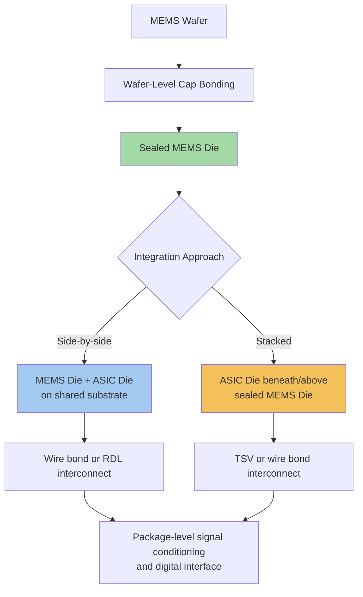

## MEMS and Sensor Integration into Advanced Packages

### Overview

MEMS (Micro-Electro-Mechanical Systems) and sensor integration into advanced packages combines mechanical, optical, chemical, or physical sensing elements with digital processing and signal-conditioning logic within a single package. Unlike purely electronic heterogeneous integration (logic-on-logic or logic-on-memory), MEMS and sensor integration introduces unique packaging challenges: MEMS devices typically require a sealed or controlled-environment cavity to allow mechanical movement, optical sensors require transparent or aperture-containing package windows, and many sensor types are highly sensitive to mechanical stress transmitted through the package itself, which can directly corrupt sensor readings. This makes MEMS/sensor packaging a distinct discipline within advanced packaging, prioritizing environmental protection and stress isolation alongside the electrical interconnect density goals common to other heterogeneous integration domains.

### MEMS Device Categories and Packaging Implications

**Key Points**

- **Inertial sensors (accelerometers, gyroscopes):** contain suspended proof masses that must move freely within a sealed cavity; package-induced stress or particulate contamination directly degrades measurement accuracy
- **Pressure sensors:** require a controlled reference cavity (vacuum or known-pressure sealed reference) alongside an exposed diaphragm or port allowing external pressure to act on the sensing element
- **Microphones (MEMS acoustic sensors):** require an acoustic port allowing sound pressure waves to reach the sensing diaphragm while protecting the sensitive element from moisture and particulate ingress
- **Optical MEMS (micromirrors, optical switches):** require a package with optical-grade transparent windows or apertures with tightly controlled optical path characteristics
- **RF MEMS (switches, resonators):** require hermetic sealing to protect delicate mechanical switching elements from environmental contamination while maintaining low-loss RF signal paths into and out of the package

### Wafer-Level Packaging for MEMS

**Structure**

Wafer-level MEMS packaging seals and protects MEMS structures at the wafer level, before individual die singulation, typically using a cap wafer bonded directly over the MEMS wafer to create a sealed cavity around each device site prior to dicing.

**Key Points**

- **Wafer-level cap bonding:** a separate cap wafer (often glass or silicon) is bonded over the MEMS wafer using techniques such as glass frit bonding, anodic bonding, or eutectic bonding, creating a sealed cavity around the MEMS structure before the wafer is diced into individual devices
- **Thin-film encapsulation:** for some MEMS device types, a thin-film cap layer is deposited and patterned directly over the MEMS structure at the wafer level, avoiding the need for a separate bonded cap wafer entirely, though this approach is limited to MEMS structures compatible with the thin-film deposition process
- Wafer-level capping enables MEMS devices to be handled, tested, and assembled using standard IC packaging equipment after capping, since the fragile moving structures are protected before the die ever leaves wafer form
- Cavity pressure control during wafer-level bonding is critical for certain MEMS types (e.g., resonators, gyroscopes) where the damping environment inside the cavity directly affects device performance — vacuum-sealed cavities are common for resonant MEMS structures requiring high quality factor (Q)

### System-in-Package (SiP) Integration of MEMS with Logic

**Structure**

MEMS and sensor SiP integration combines a pre-capped (wafer-level sealed) MEMS die with an ASIC die providing signal conditioning, analog-to-digital conversion, and digital interface logic, typically using side-by-side or stacked die arrangement within a single package.

**Key Points**

- Side-by-side (2D) integration places the sealed MEMS die and the signal-conditioning ASIC die adjacent to each other on a shared substrate, connected via wire bonds or a shared redistribution layer, minimizing mechanical coupling between the two dies
- Stacked (3D) integration places the ASIC die beneath or above the sealed MEMS die, reducing package footprint at the cost of increased mechanical coupling risk between the ASIC and the stress-sensitive MEMS structure
- [Inference] Side-by-side integration is generally preferred for the most stress-sensitive MEMS types (e.g., high-precision inertial sensors) specifically because it physically separates the MEMS structure from the ASIC die's own thermal and mechanical stress sources, whereas stacked integration is more common for less stress-sensitive sensor types or applications prioritizing footprint over ultimate measurement precision
- Combining the sealed MEMS die with signal-conditioning logic in the same package (rather than as separate discrete components on a PCB) reduces parasitic capacitance and noise pickup on the sensitive analog signal path between the MEMS transducer and its first-stage amplification circuitry

### Stress Isolation Design Considerations

**Key Points**

- MEMS devices, particularly high-precision inertial sensors, are sensitive to package-induced mechanical stress arising from thermal expansion mismatch between the package substrate, die attach material, and the MEMS die itself
- Package designers use stress-isolation techniques such as soft die-attach materials, decoupling structures within the substrate, or specific die placement strategies to minimize stress transmission from the package body to the MEMS sensing structure
- Temperature cycling during package assembly and subsequent field operation can introduce time-varying mechanical stress on the MEMS structure, which for high-precision applications (e.g., navigation-grade inertial sensors) may require compensation through on-chip temperature sensing and calibration algorithms in the accompanying ASIC, rather than relying solely on packaging-level stress isolation
- [Inference] The stress-sensitivity of MEMS devices means that package-level mechanical design (substrate material choice, die-attach compliance, cavity geometry) has a more direct and measurable effect on final device performance than in typical digital IC packaging, where mechanical stress primarily affects long-term reliability rather than immediate measurement accuracy

### Environmental Sealing and Hermeticity

**Key Points**

- Hermetic sealing (typically achieved via glass frit, eutectic, or anodic wafer-level bonding) provides the highest level of environmental protection, essential for MEMS devices sensitive to moisture, particulates, or specific gas environments (e.g., vacuum-cavity resonant structures)
- Near-hermetic or non-hermetic sealing using polymer-based encapsulation is more cost-effective and sufficient for MEMS devices with less stringent environmental sensitivity, such as many consumer-grade accelerometers and microphones
- Devices requiring direct environmental exposure (pressure sensors, microphones, gas sensors) cannot be fully hermetically sealed, since their function depends on interaction with the external environment; these require specialized port or membrane structures that protect the sensing element while still allowing the physical quantity being measured (pressure, sound, chemical concentration) to reach it
- [Unverified] Specific hermeticity leak-rate specifications and qualification standards vary by application domain (automotive, industrial, consumer, aerospace) and are governed by domain-specific standards; general hermetic sealing principles are described here without asserting universal leak-rate figures

### MEMS/Sensor SiP Architecture (Mermaid Diagram)

### Example: MEMS Inertial Measurement Unit (IMU) SiP

**Example**

A typical MEMS-based inertial measurement unit (IMU) package integrates a wafer-level-capped accelerometer/gyroscope MEMS die alongside an ASIC die providing charge amplification, analog-to-digital conversion, temperature compensation, and a digital communication interface (e.g., SPI or I2C). The MEMS die is typically placed with stress-isolating die attach on a substrate separate from the ASIC's own placement region, and the two dies are connected via short wire bonds or fine-pitch RDL traces to minimize noise pickup on the sensitive analog signal path between the MEMS transducer and the ASIC's front-end amplifier.

### Optical and Acoustic Port Design

**Key Points**

- MEMS microphones require an acoustic port — either a hole through the package substrate (bottom-port design) or through the package lid (top-port design) — sized and positioned to allow sound pressure waves to reach the diaphragm with minimal acoustic resonance distortion within the port itself
- Optical MEMS devices require package windows with controlled optical transmission characteristics (anti-reflective coating, specific wavelength transmission range) and precise window flatness to avoid introducing optical aberration into the device's function
- Both acoustic and optical port designs must balance environmental protection (preventing moisture, dust, or particulate ingress) against the functional requirement of allowing the relevant physical signal (sound, light) to reach the sensing element with minimal distortion

### Testing Challenges Specific to MEMS/Sensor Packages

**Key Points**

- MEMS devices often require specialized test stimuli that purely electronic packages do not — accelerometers require controlled physical motion or shaker-table stimulus, pressure sensors require controlled pressure chambers, and microphones require calibrated acoustic test environments
- This physical-stimulus testing requirement adds test complexity and cost beyond standard electrical test, and in many cases cannot be performed at wafer level before singulation, pushing more of the functional test burden to the packaged-device or module level compared to purely digital IC testing
- [Inference] The need for physical-stimulus testing at the packaged-device level, rather than wafer level, likely contributes to MEMS/sensor packages carrying a different cost and yield-learning structure than purely digital advanced packages, since defects affecting sensor performance may only become detectable after the packaging process is complete

### Emerging Directions

**Key Points**

- Growing interest in combining MEMS/sensor integration with AI accelerator packaging for edge AI applications (e.g., smart sensors performing on-package inference on sensor data) represents a convergence point between sensor packaging and the digital heterogeneous integration techniques used in AI accelerator packages
- [Speculation] As edge AI applications increasingly demand sensor fusion (combining multiple sensor modalities with on-package processing), MEMS/sensor SiP architectures may increasingly incorporate more sophisticated multi-die heterogeneous integration techniques (e.g., fine-pitch interconnects, potentially even hybrid bonding for stress-tolerant sensor types), though the fundamental stress-isolation and hermeticity requirements unique to MEMS packaging are likely to continue constraining how aggressively such advanced interconnect techniques can be applied to the most stress-sensitive sensor types

**Conclusion**

MEMS and sensor integration into advanced packages introduces packaging requirements distinct from purely electronic heterogeneous integration: environmental sealing (hermetic or near-hermetic cavity protection), mechanical stress isolation (to preserve measurement accuracy), and specialized port/window structures (for sensors requiring direct environmental interaction). Wafer-level capping combined with system-in-package integration of the sealed MEMS die alongside signal-conditioning ASIC logic represents the dominant architectural approach, balancing environmental protection, stress sensitivity, and the electrical integration benefits common to broader advanced packaging trends.

**Related Topics**

- Wafer-level chip-scale packaging (WLCSP) processes and applications
- Hermetic sealing techniques (glass frit, anodic, eutectic bonding) for sensitive devices
- System-in-package (SiP) architecture and multi-die integration strategies
- Thermal and mechanical stress modeling in heterogeneous die packages
- Edge AI sensor fusion and on-package inference architectures
- RF MEMS switch integration and hermetic RF signal path design
- Package-level test methodologies for physical-stimulus-dependent devices