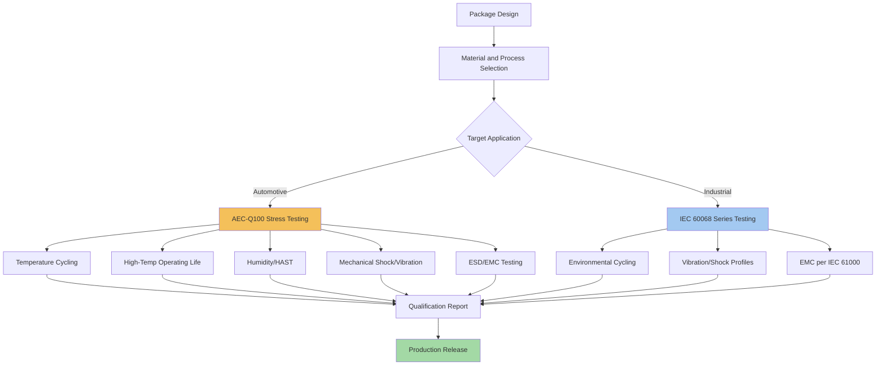

## Automotive and Industrial Packaging Requirements

### Overview

Automotive and industrial packaging requirements impose reliability, qualification, and environmental robustness standards substantially more stringent than typical consumer electronics packaging. These application domains demand extended operating temperature ranges, extreme reliability over long service lifetimes (often 10-15+ years), resistance to mechanical shock and vibration, and formal qualification against industry-specific standards (AEC-Q100 for automotive integrated circuits, IEC 61000 series and related standards for industrial electronics). For advanced packaging specifically, these requirements directly shape material selection, interconnect technology choice, thermal design margins, and test/qualification methodology, often precluding packaging approaches that are perfectly acceptable for consumer applications but fail to meet automotive or industrial reliability standards.

### Automotive Qualification Standards

**Key Points**

- **AEC-Q100:** the primary automotive qualification standard for packaged integrated circuits, defining stress test requirements across categories including temperature cycling, high-temperature operating life, humidity, electrostatic discharge, and mechanical stress
- **Grade classifications:** AEC-Q100 defines temperature grades (Grade 0 through Grade 4) corresponding to different operating temperature ranges, with Grade 0 (the most stringent, covering roughly -40°C to +150°C ambient) typically required for components in the most thermally demanding under-hood or engine-compartment locations, while less demanding grades apply to cabin-mounted or less thermally exposed components
- **AEC-Q101:** covers discrete semiconductor qualification (as distinct from integrated circuits under Q100)
- **ISO 26262:** functional safety standard for automotive systems, which indirectly affects packaging requirements by demanding traceable reliability data and, in some cases, specific redundancy or fault-detection features that influence package architecture (e.g., requiring package-level test access for in-field diagnostic checks)

### Industrial Qualification Considerations

**Key Points**

- Industrial electronics packaging requirements vary more widely than automotive, since "industrial" spans applications ranging from relatively benign indoor factory automation to extreme environments (mining equipment, oil and gas exploration, outdoor infrastructure)
- Common industrial standards include IEC 61000 series (electromagnetic compatibility), IEC 60068 series (environmental testing, covering temperature, humidity, vibration, and shock), and various sector-specific standards (e.g., IECEx for explosive atmospheres)
- Industrial applications often demand extended operating life (potentially decades of continuous operation) and may require components to remain sourceable and qualified for very long production runs, influencing package technology choices toward mature, well-characterized processes rather than leading-edge techniques still undergoing reliability characterization
- [Inference] The wide variability in industrial application severity means package engineers must carefully scope qualification requirements to the specific industrial sub-application, rather than assuming a single uniform "industrial grade" standard applies uniformly across all industrial use cases

### Temperature Range and Thermal Cycling Requirements

**Key Points**

- Automotive Grade 0 components must typically operate reliably across roughly -40°C to +150°C ambient temperature, a substantially wider range than consumer electronics (typically 0°C to 70°C) or even industrial-grade components (commonly -40°C to 85°C or -40°C to 105°C depending on application)
- Extended temperature range operation directly affects package material selection: die-attach materials, underfill compounds, mold compounds, and solder alloys must all maintain mechanical integrity and electrical performance across the full qualified temperature range without degradation
- Temperature cycling reliability (repeated cycling between temperature extremes) stresses the coefficient of thermal expansion (CTE) mismatch between dissimilar materials within the package (silicon die, substrate, mold compound, solder joints), and automotive/industrial qualification requires demonstrated survival across a specified number of temperature cycles (often numbering in the thousands) without failure
- [Inference] The wider temperature range and higher cycle-count requirements for automotive/industrial applications generally necessitate more conservative CTE-matching material choices and more robust interconnect technologies compared to consumer-grade packaging, where narrower temperature ranges and shorter expected service life allow somewhat more aggressive material and process choices

### Mechanical Shock and Vibration Requirements

**Key Points**

- Automotive components must withstand significant mechanical shock and sustained vibration throughout the vehicle's operational life, arising from road conditions, engine vibration, and potential impact events, requiring package-level mechanical robustness beyond typical consumer electronics requirements
- Industrial applications in heavy machinery, mining, or transportation infrastructure similarly demand vibration and shock resistance, often specified via standards such as IEC 60068-2 series test methods covering various shock and vibration profiles
- Package-level design responses to these requirements include robust die-attach and wire-bond (or flip-chip) interconnect selection resistant to fatigue under cyclic mechanical stress, as well as package form factors and mounting designs that distribute mechanical stress away from the most fragile package elements

### Interconnect Technology Implications

**Key Points**

- Solder joint reliability under automotive/industrial temperature cycling and vibration requirements has historically favored certain solder alloy compositions and joint geometries specifically characterized for extended thermal cycling survival, distinct from consumer-electronics-optimized solder choices
- Advanced interconnect technologies (fine-pitch microbumps, hybrid bonding) that have achieved qualification for high-volume consumer or data-center applications may require separate, additional qualification testing before being deemed suitable for automotive or industrial use, since the reliability characterization performed for consumer/data-center qualification does not automatically transfer to automotive-grade temperature and vibration requirements
- [Unverified] The specific timeline and extent to which hybrid bonding and other advanced 3D packaging interconnects achieve automotive-grade qualification varies by process maturity and individual manufacturer qualification programs; general statements about eventual automotive qualification of any specific advanced interconnect technology should be treated as provisional rather than confirmed industry-wide status

### Automotive/Industrial vs. Consumer Packaging Requirements (Comparison Table)

| Attribute | Consumer Grade | Industrial Grade | Automotive Grade 0 |
| --- | --- | --- | --- |
| Typical temperature range | 0°C to 70°C | -40°C to 85/105°C | -40°C to 150°C |
| Expected service life | 2-5 years | 10-20+ years | 10-15+ years |
| Qualification standard | Vendor-specific | IEC 60068 series | AEC-Q100 |
| Vibration/shock tolerance | Minimal | Moderate to high | High |
| Functional safety requirements | Rare | Application-dependent | ISO 26262 (where applicable) |
| Material/process maturity preference | Leading-edge acceptable | Mature preferred | Mature strongly preferred |

### Qualification and Reliability Test Flow (Mermaid Diagram)

### Example: Automotive Radar Sensor Package

**Example**

An automotive mmWave radar sensor package (used for advanced driver-assistance systems) must simultaneously satisfy multiple stringent requirements: RF performance for accurate radar sensing, AEC-Q100 Grade 0 or Grade 1 temperature qualification for under-bumper or grille mounting locations, mechanical robustness against road vibration and thermal cycling from engine-adjacent heat exposure, and long-term reliability given the vehicle's expected 10-15 year service life. This combination often necessitates ceramic or high-reliability laminate substrate choices over lower-cost organic alternatives, specifically because the RF performance and long-term reliability requirements together outweigh the cost advantage of less robust substrate materials.

### Functional Safety and Redundancy Considerations

**Key Points**

- ISO 26262 functional safety requirements for automotive systems can influence package-level architecture decisions, such as requiring accessible test structures for in-field diagnostic self-test, or in some safety-critical applications, requiring redundant circuit paths within the package to support fault detection and graceful degradation
- [Inference] These functional safety considerations mean automotive package design sometimes must accommodate architectural features (built-in self-test circuitry, redundancy) that have no direct equivalent requirement in consumer or even general industrial packaging, adding a layer of design complexity specific to safety-critical automotive applications
- Industrial applications with safety-critical functions (e.g., industrial control systems in hazardous environments) may impose analogous functional safety requirements under standards such as IEC 61508, though specific requirements vary considerably by industrial sub-sector and application criticality

### Supply Chain and Long-Term Availability Considerations

**Key Points**

- Automotive and industrial applications often require component sourceability guarantees spanning many years beyond typical consumer electronics product lifecycles, influencing package technology selection toward processes with established long-term manufacturing support commitments from suppliers
- This consideration can create tension with the pace of advanced packaging innovation, since newer packaging technologies (novel interconnects, emerging substrate materials) may not yet have the multi-year production track record and long-term supply commitments that automotive/industrial customers require before qualifying a new technology for production use
- [Inference] This dynamic likely explains why automotive and industrial applications frequently adopt advanced packaging innovations somewhat later than consumer or data-center applications, even when the underlying technology is otherwise mature — the qualification and long-term-availability requirements specific to these domains add adoption lag independent of the technology's technical readiness

**Conclusion**

Automotive and industrial packaging requirements impose substantially more stringent qualification, temperature range, mechanical robustness, and long-term reliability demands than typical consumer electronics packaging, formalized through standards such as AEC-Q100 for automotive components and the IEC 60068/61000 series for industrial electronics. These requirements directly shape material selection, interconnect technology choice, and qualification timelines for advanced packaging technologies, often resulting in automotive and industrial adoption of new packaging techniques lagging behind consumer or data-center adoption due to the additional qualification burden and long-term supply chain assurance these domains require.

**Related Topics**

- AEC-Q100 stress test categories and grade classification details
- Solder joint reliability under thermal cycling for advanced interconnects
- RF and mmWave heterogeneous integration and antenna-in-package design (automotive radar application)
- MEMS and sensor integration into advanced packages (automotive sensor applications)
- Functional safety standards (ISO 26262, IEC 61508) and package-level design implications
- CTE mismatch and material selection for extended temperature range packaging
- Long-term semiconductor supply chain qualification for automotive/industrial applications