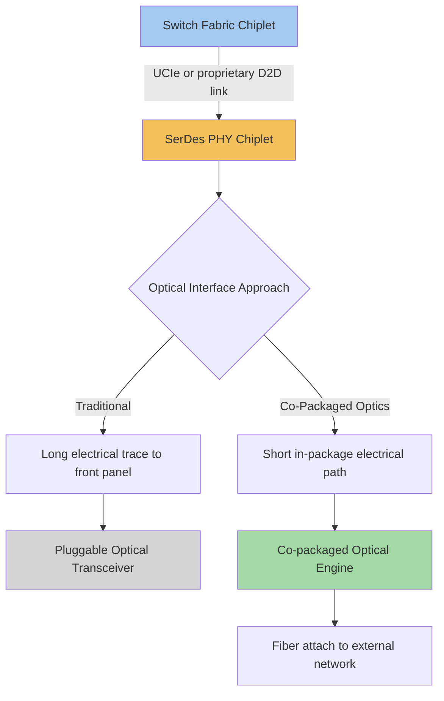

## Data Center and Networking System-in-Package Design

### Overview

Data center and networking system-in-package (SiP) design integrates the specialized die types required for high-throughput data processing and network switching — switch ASICs, SerDes (serializer/deserializer) PHY dies, optical engines, and increasingly co-packaged optics — within a single advanced package. This domain shares some technology foundations with AI accelerator packaging (2.5D interposers, chiplet-based die partitioning, HBM integration) but is distinguished by its emphasis on extremely high-radix I/O (hundreds of high-speed electrical or optical lanes per package), stringent signal integrity requirements at multi-hundred-gigabit-per-lane data rates, and, for networking-specific applications, the emerging shift toward co-packaged optics that integrates optical engines directly within the switch package to overcome electrical interconnect reach and power limitations.

### Switch ASIC Package Architecture

**Key Points**

- Data center network switch ASICs require extremely high I/O counts to support the many high-speed SerDes lanes needed for switch radix (the number of ports a switch chip supports), often numbering in the hundreds of differential pairs for a single high-end switch die
- Switch ASIC packages typically use flip-chip BGA (ball grid array) packaging with substantial substrate layer counts to route the high pin-count, high-speed signals from the die to the package balls without excessive crosstalk or impedance discontinuities
- Signal integrity at the multi-hundred-gigabit-per-lane data rates common in modern switch silicon (e.g., 112 Gbps PAM4 SerDes lanes, with successor generations targeting higher per-lane rates) places extremely tight tolerances on package substrate trace geometry, via design, and impedance matching throughout the signal path
- Power delivery network design is similarly demanding, since high-radix switch ASICs can dissipate very substantial power (hundreds of watts), requiring package and board-level power delivery architectures capable of supplying stable, low-noise power across the die's full operating range

### Chiplet-Based Switch and Networking ASIC Architectures

**Key Points**

- Following the broader industry trend toward chiplet-based design (driven by reticle-limit and yield economics, as seen in AI accelerator architectures), networking ASIC vendors have increasingly explored partitioning switch silicon into multiple chiplets — separating, for example, the switching fabric core from SerDes PHY chiplets
- This chiplet partitioning allows SerDes PHY chiplets (often requiring specialized analog-heavy process characteristics) to be fabricated on a process node optimized for high-speed analog/mixed-signal performance, while the digital switching fabric core can be fabricated on a separate, potentially more advanced digital logic process node
- [Inference] This process-node specialization mirrors the heterogeneous integration rationale seen elsewhere in advanced packaging (e.g., RF front-end integration), where no single process technology optimally serves both high-speed analog SerDes circuitry and dense digital switching logic simultaneously
- Universal Chiplet Interconnect Express (UCIe) and similar die-to-die interconnect standards are increasingly relevant to networking chiplet architectures, providing standardized high-bandwidth, low-latency interfaces between switch fabric and SerDes PHY chiplets within a single package

### Co-Packaged Optics (CPO) Architecture

**Structure**

Co-packaged optics integrates optical engines (containing laser sources, optical modulators, and photodetectors, or interfaces to external light sources) directly within the same package as the switch ASIC, replacing or substantially shortening the electrical trace length between the switch die and the point of optical-to-electrical signal conversion, compared to traditional pluggable optical transceiver modules mounted at the panel edge of a switch chassis.

**Key Points**

- Traditional networking architectures place optical transceivers (pluggable modules) at the front panel of a switch chassis, requiring electrical signals to traverse a substantial PCB trace distance from the switch ASIC to the front-panel transceiver, incurring signal loss that increases with per-lane data rate and trace length
- Co-packaged optics dramatically shortens this electrical path by placing the optical engine directly adjacent to (or within the same package as) the switch ASIC, converting to optical signaling much earlier in the signal chain and thereby reducing electrical channel loss, which becomes an increasingly dominant constraint as per-lane data rates continue increasing
- This architecture typically requires the optical engine dies to be integrated via 2.5D packaging techniques (silicon photonics dies connected to the switch ASIC via a shared substrate or interposer), combining electronic and photonic heterogeneous integration within a single package
- [Inference] Co-packaged optics represents a natural extension of the broader advanced packaging trend toward minimizing interconnect distance to reduce signal loss and power consumption, applying the same underlying principle (proximity reduces loss) that motivates HBM 2.5D integration and near-memory computing, but extended into the electrical-to-optical domain

### Trade-offs of Co-Packaged Optics vs. Pluggable Optics

**Key Points**

- **Signal integrity and power efficiency:** CPO substantially reduces electrical channel loss and the associated power consumption of high-speed SerDes drivers needed to overcome that loss, since the electrical trace distance between switch ASIC and optical conversion point shrinks dramatically
- **Serviceability:** pluggable optical transceivers can be individually replaced in the field if a single optical link fails, without requiring replacement of the entire switch package; CPO architectures generally lose this field-serviceability advantage, since a failed optical engine integrated within the package may require replacing the entire switch module
- **Density:** CPO can potentially achieve higher aggregate bandwidth density than pluggable optics, since the co-packaged approach is not constrained by the physical connector and mechanical form factor limitations of pluggable transceiver modules at the chassis front panel
- **Thermal management:** integrating optical engines (which include laser sources sensitive to temperature-dependent wavelength drift) directly within a package alongside a high-power switch ASIC introduces thermal co-design challenges, since laser performance and reliability are sensitive to the elevated temperatures the adjacent switch ASIC may generate
- [Inference] The serviceability trade-off is likely a significant factor in the pace of CPO adoption, since data center operators have historically valued the ability to field-replace individual optical links without full system downtime, meaning CPO's power and density advantages must outweigh this operational flexibility loss for a given deployment to favor CPO over pluggable optics

### Data Center Switch/Networking SiP Architecture (Mermaid Diagram)

### Example: High-Radix Switch Package with Co-Packaged Optics

**Example**

A high-radix data center switch supporting many hundreds of gigabits per second aggregate bandwidth integrates a central switch fabric chiplet, several SerDes PHY chiplets, and multiple co-packaged optical engine dies arranged around the periphery of the package substrate. Electrical signals travel only a short distance (millimeters) from the switch fabric through the SerDes PHY to the adjacent optical engine, which converts the signal to optical form for transmission over external fiber, substantially reducing the electrical channel loss and associated SerDes driver power that would otherwise be required to drive the same signal the much longer distance to a front-panel pluggable transceiver.

### Signal Integrity and Substrate Design Challenges

**Key Points**

- High-radix switch packages with hundreds of high-speed lanes require substrate designs with many routing layers to avoid excessive crosstalk between adjacent signal traces, directly increasing substrate cost and complexity compared to lower-pin-count packages
- Impedance discontinuities at flip-chip bump transitions, via transitions, and package-to-board transitions become increasingly problematic as per-lane data rates increase, requiring careful electromagnetic simulation and design co-optimization across the die, package, and board domains (a practice often termed "co-design" or "system-level signal integrity analysis")
- [Inference] The signal integrity challenges in networking SiP design share underlying physics with the electrical parasitics discussion relevant to memory interconnect technology (microbump versus hybrid bonding), though networking applications typically operate at even higher per-lane data rates than memory interfaces, making signal integrity an even more dominant design constraint in this domain

### Thermal Management for High-Power Networking Packages

**Key Points**

- High-radix switch ASICs dissipating hundreds of watts require robust thermal solutions (heat spreaders, vapor chambers, or in some data center deployments, liquid cooling) integrated at the package and system level
- Co-packaged optics introduces an additional thermal design constraint beyond typical high-power digital packages, since optical components (particularly laser sources) have temperature-sensitive performance characteristics that must be protected from the switch ASIC's thermal output, potentially requiring localized thermal isolation structures within the package despite the overall drive toward close physical integration
- [Inference] This tension between wanting optical engines physically close to the switch ASIC (to minimize electrical trace length) while also needing to thermally isolate them from the ASIC's heat output represents a characteristic co-design trade-off in CPO architecture, requiring careful floorplanning and potentially specialized thermal interface materials or structures to manage

### Industry Trends and Adoption Considerations

**Key Points**

- [Inference] As data center network bandwidth demands continue to grow, driven substantially by AI training and inference cluster interconnect requirements, the power and density advantages of co-packaged optics are likely to become increasingly compelling relative to traditional pluggable optics, particularly for the highest-bandwidth switch tiers within AI-focused data center network fabrics
- The adoption pace of co-packaged optics in production data center deployments depends on multiple factors beyond pure technical merit, including field-serviceability requirements, supply chain maturity for integrated photonic-electronic packaging, and total cost of ownership comparisons against continued pluggable optics scaling
- [Unverified] Specific production deployment timelines and adoption rates for co-packaged optics across different data center operators and networking equipment vendors continue to evolve; readers should consult current vendor roadmaps and industry announcements for the most up-to-date deployment status

**Conclusion**

Data center and networking system-in-package design shares foundational advanced packaging techniques with AI accelerator packaging (chiplet partitioning, 2.5D integration, high-layer-count substrates) while introducing networking-specific challenges around extremely high-radix I/O, stringent signal integrity at very high per-lane data rates, and the emerging architectural shift toward co-packaged optics. Co-packaged optics represents a significant packaging innovation applying the general advanced-packaging principle of minimizing interconnect distance to the electrical-to-optical conversion boundary, trading field-serviceability for substantial power and density improvements — a trade-off whose adoption pace continues to be shaped by both technical and operational data center considerations.

**Related Topics**

- Multi-die AI accelerator architecture case studies
- UCIe (Universal Chiplet Interconnect Express) standardization for die-to-die interoperability
- Silicon photonics integration and optical-electronic co-packaging techniques
- High-layer-count substrate design for high-radix I/O packages
- Thermal management for high-power multi-die packages
- RF and mmWave heterogeneous integration and antenna-in-package design
- Signal integrity co-design across die, package, and board domains