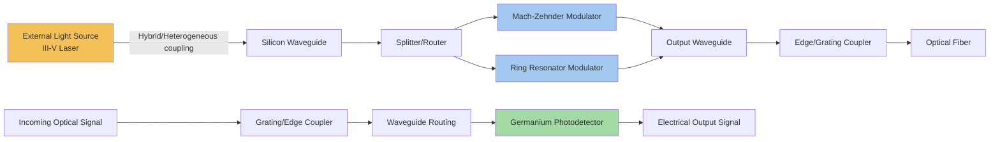

## Silicon Photonics Fundamentals and Photonic Integrated Circuits

### Overview

Silicon photonics is the technology of designing and fabricating photonic (light-based) circuits using silicon and silicon-compatible materials on semiconductor process platforms, leveraging the mature fabrication infrastructure developed for CMOS electronics to produce integrated optical devices. A photonic integrated circuit (PIC) combines multiple optical functions — waveguiding, modulation, detection, and often light generation via hybrid or heterogeneous integration with III-V materials — onto a single chip, analogous to how an electronic integrated circuit combines multiple transistors and interconnects on a single die. Silicon photonics has become foundational to modern high-bandwidth optical communication, and increasingly to co-packaged optics architectures in data center and networking advanced packaging, because silicon's high refractive index enables tightly confined, low-loss optical waveguides at chip scale, and its compatibility with CMOS fabrication processes enables cost-effective, high-volume manufacturing.

### Core Physical Principles

**Key Points**

- Silicon has a high refractive index (approximately 3.45 at telecommunications wavelengths) relative to silicon dioxide (approximately 1.44), creating strong optical confinement when silicon waveguides are surrounded by silicon dioxide cladding — this large refractive index contrast allows silicon photonic waveguides to be fabricated with much smaller cross-sectional dimensions than waveguides in materials with lower index contrast
- Silicon is largely transparent to infrared light at telecommunications wavelengths (1310 nm and 1550 nm bands commonly used in optical communications), since these wavelengths fall below silicon's bandgap-related absorption edge, making silicon a practical waveguide material for these wavelengths despite being opaque to visible light
- Light propagation within silicon waveguides can be manipulated through several physical effects: the plasma dispersion effect (free-carrier concentration changes altering the refractive index, used for high-speed modulation), thermo-optic effect (temperature-induced refractive index changes, used for slower tuning applications), and the geometric/interference effects exploited in passive structures like ring resonators and Mach-Zehnder interferometers

$$n_{eff} = n_{eff,0} - \Delta n(\Delta N, \Delta P)$$

Where $n_{eff}$ is the effective refractive index of the waveguide mode, and $\Delta n$ represents the index change induced by free-carrier concentration changes $\Delta N$ (electrons) and $\Delta P$ (holes) — the physical basis of silicon's plasma-dispersion-based electro-optic modulators.

### Photonic Integrated Circuit Building Blocks

**Key Points**

- **Waveguides:** the fundamental passive structure confining and routing light across the chip, typically fabricated as a patterned silicon layer (often on a silicon-on-insulator, SOI, substrate) surrounded by lower-index cladding material
- **Grating couplers and edge couplers:** structures that couple light between an optical fiber (or external light source) and the on-chip waveguide, addressing the significant mode-size mismatch between typical single-mode fiber (several micrometers in diameter) and silicon waveguides (submicron dimensions)
- **Modulators:** devices that encode electrical data onto an optical carrier by modulating light intensity or phase, most commonly implemented in silicon photonics via Mach-Zehnder interferometer structures exploiting the plasma dispersion effect, or via ring-resonator-based modulators offering more compact footprint at the cost of narrower optical bandwidth and increased temperature sensitivity
- **Photodetectors:** convert optical signals back to electrical signals; since silicon itself is largely transparent at telecommunications wavelengths (a useful property for waveguides but a limitation for detection), silicon photonic platforms typically integrate germanium photodetectors, since germanium's smaller bandgap allows efficient absorption at these wavelengths while remaining compatible with silicon-based fabrication processes
- **Passive routing components:** including splitters, combiners, multiplexers, and wavelength-selective filters (often based on ring resonators or arrayed waveguide gratings) that route and combine optical signals across the chip

### The Light Source Challenge

**Key Points**

- Silicon is an indirect-bandgap semiconductor, which makes it fundamentally inefficient at generating light through electrical injection (the physical mechanism underlying laser diodes and LEDs in direct-bandgap materials), meaning silicon itself cannot practically serve as an on-chip laser source
- This necessitates hybrid or heterogeneous integration of III-V compound semiconductor materials (such as indium phosphide, InP, or gallium arsenide-based compounds), which are direct-bandgap materials well-suited to efficient light generation, to provide the laser source function within an otherwise silicon-based photonic platform
- **Hybrid integration approaches:** attaching a separately fabricated III-V laser die to the silicon photonic chip via flip-chip or edge-coupling techniques, keeping the III-V material and silicon photonic fabrication processes largely separate until final assembly
- **Heterogeneous integration approaches:** bonding unprocessed or partially processed III-V material directly onto the silicon photonic wafer at an earlier fabrication stage (e.g., via wafer bonding), then completing laser fabrication using lithographic processes aligned to the underlying silicon photonic circuit, enabling tighter integration and potentially higher yield at scale
- [Inference] The choice between hybrid and heterogeneous laser integration approaches involves trade-offs between fabrication complexity, yield, and integration density, with heterogeneous approaches generally offering tighter optical coupling and higher potential integration density at the cost of more complex, tightly coupled fabrication process development between the III-V and silicon photonic process flows

### PIC Fabrication Platform: Silicon-on-Insulator (SOI)

**Structure**

Most silicon photonic circuits are fabricated on silicon-on-insulator (SOI) wafers, consisting of a thin top silicon device layer (where waveguides and other photonic structures are patterned), separated from the silicon substrate below by a buried oxide (BOX) layer that provides the lower-index cladding necessary for optical confinement.

**Key Points**

- The buried oxide layer thickness and top silicon layer thickness are both critical design parameters, chosen to support the desired waveguide mode characteristics while providing sufficient optical isolation from the underlying silicon substrate (which would otherwise cause unwanted optical leakage/loss)
- SOI-based silicon photonics fabrication leverages substantial process compatibility with standard CMOS fabrication infrastructure, including lithography, etch, and deposition tools, which is a primary driver of silicon photonics' cost advantage at high production volumes compared to photonic integration platforms based on less CMOS-compatible materials
- Many silicon photonics foundries operate on shared or multi-project-wafer platforms analogous to CMOS foundry practices, enabling smaller volume or research-stage photonic circuit designs to access production-quality fabrication processes without requiring dedicated full-wafer production runs

### Silicon Photonic Integrated Circuit Architecture (Mermaid Diagram)

### Mach-Zehnder Modulator Principle

**Structure**

A Mach-Zehnder modulator splits an incoming optical signal into two paths (arms), applies an electrically controlled phase shift to one or both arms via the plasma dispersion effect, and recombines the two paths — constructive or destructive interference at the recombination point converts the applied phase shift into an intensity modulation of the output signal.

**Example**

In a typical silicon photonic Mach-Zehnder modulator, applying a voltage across a PN junction embedded within one waveguide arm changes the local free-carrier concentration, which shifts that arm's effective refractive index and therefore the optical phase of light traveling through it. When the two arms are recombined, a phase difference near $\pi$ radians between the arms produces destructive interference (low output intensity, representing a "0" bit), while a near-zero phase difference produces constructive interference (high output intensity, representing a "1" bit), enabling high-speed encoding of electrical data onto the optical carrier.

### Wavelength Division Multiplexing (WDM) in Silicon Photonics

**Key Points**

- Silicon photonic circuits commonly exploit wavelength division multiplexing to increase aggregate data throughput per physical waveguide or fiber, transmitting multiple independent data streams simultaneously on different wavelength channels within the same optical path
- Ring resonator-based filters are commonly used for WDM multiplexing/demultiplexing functions in silicon photonics, since a ring resonator's resonant wavelength can be precisely designed (and, if needed, thermally tuned) to selectively couple specific wavelength channels
- [Inference] The compact footprint of ring-resonator-based WDM components is particularly valuable in silicon photonics applications targeting high port-density co-packaged optics, where chip area is at a premium, though this compactness trades off against the narrower optical bandwidth and higher temperature sensitivity of ring-based designs compared to broader-bandwidth Mach-Zehnder-based approaches

### Optical Loss Mechanisms and Design Considerations

**Key Points**

- Waveguide propagation loss arises primarily from sidewall roughness (introduced during lithography and etch processes) causing light scattering, as well as material absorption; minimizing this loss requires tight process control over waveguide sidewall smoothness
- Coupling loss at the fiber-to-chip interface (via grating couplers or edge couplers) represents a significant loss contributor in many silicon photonic systems, since the mode mismatch between fiber and on-chip waveguide dimensions is difficult to fully eliminate without specialized mode-converter structures
- [Inference] Total system-level optical budget (accounting for all loss sources: coupling, propagation, component insertion loss) directly constrains achievable link distance and signal-to-noise ratio at the receiver, making loss minimization a first-order design consideration throughout silicon photonic circuit design, analogous to how signal integrity and channel loss considerations dominate high-speed electrical interconnect design

### Relevance to Advanced Packaging and Co-Packaged Optics

**Key Points**

- Silicon photonics' CMOS-compatible fabrication process is a key enabler of co-packaged optics architectures in data center and networking packaging, since it allows optical engines to be manufactured at cost and volume scales compatible with high-density electronic packaging production
- The integration of silicon photonic dies with electronic ASICs (switch fabric, SerDes PHY) within a single package requires careful co-design across optical and electrical domains, extending the heterogeneous integration principles seen elsewhere in advanced packaging (RF/mmWave, MEMS/sensors) into the photonic-electronic integration space
- [Inference] As co-packaged optics adoption grows in data center networking, the packaging-level integration challenges of combining silicon photonic PICs with electronic dies (thermal management for laser sources, precise optical fiber attachment, electrical-optical signal co-design) are likely to become an increasingly significant and specialized sub-discipline within advanced packaging, distinct from but related to the electronic-only heterogeneous integration techniques covered elsewhere in this domain

**Conclusion**

Silicon photonics leverages silicon's high refractive index and CMOS-compatible fabrication infrastructure to enable cost-effective, high-volume production of photonic integrated circuits combining waveguiding, modulation, and (via germanium detectors) photodetection on a single chip. Because silicon cannot efficiently generate light itself, practical silicon photonic systems require hybrid or heterogeneous integration of III-V laser sources, representing an inherent heterogeneous-integration requirement built into the technology's fundamental physics. This technology platform is foundational to modern optical communications and is increasingly central to co-packaged optics architectures within advanced packaging for data center and networking applications.

**Related Topics**

- Data center and networking system-in-package design (co-packaged optics application)
- III-V laser integration techniques: hybrid versus heterogeneous approaches
- Germanium photodetector fabrication and integration on silicon photonic platforms
- Optical fiber-to-chip coupling techniques (grating couplers, edge couplers, mode converters)
- Wavelength division multiplexing architecture for high-throughput optical links
- Thermal management for laser sources co-packaged with electronic ASICs
- Silicon-on-insulator (SOI) wafer fabrication and photonic waveguide design