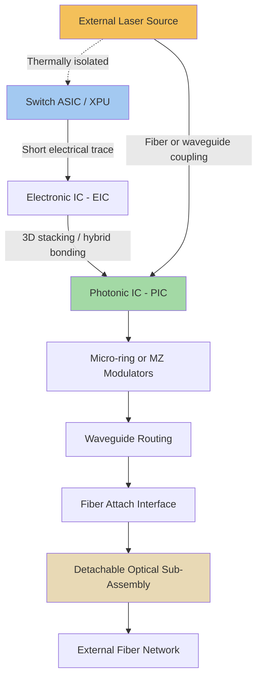

## Co-Packaged Optics System Architecture and Optical Engine Design

### Overview

Co-packaged optics (CPO) system architecture integrates photonic engines directly with switch ASICs and AI accelerator XPUs within the same package, cutting power draw and latency by minimizing the electrical trace distance between compute/switching silicon and the point of optical signal conversion. This represents an architectural evolution beyond both traditional pluggable transceivers (mounted at the chassis front panel) and intermediate near-packaged optics approaches (moved closer to the ASIC but not fully co-packaged), driven by the reality that electrical interconnects are increasingly the limiting factor at multi-terabit data rates, where insertion loss rises non-linearly with frequency and distance and forces increasingly aggressive, power-hungry equalization. Optical engine design — the photonic-electronic subsystem performing the actual optical-electrical conversion — sits at the center of CPO architecture, and current industry approaches diverge significantly in modulator technology, laser sourcing strategy, and package integration method.

### Why Co-Packaged Optics: The Electrical Bottleneck

**Key Points**

- At multi-terabit data rates, interconnect requirements grow combinatorially — systems with millions of endpoints require tens of millions of high-speed links, and electrical interconnects become the limiting factor as insertion loss rises non-linearly with frequency and distance, forcing increasingly aggressive equalization; retimers and DSPs can recover signal integrity, but at a steep cost in power consumption.
- Roughly 60% of data center energy is spent on data movement rather than compute, and AI data center power demand is projected to grow substantially, making interconnect power efficiency a first-order system design concern rather than a secondary optimization.
- Nvidia's reported data shows co-packaged optics integration reduces electrical signal loss from 22 dB to approximately 4 dB, achieving 3.5x power efficiency, 10x higher resiliency, and 1.3x faster time-to-operation compared to pluggable transceiver architectures.
- In 1.6T network links, transitioning from pluggable transceivers to CPO can reduce link power from 30W to 9W, illustrating the magnitude of power savings achievable by shortening the electrical path between switch/XPU silicon and optical conversion.

### System Architecture: From Pluggable to Co-Packaged

**Key Points**

- **Pluggable optics (traditional):** optical transceiver modules mounted at the chassis front panel, connected to the switch ASIC via a long PCB electrical trace, offering maximum field-serviceability at the cost of the greatest electrical channel loss
- **Near-packaged optics (intermediate):** the optical engine is migrated closer to the switch ASIC (though not within the same package) specifically to shorten the copper trace used for electrical signaling and improve electrical performance, while still diverging from the well-established pluggable ecosystem
- **Co-packaged optics (fully integrated):** the optical engine is placed directly adjacent to, or within the same package as, the switch ASIC or XPU, providing the shortest possible electrical path and the greatest power/performance benefit, at the cost of the most significant departure from traditional serviceable, field-replaceable optics
- The industry is converging on modular optical engines (in the 1.6T–6.4T aggregate bandwidth range) paired with external laser sources and standardized fiber connectors, reflecting a design consensus around specific architectural sub-choices within the broader CPO category

### Optical Engine Design: EIC-PIC Integration Approaches

**Structure**

An optical engine combines an electronic integrated circuit (EIC, providing driver and receiver amplifier circuitry) with a photonic integrated circuit (PIC, providing modulators, waveguides, and detectors), integrated via advanced packaging techniques to minimize the electrical parasitic path between the two domains.

**Key Points**

- Nvidia's optical engines, used in its Quantum-X Photonics InfiniBand and Spectrum-X Photonics Ethernet switch platforms, use TSMC's COUPE process featuring 3D-stacked EIC and PIC dies combined with micro-ring modulators — a design choice that reduces drive voltage and energy per bit compared to Mach-Zehnder-modulator-based alternatives.
- External laser sources are a common design choice across multiple vendor approaches (Nvidia sources external lasers from partners including Lumentum and Coherent), keeping high-heat-generating, temperature-sensitive laser components physically separated from the switch ASIC package, addressing the thermal co-design tension between wanting optical components close to the ASIC electrically while needing thermal isolation from the ASIC's heat output.
- Ayar Labs' TeraPHY optical engine chiplets exemplify a chiplet-based approach to CPO integration, where optical engine chiplets are placed within the same SoC package as a customer's ASIC/FPGA, demonstrating collaborative advanced-packaging workflows between optical engine vendors and ASIC/packaging partners.
- Broadcom's Tomahawk-series and related next-generation CPO switch ASICs, alongside its BCM78909 51.2-Tb/s multilayer co-packaged optics switch supporting up to 64×800GbE or 128×400GbE ports, represent an alternative high-radix CPO switch implementation from a separate major vendor, indicating multiple competing architectural approaches have reached commercial or near-commercial maturity.

### Modulator Technology Choice: Micro-Ring vs. Mach-Zehnder

**Key Points**

- Micro-ring resonator modulators offer a substantially more compact footprint than Mach-Zehnder modulators, an important consideration for optical engines where chip area directly constrains achievable port density within a co-packaged switch
- Micro-ring modulators can reduce drive voltage and energy per bit compared to Mach-Zehnder-based alternatives, directly benefiting the power-efficiency goals that motivate CPO adoption in the first place
- Mach-Zehnder modulators offer broader optical bandwidth and lower temperature sensitivity compared to ring-based designs, representing the trade-off vendors must weigh: ring-based approaches optimize for density and power efficiency, while Mach-Zehnder approaches optimize for bandwidth and thermal robustness
- [Inference] The vendor divergence toward micro-ring modulators in leading commercial CPO platforms (e.g., Nvidia's COUPE-based optical engines) suggests the density and power-efficiency advantages of ring-based designs are currently outweighing their narrower-bandwidth and thermal-sensitivity trade-offs for the specific high-port-count switch applications these platforms target, though this balance could shift for different application profiles

### Packaging Techniques Enabling CPO Integration

**Key Points**

- The seamless attachment of optical engines to switch ASICs or XPUs requires a range of packaging approaches, including 2.5D interposers, through-silicon vias (TSVs), fan-out wafer-level packaging, and 3D integration enabled by hybrid bonding — spanning essentially the full breadth of advanced packaging techniques covered elsewhere in this domain, now applied to the photonic-electronic integration problem
- CPO design requires teams to adopt high-capacity design and analysis tools capable of handling the complexity of advanced packaging technologies such as 2.5D interposers and hybrid bonding, reflecting the convergence of photonic and electronic packaging design methodology
- 3D-stacked EIC-PIC integration (as used in Nvidia's COUPE-based optical engines) represents the tightest integration approach among current commercial options, minimizing the electrical parasitic path between driver/receiver circuitry and the photonic modulator/detector elements

### Serviceability: The Detachable Optical Sub-Assembly Approach

**Key Points**

- A notable architectural response to CPO's traditional serviceability disadvantage is the detachable optical sub-assembly (OSA), which allows field replacement of the optical engine without disturbing the switch ASIC — a direct design response to the serviceability concerns that have historically made data center operators cautious about full CPO adoption
- This architectural pattern attempts to preserve some of pluggable optics' field-serviceability advantage while retaining most of CPO's electrical performance benefit, by making the optical sub-assembly a separately replaceable unit rather than requiring full switch package replacement upon optical engine failure
- [Inference] The emergence of detachable OSA designs suggests the CPO industry has recognized serviceability as a primary adoption barrier independent of technical performance advantages, and is actively engineering architectural compromises to address it rather than expecting operators to simply accept reduced field-serviceability in exchange for power/density gains

### CPO Optical Engine Architecture (Mermaid Diagram)

### System-Level Example: Nvidia Quantum-X and Spectrum-X Photonics

**Example**

Nvidia entered the CPO market with its Quantum-X Photonics InfiniBand switch and Spectrum-X Photonics Ethernet switch, both announced in 2025, with Quantum-X reaching commercial availability in early 2026 and Spectrum-X expected in the second half of 2026. Both platforms integrate silicon photonic optical engines using the TSMC COUPE process, combining 3D-stacked EIC/PIC dies with micro-ring modulators and externally sourced lasers, and both reportedly achieve substantial power efficiency gains (approximately 3.5x) relative to equivalent pluggable-transceiver-based switch designs, illustrating a complete commercial system built around the CPO architectural principles described above.

### Thermal and Mechanical Design Challenges

**Key Points**

- CPO integration must simultaneously address architectural, power and signal integrity, mechanical, and thermal challenges, reflecting the multidisciplinary co-design effort required to successfully integrate optical and electronic subsystems within a shared package
- Fiber management represents a distinct mechanical challenge in CPO system design, since optical fibers must be precisely aligned and attached to the photonic engine's coupling structures while accommodating the package's thermal expansion behavior and overall mechanical assembly process — an industry ecosystem of specialized fiber-optic connector and cable management partners has formed specifically to address this challenge
- Keeping high-heat laser sources external to (or thermally isolated from) the switch ASIC package, as seen in Nvidia's external-laser design choice, directly addresses the thermal coupling risk that would otherwise arise from placing temperature-sensitive laser sources immediately adjacent to a high-power switch or XPU die

### Market and Adoption Trajectory

**Key Points**

- Industry analyses project the CPO market will exceed $20 billion by 2036, growing at an estimated compound annual growth rate of approximately 37% from 2026 to 2036, and separately project 3.2T CPO ports exceeding 10 million units by 2029, indicating strong anticipated growth from a currently early-commercial-stage market.
- Broad adoption of CPO in scale-up GPU interconnects — where the power and density gains matter most for AI infrastructure — is expected between 2028 and 2030 as supply chains and standards mature, suggesting current (2026) deployments represent early-stage commercial rollout rather than mainstream production-volume adoption.
- CPO for high-performance network switches specifically is assessed as offering potential efficiency gains around 25%, a figure distinct from the larger power-reduction figures reported for full link-level power comparisons, reflecting different measurement scope (switch-level efficiency versus per-link power comparison) across various industry sources.
- [Unverified] Specific adoption timelines, market size projections, and efficiency percentages vary across analyst firms and vendor claims; the figures cited here reflect publicly available industry analysis and vendor-reported data as of this writing and should be treated as illustrative of directional trends rather than precise, universally agreed figures.

**Conclusion**

Co-packaged optics system architecture integrates photonic engines directly with switch ASICs and XPUs to overcome the electrical interconnect power and signal-integrity bottleneck that increasingly limits multi-terabit data center networking. Optical engine design within this architecture centers on EIC-PIC integration (increasingly via 3D stacking and hybrid bonding), modulator technology choice (micro-ring for density and power efficiency versus Mach-Zehnder for bandwidth and thermal robustness), and laser sourcing strategy (predominantly external, for thermal isolation). Emerging design patterns such as detachable optical sub-assemblies directly address CPO's historical serviceability disadvantage, reflecting an actively maturing commercial ecosystem moving from early 2026 deployments toward broader anticipated adoption later in the decade.

**Related Topics**

- Silicon photonics fundamentals and photonic integrated circuits
- Data center and networking system-in-package design
- Micro-ring resonator versus Mach-Zehnder modulator design trade-offs
- Hybrid bonding and 3D stacking for EIC-PIC photonic-electronic integration
- Thermal isolation strategies for laser sources in advanced packages
- Fiber attach and optical connector ecosystem for co-packaged systems
- Field-serviceability design patterns in advanced packaging (detachable sub-assemblies)