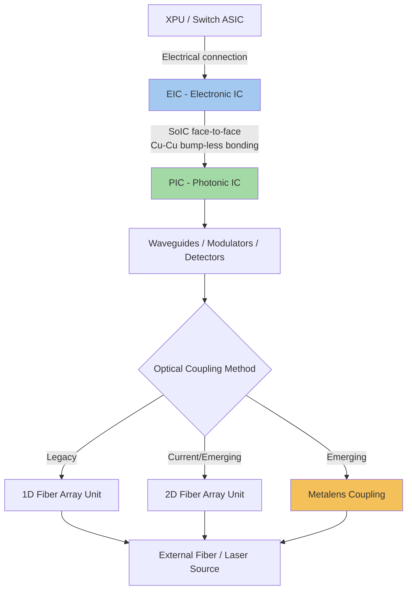

## Switch ASIC Co-Packaging Platforms Such as TSMC COUPE

### Overview

Switch ASIC co-packaging platforms provide the standardized manufacturing infrastructure enabling switch and XPU vendors to integrate photonic optical engines directly within their packages without each vendor independently developing photonic-electronic integration processes from scratch. TSMC's Compact Universal Photonic Engine (COUPE) is the most prominent example of such a platform, functioning as a foundry-and-packaging platform for optical AI interconnect rather than a standalone merchant switch product. COUPE consolidates TSMC's silicon photonics fabrication, SoIC (System on Integrated Chip) 3D packaging, and optical coupling technologies into a common, manufacturable architecture, and has become foundational infrastructure for major commercial co-packaged optics deployments including Nvidia's Quantum-X and Spectrum-X photonics switches and Broadcom's Tomahawk 6 Davisson platform.

### COUPE Platform Origins and Design Philosophy

**Key Points**

- TSMC's research introduced COUPE as a common photonic-engine structure meant to collapse the fragmented landscape of monolithic, 2D, 2.5D, and 3D silicon-photonics integration schemes into one manufacturable architecture, addressing the historical challenge that the availability of an integration platform meeting a wide range of power, performance, and cost criteria across different applications had been a prominent barrier to widespread silicon photonics adoption.
- The "universal" designation reflects the platform's intent to consolidate different application requirements (varying bandwidth, power, and cost targets across different switch and XPU use cases) onto the same underlying integration platform, rather than requiring bespoke photonic engine architectures per application.
- COUPE should be understood as a foundry-and-packaging platform for optical AI interconnect, not as a stand-alone merchant switch product — TSMC provides the underlying photonic-electronic integration technology, while switch and XPU vendors (Nvidia, Broadcom, and others) build their commercial products atop this shared platform.

### EIC-PIC Integration Architecture

**Structure**

COUPE integrates an Electronic Integrated Circuit (EIC, providing driver, transimpedance amplifier, and receiver circuitry) with a Photonic Integrated Circuit (PIC, providing waveguides, modulators, and photodetectors) using SoIC 3D stacking with bump-less copper-to-copper bonding, placing the EIC directly atop the PIC to minimize the electrical parasitic path between the two domains.

**Key Points**

- COUPE is designed as a SoIC-based photonic engine platform optimized for XPU-to-XPU optical links, leveraging 3D stacking of the EIC over the PIC through bump-less copper-to-copper bonding — architecturally equivalent to the hybrid bonding technique used elsewhere in advanced packaging (e.g., HBM stacking), now applied to the photonic-electronic integration problem.
- COUPE's electrical interface between EIC and PIC is specifically designed to minimize EIC-PIC coupling loss; compared to other industry-proposed photonic engine technologies, COUPE is reported to provide low insertion loss for both grating coupler (GC) and edge coupler (EC) optical interface geometries.
- The platform's face-to-face SoIC bonding configuration places the EIC and PIC in extremely close vertical proximity, with die separation distances in the range of a few to roughly ten micrometers according to published characterization work, a spacing far tighter than 2.5D or wire-bonded alternative photonic engine architectures.
- [Unverified] Specific quantitative figures for COUPE's energy efficiency (e.g., sub-2 pJ/bit optical I/O figures cited in some secondary literature) and precise EIC-PIC separation distances appear in academic and industry analysis sources with varying levels of primary-source verification; readers should treat specific numeric performance claims as indicative of the platform's general performance class rather than as definitively confirmed universal specifications, and should consult TSMC's own primary technical disclosures for authoritative figures.

### Optical Coupling: From Fiber Array Units to Metalens

**Key Points**

- Traditional optical couplers in photonic engines rely on 1D Fiber Array Units (FAU) for coupling light between the photonic chip and external optical fiber, but the growing need for multi-channel, multi-wavelength, and high-density interconnects is driving a transition toward 2D FAU structures within the COUPE ecosystem.
- TSMC has demonstrated the use of metalens structures (flat, nanostructured optical elements replacing traditional bulk lens optics) as an optical-coupling element within the COUPE platform, addressing optical I/O density and coupling efficiency challenges as channel counts scale.
- [Inference] The progression from 1D FAU toward 2D FAU and metalens-based coupling reflects the broader industry trend toward increasing optical I/O density per unit chip area, driven by the same underlying pressure (maximizing bandwidth density within a fixed package footprint) that motivates fine-pitch electrical interconnect scaling elsewhere in advanced packaging.

### Platform Qualification Path and Ecosystem Position

**Key Points**

- TSMC has tied COUPE to a formal qualification path from pluggable optics into CoWoS-based co-packaged optics, positioning the platform as a structured migration route for vendors transitioning from traditional pluggable transceiver architectures toward full CPO integration.
- COUPE integrates with TSMC's broader silicon photonics ecosystem, including complementary platforms referenced in TSMC's technical disclosures such as EPIC-BOE (Electronic Photonic Integrated Circuit - Broadband Optical Engine) and iOIS, reflecting a multi-platform strategy spanning different aspects of optical-electronic system integration rather than a single monolithic solution.
- The Broadband Optical Engine (BOE) architecture represents system-level integration of multiple TSMC photonics technologies, including COUPE alongside complementary interconnect components, combining silicon photonics with advanced packaging technologies to address bandwidth-intensive AI and HPC application demands.

### Commercial Adoption and Vendor Ecosystem

**Key Points**

- TSMC confirms that COUPE has entered mass production, enabling 1.6T optical interconnects for AI applications, representing a transition from research/development platform status to production-volume manufacturing infrastructure.
- Nvidia has explicitly built its flagship Quantum-X Photonics InfiniBand switch (commercially available in early 2026) and Spectrum-X Photonics Ethernet switch (expected second half of 2026) around COUPE-based optical engines, leaning on TSMC's SoIC infrastructure for the underlying photonic-electronic integration.
- Broadcom has publicly indicated its third-generation Tomahawk 6 Davisson co-packaged optics scale-out platform uses COUPE-based optical engines as well, with a fourth generation in development, indicating COUPE-based infrastructure now underpins co-packaged optics platforms from at least two major competing switch vendors.
- Nvidia has invested substantially in laser supply chain partners to support its COUPE-based platforms, reportedly committing approximately $2 billion each into Coherent and Lumentum to secure external laser sourcing, reflecting the broader industry pattern of keeping laser sources external to the co-packaged switch ASIC for thermal isolation reasons.
- Marvell, through its Celestial AI acquisition, has guided toward a co-packaged optics revenue run rate reaching approximately $500 million by fiscal Q4 2028, doubling to roughly $1 billion the following year, according to company guidance — illustrating the broader ecosystem of vendors building CPO businesses around this class of platform beyond TSMC/Nvidia/Broadcom alone.
- [Unverified] Vendor-specific revenue projections and guidance figures represent forward-looking company statements as of the time of reporting and are inherently subject to change; readers should treat these as illustrative of ecosystem investment scale and directional commitment rather than as guaranteed outcomes.

### COUPE Platform Architecture (Mermaid Diagram)

### Thermal Management Considerations in SoIC-Based Photonic Engines

**Key Points**

- The tight face-to-face SoIC integration distance between EIC and PIC that gives COUPE its electrical performance advantage also creates a thermal management consideration, since thermal crosstalk in vertically-stacked SoIC packages generally scales inversely with EIC-PIC separation distance — tighter integration for electrical performance correspondingly increases thermal coupling between the two dies.
- Silicon micro-ring resonators used in ring-based photonic engine designs are wavelength-sensitive structures requiring precise thermal tuning (via local microheaters) to maintain alignment with target wavelength grids, making thermal management a functionally significant design consideration for ring-resonator-based optical engines built on platforms like COUPE, not merely a reliability concern.
- [Inference] The combination of extremely tight EIC-PIC integration distance (necessary for COUPE's electrical performance advantages) and the wavelength-sensitivity of ring-resonator-based modulator designs suggests thermal management is likely a first-order co-design consideration for COUPE-based optical engines specifically, distinct from the thermal management challenges facing more loosely integrated (2.5D or discrete) photonic engine alternatives — though specific thermal budgets and mitigation techniques are proprietary platform implementation details not fully disclosed in public technical literature.

### Market Context and Growth Trajectory

**Key Points**

- The AI-focused optical transceiver market (encompassing both pluggable and co-packaged approaches) is modeled at approximately $26 billion in 2026, representing roughly 57% year-over-year growth from an estimated $16.5 billion in 2025, according to industry market research, indicating substantial overall market expansion during the period of COUPE's transition to mass production.
- [Inference] The concurrent timing of COUPE's mass-production entry with substantial overall optical interconnect market growth suggests platform-level manufacturing infrastructure maturity (COUPE reaching production scale) and market demand growth (driven by AI infrastructure buildout) are mutually reinforcing trends, though attributing precise causal weight between platform availability and market demand growth is not possible from available public information.

**Conclusion**

TSMC's COUPE platform represents a foundational, standardized manufacturing infrastructure layer for co-packaged optics, providing SoIC-based EIC-PIC 3D integration via bump-less copper-to-copper bonding that multiple major switch and XPU vendors (Nvidia, Broadcom, and others through the broader ecosystem) have adopted as the underlying technology for their commercial CPO products. By consolidating fragmented photonic engine integration approaches into a common, universal, production-qualified platform, COUPE illustrates how advanced packaging platform standardization — analogous to foundry process node standardization in conventional semiconductor manufacturing — can accelerate an entire industry's transition toward a new integration paradigm, in this case from pluggable optics to fully co-packaged optical interconnect.

**Related Topics**

- Co-packaged optics system architecture and optical engine design
- Silicon photonics fundamentals and photonic integrated circuits
- Hybrid bonding and SoIC (System on Integrated Chip) 3D packaging techniques
- Data center and networking system-in-package design
- Micro-ring resonator thermal tuning and wavelength stability management
- Metalens and advanced optical coupling structures for photonic I/O density scaling
- Laser supply chain strategy and external laser sourcing for CPO thermal isolation