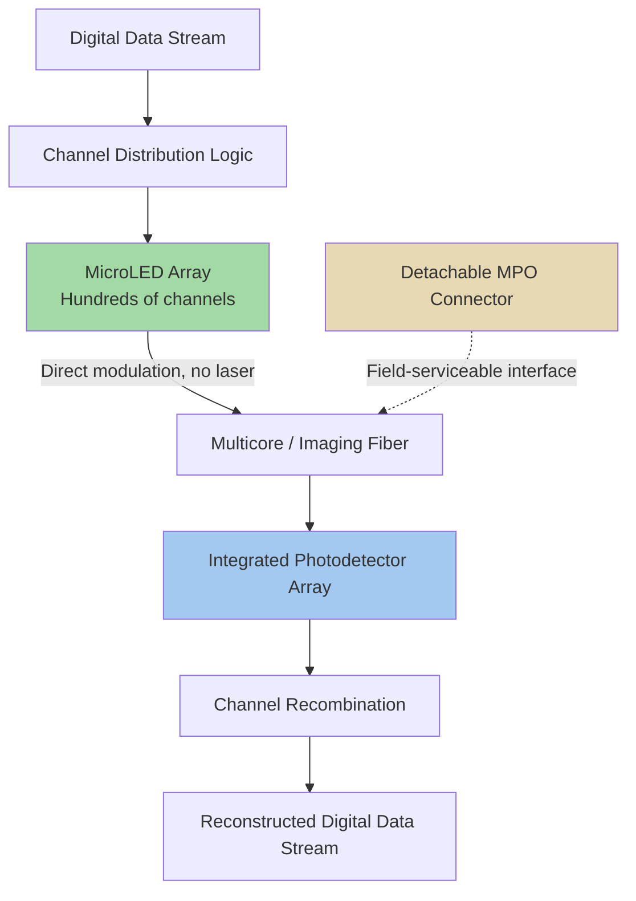

## MicroLED-Based Optical Interconnect Alternatives to Laser-Based CPO

### Overview

MicroLED-based optical interconnects represent an emerging alternative to laser-based co-packaged optics, replacing conventional laser sources and optical modulators with dense arrays of directly modulated micro-scale LEDs operating at modest per-channel speeds, distributed across hundreds of parallel low-speed optical channels rather than a small number of high-speed wavelength-multiplexed laser channels. This architecture directly targets two persistent weaknesses of laser-based CPO: laser supply chain constraints (which industry analysts expect to remain constrained through 2027) and the relatively high per-emitter power and failure rate of laser sources compared to commodity LED technology. Major initiatives including Microsoft's MOSAIC architecture, Avicena's LightBundle technology, and MediaTek's microLED demonstrations illustrate an active, rapidly maturing alternative architectural path within the broader photonic integration and co-packaged optics domain.

### Core Architectural Principle: Many Slow Channels vs. Few Fast Channels

**Key Points**

- Laser-based CPO architectures typically achieve high aggregate bandwidth through a relatively small number of very high-speed channels (often per-lane data rates exceeding 100 Gbps), frequently combined with wavelength division multiplexing to further increase throughput per physical channel
- MicroLED-based architectures instead distribute aggregate bandwidth across hundreds of relatively low-speed optical channels — for example, one implementation uses as many as 335 independent microLED data channels operating at up to 3 Gbps per channel, coupled through multicore fiber to integrated photodetector arrays
- This "many slow channels" approach eliminates lasers, optical modulators, and wavelength-division multiplexing entirely, since each microLED channel is directly modulated (turned on and off to encode data) rather than requiring a separate continuous-wave laser source paired with an external modulator
- [Inference] This architectural inversion — trading per-channel speed for channel count — is viable specifically because microLEDs can be fabricated as dense two-dimensional arrays at very fine pitch using mature LED/display fabrication processes, making massively parallel low-speed channels a practical alternative to fewer high-speed channels in a way that would not be practical with discrete laser sources

### Why MicroLED: Power and Reliability Motivations

**Key Points**

- Laser-based optical cables in AI data centers reportedly consume approximately 9.8–12W per 800 Gbps link and have been reported to fail every 6–12 hours at 100,000-GPU cluster scale, reflecting both the inherent power draw and reliability challenges of laser-based optical interconnect at large deployment scale.
- MicroLEDs offer the pure efficiency advantage of LED technology over laser technology, translating directly into reduced power usage at data center scale — commodity LED emitters can operate at substantially lower power per emitter (cited informally as 100 to 1,000 times lower power per emitter) compared to laser diodes, while microLED-based link implementations have reported end-to-end power figures around 3.1–5.3W per 800G link in one prominent architecture, alongside separately reported single-digit pJ-per-bit power consumption figures from industry commentary on microLED solutions generally.
- Unlike traditional lasers requiring complex temperature control and wavelength stabilization circuitry, microLEDs have a simpler structure and higher integration level, naturally suited to the heterogeneous integration requirements of co-packaged optics due to their micron-scale light-emitting size, high modulation bandwidth, low threshold current, and compatibility with two-dimensional array integration.
- Laser supply chain constraints are expected to persist through 2027 according to industry analyst commentary, and CPO's reliance on lasers in a supply-constrained environment is cited as a specific motivation for pursuing microLED-based alternatives that sidestep the laser supply chain entirely.

### Case Study: Microsoft MOSAIC Architecture

**Structure**

Microsoft's MOSAIC (an ACM SIGCOMM 2025 Best Paper architecture, with a MediaTek proof-of-concept subsequently built) replaces laser-driven channels with hundreds of parallel MicroLED emitters coupled to medical-grade imaging fiber, distributing 800 Gbps of aggregate bandwidth across 400+ parallel channels operating at approximately 2 Gbps each.

**Key Points**

- Unlike conventional fiber optic cables relying on a handful of high-speed laser-driven channels, MOSAIC uses hundreds of parallel low-speed channels powered by cheaper, more temperature-stable MicroLEDs, reported to achieve end-to-end power of approximately 3.1–5.3W per 800G link with 50-meter reach and QSFP/OSFP form-factor compatibility.
- MOSAIC is positioned by Microsoft specifically as a means to avoid dependence on the constrained laser supply chain affecting CPO deployment broadly; industry analysts have characterized this as potentially providing Microsoft a supply chain advantage distinct from the laser-dependent approaches pursued by other major cloud providers.
- [Unverified] Whether MOSAIC-class architectures achieve broad ecosystem adoption and scale successfully to 1.6T-and-beyond aggregate bandwidth requirements by the commonly cited 2027 target timeframe remains an open question dependent on continued technology maturation and ecosystem partner adoption; current public reporting reflects early-stage demonstration and evaluation-kit status rather than confirmed large-scale production deployment.

### Case Study: Avicena LightBundle

**Structure**

Avicena's LightBundle technology implements a microLED-based optical interconnect using multicore fiber coupling between microLED transmitter arrays and integrated photodetector arrays, with a connectorized implementation demonstrated at industry conferences enabling detachable, field-serviceable optical connections.

**Key Points**

- Avicena's 1 Tbps LightBundle evaluation kits use as many as 335 independent microLED data channels operating at up to 3 Gbps per channel, coupled through multicore fiber to integrated photodetector arrays, with the company reporting 200 fJ/bit transmitter operation and having demonstrated 30-meter link distances at prior industry conferences.
- A notable architectural development is Avicena's connectorized "eKit" implementation, which adds a detachable MPO-based (multi-fiber push-on) interface using an industry-standard connector form factor with a ferrule optimized for the multicore fiber bundle, specifically aimed at making laser-free optical I/O easier to assemble, test, and service in AI infrastructure — directly addressing a serviceability concern shared with laser-based CPO architectures.
- Avicena's roadmap has progressed from 512 Gbps toward 896 Gbps and 1 Tbps implementations across successive development milestones, indicating active bandwidth scaling within the microLED architectural approach.
- The company plans to demonstrate live data transmission while physically disconnecting and reconnecting the optical interface at industry conferences, directly showcasing the field-serviceability advantage that connectorized microLED architectures can offer relative to more tightly integrated laser-based CPO approaches.

### Case Study: MediaTek MicroLED CPO Demonstration

**Key Points**

- MediaTek demonstrated a next-generation optical interconnect built on MicroLED technology at a major industry trade show, co-developed with Microsoft Research under the MOSAIC project, promising 400 Gbit/s per fiber and reportedly 50% lower energy consumption compared to laser-based alternatives.
- This demonstration positions MicroLED-based CPO as replacing traditional VCSEL-based active optical cables with hundreds of parallel lower-speed MicroLED channels, targeting high bandwidth density, low latency, and reduced power consumption relative to both laser-based CPO and VCSEL-based near-packaged optics approaches.
- [Unverified] Specific performance claims from trade-show demonstrations (bandwidth figures, power reduction percentages) typically represent vendor-reported figures from early-stage or proof-of-concept hardware rather than independently verified, production-representative benchmarks; such figures should be treated as directionally informative rather than as confirmed final production specifications.

### MicroLED vs. Laser-Based CPO: Architectural Comparison

| Attribute | Laser-Based CPO | MicroLED-Based Interconnect |
| --- | --- | --- |
| Light source | Laser diode (external or co-packaged) | Directly modulated LED array |
| Channel architecture | Few high-speed channels, often WDM | Hundreds of parallel low-speed channels |
| Wavelength stabilization | Required (thermal tuning, control circuitry) | Not required (simpler structure) |
| Supply chain dependency | Laser diode supply (currently constrained) | Commodity LED/display fabrication supply |
| Typical reach | Tens of meters to longer-reach applications | Tens of meters (short/ultra-short reach) |
| Modulator requirement | Often requires separate optical modulator (MZM/ring) | Direct modulation (no separate modulator) |
| Field serviceability | Historically limited; improving via detachable OSA designs | Emerging connectorized (MPO-based) implementations |

### MicroLED Interconnect Architecture (Mermaid Diagram)

### Market Position Within the Broader Optical Interconnect Landscape

**Key Points**

- MicroLED-based CPO is emerging as one of three major short-distance, high-speed intra-rack transmission solutions for scale-up data-center networks, alongside active electrical cables (AEC) and VCSEL-based near-packaged optics (VCSEL NPO), positioning it as a complementary rather than universally displacing technology relative to laser-based approaches.
- Industry market research projects the micro-LED CPO optical transceiver market will reach approximately $848 million by 2030, indicating anticipated meaningful but comparatively modest market scale relative to the broader tens-of-billions-of-dollars laser-based optical transceiver and CPO market over a similar timeframe.
- Industry commentary at major optical communications conferences has identified GaAs VCSEL and MicroLED as alternative CPO implementation options that may offer benefits for specific applications distinct from mainstream laser-based silicon photonics CPO, suggesting an anticipated multi-technology coexistence within the broader optical interconnect ecosystem rather than a single dominant architecture.
- Ecosystem consolidation activity is already occurring in this space: active electrical cable vendor Credo Technology Group acquired microLED technology company Hyperlume to broaden its optical interconnect portfolio, illustrating cross-technology strategic investment as established interconnect vendors position themselves across multiple competing optical architectures.

### Application Fit: Scale-Up vs. Scale-Out Considerations

**Key Points**

- MicroLED-based interconnects are particularly positioned for scale-up data-center networks (tight, short-reach interconnects within or between adjacent racks) given their short-to-moderate reach characteristics (tens of meters in current demonstrations), distinguishing this application focus from longer-reach scale-out network applications where laser-based approaches with greater reach capability remain more established
- [Inference] The reach limitation inherent to current microLED implementations (tens of meters, as demonstrated) suggests this technology is more likely to find near-term adoption in intra-rack or inter-rack scale-up interconnects within AI clusters, rather than displacing laser-based approaches in longer-reach scale-out network tiers where extended optical reach is a harder requirement
- Reliability characteristics reported for microLED architectures — including resilience through spare channel failover across the many parallel low-speed channels — may offer a distinct reliability advantage compared to laser-based approaches, since failure of any single channel among hundreds represents a much smaller proportional bandwidth loss than failure of one channel among a small number of high-speed laser-driven channels

**Conclusion**

MicroLED-based optical interconnects represent a genuinely emerging, actively developing alternative architectural path within co-packaged optics, trading the wavelength-multiplexed, few-high-speed-channel approach of conventional laser-based CPO for a many-parallel-low-speed-channel approach built on commodity LED technology. This approach directly targets laser supply chain constraints and the higher power/failure-rate characteristics associated with laser sources, with multiple concurrent industry initiatives (Microsoft MOSAIC, Avicena LightBundle, MediaTek demonstrations) indicating substantive, well-resourced development activity rather than purely speculative research. Current market analysis positions microLED CPO as a complementary technology addressing specific short-reach, scale-up application niches alongside — rather than immediately displacing — the broader laser-based CPO ecosystem, with market scale projections considerably smaller than the mainstream laser-based optical interconnect market through the end of the decade.

**Related Topics**

- Co-packaged optics system architecture and optical engine design
- Switch ASIC co-packaging platforms such as TSMC COUPE
- Silicon photonics fundamentals and photonic integrated circuits
- VCSEL-based near-packaged optics as an intermediate architectural approach
- Laser supply chain constraints and their influence on optical interconnect architecture choice
- Multicore and imaging fiber technology for parallel channel optical transmission
- Field-serviceable connector design for co-packaged and near-packaged optical interconnects