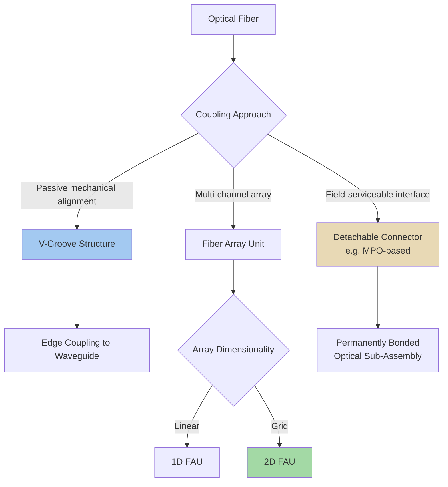

## Fiber-to-Chip Coupling: V-Groove, Detachable, and Fiber Array Approaches

### Overview

Fiber-to-chip coupling addresses the fundamental interface challenge in silicon photonics and co-packaged optics: transferring optical signals between a single-mode optical fiber (with a mode field diameter typically around 9-10 micrometers) and an on-chip silicon photonic waveguide (with submicron cross-sectional dimensions), while minimizing insertion loss, back-reflection, and alignment sensitivity. This mode-size and geometry mismatch, combined with the need for extremely tight alignment tolerances (often submicron) between fiber and waveguide, makes fiber-to-chip coupling a persistent engineering challenge distinct from most other aspects of photonic packaging. Three broad architectural families address this challenge: V-groove-based passive alignment structures, fiber array units for high-channel-count coupling, and detachable/connectorized interfaces prioritizing field-serviceability, each representing different trade-offs between coupling efficiency, alignment precision, manufacturing cost, and operational flexibility.

### The Fundamental Coupling Challenge

**Key Points**

- Single-mode optical fiber has a mode field diameter typically around 9-10 micrometers at telecommunications wavelengths, while silicon photonic waveguides on typical silicon-on-insulator platforms have cross-sectional dimensions on the order of hundreds of nanometers, creating a substantial mode-size mismatch that any coupling structure must address
- Poor mode matching between fiber and waveguide directly translates to coupling loss (light that fails to transfer into the guided waveguide mode), which compounds with other loss sources (propagation loss, component insertion loss) to constrain the overall optical power budget and achievable link distance/signal-to-noise ratio
- Alignment tolerance requirements are extremely tight — misalignment on the scale of even a micrometer can introduce significant additional coupling loss — making mechanical alignment precision a first-order engineering consideration throughout all fiber-to-chip coupling approaches
- [Inference] This combination of mode-mismatch and tight alignment tolerance requirements is analogous in spirit (though different in physical mechanism) to the electrical parasitic and interconnect-distance challenges seen in electronic advanced packaging, where minimizing the "interface" between dissimilar domains (electrical-to-optical here, versus die-to-die electrical interconnect elsewhere) is a recurring theme across the broader advanced packaging discipline

### V-Groove Passive Alignment Approach

**Structure**

V-groove coupling uses precisely etched V-shaped grooves (typically fabricated via anisotropic wet etching of crystalline silicon, which naturally produces well-controlled V-shaped groove geometry along specific crystallographic planes) to passively align optical fibers to a target position with high mechanical precision, without requiring active optical feedback during the alignment process.

**Key Points**

- The V-groove's geometry is defined by the etch process's crystallographic dependence, producing highly repeatable, precisely dimensioned groove cross-sections that mechanically constrain a fiber's lateral position when the fiber is seated into the groove
- Because V-groove alignment relies on mechanical precision rather than active optical power monitoring during assembly, it is generally referred to as "passive alignment," which can substantially reduce assembly time and cost compared to active alignment approaches requiring real-time optical feedback and iterative position adjustment
- V-groove arrays (multiple parallel grooves fabricated on a single substrate) enable simultaneous, precisely pitch-matched alignment of multiple fibers in a single assembly step, making this approach naturally suited to multi-channel fiber array applications
- [Inference] The passive nature of V-groove alignment makes it particularly attractive for high-volume manufacturing scenarios where the cost and throughput advantages of eliminating active alignment steps outweigh any potential coupling efficiency advantage that active alignment might otherwise provide through real-time optimization

### Edge Coupling vs. Grating Coupling Context

**Key Points**

- V-groove structures are most commonly associated with edge coupling approaches, where the fiber approaches the photonic chip from the side (in-plane with the waveguide), requiring the waveguide to be brought to the chip edge with a mode-matching taper structure to improve coupling efficiency with the larger fiber mode
- Grating couplers, by contrast, couple light vertically (out of the chip plane) using a periodic grating structure that diffracts light between the fiber (positioned above the chip surface, often at a slight angle) and the in-plane waveguide mode, offering different alignment tolerance and bandwidth characteristics compared to edge coupling
- Edge coupling with mode-matching tapers generally achieves broader optical bandwidth and lower polarization dependence compared to grating couplers, but typically requires more precise fiber positioning and often necessitates dicing/polishing the chip edge to optical quality, whereas grating couplers can couple at any location on the chip surface and are more tolerant of certain alignment variations, at some cost in bandwidth and polarization sensitivity
- [Inference] The choice between edge coupling (often paired with V-groove alignment) and grating coupling for a given co-packaged optics platform likely reflects a trade-off between optical bandwidth/polarization performance (favoring edge coupling) and manufacturing/testing flexibility (favoring grating couplers, which do not require chip-edge access), with different platforms making different choices based on their specific performance and manufacturing priorities

### Fiber Array Unit (FAU) Approaches

**Structure**

A Fiber Array Unit assembles multiple optical fibers into a single mechanical unit with precisely controlled fiber pitch and position, typically using V-groove arrays or similar precision alignment structures to hold each fiber in the array at a fixed, repeatable position relative to its neighbors, enabling simultaneous multi-channel coupling to a corresponding array of waveguides or grating couplers on the photonic chip.

**Key Points**

- **1D Fiber Array Units:** arrange fibers in a single linear row, historically the dominant FAU architecture, suited to moderate channel counts where a linear arrangement provides sufficient coupling density for the target application
- **2D Fiber Array Units:** arrange fibers in a two-dimensional grid pattern, providing substantially higher channel density per unit chip edge or surface area compared to 1D arrangements, increasingly important as co-packaged optics applications demand higher aggregate channel counts within constrained package footprints
- The growing need for multi-channel, multi-wavelength, and high-density interconnects in modern co-packaged optics applications is driving industry transition from 1D FAU toward 2D FAU structures, reflecting the same underlying pressure toward higher interconnect density seen throughout advanced packaging
- FAU assembly typically combines V-groove-based mechanical alignment structures with precision epoxy bonding or similar permanent attachment methods, historically creating a largely fixed, non-detachable connection between the fiber array and the photonic chip once assembled

### Metalens and Emerging Coupling Structures

**Key Points**

- Metalens structures (flat, nanostructured optical elements using subwavelength features to control light, replacing traditional bulk refractive lens optics) have been demonstrated as an optical-coupling element within advanced co-packaged optics platforms, offering a compact, potentially more manufacturable alternative to conventional bulk-optic coupling lenses for beam shaping and mode conversion between fiber and chip
- [Inference] The adoption of metalens-based coupling structures likely reflects the same drive toward higher interconnect density and more compact optical engine form factors seen in the 1D-to-2D FAU transition, extending fine-feature-size, lithographically-defined optical structures (rather than bulk discrete optics) into the fiber-coupling interface itself

### Detachable and Connectorized Coupling Approaches

**Structure**

Detachable fiber-to-chip coupling approaches use standardized mechanical connector interfaces — such as MPO (multi-fiber push-on) connectors adapted for the relevant fiber geometry — to allow the optical connection between fiber and chip (or fiber and package) to be physically disconnected and reconnected without disturbing the underlying permanently bonded optical engine assembly.

**Key Points**

- Detachable optical sub-assembly (OSA) designs in co-packaged optics architectures directly address the serviceability disadvantage traditionally associated with permanently bonded fiber-to-chip coupling, allowing field replacement of the optical engine (or the fiber connection to it) without requiring replacement of the entire switch or accelerator package
- Connectorized microLED-based interconnect implementations have demonstrated detachable MPO-based interfaces using an industry-standard connector form factor with a ferrule optimized for multicore fiber bundles, specifically aimed at making optical I/O easier to assemble, test, and service — illustrating that the detachable-coupling design pattern extends across both laser-based and emerging non-laser optical interconnect architectures
- Live demonstrations of physically disconnecting and reconnecting an optical interface while maintaining functional data transmission (with bit-error-rate monitoring) illustrate the field-serviceability goal these detachable approaches are specifically engineered to achieve, directly responding to data center operator concerns about losing pluggable-optics-style field-replaceability in fully co-packaged architectures
- [Inference] The emergence of detachable/connectorized coupling approaches across multiple different co-packaged optics technology families (both conventional laser-based CPO and emerging microLED-based alternatives) suggests field-serviceability is a broadly recognized adoption barrier across the co-packaged optics industry as a whole, rather than a concern specific to any single technology approach, motivating parallel engineering investment in detachable interface solutions across the ecosystem

### Comparison of Fiber-to-Chip Coupling Approaches

| Attribute | V-Groove (Passive, Fixed) | Fiber Array Unit (1D/2D) | Detachable/Connectorized |
| --- | --- | --- | --- |
| Alignment method | Passive mechanical (etched groove) | Passive mechanical, array-based | Standardized connector mating |
| Channel density | Single or few channels typically | High (especially 2D FAU) | Varies by connector design |
| Field serviceability | Low (typically permanently bonded) | Low (typically permanently bonded) | High (designed for disconnection) |
| Manufacturing cost profile | Lower (passive alignment reduces assembly cost) | Moderate to higher (precision multi-fiber assembly) | Additional connector hardware cost |
| Primary use case | Single-channel or small-array edge coupling | High-channel-count photonic engines | Operator-serviceable CPO/optical I/O modules |

### Fiber-to-Chip Coupling Architecture Comparison (Mermaid Diagram)

### Example: High-Density 2D FAU in a Co-Packaged Optics Engine

**Example**

A co-packaged optics platform targeting high aggregate bandwidth within a compact optical engine footprint uses a 2D fiber array unit, arranging fiber connection points in a grid pattern rather than a single row, to maximize the number of optical channels that can be coupled within the limited chip-edge or chip-surface area available. Each fiber in the array is passively aligned using a corresponding V-groove structure fabricated with high dimensional precision, ensuring the entire array mates correctly with a matching array of waveguide or grating coupler structures on the photonic chip in a single assembly step, without requiring individual active alignment of each fiber channel.

### Reliability and Environmental Considerations

**Key Points**

- Permanently bonded fiber-to-chip connections (via epoxy or similar attachment following V-groove or FAU alignment) must maintain optical alignment stability across the package's full operating temperature range and mechanical stress environment, since even small alignment drift can measurably increase coupling loss over the device's operational life
- Detachable connector interfaces introduce their own reliability considerations distinct from permanently bonded approaches, including mating cycle durability (how many disconnect/reconnect cycles the connector can withstand while maintaining coupling performance) and contamination risk during field disconnection/reconnection (dust or debris introduced into the optical path during servicing)
- [Inference] The trade-off between permanently bonded and detachable coupling approaches likely mirrors, at the photonic packaging level, similar reliability-versus-serviceability trade-offs seen in electronic advanced packaging (e.g., hybrid bonding's lack of rework capability versus microbump stacking's limited rework possibility), suggesting this tension between maximum performance/reliability and field-serviceability is a recurring theme across advanced packaging broadly, not unique to the photonic domain

### Relevance to Co-Packaged Optics System Design

**Key Points**

- Fiber-to-chip coupling approach selection directly interacts with broader co-packaged optics system architecture decisions, since the choice between permanently bonded high-density arrays versus detachable connectorized interfaces affects overall system serviceability, a factor identified as a significant adoption consideration for co-packaged optics broadly
- The trend toward higher channel density (1D to 2D FAU transition) and the parallel trend toward field-serviceable detachable interfaces represent two design pressures that are not mutually exclusive but require careful co-engineering to satisfy simultaneously, as evidenced by detachable MPO-based interfaces being developed specifically to accommodate high-channel-count multicore fiber bundles

**Conclusion**

Fiber-to-chip coupling addresses the fundamental mode-mismatch and alignment-precision challenge inherent to connecting standard optical fiber with submicron-scale photonic waveguides, through three complementary architectural families: V-groove-based passive mechanical alignment (offering manufacturing efficiency for single or small-array channels), fiber array units in 1D or increasingly 2D configurations (addressing high-channel-density requirements), and detachable connectorized interfaces (addressing field-serviceability concerns that permanently bonded approaches cannot satisfy). These approaches are not mutually exclusive — modern co-packaged optics platforms increasingly combine precision V-groove-based array alignment with detachable connector interfaces to simultaneously achieve high channel density and field-serviceability, reflecting the broader advanced packaging theme of balancing maximum interconnect performance against practical operational and reliability requirements.

**Related Topics**

- Silicon photonics fundamentals and photonic integrated circuits
- Co-packaged optics system architecture and optical engine design
- Switch ASIC co-packaging platforms such as TSMC COUPE
- MicroLED-based optical interconnect alternatives to laser-based CPO
- Grating coupler versus edge coupler design trade-offs
- MPO connector standards and multicore fiber bundle technology
- Optical power budget analysis and loss accounting in photonic links