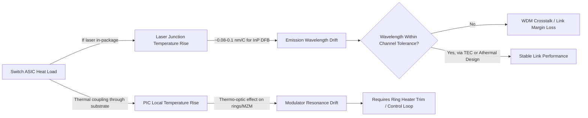

## Laser Integration, Laser Supply Chain, and Thermal Control for Photonic Packages

### Overview

Co-packaged optics (CPO) and silicon photonics (SiPh) modules cannot generate light natively from silicon, since silicon is an indirect-bandgap semiconductor with poor spontaneous and stimulated emission efficiency. Every silicon photonic transceiver, therefore, requires a light source supplied from a III-V compound semiconductor (InP or GaAs-based) either flip-chip bonded, edge-coupled, or heterogeneously integrated onto the photonic integrated circuit (PIC). This item covers the three interlocking engineering domains that determine whether a photonic package is manufacturable, reliable, and serviceable at hyperscale volumes: (1) laser integration architectures, (2) the external laser supply chain (foundries, EML/DFB vendors, qualification), and (3) thermal control strategies (TECs, athermal design, heat extraction) needed because III-V lasers are highly temperature-sensitive while co-located with power-dense switch ASICs.

---

### Why Lasers Cannot Be Made From Silicon

- Silicon's indirect bandgap requires a phonon to conserve momentum during electron-hole recombination, making radiative recombination probability orders of magnitude lower than in direct-bandgap materials.
- III-V materials (InP, GaAs, InGaAsP, InGaAsN) are direct-bandgap, enabling efficient stimulated emission for laser diodes.
- This mismatch is the foundational reason CPO architectures are inherently heterogeneous (multi-material) systems, not monolithic silicon designs.

---

### Laser Integration Architectures

#### 1. External Laser Source (ELS) / Off-Chip Fiber-Coupled Laser

- Laser resides in a separate, fiber-pigtailed module outside the PIC package (sometimes off-board entirely in a laser bank/shelf).
- Light is delivered via polarization-maintaining (PM) fiber into the PIC through edge or grating couplers.
- **Key Points**
  - Decouples laser thermal/reliability issues from the switch ASIC's hot thermal envelope.
  - Enables laser sparing/hot-swap and independent binning.
  - Adds fiber-coupling loss (~1–3 dB typical) and packaging complexity (PM fiber alignment tolerances are sub-micron).
  - Preferred initial approach for CPO 3.0/OSFP-based pluggable-adjacent designs and early hyperscaler CPO deployments (e.g., architectures aligned with OIF's External Laser Source MSA).

#### 2. On-Board/In-Package Discrete Laser (Flip-Chip Bonded)

- Bare laser die (typically a DFB or Fabry-Pérot laser bar) is flip-chip or wire-bonded directly onto or adjacent to the PIC substrate within the same package.
- Coupling to the SiPh waveguide occurs via edge coupling, spot-size converters (SSC), or evanescent coupling.
- **Key Points**
  - Reduces coupling loss versus long fiber runs but increases thermal coupling to the package's hot zone.
  - Requires sub-micron active or passive alignment during assembly (a major yield/cost driver).
  - Common for EML (electro-absorption modulated laser) or DFB laser arrays feeding multiple PIC channels.

#### 3. Heterogeneous/Hybrid Integration (Wafer-Level III-V-on-Si)

- III-V epitaxial material (often unpatterned "coupons") is bonded onto the SOI/SiPh wafer at the wafer level using die-to-wafer bonding (molecular bonding, adhesive DVS-BCB bonding) before laser structures are lithographically defined.
- Post-bond processing defines the laser cavity, mirrors (via etched facets or Bragg gratings), and electrical contacts using standard CMOS-compatible lithography.
- **Key Points**
  - Enables wafer-scale laser fabrication with hundreds/thousands of lasers per wafer, reducing per-unit assembly cost at high volume.
  - This is the approach used in integrated hybrid silicon lasers pioneered by groups such as UCSB/Intel Photonics.
  - Highest R&D barrier to entry; concentrated among a small number of foundries (see Supply Chain section).

#### 4. Micro-Transfer Printing (µTP) of III-V Coupons

- Small, pre-fabricated III-V laser/SOA (semiconductor optical amplifier) coupons are lithographically released from a native III-V wafer and "stamped" (transfer printed) onto the target SiPh wafer at specific die locations using an elastomer stamp.
- **Key Points**
  - Combines wafer-level throughput with pick-and-place flexibility — enables sparse, precise placement without wasting full III-V wafers.
  - Commercialized by X-Celeprint (licensing model) and integrated into pilot lines from imec and others.
  - Considered a strong candidate for scaling heterogeneous laser integration beyond current bonded-wafer approaches because it does not require full-wafer III-V-to-Si bonding.

---

### Laser Types Used in Photonic Packages

| Laser Type | Structure | Typical Use in CPO | Notes |
| --- | --- | --- | --- |
| DFB (Distributed Feedback) | Single-mode, grating-stabilized cavity | CW light source for external modulation (feeds SiPh MZM/ring modulators) | Narrow linewidth, high wavelength stability; dominant CW source for CPO |
| EML (Electro-absorption Modulated Laser) | DFB laser + integrated EA modulator on same chip | Direct high-speed optical output (100G/lane+ NRZ/PAM4) | Historically dominant in pluggable transceivers; less common as the sole source inside CPO where external modulation on the PIC is preferred |
| DR Laser (Directly Modulated Laser) | Directly modulated DFB | Lower-cost, shorter-reach links | Simpler drive circuitry, lower bandwidth ceiling than EML |
| VCSEL (Vertical-Cavity Surface-Emitting Laser) | GaAs-based, surface emission | Short-reach, multimode (850 nm) links | Not typically used for CPO's single-mode SiPh links; relevant for some short-reach/AOC applications |
| Comb Laser / Micro-Ring Comb | Multi-wavelength single source | Feeds WDM/DWDM SiPh links with many wavelengths from one laser | Reduces laser count per package; active research area (Kerr combs, quantum-dot comb lasers) |
| Quantum Dot (QD) Laser (on Si or InP) | III-V quantum dot active region grown on Si or InP | Emerging CW source, especially for direct epitaxial growth on silicon | Offers better temperature stability and defect tolerance than quantum-well lasers; active DARPA/academic focus |

**External Laser Source (ELS) vs. Integrated CW Laser** is the primary architectural decision point in CPO design, with most first-generation 51.2T/102.4T switch CPO systems (e.g., Broadcom Bailly, Marvell/Ranovus designs) adopting pluggable or replaceable ELS modules specifically to isolate laser reliability risk from the switch package and to allow independent field replacement.

---

### Laser Supply Chain

#### Market Structure and Key Suppliers

The laser supply chain for photonic packaging is significantly more concentrated and specialized than general semiconductor supply chains, because III-V epitaxy, DFB/EML fabrication, and hermetic packaging require distinct process expertise from CMOS foundries.

- **III-V Epitaxy/Foundry Vendors**: Companies growing and fabricating InP-based laser die, including established telecom-laser suppliers repurposing capacity for datacom/AI-interconnect volumes.
- **Merchant Laser Suppliers**: Firms supplying DFB, EML, and comb laser die/chips to module integrators and hyperscalers, often via direct supply agreements given the volume commitments involved in CPO programs.
- **Integrated Device Manufacturers (IDMs)**: Vertically integrated players controlling both PIC and laser fabrication (through internal III-V fabs or acquisitions), reducing interface risk between laser and PIC vendors.
- **Foundry-Model SiPh Players**: Pure-play SiPh foundries that partner with external laser suppliers rather than fabricating III-V material themselves, requiring robust laser-attach and qualification partnerships.

**Key Points**

- Because CPO for AI/ML clusters is projected to require laser volumes far exceeding historical telecom-laser demand (potentially millions of units annually per hyperscaler), supply chain capacity expansion, second-sourcing, and multi-vendor qualification are major program risks discussed openly by OIF, COBO (Consortium for On-Board Optics), and hyperscaler technical forums.
- [Inference] Given the historical concentration of InP epitaxy capacity among a handful of specialized fabs, near-term industry-wide CPO laser demand could outstrip available capacity unless significant capital expenditure in III-V fab capacity occurs; this is a widely discussed but not universally quantified risk.

#### Supply Chain Structural Considerations

- **Wavelength/Grid Standardization**: Laser wavelength grids (CWDM4, LAN-WDM, O-band vs. C-band) must be standardized across the ecosystem (OIF CPO MSAs) so that laser suppliers can produce interchangeable, multi-sourced parts rather than bespoke wavelengths per customer.
- **Hermeticity and Packaging**: III-V lasers require hermetic (or near-hermetic) sub-packages to prevent moisture-induced facet degradation, adding a secondary packaging supply chain (TO-can-like micro-packages, hermetic lids, getters) distinct from the SiPh package itself.
- **Second-Sourcing Strategy**: Hyperscalers increasingly require dual/multi-sourced laser suppliers per design to avoid single-point-of-failure risk, given III-V fab capacity constraints and long qualification cycles (typically 12–18+ months for new laser sources in hyperscale-grade reliability programs).
- **Vertical Integration Trend**: Some switch/optics vendors have pursued acquisition of laser fabrication capability directly (bringing III-V epitaxy in-house) specifically to secure supply and control cost at CPO volumes, reflecting the strategic importance of laser supply independent of PIC capability.

#### Laser Reliability and Qualification

- **Telcordia GR-468 / GR-1221**: Industry-standard qualification frameworks originally developed for telecom lasers, adapted for datacom/CPO laser qualification (high-temperature operating life, temperature cycling, humidity, ESD).
- **FIT Rate (Failures in Time)**: Laser reliability is specified in FIT (failures per billion device-hours); CPO's in-package, hard-to-service laser placement drives requirements toward very low FIT targets, especially for architectures without field-replaceable ELS modules.
- **Field Replaceability as a Reliability Mitigation**: A major driver for ELS-based architectures (Section: Laser Integration Architectures, #1) is that lasers historically exhibit higher failure rates than passive photonic or electronic components, so keeping the laser field-replaceable avoids scrapping an entire switch package over a single laser failure.

---

### Thermal Control for Photonic Packages

#### The Core Thermal Challenge

III-V lasers (particularly DFB and comb lasers) exhibit strong temperature dependence in threshold current, output power, and — critically — emission wavelength (typically ~0.08–0.1 nm/°C for InP-based DFB lasers). Co-packaged optics place these temperature-sensitive lasers in immediate proximity to switch ASICs dissipating hundreds of watts, creating a severe thermal co-design problem.

**Key Points**

- Wavelength drift from junction temperature changes can walk a laser off its designed WDM channel, causing crosstalk or receiver misalignment in DWDM links.
- Threshold current increases with temperature, degrading power efficiency and potentially forcing lasers outside safe operating current density (accelerating degradation).
- Unlike the switch ASIC, which tolerates a relatively wide junction temperature range, lasers typically require tight temperature stabilization (often ±0.1–1°C) for wavelength-critical DWDM applications.

#### Thermal Control Approaches

##### 1. Thermoelectric Coolers (TECs)

- Peltier-effect TECs actively stabilize laser temperature independent of ambient/package temperature swings.
- **Key Points**
  - Provides the tightest wavelength control, essential for DWDM comb-laser sources feeding many wavelength channels from one source.
  - Adds electrical power overhead (TEC power draw can rival or exceed laser diode power draw itself), a significant concern for AI-datacenter power budgets at scale.
  - Adds height/volume to the package and a discrete component with its own reliability/lifetime considerations, complicating dense in-package integration.
  - Common in ELS modules where laser sits outside the switch package's most extreme thermal zone, making TEC integration more tractable.

##### 2. Athermal Laser/Waveguide Design

- Designing the laser cavity or feedback structure (e.g., athermal Bragg gratings using material combinations with compensating thermo-optic coefficients) to minimize wavelength drift without active cooling.
- **Key Points**
  - Reduces or eliminates TEC power overhead — critical for in-package (non-ELS) laser architectures where TEC placement is thermally and spatially difficult.
  - Athermal designs typically trade off some optical performance (linewidth, tuning range) versus actively cooled designs.
  - Active research area for making heterogeneously integrated (wafer-bonded) lasers viable without per-laser TECs at scale.

##### 3. Passive Thermal Management (Heat Spreaders, Substrate Engineering)

- Use of high-thermal-conductivity submounts (AlN, diamond, SiC) under laser die to spread heat away from the active region toward the package heat sink path.
- Thermal vias and copper heat-spreading layers integrated into the PIC/interposer stack to route laser-generated heat away from both the laser itself and nearby thermally sensitive optical components (ring resonators, MZMs).
- **Key Points**
  - Diamond submounts offer very high thermal conductivity (~2000 W/m·K) but at higher cost, reserved for the highest-power-density laser placements.
  - Passive approaches reduce but do not eliminate wavelength drift, so they are often combined with digital wavelength locking/monitoring rather than full active TEC stabilization.

##### 4. System-Level Thermal Co-Design (Switch ASIC + Laser Coexistence)

- CPO packages must jointly manage: switch ASIC heat (typically the dominant heat source, hundreds of watts), laser heat (comparatively small per-device but thermally sensitive), and the PIC's own thermo-optic sensitivity (ring resonators drift with temperature too).
- **Key Points**
  - Physical separation/isolation zones within the package (thermal moats, dedicated heat spreaders) are used to keep switch ASIC heat from coupling into the laser's local thermal environment.
  - Liquid cooling (cold plates) increasingly used at the switch package level in AI cluster CPO deployments, with the laser subsystem often thermally isolated from the primary cold-plate contact zone or given a dedicated secondary thermal path.
  - Digital control loops (on-die temperature sensors + firmware-driven bias/wavelength compensation) are used to complement or substitute for hardware TECs, trading some wavelength precision for lower power and simpler mechanical integration.

##### 5. Wavelength Locking and Monitoring

- Even with thermal control, closed-loop wavelength locking (using integrated photodiodes monitoring a reference etalon or grating) corrects residual drift.
- **Key Points**
  - Common in DWDM comb-laser architectures where many channels must remain precisely on-grid.
  - Adds control-loop complexity (firmware, calibration) but relaxes the burden on pure thermal/TEC precision.

---

### Illustrative Package Cross-Section (SVG Diagram)

Thermal/laser integration cross-section for an ELS-fed CPO switch package (svg_diagram)

<svg xmlns="http://www.w3.org/2000/svg" viewBox="0 0 900 480" font-family="sans-serif">
<text x="450" y="30" text-anchor="middle" font-size="18" font-weight="bold">CPO Package: Laser Integration &amp; Thermal Paths (svg_diagram)</text>

<rect x="150" y="50" width="600" height="30" fill="#a8c6e8" stroke="#333" stroke-width="1.5" />
<text x="450" y="70" text-anchor="middle" font-size="13">Liquid Cold Plate (Switch ASIC Cooling)</text>

<rect x="330" y="90" width="240" height="60" fill="#e8a8a8" stroke="#333" stroke-width="1.5" />
<text x="450" y="115" text-anchor="middle" font-size="13" font-weight="bold">Switch ASIC</text>
<text x="450" y="135" text-anchor="middle" font-size="11">(Hundreds of Watts, High Tj Tolerance)</text>

<rect x="100" y="150" width="700" height="40" fill="#d9d9d9" stroke="#333" stroke-width="1.5" />
<text x="450" y="175" text-anchor="middle" font-size="12">Package Substrate / Interposer</text>

<rect x="130" y="190" width="280" height="70" fill="#c9e8c2" stroke="#333" stroke-width="1.5" />
<text x="270" y="215" text-anchor="middle" font-size="13" font-weight="bold">Silicon Photonic IC</text>
<text x="270" y="233" text-anchor="middle" font-size="11">(MZM / Ring Modulators,</text>
<text x="270" y="248" text-anchor="middle" font-size="11">Thermo-Optic Sensitive)</text>

<rect x="420" y="190" width="20" height="70" fill="#ffffff" stroke="#333" stroke-width="1" stroke-dasharray="4,3" />
<text x="430" y="280" text-anchor="middle" font-size="10">Thermal</text>
<text x="430" y="292" text-anchor="middle" font-size="10">Moat</text>

<rect x="450" y="190" width="170" height="70" fill="#f0d9a8" stroke="#333" stroke-width="1.5" />
<text x="535" y="220" text-anchor="middle" font-size="12" font-weight="bold">Electronic IC</text>
<text x="535" y="238" text-anchor="middle" font-size="11">(SerDes / DSP)</text>

<line x1="130" y1="225" x2="30" y2="225" stroke="#333" stroke-width="2" />
<text x="80" y="215" text-anchor="middle" font-size="10">PM Fiber</text>

<rect x="650" y="330" width="200" height="110" fill="#f5c6c6" stroke="#333" stroke-width="1.5" rx="6" />
<text x="750" y="355" text-anchor="middle" font-size="13" font-weight="bold">External Laser</text>
<text x="750" y="372" text-anchor="middle" font-size="13" font-weight="bold">Source (ELS)</text>
<text x="750" y="392" text-anchor="middle" font-size="10">DFB / Comb Laser</text>
<text x="750" y="406" text-anchor="middle" font-size="10">+ TEC (Active Wavelength Lock)</text>
<text x="750" y="422" text-anchor="middle" font-size="10">Field-Replaceable Module</text>

<path d="M 30 225 L 30 385 L 650 385" fill="none" stroke="#333" stroke-width="2" stroke-dasharray="6,3" />
<text x="330" y="378" text-anchor="middle" font-size="10">PM Fiber to PIC Edge Coupler</text>

<rect x="100" y="260" width="700" height="20" fill="#bbbbbb" stroke="#333" stroke-width="1.5" />
<text x="450" y="274" text-anchor="middle" font-size="10">Heat Spreader / Baseplate</text>

<rect x="100" y="440" width="14" height="14" fill="#e8a8a8" stroke="#333" />
<text x="120" y="452" font-size="10">High Heat Source</text>
<rect x="260" y="440" width="14" height="14" fill="#c9e8c2" stroke="#333" />
<text x="280" y="452" font-size="10">Thermo-Optic Sensitive</text>
<rect x="460" y="440" width="14" height="14" fill="#f5c6c6" stroke="#333" />
<text x="480" y="452" font-size="10">Isolated Laser Subsystem</text>
</svg>

---

### Laser Wavelength Drift vs. Junction Temperature (Mermaid Reference)

---

### Comparative Summary: ELS vs. In-Package Laser Trade-offs

| Factor | External Laser Source (ELS) | In-Package/Heterogeneous Laser |
| --- | --- | --- |
| Thermal isolation from switch ASIC | Strong (separate module) | Weak-to-moderate (shares package thermal envelope) |
| Field replaceability | Yes (major reliability mitigation) | No (laser failure often scraps the package) |
| Coupling loss | Higher (fiber run + connector) | Lower (direct/evanescent coupling) |
| TEC integration feasibility | Straightforward | Difficult (space, power, thermal crosstalk) |
| Manufacturing/assembly complexity | Lower per-package (laser built separately) | Higher (precision die bonding or wafer bonding) |
| Scalability to high laser-per-port counts | Easier to service/scale via modular sparing | More cost-efficient at extreme volume (wafer-level) |
| Current hyperscale CPO adoption stance | Preferred for 1st/2nd-gen deployments | Target for future cost/power reduction |

---

### Practical Example: Estimating TEC Power Budget Impact

For an ELS module maintaining a DFB laser at a fixed 25°C setpoint against an ambient rise to 55°C (ΔT = 30°C), with a laser dissipating $P_{laser} = 0.5\ \text{W}$ and a TEC of coefficient of performance $\text{COP} \approx 0.4$ at this ΔT (typical for a single-stage Peltier under a large ΔT):

$$P_{TEC} = \frac{P_{laser}}{\text{COP}} \approx \frac{0.5}{0.4} = 1.25\ \text{W}$$

**Key Points**

- The TEC can draw 2–3× the laser's own dissipation at large ΔT, which is why athermal or passive designs are attractive at scale — across thousands of lasers per switch and many switches per rack, TEC overhead becomes a material fraction of the interconnect power budget. [Inference: exact COP and resulting overhead vary significantly with TEC design, ΔT, and laser package thermal resistance; treat this as an illustrative order-of-magnitude calculation, not a specification.]

---

### Standards and Ecosystem Bodies Relevant to This Item

- **OIF (Optical Internetworking Forum)**: Publishes CPO framework documents and External Laser Source MSAs defining electrical/optical/mechanical interfaces for pluggable ELS modules.
- **COBO (Consortium for On-Board Optics)**: Defines on-board optics form factors and thermal/mechanical guidelines relevant to in-package and near-package laser modules.
- **Telcordia/GR Standards**: Reliability and qualification baseline for laser diodes used in the ecosystem.

---

**Related Topics**

- Silicon photonics modulator types (MZM vs. micro-ring) and their thermal tuning requirements
- Wafer-to-wafer and die-to-wafer bonding techniques for heterogeneous III-V-on-Si integration
- Optical coupling methods: edge coupling, grating couplers, and spot-size converters
- DWDM/CWDM channel plans for co-packaged optics links
- Liquid cooling and cold-plate design for CPO switch packages
- Fiber attach and pigtailing processes for photonic packages
- Reliability physics of III-V laser diodes (facet degradation, dark-line defects)
- Comb laser and quantum-dot laser sources for multi-wavelength CPO architectures
- Power delivery network (PDN) co-design for laser drivers and TECs in dense packages
- Optical wavelength locking and monitoring control loops