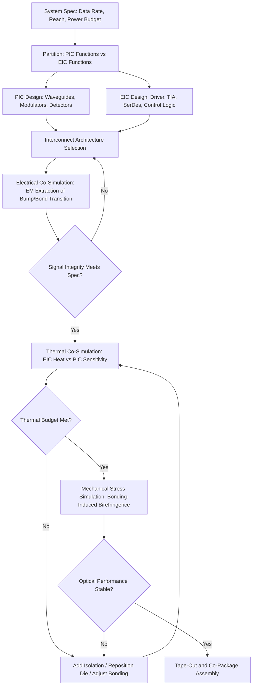

## Electronic-Photonic Co-Integration and PIC-EIC Interface Design

### Overview

Electronic-photonic co-integration is the discipline of combining a Photonic Integrated Circuit (PIC) — which manipulates light for modulation, detection, and routing — with an Electronic Integrated Circuit (EIC) — which provides driving, transimpedance amplification, serialization, and digital signal processing — into a single tightly coupled system. The interface between these two die is one of the highest-risk, highest-value engineering boundaries in co-packaged optics (CPO), because it must simultaneously satisfy high-speed electrical signal integrity, optical performance stability, thermal co-existence, and mechanical/assembly yield constraints across two fundamentally different semiconductor technologies (typically CMOS for the EIC and SOI or III-V-enhanced SOI for the PIC).

---

### Why Co-Integration Is Architecturally Difficult

- **Process Mismatch**: EICs are fabricated in advanced CMOS nodes (7nm, 5nm, or finer) optimized for transistor density and switching speed; PICs are fabricated in SOI processes optimized for optical waveguide propagation, often at older, photonics-specific nodes (90nm–130nm class litho for many foundry PDKs).
- **Electrical Parasitics at the Interface**: The PIC-EIC boundary introduces bond wires, micro-bumps, or through-silicon vias (TSVs) that add parasitic inductance/capacitance directly in the signal path of multi-tens-of-Gbps electrical signals driving optical modulators.
- **Thermal Interaction**: EIC switching activity generates heat that couples into the PIC's thermo-optic-sensitive components (ring resonators, MZM phase shifters), requiring co-design of thermal isolation alongside electrical co-design.
- **Mechanical Stress**: Bonding processes (flip-chip, hybrid bonding) can induce stress birefringence in the PIC's waveguides, shifting optical performance — a failure mode that has no analog in pure-electronic IC packaging.

---

### Integration Architectures

#### 1. Wire-Bond Interconnect (Legacy/Low-Speed)

- EIC and PIC mounted side-by-side on a common substrate, connected via gold or aluminum wire bonds.
- **Key Points**
  - Simplest, lowest-cost, most mature assembly process.
  - Wire bond inductance (~0.5–1 nH/mm) becomes a dominant bandwidth limiter above ~25–56 Gbps/lane, making this approach unsuitable for current-generation 100G+/lane CPO designs.
  - Still used in some lower-speed or cost-sensitive photonic modules.

#### 2. Flip-Chip / Micro-Bump Interconnect

- EIC is flipped and bonded face-down onto the PIC (or onto a shared interposer) using solder micro-bumps, typically 40–80 µm pitch.
- **Key Points**
  - Shorter electrical path than wire bonding, substantially reducing parasitic inductance and enabling higher per-lane bandwidth (56G–112G PAM4 class).
  - This is the dominant interconnect approach in current-generation CPO products (e.g., driver/TIA EICs flip-chip bonded directly onto or adjacent to PIC modulator/photodetector arrays).
  - Requires precise co-planarity and underfill process control to avoid mechanical stress transfer into the PIC.

#### 3. Hybrid/Direct Bonding (Cu-Cu, Die-to-Wafer)

- Copper-to-copper hybrid bonding (as used in advanced 2.5D/3D electronic packaging) applied to join EIC directly onto the PIC or a shared interposer at fine pitch (sub-10 µm), enabling much higher I/O density.
- **Key Points**
  - Emerging approach for next-generation CPO, borrowing directly from 3D IC hybrid bonding techniques (analogous to what is used in HBM stacking and chiplet integration).
  - Enables far higher electrical I/O density between EIC and PIC than flip-chip bumping, relevant as per-lane count and lane-speed both increase.
  - [Inference] Broad hyperscale-volume adoption of hybrid bonding specifically for PIC-EIC integration is still emerging relative to its maturity in pure-electronic 3D stacking; qualification data at CPO-relevant volumes is comparatively less mature than for flip-chip.

#### 4. Interposer-Mediated Integration (2.5D)

- Both EIC and PIC are mounted on a common silicon or organic interposer that carries high-density redistribution layers (RDL) between them, rather than bonding EIC directly to PIC.
- **Key Points**
  - Decouples EIC and PIC bonding processes, allowing independent yield optimization and rework of one die without scrapping the other.
  - Interposer RDL adds a controlled, engineered electrical path (as opposed to ad hoc bond wire routing), improving signal integrity predictability.
  - Common in switch-ASIC-centric CPO designs where the PIC and EIC chiplets sit alongside the switch die on a shared organic or silicon substrate.

---

### PIC-EIC Electrical Interface Design

#### Driver-to-Modulator Interface (Transmit Path)

- The EIC's driver output stage must deliver sufficient voltage swing (often several volts peak-to-peak) into the PIC's modulator (typically a Mach-Zehnder Modulator, MZM, or micro-ring modulator) with minimal reflections and bandwidth roll-off.
- **Key Points**
  - Impedance matching between the EIC driver output and the PIC's traveling-wave electrode (typically designed for 50 Ω or differential 100 Ω) is critical; mismatches cause signal reflections that degrade eye diagrams at high baud rates.
  - Traveling-wave MZM electrodes require velocity matching between the electrical RF wave and the optical group velocity along the modulator arm — a co-design parameter jointly owned by EIC (drive waveform) and PIC (electrode geometry) teams.
  - Ring modulators require DC bias control (via the EIC or a dedicated bias controller) in addition to RF drive, since ring resonance is temperature- and process-sensitive and must be actively tuned to the laser wavelength.

#### Photodetector-to-TIA Interface (Receive Path)

- The PIC's photodetector (typically a Ge-on-Si photodiode) generates a small photocurrent that must be converted to a voltage and amplified by the EIC's transimpedance amplifier (TIA) with minimal added noise.
- **Key Points**
  - Parasitic capacitance at the photodiode-to-TIA interface directly sets the achievable bandwidth and noise performance; minimizing bond/bump parasitic capacitance at this node is a primary reason flip-chip/hybrid bonding is preferred over wire bonding for high-speed receivers.
  - Photodiode dark current and responsivity variation (process-dependent) must be characterized and, in some designs, compensated via EIC-side calibration (adjustable TIA gain, DC offset cancellation).

#### Digital/Control Interface

- Beyond the high-speed analog RF path, EIC and PIC exchange lower-speed control and monitoring signals: ring heater control (thermal tuning DACs), monitor photodiode readback (for wavelength locking or power monitoring), and bias control loops.
- **Key Points**
  - Typically routed via a separate, lower-density bump/bond field or a shared digital control bus (e.g., I2C, SPI, or a proprietary control interface) distinct from the high-speed RF bumps.
  - Firmware/control-loop co-design (often owned by the EIC or a companion microcontroller) manages ring resonance locking against laser wavelength and temperature drift in real time.

---

### Signal Integrity Considerations at the Interface

- **Insertion Loss Budget**: Each interconnect segment (EIC pad → bump/bond → PIC electrode) consumes part of the overall channel's insertion loss budget; at 100+ Gbps PAM4 signaling, even short (sub-mm) transitions can materially affect eye margin if not carefully designed.
- **Crosstalk**: Dense micro-bump arrays carrying multiple high-speed differential pairs require careful ground/return-path design (via fences, shield bumps) to control near-end and far-end crosstalk between adjacent channels.
- **Co-Design Simulation Flow**: Because the electrical channel spans two different physical domains (CMOS BEOL on the EIC side, photonic BEOL/electrode metal on the PIC side), signal integrity verification typically requires a combined electromagnetic (EM) simulation of both die's interconnect stacks plus the bump/bond transition, rather than treating each die's I/O independently.

---

### Thermal Co-Design at the PIC-EIC Boundary

- EIC driver and TIA circuits dissipate localized heat directly adjacent to thermo-optic-sensitive PIC components (ring resonators, thermal phase shifters), so EIC placement and thermal shielding become part of the optical design, not just the electrical design.
- **Key Points**
  - Ring resonator resonance wavelength typically shifts with temperature (on the order of tens of pm/°C depending on waveguide design), so uncontrolled EIC-induced local heating can detune rings from their target channel unless actively compensated by heater trim circuits.
  - Package-level thermal moats or isolation trenches (see also: Laser Integration and Thermal Control item) are sometimes extended to separate EIC hot spots from sensitive PIC regions, not just to isolate laser sources.
  - [Inference] The degree of thermal isolation needed between EIC and PIC varies significantly by modulator type — ring-based designs are considerably more thermally sensitive than MZM-based designs, which are comparatively athermal by design (relying on interferometric phase rather than sharp resonance).

---

### PIC-EIC Co-Design Flow (Process Overview)

---

### PIC-EIC Interconnect Comparison Table

| Interconnect Type | Typical Pitch | Max Practical Data Rate/Lane | Parasitic Inductance | Assembly Complexity | Typical Use Case |
| --- | --- | --- | --- | --- | --- |
| Wire Bond | N/A (discrete wires) | ~10–25 Gbps | High (~0.5–1 nH/mm) | Low | Legacy, low-speed, cost-sensitive modules |
| Flip-Chip Micro-Bump | 40–80 µm | 56–112 Gbps PAM4 | Moderate | Moderate | Current-generation CPO transceivers |
| Hybrid/Cu-Cu Bonding | <10 µm | >112 Gbps (scaling with I/O density) | Low | High | Next-generation, high-density CPO |
| Interposer/RDL-Mediated | Varies by RDL design rules | Comparable to flip-chip, better routability | Moderate (engineered) | Moderate-High | Switch-ASIC-centric multi-chiplet CPO packages |

---

### Example: Electrical Channel Budget Reasoning

For a 112 Gbps PAM4 lane from EIC driver to PIC modulator electrode, a simplified insertion-loss budget might allocate:

$$IL_{total} = IL_{EIC\_pad} + IL_{bump/bond} + IL_{PIC\_trace} + IL_{electrode}$$

**Key Points**

- If the total channel budget allows roughly 10–12 dB of insertion loss at Nyquist frequency (a common order-of-magnitude target for such PAM4 links, though exact values are design- and vendor-specific), the bump/bond transition is often disproportionately costly per unit length compared to on-die routing, which is precisely why minimizing physical EIC-to-PIC distance (favoring flip-chip or hybrid bonding over wire bonding or long interposer traces) is a first-order design priority. [Inference: specific budget allocations vary substantially by SerDes architecture, equalization capability (FFE/DFE/CTLE), and target BER, and should be validated against the specific PHY specification in use rather than treated as fixed values.]

---

### Foundry and Ecosystem Context

- **Multi-Project Wafer (MPW) PDKs**: Major SiPh foundries (e.g., GlobalFoundries Fotonix, TowerJazz/Tower Semiconductor PH18, AIM Photonics) provide PIC process design kits, but EIC design typically occurs in a separate advanced CMOS process (e.g., TSMC), requiring cross-foundry co-design flows and careful interface specification between the two PDKs.
- **Chiplet-Style Co-Packaging Standards**: Emerging standards efforts (e.g., work informed by UCIe-style die-to-die interconnect thinking, though UCIe itself targets pure-electronic chiplets) inform PIC-EIC interface standardization discussions, since the industry is increasingly framing PIC and EIC as chiplets within a broader heterogeneous package rather than as a single bespoke co-design per vendor.
- **OIF CEI (Common Electrical Interface) Specifications**: Define electrical interface parameters (e.g., CEI-112G-XSR) relevant to the very-short-reach electrical links between EIC and PIC (or EIC and switch ASIC) within a co-packaged module.

---

**Related Topics**

- Silicon photonics modulator design: Mach-Zehnder vs. micro-ring trade-offs
- Ge-on-Si photodetector fabrication and responsivity/bandwidth trade-offs
- Hybrid bonding (Cu-Cu) processes shared with 3D IC/HBM stacking
- Traveling-wave electrode design and RF-optical velocity matching
- Thermal moats and isolation trench design in mixed-sensitivity packages
- SerDes equalization (FFE/DFE/CTLE) for PAM4 links in CPO channels
- Multi-foundry PDK co-design flows for PIC and EIC cross-process integration
- Ring resonator thermal tuning and wavelength locking control loops
- UCIe and die-to-die chiplet interconnect standards as applied to photonic chiplets
- Mechanical stress and birefringence effects from flip-chip/hybrid bonding on waveguide performance