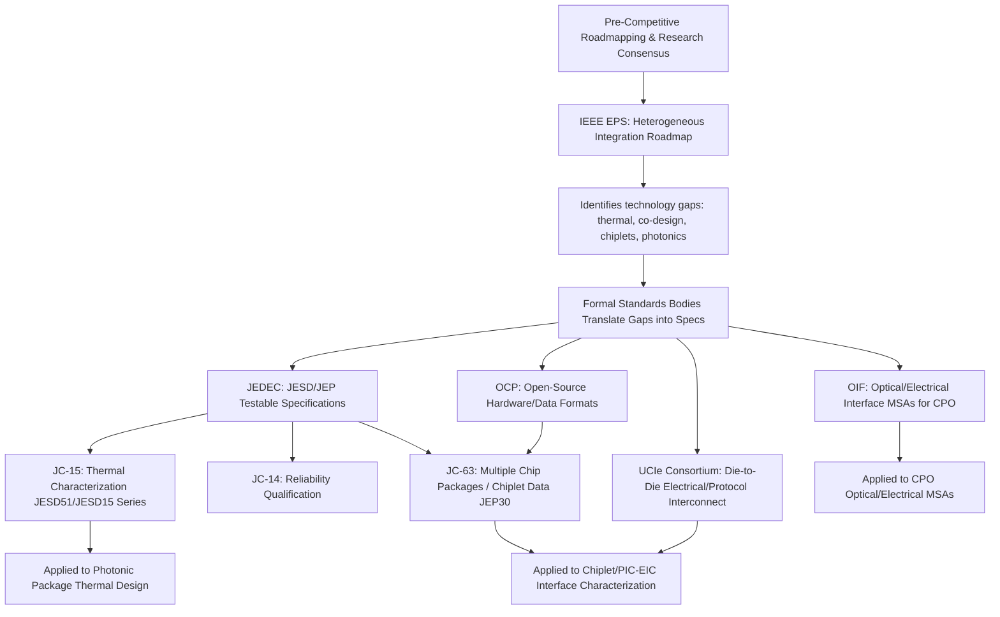

## IEEE Electronics Packaging Society and JEDEC Standards Landscape

### Overview

Advanced packaging and heterogeneous integration are governed by a dense, overlapping ecosystem of standards bodies, roadmaps, and industry consortia rather than a single authority. Two organizations anchor this landscape for different but complementary purposes: **IEEE Electronics Packaging Society (EPS)**, which drives technology roadmapping, conferences, and pre-competitive research consensus (most notably the Heterogeneous Integration Roadmap, HIR), and **JEDEC Solid State Technology Association**, which produces formal, consensus-based, testable specifications (JESD/JEP documents) covering thermal characterization, reliability qualification, mechanical form factors, and — increasingly — chiplet interoperability. Understanding how these two bodies divide responsibility, and where they intersect with adjacent organizations (SEMI, OCP, UCIe Consortium, OIF), is essential for navigating packaging technology decisions credibly.

---

### IEEE Electronics Packaging Society (EPS)

#### Mission and Scope

- EPS is the leading international forum for scientists and engineers engaged in the research, design, development and implementation of revolutionary advances in microsystems packaging and manufacturing, promoting cooperation and exchange of technical information through conferences and peer-reviewed publications across electrical, mechanical, materials, and physics disciplines.
- EPS does not primarily publish formal testable specifications (that is JEDEC's role); instead, it produces **roadmaps, conference proceedings, journal publications, and technical committee consensus documents** that shape pre-competitive technology direction and inform downstream standards bodies.
- Heterogeneous integration has become the highest strategic initiative of IEEE EPS, reflecting the industry's structural shift from monolithic scaling toward multi-die, multi-material system integration.

#### The Heterogeneous Integration Roadmap (HIR)

- The HIR is EPS's flagship deliverable, sponsored jointly by IEEE EPS, SEMI, IEEE Electron Devices Society (EDS), IEEE Photonics Society, and the ASME EPPD Division, succeeding the assembly and packaging portion of the former ITRS (International Technology Roadmap for Semiconductors) after SIA's ITRS activities concluded in 2015. [ieee](https://eps.ieee.org/technology/heterogeneous-integration-roadmap)
- **Key Points**
  - The roadmap is organized by **application-driver chapters** (e.g., High Performance Computing, IoT, Medical, Automotive, Aerospace & Defense, Mobile, 5G/Communications) layered over **cross-cutting technology chapters** covering the engineering disciplines needed to realize them.
  - The 2025 edition contains updates to 25 chapters, and its executive summary identifies Emerging Research Devices, Test, Supply Chain, Security, Thermal Management, Co-Design, Modeling and Simulation, and Reliability as cross-cutting technology focus areas, alongside three core integration technology areas: SiP (System-in-Package), 3D & 2D Interconnects, and Wafer-Level Packaging (fan-in and fan-out). [HIR 1 Overview 0.9 3 +2](https://eps.ieee.org/wp-content/uploads/2026/05/HIR_1_Overview_0.9-3.pdf)
  - The deployment and value of heterogeneous integration is most distinctly seen in AI/HPC products, mobile products, and communications products, directly framing why HIR content is central to advanced packaging curricula covering CPO and chiplet-based AI interconnect. [ieee](https://eps.ieee.org/wp-content/uploads/2026/05/HIR_1_Overview_0.9-3.pdf)
  - Earlier (2019) editions structured content into explicitly numbered chapters spanning overview, application verticals (HPC, IoT, Medical, Automotive, Aerospace & Defense, Mobile), and technology verticals including **Chapter 9: Photonics**, **Chapter 10: Integrated Power Electronics**, **Chapter 13: Co-Design**, **Chapter 17: Test**, **Chapter 18: Supply Chain**, **Chapter 19: Security**, **Chapter 20: Thermal**, and **Chapter 22: Interconnects** — directly relevant to the photonic packaging and thermal control items covered elsewhere in this course.
  - The HIR is explicitly framed as for technology assessment only and without regard to any commercial considerations pertaining to individual products or equipment, distinguishing its role as a pre-competitive forecasting document rather than a certifying or compliance standard. [ieee](https://eps.ieee.org/wp-content/uploads/2026/05/HIR_1_Overview_0.9-3.pdf)

#### EPS Conferences as De Facto Standards Fora

- **ECTC (Electronic Components and Technology Conference)**: The premier international event bringing together packaging, components, and microelectronic systems science, technology, and education, sponsored by IEEE EPS; serves as the primary venue where HIR chapter updates, new packaging architectures, and reliability data are first disclosed to the field. [ieee](https://eps.ieee.org/enews/category/february-2025)
- **EPTC, ESTC**: Regional EPS-affiliated conferences (Europe, Asia) that similarly serve as technical exchange venues feeding into roadmap updates.
- **Key Points**
  - Unlike JEDEC, EPS conference content is not binding on manufacturers; it functions as an open technical literature base that JEDEC, OCP, and industry consortia often draw upon when drafting formal specifications.

---

### JEDEC Solid State Technology Association

#### Mission and Scope

- JEDEC is a formal, ANSI-accredited standards development organization producing **consensus specifications** (prefixed JESD for full standards, JEP for publications/guidelines) that are directly referenced in procurement contracts, qualification test plans, and supplier agreements across the semiconductor industry.
- JEDEC's structure is organized into numbered technical committees (JC-xx), each responsible for a specific domain.

#### Key JEDEC Committees Relevant to Advanced Packaging

| Committee | Scope |
| --- | --- |
| JC-11 | Mechanical Standardization — package outlines, land patterns, form factors |
| JC-14 | Quality and Reliability of Solid State Products — qualification test methods (temp cycling, HAST, ESD, etc.) |
| JC-15 | Thermal Characterization Techniques for Semiconductor Packages — thermal resistance/impedance measurement standards |
| JC-16 | Interface Technology |
| JC-40 | Digital Logic |
| JC-42 | Solid State Memories |
| JC-45 | DRAM Modules |
| JC-63 | Multiple Chip Packages — directly relevant to chiplet/SiP packaging |
| JC-64 | Embedded Memory Storage & Removable Memory Cards |
| JC-70 | Wide Bandgap Power Electronic Conversion Semiconductors |

#### JC-15: Thermal Characterization Standards (JESD51 Family)

This committee is central to the "thermal control for photonic packages" item covered earlier, since photonic packages inherit the same thermal measurement discipline as conventional packages.

- **JESD51 (base standard)**: Provides a standard for thermal measurement that, if followed fully, will provide correct and meaningful data allowing determination of junction temperature for specific conditions, usable for package design evaluation, device characterization, and reliability predictions. [jedec](https://www.jedec.org/node/7475)
- **JESD51-1**: The Electrical Test Method for measuring junction temperature via electrical parameters.
- **JESD51-2**: Natural Convection Environment Standard.
- **JESD51-3**: Describes design requirements for a single-layer, leaded surface-mount IC package thermal test board, including board material, geometry, minimum trace lengths, trace thickness, and routing considerations for still-air and moving-air thermal tests. [jedec](https://www.jedec.org/node/7476)
- **JESD51-5**: Extension of thermal test board standards for packages with direct thermal attachment mechanisms, such as deep-downset or thermally tabbed packages. [jedec](https://www.jedec.org/node/7478)
- **JESD51-7**: High effective thermal conductivity test board for leaded surface mount packages, providing a mounting surface enabling heat-flow analysis with cross-lab variation targeted at ≤10%. [jedec](https://www.jedec.org/node/7480)
- **JESD51-8 / JESD51-9**: Define junction-to-board thermal resistance ($R_{\theta JB}$) test conditions (including double ring cold plate design) and array-style (BGA) test board trace fan-out guidance, respectively. JESD51-8 defines the conditions necessary for measuring $R_{\theta JB}$ including the design of a double ring cold plate, while JESD51-9 provides guidance on test board trace fan-out designs for array-style BGA packages. [electronics-cooling](https://www.electronics-cooling.com/2019/11/jedec-thermal-standards-developing-a-common-understanding/)
- **JESD51-4 / JESD51-31 / JESD51-32**: JESD51-4 describes requirements for implementing thermal test die (wire bond or flip chip format) into a thermal test package; JESD51-31 and JESD51-32 extend thermal test environments and test board standards specifically to accommodate multichip packages (MCPs) — directly relevant to multi-die CPO and chiplet assemblies. [electronics-cooling](https://www.electronics-cooling.com/2019/11/jedec-thermal-standards-developing-a-common-understanding/)[accuristech](https://store.accuristech.com/aia/subgroups/36160)
- **JESD15 series (Compact Thermal Models)**: JESD15-1.01 (Compact Thermal Model Overview), JESD15-3 (Two-Resistor Compact Thermal Model Guideline), and JESD15-4 (DELPHI Compact Thermal Model Guideline) define standardized simplified thermal models usable in system-level simulation tools — important for the "thermal co-design" workflows discussed in the electronic-photonic co-integration item. JESD15-3 specifies the definition and construction of a two-resistor compact thermal model from JEDEC junction-to-case and junction-to-board thermal metrics, applicable to single-die packages effectively represented by a single junction temperature. [accuristech](https://store.accuristech.com/aia/subgroups/36160)[jedec](https://secondrise.jedec.org/document_search/field_committees/20)
- **JESD51-14**: Interface test method for measuring junction-to-case thermal resistance for devices with heat flow through a single path — relevant to laser submount and TEC thermal path characterization.
- **JEP181A**: ECXML Guidelines for Electronic Thermal System Level Models – XML Requirements, enabling standardized digital exchange of thermal models between EDA/simulation tools. [accuristech](https://store.accuristech.com/aia/subgroups/36160)
- **Key Points**
  - $R_{\theta JC}$ (junction-to-case resistance) standardization has been a long-standing challenge due to difficulties accurately measuring case temperature without influencing the heat flow path and designing a cold plate that does not significantly impact the measurement, an open issue relevant to any advanced package (including photonic modules) where case-referenced thermal specs are needed. [electronics-cooling](https://www.electronics-cooling.com/2019/11/jedec-thermal-standards-developing-a-common-understanding/)
  - Several core JESD51 board-standard documents were reaffirmed as of February 2026, indicating these foundational thermal test methodologies remain the current baseline rather than having been superseded. [Global Standards for the Microelectronics Industry +2](https://www.jedec.org/node/7480)

#### JC-14: Reliability and Qualification Standards

- Governs environmental and mechanical stress test methods (temperature cycling, highly accelerated stress testing/HAST, moisture sensitivity, ESD) used to qualify packaged semiconductor devices, including advanced packages.
- **Key Points**
  - JEP157A (referenced in current chiplet ESD literature) provides recommended ESD-CDM (charged device model) target levels, illustrating how JC-14-family guidance is being actively extended to address chiplet-specific ESD/signal-integrity risk as die shrink and interconnect density increases in heterogeneous packages. [arxiv](https://arxiv.org/pdf/2511.10760)

#### JC-63: Multiple Chip Packages and the Chiplet Standardization Push

This committee has become the primary JEDEC vehicle for formalizing chiplet interoperability, working in direct collaboration with the Open Compute Project (OCP).

- **JEP30 (PartModel Guidelines)**: Sets the stage for seamless digital part data exchange between manufacturers and end users, providing a standardized format compatible across CAD tools and supporting a digital-twin concept that optimizes processes across the product lifecycle. [businesswire](https://www.businesswire.com/news/home/20240530522436/en)
- **JEP30 + OCP CDXML Integration**: A collaboration between OCP and JEDEC combined OCP's Chiplet Data Extensible Markup Language (CDXML) into JEP30, expanding the PartModel's capability so chiplet builders can provide standardized chiplet part descriptions to customers electronically. [businesswire](https://www.businesswire.com/news/home/20240530522436/en)
- **Key Points**
  - The updated JEP30 standard enables chiplet builders to electronically provide standardized chiplet part descriptions to SiP builders, including information on chiplet thermal properties, physical and mechanical requirements, behavior specifications, power and signal integrity properties, in-package testing, and security parameters — directly addressing the PIC-EIC and chiplet co-design interface challenges discussed elsewhere in this course. [businesswire](https://www.businesswire.com/news/home/20230124005158/en/Open-Compute-Project-Foundation-and-JEDEC-Announce-a-New-Collaboration)
  - This OCP-JEDEC collaboration is explicitly framed around building a new silicon supply chain in support of a commercially viable, standalone chiplet marketplace (OCP's "Open Chiplet Economy" vision), positioning JEP30/CDXML as the data-exchange backbone that could allow chiplets from different vendors to be selected, characterized, and integrated using standardized, machine-readable specifications rather than bespoke vendor documentation. [businesswire](https://www.businesswire.com/news/home/20240530522436/en)
  - A related JEDEC/OCP guideline set standardizes chiplet characterization details such as thermal properties, physical and mechanical requirements, and behavior specs, addressing what has historically been a sticking point for commercial chiplets, since without standardized details it has not been possible to choose the best chiplet for a particular application or workload. [semiengineering](https://semiengineering.com/tag/jedec/page/2)[semiengineering](https://semiengineering.com/tag/jedec/page/2)

---

### Division of Labor: EPS vs. JEDEC vs. Adjacent Bodies

**Key Points**

- EPS/HIR functions as the **forward-looking, consensus-building layer** that identifies where standards are needed years before formal specs exist.
- JEDEC functions as the **formal specification layer**, producing documents that are cited in supplier contracts, test plans, and qualification reports.
- Bodies like OCP (chiplet data formats), the UCIe Consortium (die-to-die electrical/protocol standards), and OIF (optical/electrical interface MSAs for CPO) fill domain-specific gaps that neither EPS nor JEDEC alone fully covers, particularly for chiplet interconnect and photonic packaging — meaning a complete standards picture for CPO/heterogeneous integration typically requires cross-referencing all of these organizations rather than relying on any single one.

---

### Practical Implications for Engineers and Program Managers

- **Thermal qualification test plans** for advanced/photonic packages should reference the specific JESD51-x sub-standard matching the package's mounting/attachment type (surface mount vs. direct attach) and die count (single-die JESD51-8/9 vs. multichip JESD51-31/32), since applying the wrong sub-standard produces non-comparable thermal resistance data.
- **Chiplet sourcing and multi-vendor integration** increasingly depends on suppliers publishing JEP30/CDXML-compliant part models; procurement and design teams should verify whether prospective chiplet suppliers provide this standardized data before committing to a multi-sourced heterogeneous integration architecture. [Inference: as of the most recent JEDEC/OCP announcements reviewed, JEP30/CDXML adoption breadth across the chiplet supplier base is still expanding rather than universal; teams should verify current supplier compliance directly rather than assuming availability.]
- **Roadmap alignment**: Teams planning multi-year advanced packaging programs (CPO, chiplet-based AI accelerators) typically track the current HIR edition's relevant application chapter (e.g., HPC/AI/Photonics) as an input to technology insertion timing, while treating JEDEC JESD/JEP documents as the binding qualification and interoperability baseline for near-term product execution.

---

**Related Topics**

- OCP (Open Compute Project) Open Chiplet Economy and CDXML specification details
- UCIe (Universal Chiplet Interconnect Express) die-to-die interconnect standard
- OIF (Optical Internetworking Forum) MSAs for co-packaged optics and CEI electrical interfaces
- JEDEC JC-14 reliability qualification standards (JESD22 series) for advanced packages
- Compact thermal modeling (JESD15 series) and its use in system-level thermal simulation
- SEMI standards for wafer-level and fan-out packaging processes
- ASME EPPD Division's role in the Heterogeneous Integration Roadmap
- Chiplet ESD and signal integrity standardization (JEP157A and related work)
- Multi-die package thermal test methodology (JESD51-31/32) applied to CPO modules
- Supply chain and security chapters of the HIR as applied to advanced packaging geopolitics