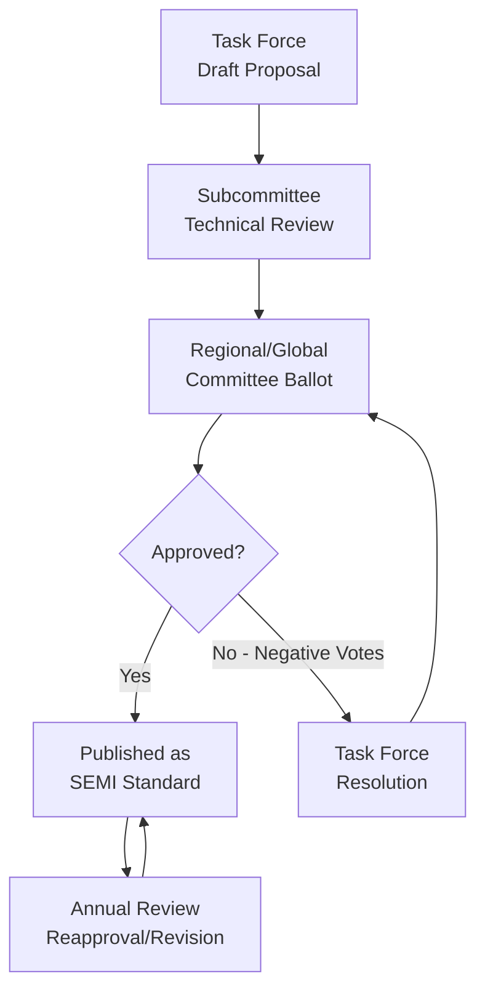
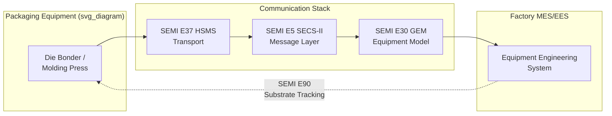

## SEMI Equipment and Materials Standards for Advanced Packaging

### Overview

SEMI (Semiconductor Equipment and Materials International) is the global industry association that develops and maintains consensus-based standards governing equipment interfaces, materials specifications, safety, facilities, and information/data exchange across the semiconductor supply chain. For advanced packaging and heterogeneous integration, SEMI standards provide the interoperability backbone that allows equipment from different vendors (die bonders, wafer-level processing tools, molding systems, metrology) to be integrated into a coherent factory, and that allows materials (substrates, mold compounds, bonding films) to be qualified against reproducible specifications.

Advanced packaging draws on both legacy front-end SEMI standards (wafer handling, facilities, safety) and a growing body of packaging-specific standards developed primarily through the SEMI 3D & Advanced Packaging (formerly 3D-IC) Standards committees.

### Standards Organization Structure

**Key Points**

- SEMI standards are organized into **Global/Regional Committees** by technology domain
- Advanced packaging standards fall mainly under: **3D-IC/Advanced Packaging**, **Materials**, **Facilities**, **Automated Test Equipment (ATE)**, and **Information & Control (E-standards)**
- Standards are voted through Task Forces → Subcommittees → Regional/Global Committees → International Standards Committee (Ballot process)
- Documents are revised annually (Spring/Fall ballot cycles) and published with a **stability level**: Provisional, Full, or Reapproved

### Standard Numbering Conventions

SEMI standards use letter prefixes indicating document category:

| Prefix | Category | Relevance to Packaging |
| --- | --- | --- |
| E | Equipment Automation/Communication | GEM/SECS, equipment data, carrier ID for panel/wafer handling |
| M | Materials | Substrates, wafers, mold compounds, dicing tape |
| G | Packaging & Shipping | Tray, tape-and-reel, moisture-sensitive packaging |
| S | Safety Guidelines | EHS for equipment (arc flash, ergonomics, gas systems) |
| F | Facilities | Cleanroom, gas delivery, chemical distribution |
| T | Test Methods | Characterization procedures |
| P | Wafer/Substrate Processing (panel-specific extensions) | Panel-level packaging dimensional standards |
| C | Chemicals | Process chemical purity specs |

### Core Materials Standards for Advanced Packaging

**Key Points**

- **SEMI M55**: Specification for silicon wafer thickness and TTV requirements relevant to thinned-wafer handling in 3D-IC stacking
- **SEMI M78**: Guide for thin wafer handling, applicable to backgrinding and temporary bonding/debonding flows in TSV and fan-out processes
- **SEMI M64**: Specification for reconstituted/molded wafer/panel carriers used in fan-out wafer-level packaging (FOWLP)
- **SEMI M108/M109 series**: Panel-level packaging substrate specifications (dimensional tolerances for rectangular panel formats used in FOPLP)
- **SEMI G87/G89**: Moisture barrier bag and moisture-sensitive device (MSD) handling, critical because mold compounds and underfills are hygroscopic and package cracking ("popcorn effect") is a major reliability risk

**Example**

A fan-out panel-level packaging (FOPLP) line qualifying a new 510mm × 515mm panel format would reference SEMI's panel dimensional standards to ensure the panel carrier, print frame, and reflow oven fixtures are all dimensionally compatible — avoiding the fragmented panel-size landscape that currently limits FOPLP equipment reuse across vendors.

### Wafer/Panel Handling and Carrier Standards

Thin-die and thin-wafer handling is one of the highest-risk process steps in 3D-IC and advanced packaging, since wafers thinned below ~50 µm become extremely fragile.

**Key Points**

- **SEMI M1**: Base specification for polished monocrystalline silicon wafers — dimensional baseline referenced even when wafers are subsequently thinned
- **SEMI E15.1/E47.1**: Wafer carrier (FOUP/cassette) mechanical interface standards, extended by packaging equipment vendors for reconstituted wafer carriers
- **SEMI E157**: Specification for E84-compliant carrier transfer, relevant where hybrid front-end/back-end automation is used in heterogeneous integration lines
- Temporary bond/debond (TBDB) tool interfaces are not yet fully standardized industry-wide; most TBDB equipment interoperability today relies on **de facto carrier standards** from glass carrier suppliers rather than a single ratified SEMI spec — an active gap area for standards committees

$$TTV = t_{max} - t_{min}$$

where $TTV$ (total thickness variation) is a key SEMI-referenced metric for thinned wafer/die uniformity, directly impacting bond-line thickness control in die stacking.

### Equipment Communication Standards (E-Standards / GEM-SECS)

**Key Points**

- **SEMI E4 (SECS-I)** and **SEMI E5 (SECS-II)**: Serial/message-layer communication protocols still used by legacy packaging tools (wire bonders, die attach)
- **SEMI E30 (GEM)**: Generic Equipment Model defining standard equipment states, alarms, and remote commands — the baseline for factory-level Equipment Engineering System (EES) integration of packaging tools
- **SEMI E37 (HSMS)**: TCP/IP-based transport, now the dominant physical/transport layer for GEM-compliant packaging equipment (molding presses, dicing saws, die bonders, AOI systems)
- **SEMI E40**: Processing job management — relevant for panel/strip-based batch processing common in packaging (as opposed to single-wafer front-end flows)
- **SEMI E90**: Substrate tracking, extended in OSAT (Outsourced Semiconductor Assembly and Test) fabs to track panels, strips, and reconstituted wafers through non-linear packaging flows involving rework loops

### Safety and Facilities Standards

**Key Points**

- **SEMI S2**: Environmental, Health, and Safety (EHS) guideline — baseline safety certification most OSAT and packaging equipment must meet before factory installation
- **SEMI S8**: Ergonomics guideline, relevant given the manual/semi-automated handling still present in some die-attach and wire-bond operations
- **SEMI S23**: Conservation of energy, utilities, and materials — increasingly cited in advanced packaging fabs given the high thermal/energy load of reflow, curing, and molding equipment
- **SEMI F47**: Voltage sag immunity for facilities power — relevant to plating lines (common in RDL/redistribution layer formation) sensitive to power transients

### Advanced Packaging-Specific Standards Initiatives (3D-IC / Heterogeneous Integration)

The **SEMI 3D-IC Standards Committee** (increasingly referred to under the broader "Advanced Packaging" scope) is the most active body developing new standards for this domain, largely because advanced packaging historically inherited a fragmented mix of OSAT-proprietary and JEDEC/IPC-derived specifications rather than unified SEMI equipment standards.

**Key Points**

- Active work areas include: **hybrid bonding interface metrology standards**, **glass/organic panel-level packaging dimensional standards**, **RDL (redistribution layer) design rule interoperability**, and **chiplet interconnect test structures**
- SEMI collaborates with the **UCIe (Universal Chiplet Interconnect Express) Consortium**, **JEDEC**, and **IPC** on overlapping scope — SEMI generally owns equipment/materials/factory-interface standards, while JEDEC owns electrical/package outline standards and IPC owns PCB/substrate design standards
- **SEMI International Roadmap for Devices and Systems (IRDS)** Heterogeneous Integration chapter (co-published with IEEE EPS) is the primary roadmap document referenced by the packaging industry for technology inflection timing (though IRDS itself is a roadmap, not a compliance standard)

[Inference] Because panel-level packaging (FOPLP) is a relatively recent industrialization push (roughly since the early-to-mid 2020s), panel dimensional standardization remains less mature and more fragmented across OSATs than the long-established 300mm wafer standards — this is corroborated by ongoing SEMI task force activity on panel format harmonization but should be verified against the latest published standard revision if used for procurement decisions.

### Materials Qualification Framework

**Key Points**

- **SEMI C-series** chemical purity standards apply to plating baths, cleaning chemistries, and photoresists used in RDL/fan-out processing
- Mold compound and underfill materials are typically qualified against a combination of **SEMI G87/G89 (MSD)**, **JEDEC J-STD-020** (reflow classification), and internal OSAT reliability specs (JEDEC JESD22 series) rather than a single unified SEMI materials standard — reflecting the cross-body nature of packaging materials qualification
- Bonding film and temporary adhesive qualification for TBDB processes generally follows equipment-vendor-specific qualification protocols referencing SEMI M78 handling guidance rather than a dedicated adhesive-performance SEMI standard

### Illustrative Compliance Stack for an Advanced Packaging Line

<svg xmlns="http://www.w3.org/2000/svg" viewBox="0 0 760 460">
<text x="380" y="28" text-anchor="middle" font-size="18" font-weight="bold" fill="#1a1a2e">SEMI Standards Compliance Stack — Advanced Packaging Line (svg_diagram)</text>
<rect x="40" y="60" width="680" height="70" rx="6" fill="#e8f0fe" stroke="#4285f4" stroke-width="1.5" />
<text x="380" y="88" text-anchor="middle" font-size="14" font-weight="bold" fill="#1a1a2e">Facilities &amp; Safety Layer</text>
<text x="380" y="110" text-anchor="middle" font-size="12" fill="#333">SEMI S2 (EHS) · SEMI S8 (Ergonomics) · SEMI F47 (Power Sag) · SEMI S23 (Energy)</text>
<rect x="40" y="150" width="680" height="70" rx="6" fill="#fce8e6" stroke="#ea4335" stroke-width="1.5" />
<text x="380" y="178" text-anchor="middle" font-size="14" font-weight="bold" fill="#1a1a2e">Materials Layer</text>
<text x="380" y="200" text-anchor="middle" font-size="12" fill="#333">SEMI M1/M55 (Wafer) · M64/M108 (Panel/Carrier) · M78 (Thin Handling) · G87/G89 (MSD)</text>
<rect x="40" y="240" width="680" height="70" rx="6" fill="#e6f4ea" stroke="#34a853" stroke-width="1.5" />
<text x="380" y="268" text-anchor="middle" font-size="14" font-weight="bold" fill="#1a1a2e">Equipment Communication Layer</text>
<text x="380" y="290" text-anchor="middle" font-size="12" fill="#333">SEMI E4/E5 (SECS) · E37 (HSMS) · E30 (GEM) · E40 (Job Mgmt) · E90 (Tracking)</text>
<rect x="40" y="330" width="680" height="70" rx="6" fill="#fef7e0" stroke="#fbbc04" stroke-width="1.5" />
<text x="380" y="358" text-anchor="middle" font-size="14" font-weight="bold" fill="#1a1a2e">Cross-Body Interoperability</text>
<text x="380" y="380" text-anchor="middle" font-size="12" fill="#333">JEDEC (electrical/outline) · IPC (substrate design) · UCIe (chiplet interconnect)</text>
<line x1="380" y1="130" x2="380" y2="150" stroke="#666" stroke-width="1.5" marker-end="url(#arrow)" />
<line x1="380" y1="220" x2="380" y2="240" stroke="#666" stroke-width="1.5" marker-end="url(#arrow)" />
<line x1="380" y1="310" x2="380" y2="330" stroke="#666" stroke-width="1.5" marker-end="url(#arrow)" />
<text x="380" y="430" text-anchor="middle" font-size="11" font-style="italic" fill="#666">Standards stack reflects typical OSAT/advanced-packaging fab structure; exact applicability varies by process (FOWLP, FOPLP, 3D-IC, hybrid bonding)</text>

</svg>

### Practical Example: New Tool Integration Checklist

A fab integrating a new **hybrid bonder** into an existing 3D-IC line would typically validate:

1. **SEMI E30 (GEM)** compliance for equipment state reporting to the factory host
2. **SEMI E37 (HSMS)** network configuration matching factory Ethernet/TCP standards
3. **SEMI S2** EHS certification prior to factory floor installation
4. **SEMI M78** thin-wafer handling guideline conformance for the tool's wafer-handling robotics
5. Panel/wafer carrier mechanical fit against **SEMI E15.1/M64**-derived carrier dimensions
6. **SEMI E90** substrate-tracking data model mapping so bonded pairs are traceable through downstream dicing and test

[Unverified] Specific ballot-cycle version numbers (e.g., whether a given fab requires SEMI E30-0699 vs. a later revision) should always be confirmed against the current SEMI standards catalog at time of procurement, since revision suffixes change with each ballot cycle.

### Conclusion

SEMI standards for advanced packaging form a layered but still-maturing framework: facilities and safety standards are largely inherited unchanged from front-end fabs, equipment communication standards (GEM/SECS/HSMS) are well-established and broadly adopted, while materials and panel-format standardization remains an active area of committee work due to the rapid diversification of packaging architectures (fan-out, panel-level, hybrid bonding, chiplet integration). Effective advanced packaging factory design requires cross-referencing SEMI standards alongside JEDEC and IPC specifications, since no single body fully owns the packaging materials and reliability qualification space.

**Related Topics**

- JEDEC package outline and reliability standards (JESD22 series) for advanced packaging
- IPC substrate and PCB design standards relevant to package substrates
- UCIe chiplet interconnect standard and its relationship to SEMI equipment standards
- Panel-level packaging (FOPLP) format fragmentation and standardization efforts
- GEM300/E40 job management adaptation for panel and strip-based packaging flows
- Hybrid bonding metrology and inspection standardization
- IRDS Heterogeneous Integration roadmap chapter