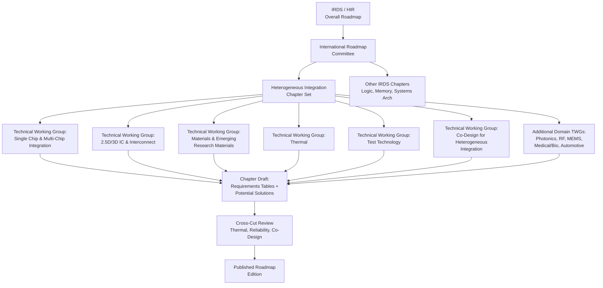

## Heterogeneous Integration Roadmap Structure and Technical Working Groups

### Overview

The Heterogeneous Integration Roadmap (HIR) is a community-developed roadmap effort — jointly sponsored by IEEE Electronics Packaging Society (EPS), SEMI, and originally continuing the legacy of the International Technology Roadmap for Semiconductors (ITRS) — that documents technology requirements, gaps, and potential solutions for packaging-level integration of heterogeneous components (logic, memory, photonics, MEMS, RF, sensors) as Moore's Law scaling slows. Since 2022, the HIR has been formally absorbed as the **Heterogeneous Integration chapter within the broader International Roadmap for Devices and Systems (IRDS)**, published under IEEE's roadmap umbrella, though "HIR" remains the commonly used name in industry discussion and many legacy chapter documents are still referenced independently.

### Historical Lineage and Governance

**Key Points**

- Predecessor: **ITRS** (International Technology Roadmap for Semiconductors), which concluded its front-end-focused scaling roadmap around 2015-2016
- Successor bodies split into two roadmap efforts: **IRDS** (device/system scaling, systems architecture) and the standalone **HIR** (packaging/heterogeneous integration focus), first published 2019
- Governance: co-sponsored by **IEEE EPS** and **SEMI**, with technical content authored by volunteer working group members from industry, academia, and national labs
- As of the most recent roadmap cycles, HIR content has been integrated as a formal chapter set within **IRDS**, aligning packaging roadmapping with the broader systems/device roadmap under one publication structure

[Unverified] The exact current administrative relationship between "HIR" as a standalone brand and its IRDS chapter integration may continue to evolve with each roadmap publication cycle; readers should confirm the latest organizational structure against the current IRDS/HIR publication front matter.

### Roadmap Structure

**Key Points**

- The roadmap is organized as a **set of chapters**, each addressing a technology domain, authored by a dedicated **Technical Working Group (TWG)**
- Each chapter follows a consistent internal structure: **Scope**, **Difficult Challenges**, **Technology Requirements Tables**, **Potential Solutions**, and **Cross-Team Coordination** notes
- Requirements tables use a multi-year horizon (typically near-term ~2-3 years, and long-term ~10-15 years) with quantitative targets (e.g., interconnect pitch, bandwidth density, thermal budgets)
- A **Cross-Cut** theme structure links related chapters (e.g., thermal management cross-cuts nearly every chapter)

### Core Technical Working Groups

**Key Points**

The HIR/IRDS Heterogeneous Integration effort is organized into numerous domain-specific chapters, each stewarded by a TWG. Representative groups include:

1. **Single Chip and Multi-Chip Integration** — packaging architectures spanning SiP, fan-out, and multi-die assemblies
2. **2.5D/3D IC and Interconnects** — TSV, interposers, hybrid bonding, micro-bump scaling
3. **High-Bandwidth Memory (HBM) / Memory Integration** — stacked memory integration requirements
4. **Materials and Emerging Research Materials** — mold compounds, dielectrics, novel substrate materials
5. **Thermal** — cooling architectures, thermal interface materials, co-design for power density
6. **Test Technology** — known-good-die (KGD) test, wafer-level and package-level test strategies for multi-die assemblies
7. **Co-Design for Heterogeneous Integration** — EDA/design-flow requirements to enable system-technology co-optimization (STCO)
8. **Photonics** — co-packaged optics and optical interconnect integration
9. **MEMS and Sensor Integration**
10. **RF and Analog Mixed-Signal (wireless/mmWave systems)**
11. **Medical, Health, and Wearable Technologies**
12. **Automotive**
13. **Aerospace and Defense**
14. **Mechanical/Reliability/Modeling and Simulation**
15. **Security**
16. **Supply Chain / Emerging Materials and Manufacturing**

[Inference] The precise list and naming of TWGs shifts somewhat between roadmap editions as new domains (e.g., quantum, chiplet ecosystem/UCIe alignment) gain dedicated chapter status — this reflects the roadmap's stated intent to track emerging heterogeneous integration domains, but the exact current chapter list should be verified against the latest published edition.

### Chapter Content Format

**Example**

A representative chapter (e.g., "2.5D/3D IC and Interconnects") typically contains:

- **Scope**: defines what falls inside/outside the chapter (e.g., TSV-based 3D stacking, interposer routing, hybrid Cu-Cu bonding, excluding wire-bond-only packages)
- **Difficult Challenges**: near-term (e.g., hybrid bonding pitch scaling below 1 µm, warpage control) and long-term (e.g., true 3D monolithic-like integration, thermal density at multi-tier stacking)
- **Technology Requirements Table**: quantitative targets by year, such as interconnect pitch (µm), I/O density (I/O/mm²), and bandwidth (GB/s/mm²)
- **Potential Solutions**: candidate technical approaches (e.g., hybrid bonding, TCB with formic acid flux, D2W vs W2W integration)

$$\text{I/O density} = \frac{N_{I/O}}{A_{die}}$$

where interconnect pitch scaling directly drives the achievable $I/O$ density target published in the roadmap tables, a key metric tracked across successive HIR/IRDS editions to benchmark industry progress against roadmap targets.

### Relationship to Other Standards Bodies

**Key Points**

- HIR/IRDS is explicitly a **roadmap**, not a compliance standard — it identifies technology gaps and targets rather than mandating interfaces (contrast with SEMI equipment/materials standards, which are compliance documents)
- SEMI standards committees frequently reference HIR requirements tables to prioritize which new equipment/materials standards to develop
- Overlaps and cross-references exist with: **JEDEC** (memory/package electrical standards), **IPC** (substrate/PCB design), **UCIe Consortium** (chiplet interconnect), and **CHIPS Act-funded** national packaging initiatives (e.g., NAPMP/Natcast in the U.S.), which often cite HIR chapters to justify R&D investment priorities

### Practical Use in Industry

**Example**

A packaging equipment vendor developing a next-generation hybrid bonder would consult the "2.5D/3D IC and Interconnects" TWG's requirements table to identify the target bonding pitch and alignment accuracy for the relevant roadmap year, then cross-reference the "Thermal" and "Test Technology" chapters to ensure the tool's process window is compatible with downstream thermal and testability requirements — using the roadmap as a shared reference point for R&D prioritization across otherwise-competing equipment suppliers.

### Publication Cadence and Access

**Key Points**

- Roadmap editions are typically republished on a **multi-year cycle** (historically roughly every 2 years for full editions, with interim chapter updates)
- Chapters are made available as individual PDF documents through IEEE EPS and SEMI channels, allowing practitioners to reference only the domain-relevant chapter rather than the full roadmap
- Participation in TWGs is open to industry volunteers, meaning chapter content reflects consensus industry input rather than a single organization's proprietary roadmap

[Unverified] Specific current publication dates, chapter counts, and access URLs change between editions; verify against the current IEEE EPS/IRDS roadmap portal for the latest edition status before citing specific dates.

### Conclusion

The Heterogeneous Integration Roadmap provides the strategic technology-planning layer that sits above SEMI's compliance-oriented equipment and materials standards: while SEMI standards define *how* equipment and materials interoperate today, the HIR/IRDS Heterogeneous Integration chapters define *where the industry needs to go*, organized through a structured set of Technical Working Groups covering integration architectures, materials, thermal, test, co-design, and application-specific domains (photonics, automotive, medical, aerospace). Understanding this roadmap structure is essential context for interpreting why specific SEMI standards development priorities emerge when they do.

**Related Topics**

- SEMI equipment and materials standards for advanced packaging (companion compliance layer)
- System-Technology Co-Optimization (STCO) and design-technology co-design frameworks
- UCIe chiplet interconnect standard and its roadmap alignment with HIR
- Known-good-die (KGD) test strategies for multi-die heterogeneous assemblies
- Hybrid bonding pitch scaling roadmap and technical challenges
- CHIPS Act national packaging initiatives (NAPMP) and their relationship to roadmap priorities
- Thermal co-design challenges in high-density 3D-IC stacking