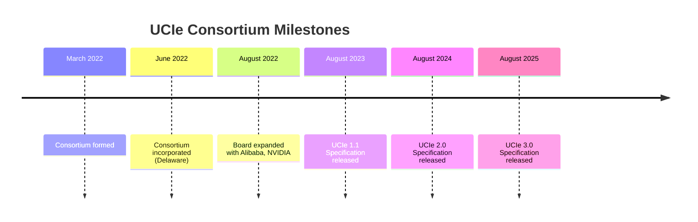
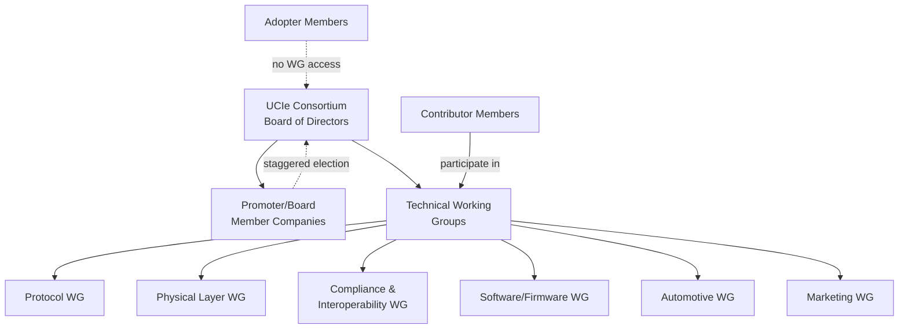

## UCIe Consortium Governance and Chiplet Ecosystem Membership

### Overview

The Universal Chiplet Interconnect Express (UCIe) Consortium is the industry body governing the UCIe specification — an open standard defining the die-to-die interconnect within a package that enables mixing chiplets from different vendors, process nodes, and foundries into a single heterogeneous integrated package. The consortium was officially incorporated in Delaware in June 2022, following its formation earlier that year, and governs specification development, compliance testing, interoperability events, and IP protections for member companies. [businesswire](https://www.businesswire.com/news/home/20220802005203/en)

### Formation and Founding Structure

**Key Points**

- Founding Board members included Advanced Semiconductor Engineering (ASE), AMD, Arm, Google Cloud, Intel Corporation, Meta, Microsoft Corporation, Qualcomm Incorporated, Samsung Electronics, and Taiwan Semiconductor Manufacturing Company (TSMC) [businesswire](https://www.businesswire.com/news/home/20220802005203/en)
- Alibaba and NVIDIA joined shortly after as newly elected Board members, bringing the founding board to 12 companies [businesswire](https://www.businesswire.com/news/home/20220802005203/en)
- The group was first unveiled in March 2022 as an initial announcement, with formal incorporation following in June 2022 [anandtech](https://at-web1.www.anandtech.com/show/17526/ucie-consortium-incorporates-adds-nvidia-and-alibaba-as-members)
- Intel donated the original UCIe 1.0 specification to the consortium as the technical starting point [anandtech](https://at-web1.www.anandtech.com/show/17526/ucie-consortium-incorporates-adds-nvidia-and-alibaba-as-members)
- The consortium description frames itself around industry veterans of prior successful interconnect standards efforts (PCIe, CXL, USB), reflecting a deliberate governance model borrowed from those precedents

### Governance Structure

**Key Points**

- Governance is organized around a **Board of Directors**, elected primarily from Promoter/Contributor-class member companies
- Contributor members gain election eligibility to the Promoter Class/Board each year when the term of half the board completes, indicating a staggered board-rotation model rather than fixed permanent seats [snia](https://snia.org/sites/default/files/2025-05/SNIA-SDC23-DasSharma-SoC-Construction-Using-UCIe.pdf)
- Chairmanship has been held by **Dr. Debendra Das Sharma** (Intel Senior Fellow), who has served as the consortium's public technical spokesperson across specification releases
- The board comprises semiconductor and packaging companies, IP suppliers, foundries, and cloud service providers, reflecting the full chiplet supply chain rather than a single industry segment [hpcwire](https://www.hpcwire.com/?p=146012)

### Membership Tiers

**Key Points**

UCIe operates a **two-tier membership structure**, distinct from the three-tier Promoter/Contributor/Adopter model used by some other consortia (e.g., early PCI-SIG):

1. **Contributor Membership**
   - Access to Final Specifications (1.0, 1.1, 2.0, etc.) [snia](https://snia.org/sites/default/files/2025-05/SNIA-SDC23-DasSharma-SoC-Construction-Using-UCIe.pdf)
   - Implementation rights with IP protections as outlined in the membership agreements [snia](https://snia.org/sites/default/files/2025-05/SNIA-SDC23-DasSharma-SoC-Construction-Using-UCIe.pdf)
   - Right to attend Corporation trade shows and industry events as determined by the Board [snia](https://snia.org/sites/default/files/2025-05/SNIA-SDC23-DasSharma-SoC-Construction-Using-UCIe.pdf)
   - Participation in the technical working groups, with the ability to influence technology direction [snia](https://snia.org/sites/default/files/2025-05/SNIA-SDC23-DasSharma-SoC-Construction-Using-UCIe.pdf)
   - Access to intermediate ("dot-level") specifications ahead of full public release [snia](https://snia.org/sites/default/files/2025-05/SNIA-SDC23-DasSharma-SoC-Construction-Using-UCIe.pdf)
   - Eligibility for election to the Promoter Class/Board during annual staggered elections [snia](https://snia.org/sites/default/files/2025-05/SNIA-SDC23-DasSharma-SoC-Construction-Using-UCIe.pdf)
2. **Adopter Membership**
   - Access to Final Specifications only (not intermediate-level specifications) [uciexpress](https://www.uciexpress.org/post/ucie-consortium-grows-to-more-than-100-members)
   - Implementation rights with the same IP protections as Contributor members [uciexpress](https://www.uciexpress.org/post/ucie-consortium-grows-to-more-than-100-members)
   - No working group participation and no board election eligibility

**Example**

Membership dues for the Adopter tier are structured as: $2,500 per year, with a $5,000 first-year fee that includes a one-time member startup fee plus the first year's membership. Contributor-tier dues are typically higher, reflecting the added working-group access and IP influence rights, though exact current Contributor pricing should be confirmed directly against the consortium's membership agreement at time of application. [uciexpress](https://www.uciexpress.org/post/ucie-consortium-grows-to-more-than-100-members)

### Ecosystem Growth

**Key Points**

- At incorporation in August 2022, the consortium had approximately 60 member companies [anandtech](https://at-web1.www.anandtech.com/show/17526/ucie-consortium-incorporates-adds-nvidia-and-alibaba-as-members)
- Early contributor members included Ayar Labs, Broadcom, Cadence, Micron, and Tachyum, spanning IP vendors, EDA tool providers, and memory suppliers [servethehome](https://www.servethehome.com/?p=62516)
- By 2023, membership had grown past 120 companies [snia](https://snia.org/sites/default/files/2025-05/SNIA-SDC23-DasSharma-SoC-Construction-Using-UCIe.pdf)
- By the 2025 timeframe, membership exceeded 140 companies and continued growing [uciexpress](https://www.uciexpress.org/_files/ugd/0c1418_b4744fe368c94e3e9c7eaa13ead632bf.pdf)
- Member composition spans **foundries and OSATs** (TSMC, ASE), **IDMs/fabless silicon vendors** (AMD, Intel, Qualcomm, NVIDIA), **hyperscalers/cloud providers** (Google Cloud, Microsoft, Meta, Alibaba), **IP suppliers**, **EDA vendors**, and **automotive/industrial companies** (e.g., Toyota Motor Corporation and Volkswagen Aktiengesellschaft appear among later member rosters), reflecting UCIe's expansion beyond datacenter/HPC use cases into automotive and edge applications [uciexpress](https://uciexpress.org/_files/ugd/0c1418_dc86d84bd42446dcb864480002db8f05.pdf)

### Technical Working Groups

**Key Points**

- At incorporation, the consortium launched six initial working groups covering the core technical domains needed to mature the specification [anandtech](https://at-web1.www.anandtech.com/show/17526/ucie-consortium-incorporates-adds-nvidia-and-alibaba-as-members)
- Working Groups are tasked with identifying and addressing the demands of a complete, full-stack solution for strengthening the open standards-based chiplet ecosystem [uciexpress](https://www.uciexpress.org/_files/ugd/0c1418_b4744fe368c94e3e9c7eaa13ead632bf.pdf)
- Named working group tracks visible in consortium materials include **Automotive** and **Marketing**, alongside the core protocol/physical-layer/compliance groups implied by the specification's technical scope (die-to-die PHY, protocol layer, software/firmware enablement, compliance and interoperability testing)
- Only Contributor-tier members may participate in technical working groups; Adopter members receive specification access but no direct influence over working group technical direction [snia](https://snia.org/sites/default/files/2025-05/SNIA-SDC23-DasSharma-SoC-Construction-Using-UCIe.pdf)

[Inference] The specific full current list of active working group names beyond "Automotive" and "Marketing" is not consistently published in a single public document across consortium materials reviewed; the six-working-group structure announced at incorporation in 2022 has likely been reorganized or expanded as the specification matured through versions 1.1, 2.0, and 3.0, but the authoritative current list should be confirmed against the consortium's official working-group charter documentation.

### Specification Evolution Timeline

**Key Points**

- UCIe 1.0 was released concurrent with incorporation in June 2022 [uciexpress](https://www.uciexpress.org/_files/ugd/0c1418_b4744fe368c94e3e9c7eaa13ead632bf.pdf)
- UCIe 1.1 was released in August 2023 [uciexpress](https://www.uciexpress.org/_files/ugd/0c1418_b4744fe368c94e3e9c7eaa13ead632bf.pdf)
- UCIe 2.0 was released in August 2024 [uciexpress](https://www.uciexpress.org/_files/ugd/0c1418_b4744fe368c94e3e9c7eaa13ead632bf.pdf)
- UCIe 3.0 was released in August 2025, with Dr. Debendra Das Sharma presenting it as continued innovation in the open chiplet ecosystem, introducing planar (UCIe-A, UCIe-S) enhancements including 48 GT/s and 64 GT/s bandwidth support, run-time TX recalibration for power savings, L2 idle-power optimization, and manageability enhancements including firmware download and priority sideband packets [uciexpress](https://www.uciexpress.org/_files/ugd/0c1418_b4744fe368c94e3e9c7eaa13ead632bf.pdf)[uciexpress](https://www.uciexpress.org/_files/ugd/0c1418_b4744fe368c94e3e9c7eaa13ead632bf.pdf)
- This annual-cadence release pattern (each August) reflects an actively maintained, member-driven specification evolution model rather than a slow-moving standard

$$\text{Bandwidth density} = \frac{N_{lanes} \times \text{Data Rate}}{\text{Package Area}}$$

where the UCIe 3.0 bump to 64 GT/s directly raises the achievable bandwidth density ceiling relevant to HBM-adjacent and high-radix chiplet interconnect designs.

### Relationship to Other Standards Bodies

**Key Points**

- UCIe governs the **package-level die-to-die interconnect layer**, distinct from and complementary to SEMI's equipment/materials standards and the HIR/IRDS Heterogeneous Integration roadmap chapters
- UCIe explicitly builds on protocol heritage from **PCIe and CXL** (both governed by PCI-SIG and the CXL Consortium respectively), reusing familiar transaction-layer semantics to ease adoption by existing chip design teams
- The chiplet form factor, packaging mechanical standards, and compliance test methodologies developed by UCIe working groups increasingly intersect with SEMI panel/substrate dimensional standards and JEDEC electrical/mechanical package outline standards, motivating cross-consortium liaison activity, though the precise formal liaison agreements between UCIe and SEMI/JEDEC are not detailed in the documents reviewed here [Unverified]

### Practical Implication for Advanced Packaging Design

**Example**

An OSAT or IDM designing a multi-die package using chiplets from two different silicon vendors would reference the UCIe specification (obtained via Contributor or Adopter membership) to ensure die-to-die PHY compatibility at the package substrate level — while separately consulting SEMI equipment standards for the RDL/interposer fabrication process and JEDEC standards for the package's external electrical interface, illustrating how UCIe governance sits within, rather than replaces, the broader standards ecosystem covered elsewhere in this chapter.

### Conclusion

The UCIe Consortium represents a governance model purpose-built for rapid, member-driven chiplet interconnect standardization: a two-tier membership structure (Contributor/Adopter) balances broad specification access against focused technical-direction influence, a staggered board-election process ties governance authority to active Contributor participation, and an annual specification release cadence (1.0 through 3.0 across 2022-2025) demonstrates sustained cross-industry commitment from a membership base spanning foundries, IDMs, hyperscalers, IP vendors, and — increasingly — automotive OEMs. This governance structure directly shapes which packaging architectures gain de facto interoperability support across the advanced packaging ecosystem.

**Related Topics**

- UCIe physical layer (PHY) architecture: Standard Package (UCIe-S) vs. Advanced Package (UCIe-A) variants
- UCIe protocol layer and PCIe/CXL protocol reuse in chiplet interconnect
- Chiplet compliance and interoperability testing methodology
- SEMI equipment and materials standards for advanced packaging (companion compliance layer)
- Heterogeneous Integration Roadmap structure and its relationship to UCIe technical priorities
- JEDEC package outline standards and their intersection with chiplet form factors
- Die-to-die interconnect power/thermal co-design for multi-chiplet packages